# 📌 AI와 ML은 무엇인가?
**학습 목표**
> AI, ML, DL의 정의 및 관계를 학습
> 데이터 (feature 및 label), 가설공간, 모델의 개념 학습
> 학습(learning) 의 정의를 학습

<br>

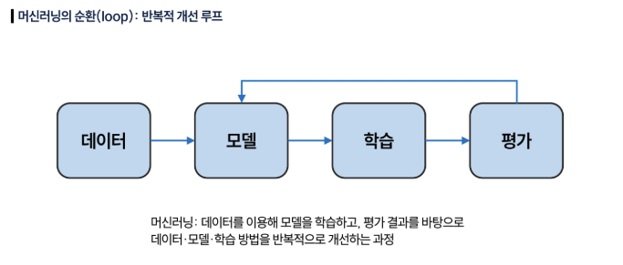

# 1. AI, ML, DL의 정의
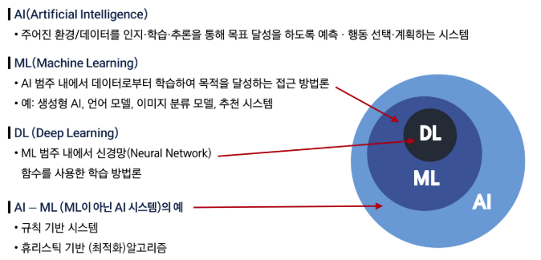

# 2. 데이터와 학습의 이해
## 2-1. 데이터 구성요소 (Feature/Label)

**데이터가 왜 중요한가?**
* 머신러닝은 규칙을 직접 코딩하지 않고, 데이터에서 규칙을 학습
* 데이터(Feature, Label)의 분포와 관계가 머신러닝의 학습 결과를 결정
<br>

**Feature (피처, 특성)**
* 모델이 예측에 사용하는 입력정보
* 예측, 판단의 근거/단서
<br>

**Label (라벨, 목표값)**
* 모델이 예측하려는 정답
* 학습의 목표값
<br>

> 우리의 목적은 뭘까요? 오차가 하나도 없는 것이 목적일까?ㄴㄴ
>
> 우리의 목적은 참 함수 찾기임!!!!!!!!!! 보면 데이터랑 조금씩 surface랑 떨어져있음


## 2-2. ML 실생활 예시
- 피처는 인풋이고 라벨은 아웃풋이다
#### 예시 1 – 유튜브 추천

* **Feature** : 각 영상들의 정보(장르, 크리에이터, 조회수, 좋아요 수 등), 사용자 정보(시청 이력, 구독 채널 등)
* **Label** : 영상에 대한 사용자 피드백(시청 여부, 좋아요 클릭 여부)
<br>

#### 예시 2 – 스팸메일 분류

* **Feature** : 메일 제목, 발신자, 단어 빈도
* **Label** : 스팸 / 정상
-------

# 3. 단일 피쳐 기반 학습

## 3-1. 1D 피쳐 기반 학습

### 1D 피쳐 기반 학습(단일 피쳐 학습)이란?

* **1D = 1차원**
* **Feature가 하나일 때** 머신러닝이 학습하는 가장 단순한 형태

$$\text{Income}_i = \underbrace{f^*}_{\text{미지의 참 함수}}(\text{Years of Education}_i) + \underbrace{\epsilon_i}_{\text{측정 오차}}$$

* 데이터셋 $D$: 30명의 Years of Education (피쳐)와 **Income (라벨)** 쌍
* $D = \{(\text{Years of Education}_i, \text{Income}_i)\}_{i=1}^{30}$

---

### 구성 요소 상세

* **미지의 함수 ($f^*$, 에프스타)**
* Feature와 Label 사이의 실제 평균 관계
* 하지만 직접 관측할 수 없음
* 오차가 포함된 데이터(점)만 관측 가능


* **측정오차 ($\epsilon$, 앱실론)**
* 데이터에는 주로 측정 오차가 섞여 있음
* 원인 : 측정 기기의 한계, 환경적 요인 등
* 따라서, $\text{데이터} = \text{참 함수} + \text{오차 } (f^* + \epsilon)$
* 앱실론은 학습을 통해 절대 줄일 수 없음. 우리의 목적은 참함수를 찾는 것임. 참함수(가설공간에서 선택한 모델)에서의 측정오차는 실제 존재하는 값과의 차이기 때문에 측정오차를 절대 줄일 수 없음.

<br>

### 피쳐와 라벨의 관계를 잘 나타낸 함수 $f$는 무엇일까?
- 결국 학습하라고 하는 건 f*이다 = 미지의 참 함수를 찾는 것이 우리의 task
<br>

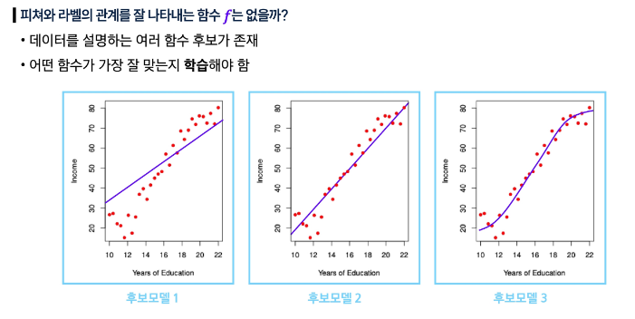
- 위 이미지에서 가장 합리적인 모델은 무엇인가?

## 3-2. 모델과 가설 공간
- 학습, 가설 공간, 모델
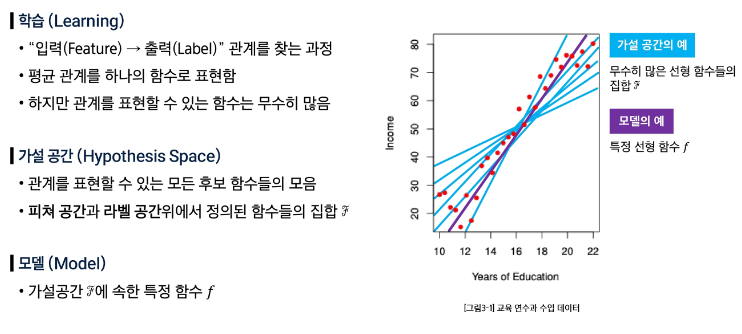

- 가설 공간은 학습을 하기 전에 찾아야 하는 것 = 나의 search 범위를 어디까지 할 것인가? 그 중에서 모델을 선택함
    - 예시) **직선으로 된 선들 중(= 가설공간)** 에서 가장 fit한 직선을 찾고 싶어요, 곡선으로 된 선들 중에서 선택하고 싶어요 -> 가설공간은 내가 선택하는 것 
    - 내가 선택하는 모델은 결국 내가 어떤 선형 함수에서 어떤 모델을 선택할지 정한 것이다.

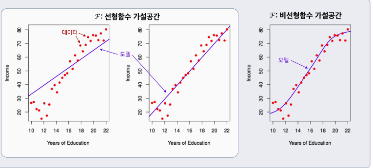

## 3-3 학습이란?
- 학습, 필요요소, 과정
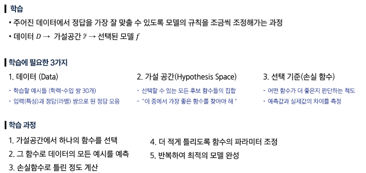
- 가설 공간 중에서 어떤 특정 함수 모델을 찾는 과정이고 얼마나 에러가 있는지 손실함수로 수치를 나타내고 더 적게 틀리도록 파라미너를 조정하여 손실함수를 줄이도로 하는 과정의 반복

- 학습 전 -> 선형 함수로 오차를 최대한 줄임 -> 학습 후
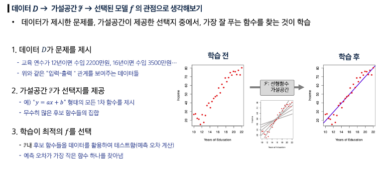

# 4. 복수 피쳐 기반 학습
## 41-.2D 피쳐 기반 학습
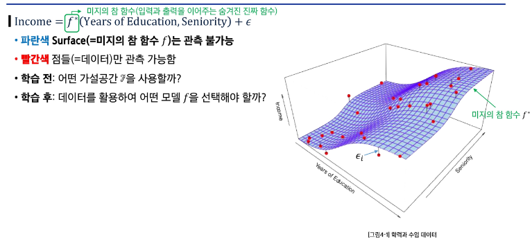
- 피쳐가 2개가 된 것일 뿐 미지의 참 함수를 찾는 것은 같다.
- 다만 차이점은 면이 surface인 점, 파란 면은 미지의 함수
- 빨간색 점에 surface에 가장 가깝게 학습시켜야 하는데 가능할까? 관측 오차는 여전히 존재

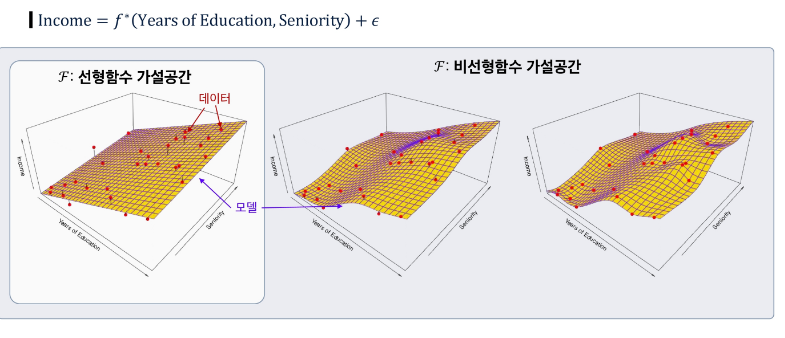
- 함수의 가설공간을 어떻게 설정하느냐에 따라 학습 함수가 다르다
* 선형: 평평/ 비선형: 곡선
* 하이퍼플레인: 디멘션 내에서의 플레인

- 어떤 결과가 학습이 더 잘 된 것 같은가? 이미지만 보면 모름
    - 가장 오른쪽 모델은 과적합 모델임(부정)
    - 가운데 모델처럼 surface와 데이터가 딱 붙어있는 것보다 적절한 flexible 이 예측이 잘 됨 -> **미지의 참 함수 찾기가 목적**
    - 데이터 하나하나의 오차를 0으로 만드는 것이 목표가 아님
    - 구간별로 다른 함수를 적용하는 구간별 모델링이나 의사결정나무가 대표적인 예입니다. 데이터의 구간마다 다르면 더 빠르고 정확하게 근사할 수 있지만, 구획을 너무 잘게 나누면 과적합되어 새로운 데이터에 대한 성능이 되려 떨어질 수 있다.(조교님 왈)

## 4-2. 일반적 용어 정리 및 모델 가정
<br>

$$\text{Income} = f^*(\text{Years of Education}, \text{Seniority}, \dots) + \epsilon \quad \rightarrow \quad Y = f^*(\mathbf{X}) + \epsilon$$

* **Income**: 우리가 예측하려는 라벨(반응/목표) 변수 $\rightarrow Y$로 표기
* **Years of Education**: 첫번째 피쳐(입력/예측) 변수 $\rightarrow X_1$로 표기
* **Seniority**: 두번째 피쳐(입력/예측) 변수 $\rightarrow X_2$로 표기
* 다른 $i$번째 피쳐가 있다면 역시 $X_i$로 표기
* 일반적인 $p$차원 피쳐(총 $p$개의 피쳐) 벡터:

$$\mathbf{X} = \begin{bmatrix} X_1 \\ X_2 \\ \vdots \\ X_p \end{bmatrix} \in \mathbb{R}^p$$
*R=실수

* **모델(함수형)** : $f^* : \mathbb{R}^p \rightarrow \mathbb{R}, \quad Y = f^*(\mathbf{X}) + \epsilon$
* **측정오차 $\epsilon$** : $\epsilon$는 피쳐 $\mathbf{X}$와 독립 및 $\mathbb{E}[\epsilon] = 0$로 가정함
*E(입실론)=기댓값, 0    -> 정의 다시 찾아보기

- 오차는 0으로 가정하고 수업 진행한다고 이해하면 되나요? 네 맞습니다. 실제 데이터에서는 오차가 존재하지만, 먼저 참함수와 모델의 개념을 이해하기 위해 단순화한 것입니다.(조교 왈)

<br>

## 4-3. 왜 $f(\cdot)$를 학습하는가?

**예측**

* 잘 학습된 $f$가 있으면, 새로운 입력 $X = x$에서 **반응/목표 $Y$를 예측**할 수 있음


**중요 특성 파악**

* 피쳐들 $X = (X_1, X_2, \dots, X_p)$ 중 어떤 **특성**이 $Y$를 설명하는데 **중요**하고, 어떤 것은 덜 중요(무관)한지 알 수 있음
* 예: 근속 연수(Seniority), 교육 연수(Years of Education)은 소득(Income)에 큰 영향을 줄 수 있지만, 혼인 여부(Marital Status)는 영향이 거의 없을 것임


**해석 가능성**

* $f$의 **복잡도**에 따라 각 구성요소 $X_i$가 $Y$에 **어떻게 영향을 미치는지**(증가/감소 방향, 민감도 등) **이해**할 수 있음

---------
--------
# 📌 지도 학습은 무엇인가?
**학습 목표**
> 회귀(연속값)와 분류(범주값)의 문제 정의와 출력 차이 이해
> 문제 유형에 맞는 오류/ 평가지표를 바르게 선택 및 해석
> 학습의 목표: 테스트 성능 최대화(테스트 오류 최소화)에 대한 이해
> 오버피팅의 이해

<br>

# 지도 학습: "처음 보는 문제도 잘 푸는 AI 만들기"

* **정의** : **입력**(feature) + **정답**(label)을 가지고 예측 규칙을 배우는 방법
* 정답이 있는 예시 데이터로 AI를 훈련시켜서, 새로운 문제에도 정확한 답을 할 수 있게 만드는 방법이 지도학습이다.


* **목표** : 훈련 데이터 뿐만 아니라, 처음 보는 데이터에서도 예측 성능 향상


 예시 1) 어제까지 고객 데이터로 "내일 이탈할 고객" 미리 알기

* 기존 고객 정보 + 탈퇴 여부 $\rightarrow$ 내일 이탈할 고객 예측


 예시 2) 기존 거래 사기(Fraud) 데이터로 새로운 사기 탐지

* 기존 사기 거래 데이터
$\rightarrow$ 사기인지 아닌지 구분하지 못했던 거래 or 새로운 사기거래 예측

# 1. 지도학습의 개념
## 1-1. 지도학습이란?
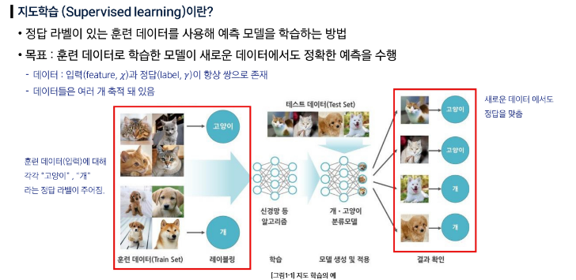
- 새로운 데이터(=학습이 되지 않은 데이터)에서도 예측 성능이 높기를 바람

## 1-2. 지도학습의 종류 (회귀 VS 분류)
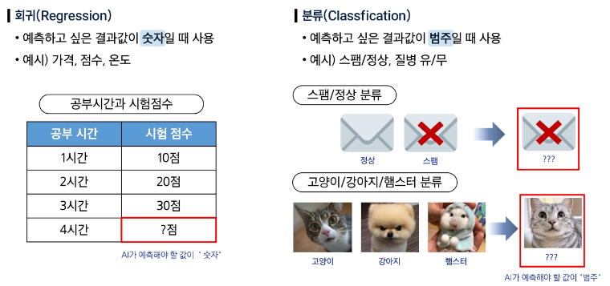
- 회귀: 공부시간(input) -> 시험점수(output)
- 분류: 이미지(input) -> 범주(output)

## 1-3. 손실함수(Loss Function)
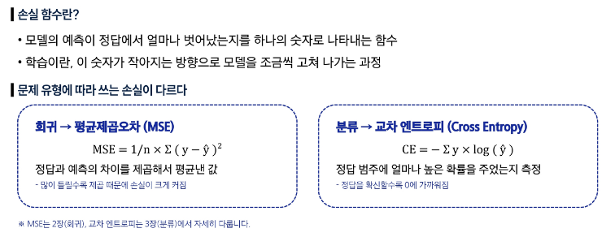
- y 실제값, y^ 예측값
- 회귀: 제곱하는 이유는 차이가 크면 안좋아서 패널티를 더 준다~

### $\epsilon$(엡실론)과 MSE(평균제곱오차)의 핵심 차이

* **$\epsilon$ (엡실론 / 오차)**: 개별 데이터 포인트 하나하나가 가진 **'실제값과 예측값(또는 참값)의 차이'** (개별적인 오차값)
* **MSE (평균제곱오차)**: 전체 데이터의 엡실론들을 제곱해서 평균 낸 **'모델 전체의 성능 측정 표준 점수'** (하나의 대표 수치)

 📊 상세 비교

| 구분 | $\epsilon$ (엡실론, 오차/잔차) | MSE (Mean Squared Error, 평균제곱오차) |
| --- | --- | --- |
| **개념** | 데이터 **1개** 단위의 예측 오차 | **전체** 데이터 오차의 제곱 평균 |
| **수식** | $\epsilon_i = Y_i - \hat{Y}_i$ | $\text{MSE} = \frac{1}{n} \sum_{i=1}^{n} (Y_i - \hat{Y}_i)^2 = \frac{1}{n} \sum_{i=1}^{n} \epsilon_i^2$ |
| **역할** | 각 샘플에서 발생한 오차의 양 | 모델이 전체적으로 얼마나 틀리는지 평가하는 손실 함수(Loss/Cost) |
| **형태** | 데이터 개수만큼 존재하는 **여러 개의 값** | 모델 전체를 대표하는 **단 하나의 숫자** |

> ✏️ **비유하자면:**
> * **$\epsilon$**: 학생 개개인이 시험에서 틀린 문제 개수
> * **MSE**: 반 전체 학생들의 틀린 문제 개수를 제곱해서 평균 낸 반 전체의 점수 (낮을수록 좋은 반/모델)


## 1-4. 지도학습 용어
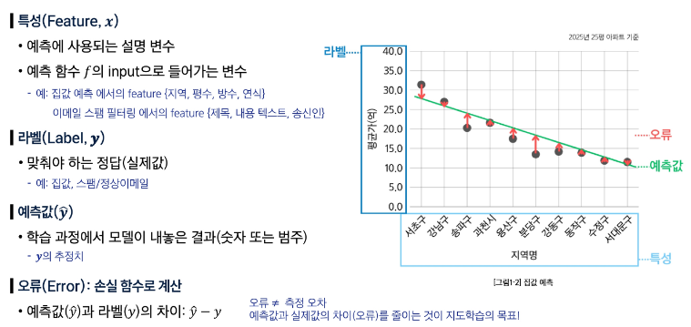
- 특성, 라벨, 예측값(hat, 댓/햇), 오류

# 2. 회귀
## 2-1. 회귀 문제
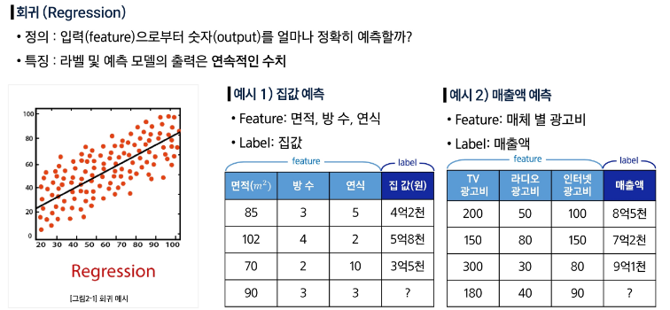

## 2-2. 회귀 오류: 평균제곱오차(MSE)
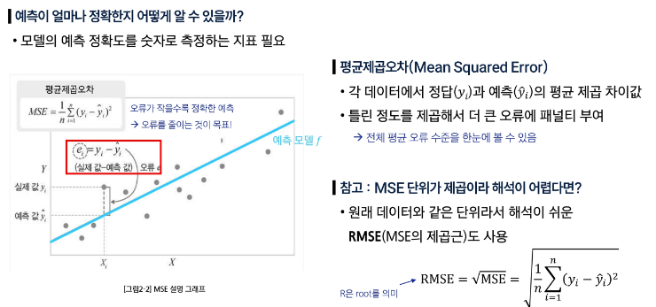
- 내 예측값은 전부 예측 모델 선 위에 있음 
- 이미지 내 e는 앱실론과 다름 -> 예측값 오류임
    - E는 트루모델에서 얼마나 노이즈가 있는지를 나타낸 것임
- MSE란 결국 예측 모델 오류 e를 제곱

* 내 개인적 의문은 그러면 선 아래 있는 관측값들은 뭐지?
    

## 2-3. 회귀 설명력: R^2 (결정계수)
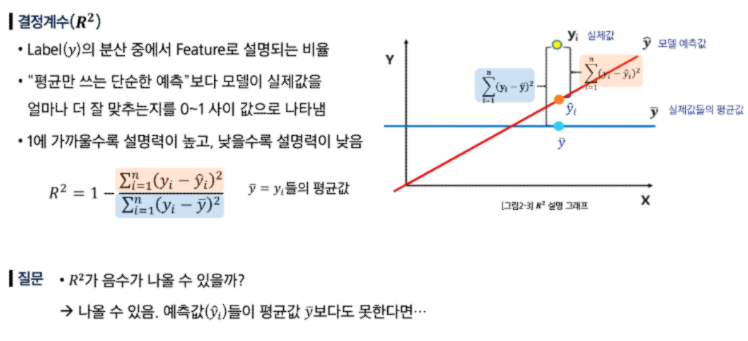
- '알스퀘어드'라고 발음
- 분모와 분자를 이해하면 됨
    - 분모: 실제 y값과 y 평균값의 차이 -> 모델링 하나도 안하고 단순 y값 평균으로 예측했을 때의 오차
    - 분자: 실제 y값과 모델링을 한 후 예측값(와이햇)과의 오차
        - 모델링을 잘해서 분자의 차이가 적다면 분모보다 차이가 적을 것
        - 분자가 작을수록 모델링을 잘한 것
    - 결정계수가 1에 가까울 수록 좋다 왜지?
        - 분자가 작아서 분자/분모의 값이 0에 가까울수록 1에서 빼는 수가 적기 때문에 -> 1에 가까워짐


## 2-4. MSE vs 결정계수
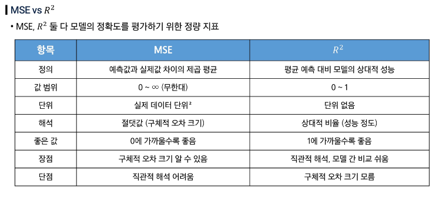
- MSE 단점 예시: 만약 MSE가 3.5라면 이게 실제로 잘한 것인지 바로 평가 어려움
    - 알스퀘어는 0~1로 최소와 최대의 값이 정해져있기 때문에 바로 평가 가능

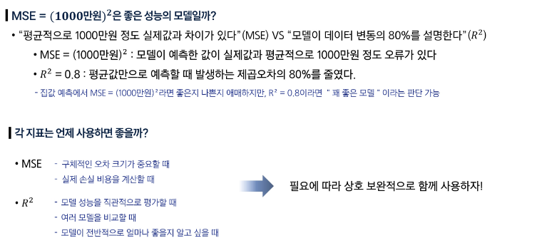
- 각 지표는 언제 사용하면 좋을지

# 3. 분류
## 3-1. 분류 문제
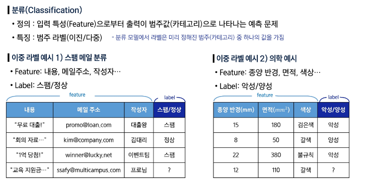
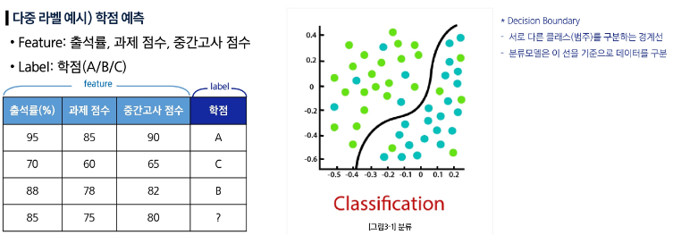

- 분류의 기준은 **LABEL(아웃풋)의 형태** 로 결정된다

## 3-2. 분류 정확도 (Accuracy)
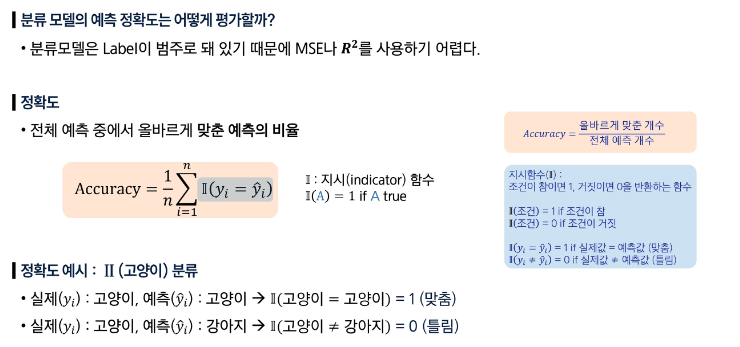
- 라벨의 일치 여부로 판단: 정확도 예시 참고
- 비율을 계산한 것
- 오른쪽 지시함수 중요!

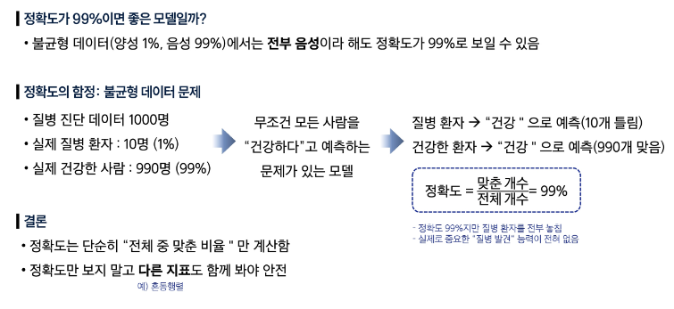

## 3-3. 혼동행렬
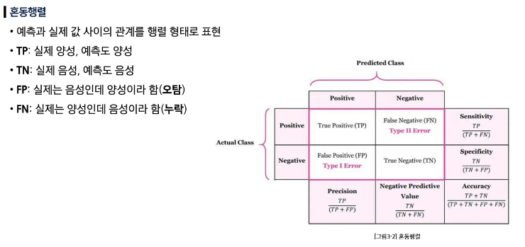
- 대각선이 클수록 좋음 -> 예측값과 실제값이 같음
- 아래 지표는 전부 크면 클수록 좋다
<br>

**정밀도(Precision)**

* **"양성이라 판정한 것 중"** 진짜 양성의 비율 = $\text{TP} / (\text{TP} + \text{FP})$

**재현율(Sensitivity or Recall)**

* **"진짜 양성 가운데"** 잡아낸 예측 양성 비율 = $\text{TP} / (\text{TP} + \text{FN})$

**F1-score**

* **정밀도와 재현율의 조화평균**

$$\text{F1} = 2 \times \frac{\text{정밀도} \times \text{재현율}}{\text{정밀도} + \text{재현율}}$$

## 3-4.분류 손실: 교차 엔트로피
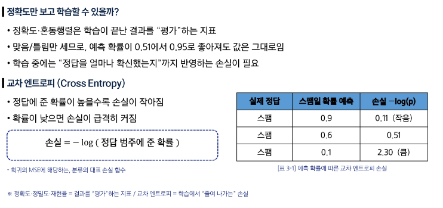
- 실제 정답에 **내가 부여한 확률** 이 높을수록 손실이 작아짐
-   이미지 내 예시에서 마지막 정답 스팸을 0.1%의 확률로 정답을 맞춘 것인데 -log0.1을 하면 2.30이 됨
    - 자연로그 (밑이 $e$인 경우, $\ln$)머신러닝 손실함수(Cross-Entropy Loss 등)에서 주로 사용하는 자연로그 기준

# 4. 학습의 목적

**학습의 목적 : 새로운 데이터에서 예측하기**

* **목적** : 훈련 데이터로 학습한 모델이 새로운 데이터에서도 정확한 예측을 수행하도록 하는 것


**훈련이 잘 됐는지 어떻게 확인할까? (모델 성능을 어떻게 평가할까?)**

* **학습 모델의 성능 평가**는 모델이 **처음 보는(학습에 사용되지 않은) 데이터로 평가**
* *"이 모델이 훈련 상황 외에 새로운 상황에서도 잘 동작 할까?"* (일반화) 를 검증


* 훈련 데이터에서 성능이 아무리 좋아도, 새로운 데이터에서 성능이 떨어지면 **실전엔 사용할 수 없음**
* **일반화(generalization) 오류**의 최소화 지향
$\rightarrow$ 새로운 데이터에서 틀리는 걸 최대한 줄여야 한다!


* 다음 차시(3차시)에서 **일반화 성능을 추정**(검증/교차검증)하는 방법을 배울 예정
 -> 일반화 성능을 높이는 것이 우리의 목표이기 때문

## 4-2. 오버피팅이란?
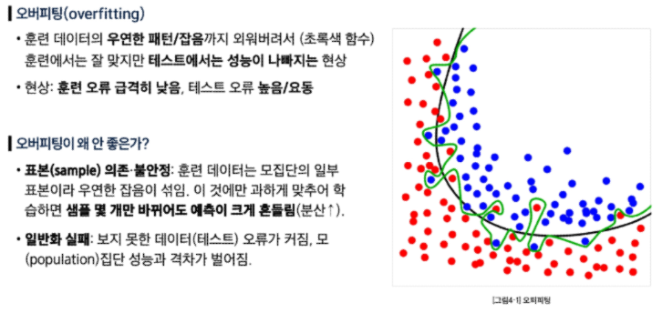
- 예시: 이해없이 기출만 외워서 시험보기
- 발생원인이 데이터의 잡음까지 전부 외워버려서인데 트레인에서는 성능이 좋은데 테스트 결과가 나쁜 것을 보고 성능이 나쁘다고 오버피팅이라곤 할 수 없음.
- 오버피팅 -> 일반화 못함

## 4-3. 오버피팅에 대한 오해
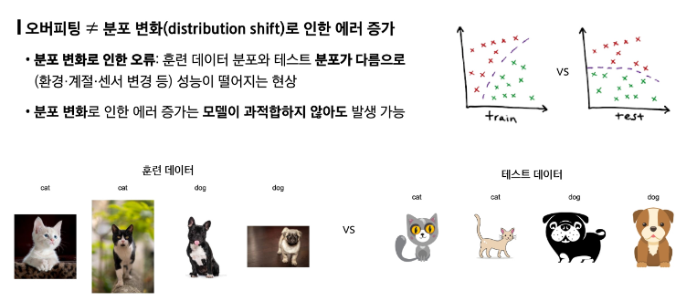
- 오버피팅을 말 할 수 있는 전제 조건은 훈련 데이터와 테스트 데이터의 분포가 같아야 함
- **데이터의 분포가 같아야(중요)** 성능이 좋을 것이라고 기대할 수 있음

## 4-4. 오버피팅 vs 언더피팅
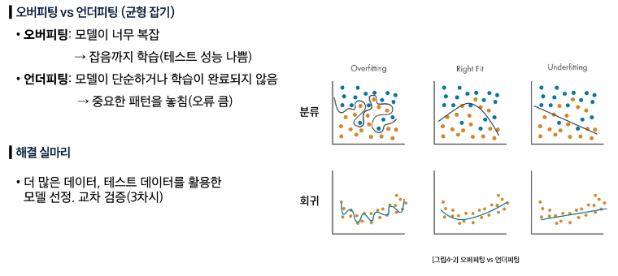

------
------
# 📌 교차검증
**학습 목표**
> 학습 데이터와 새로운 데이터에서 일어나는 오류의 차이를 설명할 수 있다.
> '처음 보는 데이터 예측(일반화)'이 왜 중요한지 설명할 수 잇다.
> 검증셋(hold-out)과 교차검증(K-fold)이 무엇인지 알고, 각각의 장단점을 설명할 수 있다.
<br>

# 1. 테스트 성능 평가
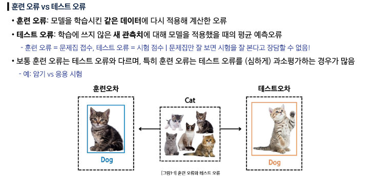
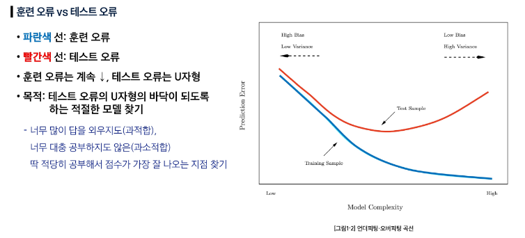
<br>
**테스트 예측 오류 계산**

* **이상적 케이스**: 충분히 큰 별도 테스트 데이터셋 $\rightarrow$ 현실에선 구하기 어려움
* **현실에서는** 테스트만을 위한 데이터를 갖기에 **데이터 자체가 부족할 수 있음**

**대안: 재표본화(resampling)를 통한 테스트 오류 추정**

* **데이터를 나눠** 여러 번 "훈련$\rightarrow$평가"를 반복해 테스트 오류를 가능
* *시험용 문제가 따로 없다면?! $\Rightarrow$ 기존 문제집의 문제들을 활용해 모의고사를 보자!*


* **방법**: 검증셋(hold-out), K겹 교차검증(K-fold Cross-Validation)
* **장점**: 별도의 테스트 데이터 없이 **데이터를 더 효율적으로 사용하여** 일반화 오차 추정


# 2. 검증셋(Validation Set) 접근
## 2-1. 검증셋 방법

**검증셋(홀드아웃) 방법**

* **가용 샘플들을 무작위로 훈련셋과 검증셋(hold-out)으로 분할**
* *문제집의 문제들을 모의고사용과 학습용으로 나누고 모의고사는 딱 1번만 보기*


* **훈련셋으로 모델 적합**, 검증셋으로 **예측 후 검증 오류를 계산**.
* 검증 오류는 보통 **정량 반응은 MSE**, 범주 반응은 오분류율(또는 F1-score)을 측정한다.

**검증 절차**

* 데이터 순서 무작위 **셔플링 후 두 부분으로 분할**: 왼쪽(파랑)=훈련셋, 오른쪽(주황)=검증셋
* 학습은 **훈련셋**에서, 성능평가는 **검증셋**에서 수행
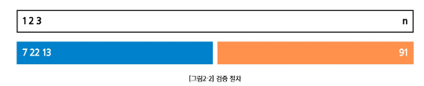

<br>

## 2-3. 검증셋 방법 예시
**예시: 자동차 데이터**

* **목표**: **선형**(1차)모델부터 **고차항**(다항식) 모델 비교
* 392개 데이터를 무작위로 196개 훈련셋/196개 검증셋으로 분할 (일반적으로 반으로 나누실 필요는 없음)
* **좌측 패널**: 단 한 번 분할 시의 MSE 곡선
**우측 패널**: *여러 번 (셔플후)* 다른 분할의 MSE 곡선들

## 2-4. 검증셋 접근의 한계
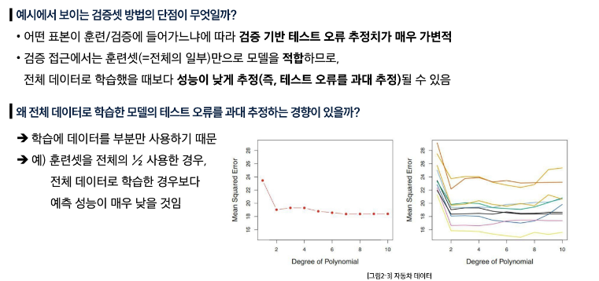

> **"공부할 문제(데이터량)를 줄였으니 당연히 시험 점수가 떨어져(오차가 커져) 실제 실력보다 부족하게 평가되는 현상"**입니다.


🔍 상세 원인 분석

학습 데이터 부족으로 인한 모델 성능 하락


* **원래 목표**: 우리가 진짜 평가하고 싶은 것은 **전체 데이터(100%)로 학습시킨 강력한 모델의 성능**입니다.
* **현실(홀드아웃)**: 검증을 위해 데이터를 나누면서 **일부(예: 50%)의 데이터만 학습에 사용**합니다.
* **결과**: 적은 데이터로 학습한 모델은 전체 데이터로 학습한 모델보다 당연히 패턴을 덜 배우게 되므로 **예측 성능이 떨어지고 오류(MSE)가 크게 측정**됩니다.


테스트 오류 과대 추정의 메커니즘

1. **학습 데이터 감소** $\rightarrow$ 모델이 전체 패턴을 완벽히 익히지 못함
2. **예측력 감소** $\rightarrow$ 검증 데이터에 대한 오차(MSE) 발생 증가
3. **오류 과대 추정** $\rightarrow$ 측정된 테스트 오류가 **"전체 데이터로 학습했을 때 실제 나올 오류"보다 크게 나옴**

📊 요약 비교

| 구분 | 전체 데이터 학습 | 검증셋(홀드아웃) 학습 |
| --- | --- | --- |
| **학습 데이터량** | 전체 (100%) | 전체의 일부 (예: 50%) |
| **모델의 예측 능력** | 높음 | 상대적으로 낮음 |
| **발생하는 오류(MSE)** | 낮음 (실제 성능) | **높게 측정됨 (오류 과대 추정)** |

> 📌 **결론**:
> 검증셋(홀드아웃) 방식은 데이터를 학습용과 검증용으로 쪼개느라 학습 데이터가 줄어들기 때문에, **모델의 실제 잠재력(전체 데이터 학습 시 성능)보다 테스트 오류를 더 나쁘게(높게) 평가하는 비관적 편향(Pessimistic Bias)**을 가지게 됩니다.


# 3. K-겹 교차검증 (K-fold Cross-Validation))
## 3-1. K-겹 교차검증
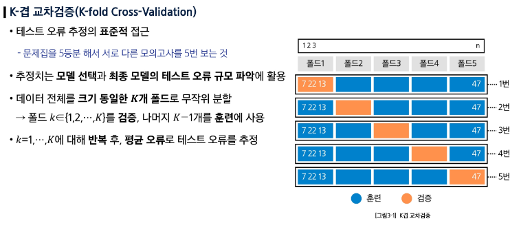
- 주황색 폴드에서 검증만 함 -> K번째 폴드에서 나온 에러값 기재 -> K개의 에러값 평균 오류 사용

**K-겹 교차검증 단계**

* 데이터를 먼저 **셔플링한 뒤**, 총 $n$개의 데이터를 겹치지 않는 $K$개 그룹으로 분할
* 각 그룹이 번갈아 **검증셋(주황)**, 나머지는 **훈련셋(파랑)**
* $K$개의 MSE를 평균해 테스트 오류를 추정


## 3-2. K-겹 교차검증 오류 계산

**K-겹 교차검증 오류 계산**

* 폴드 집합 $C_1, \dots, C_K$, 각 폴드 크기 $n_k$

$$\text{CV}_{(K)} = \sum_{k=1}^{K} \frac{n_k}{n} \text{MSE}_k$$

- Nk 의 값은 각각의 폴드에 맞게 데이터를 나눠야 함. 모든 폴드의 데이터 값이 정확히 동일하게 떨어지지 않을 수 있음. 폴드의 개수로 데이터를 나누는 것이 중요함

* 여기서, $\text{MSE}_k = \frac{1}{n_k} \sum_{i \in C_k} (y_i - \hat{y}_i)^2$ ($K$-폴드를 검증셋으로 두고 나머지로 적합한 예측 $\hat{y}_i$)
* MSE(평균제곱오차): 예측이 얼마나 틀렸는지를 숫자로 표현한 값 (오차를 제곱해 평균)


* $K = n$이면 **Leave-One-Out 교차검증(LOOCV)**
* *100개 문제($n$)로 100개의 서로 다른 모의고사($K$)를 만드는 것.*


*Leave-One-Out 교차검증에서 검증셋 크기는? 1*

## 3-3.Leave-One-Out 교차검증
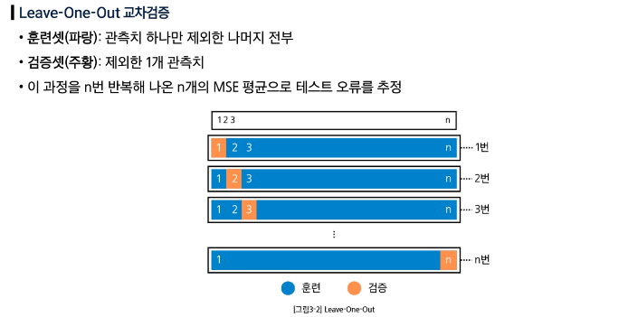

## 3-4. k-겹 교차검증 비교

<br>

**$K$-겹 교차검증(K-fold CV)과의 관계**

K-fold 교차검증은 전체 데이터를 $K$개의 폴드(그룹)로 나누는 방식입니다.

**LOOCV는 $K = n$인 특수한 형태의 K-fold 교차검증**입니다.

* $K = 5$ 이면: 전체를 5개 그룹으로 나누어, 각 그룹(전체의 20%)이 검증셋이 됨
* $K = n$ 이면: 전체를 $n$개 그룹으로 나누므로, **그룹당 데이터 1개**가 검증셋이 됨

**LOOCV의 장점과 왜 이렇게 할까?**

* **학습 데이터 손실의 최소화**:
일반 홀드아웃(예: 50% 훈련 / 50% 검증)은 데이터를 반이나 떼어내서 학습량이 부족해지는 단점(오차 과대추정)이 있었습니다.
반면 LOOCV는 **$(n-1)$개(사실상 거의 전체)의 데이터를 학습에 활용**하므로, 전체 데이터로 학습시켰을 때의 실제 성능에 가장 가깝게(편향이 매우 적게) 오류를 추정할 수 있습니다.
* **결과의 재현성(100% 동일함)**:
무작위로 데이터를 어떻게 나누느냐에 따라 오차가 달라지는 홀드아웃이나 K-fold와 달리, LOOCV는 데이터를 어떻게 셔플하든 **결과가 항상 동일**합니다.
<br>

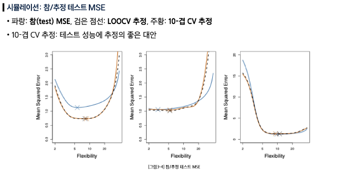

- flexibility가 너무 높아도 낮아도 좋지 않음
- 현업에서 주로 사용하는 선은 주황선 -> 10-ruq cv 추정으로도 충분하다
  - 왜? 편향(Bias)과 분산(Variance)의 트레이드오프를 가장 균형 있게 해결해주기 때문

<br>

#### 10-ruq cv 추정으로도 충분한 이유

1. 편향-분산 트레이드오프의 최고 적정점 (Sweet Spot)

이전에 학습 데이터 수가 적으면 오차를 과대 추정(비관적 편향)한다고 정리했습니다.

* **단순 검증셋 (Hold-out, 예: 50% / 50%)**:
학습 데이터가 절반으로 줄어들어 모델이 충분히 배우지 못합니다. 그 결과 **편향(Bias)이 매우 높아져** 테스트 오류를 과대 추정합니다.
* **LOOCV ($K=n$)**:
학습 데이터로 $(n-1)$개를 쓰므로 편향은 거의 없습니다. 하지만 $n$개의 모든 모델이 거의 똑같은 데이터로 학습되어 서로 강하게 상관(Correlated)되어 있습니다. 상관관계가 높은 값들을 평균 내면 **분산(Variance)이 커져** 추정치가 불안정해집니다.
* **10-겹 교차검증 ($K=10$)**:
전체 데이터의 **90%를 학습에 사용**하므로 **편향이 충분히 낮고**, 모델 간 상관관계도 적절히 낮아 **분산도 낮게 유지**됩니다.


2. 계산 효율성 (Computational Cost)

* **LOOCV**: 데이터가 $n=10,000$개라면 모델을 **10,000번**이나 학습시켜야 합니다. 데이터가 조금만 커져도 현실적으로 실행이 불가능합니다.
* **10-겹 CV**: 데이터 크기($n$)가 아무리 커져도 **딱 10번만 학습**시키면 되므로, 계산 복잡도 면에서 매우 경제적입니다.

3. 데이터의 모든 요소를 검증에 활용

단 한 번 분할하는 홀드아웃 방식은 "어떤 표본이 검증셋에 들어가느냐"에 따라 결과가 크게 출렁입니다(가변성이 큼).

반면 10-겹 CV는 **모든 데이터 포인트가 정확히 한 번씩 검증셋으로 활용**되고 **9번씩 훈련셋으로 활용**되므로, 특정 데이터 분할에 치우치지 않는 안정적이고 신뢰할 수 있는 성능 평가값을 얻을 수 있습니다.


📊 한눈에 보는 요약 비교

| 평가 방법 | 학습 데이터 비율 | 편향 (Bias) | 분산 (Variance) | 계산 비용 |
| --- | --- | --- | --- | --- |
| **단순 홀드아웃 (50:50)** | 50% | **높음** (과대 추정) | 높음 (분할에 민감) | 매우 낮음 (1회) |
| **LOOCV ($K=n$)** | $(n-1)/n \approx 100\%$ | **매우 낮음** | **높음** | **매우 높음 ($n$회)** |
| **10-겹 CV ($K=10$)** | **90%** | **낮음** | **낮음 (최적)** | **적절함 (10회)** |

> 💡 **결론**:
> 통계학 및 머신러닝 실무에서 $K=5$ 또는 $K=10$을 표준으로 사용하는 이유는 **적절한 계산 시간 내에 편향과 분산을 모두 낮춘 가장 정확한 일반화 성능을 추정**할 수 있기 때문입니다.

<br>

-------
--------
# 📌 비지도 학습은 무엇인가?
**학습 목표**
> 비지도 학습의 개념과 지도학습과의 차이점을 설명한다.
> 클러스터링 개념과 대표적 방법론인 K-means와 계층별 군집법을 설명한다.
<br>

# 1. 비지도 학습
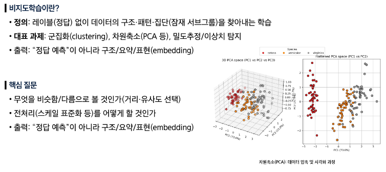
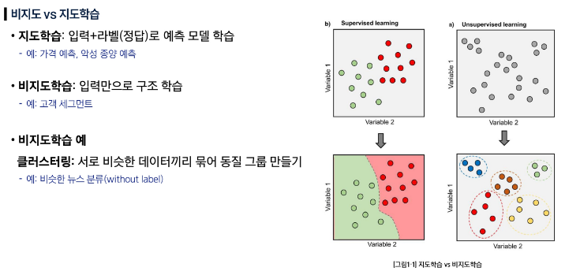


# 2. 클러스터링 (Clustering)
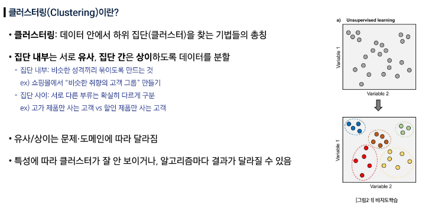

**예시: 마케팅 세그먼테이션**

* 다수의 지표(가구 소득, 직업, 도심 거리 등)를 가진 많은 사람들에 대해 **특정 광고/상품에 더 반응할 하위집단을 식별하고자 함.**
* **시장 세분화** 작업 자체가 **클러스터링**에 해당

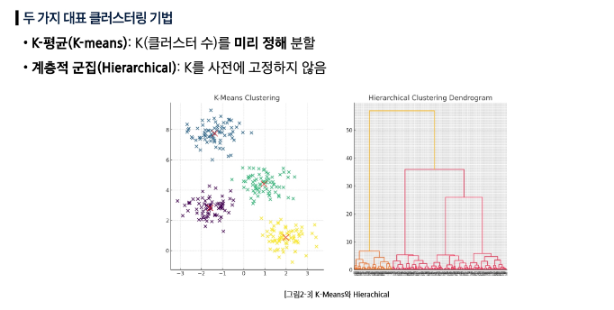

# 3. k-means 클러스터링
## 3-1. k-meams 클러스터링
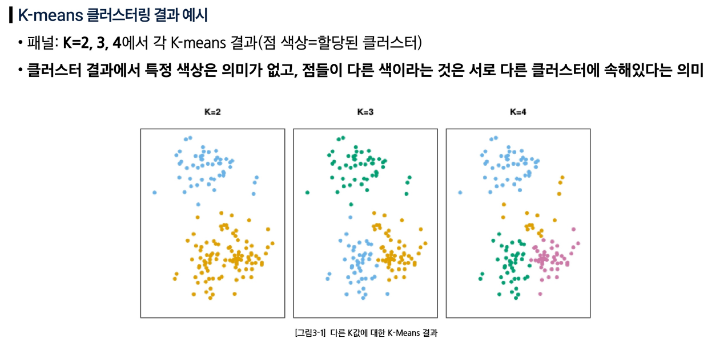
- 정답 = 지도가 없음

<br>

**K-means의 표기(군집 집합)**

* 관측치 인덱스 집합을 $C_1, \dots, C_K$ 라 하면:
$$C_1 \cup \dots \cup C_K = \{1, \dots, n\} \quad \text{(각 관측치는 적어도 하나의 군집에 속함)}$$


* 모든 다른 클러스터 $k \neq k'$ 에 대해, $C_k \cap C_{k'} = \emptyset$
$\rightarrow$ 하나의 데이터가 *여러 그룹에 동시*에 속할 수 없음
* $i$번째가 $k$번째 군집이면 $i \in C_k$ (비중첩 분할)

<br>

* 모든 데이터를 **겹치지 않게** ($K$개 군집이 서로 겹치지 않음)
* **빠짐없이** ($K$개 군집 중 하나에는 반드시 포함)
* **정확히 하나의 군집에만 나눔**


**핵심 아이디어**

* 좋은 군집화 = 클러스터 내부 변동(Within-Cluster Variation)이 작은 분할
* **목표**: **클러스터 거리·차이의 합**이 **최소**가 되도록 데이터를 나누는 것
$\rightarrow$ '그룹 안에서 얼마나 모여 있는지'를 기준으로 $K$개의 그룹을 만드는 알고리즘
  - 그룹 내의 변동이 작은 것을 원함


## 3-2. K-means 클러스터링 알고리즘

**K-means 알고리즘**

1. **초기화**: 관측치들에 **무작위로 $1 \dots K$ 클러스터를 임시 부여**
2. **반복**(할당이 더 이상 바뀌지 않을 때까지):
   * **2a.** 각 클러스터의 **중심(centroid)** 계산 (특성 평균 벡터)
   * **2b.** 각 관측치를 **가장 가까운 중심**의 클러스터에 **재할당** (거리 예=유클리드)


**K-means 알고리즘 특성**

* 중심점과의 평균 거리가 계속 줄어들기 때문에 매 반복마다 결과는 더 좋아짐
* 하지만 최적 해를 항상 찾는 건 아님 $\rightarrow$ **초기값에 따라 지역 최솟값으로 수렴 가능**
$\rightarrow$ 지역 최솟값(Local minimum) 문제라고 부름

**단점**
- 초기 k 값을 알아야 함

## 3-4. k-means 알고리즘 단계별 진행
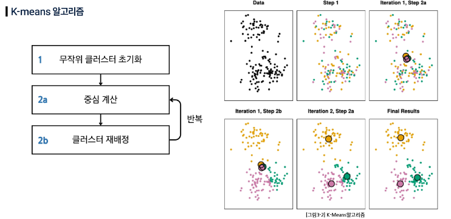
- input: k-3개로 나눠 -> 중심 계산 - 재할당 - 반복
- 그러면 언제까지 재할당하냐, 더이상 변화가 없을 때까지 = 이전 재할당 값과 같을 때까지

## 3-5. k-means 클러스터링에서 초기값의 영향
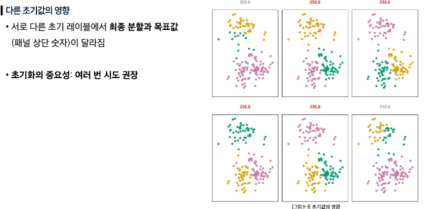
- 이전 이미지와 똑같은 데이터고 input도 k-3으로 같음
- 다른 종류의 클러스터링은 3개만 있음
  - 어떻게 나눴는지 정도가 차이임. 색깔로 현혹되면 안됨
  - 빨간 글씨의 클러스터링은 같은 것임
  - 320.9, 310.9는 다른 클러스터링
  - 이미지 위 수치는 각각의 클러스터링 안에 퍼져있는 정도. 작으면 작을 수록 좋다
    - 그럼 더 돌리면 되지 않아요? 더이상 변하지 않음. 멈춘 값임


<br>

**무작위 클러스터 초기화의 정의**

알고리즘을 시작할 때 **각 데이터(관측치)에 $1$부터 $K$까지의 클러스터 번호를 무작위로 임시 할당**하거나, 전체 데이터 중 **무작위로 $K$개의 점을 선택하여 초기 중심점(Centroid)으로 지정하는 과정**을 의미합니다.

* 알고리즘의 첫 단계(Step 1)에서 데이터의 초기 위치 구조를 정해주는 출발점 역할을 합니다.
  
<br>

**최종 분할과 목표값에 미치는 영향**

무작위 초기화는 K-means 알고리즘의 최종 군집 결과(최종 분할)와 내부 변동성 합(목표값)에 매우 결정적인 영향을 미칩니다.

① 지역 최솟값(Local Minimum) 문제 발생

K-means 알고리즘은 매 반복(Iteration)마다 중심점을 재계산하고 데이터를 재할당하면서 클러스터 내부 변동(Within-Cluster Variation, 거리/차이의 합)을 **감소시키는 방향으로 작동**합니다.

* 하지만 이 방식은 **경사하강법과 유사한 탐색 구조**를 가지기 때문에, 전역 최솟값(Global Minimum)이 아닌 초기 위치에서 가까운 지역 최솟값(Local Minimum)에 빠진 채 알고리즘이 종료될 수 있습니다.

② 초기화 위치에 따른 최종 분할의 가변성

초기 중심점(또는 초기 할당)이 어디서 시작하느냐에 따라 **최종적으로 나뉘는 군집의 경계(분할)와 형태가 완전히 달라질 수 있습니다.**

* 운 좋게 진짜 데이터 구조와 가까운 곳에서 시작하면 최적의 군집 분할을 얻지만, 서로 가까운 위치에 초기 중심점들이 뭉쳐서 시작하면 비효율적이고 왜곡된 경계로 나뉘게 됩니다.

③ 목표값(클러스터 내부 변동/거리 합)의 차이

알고리즘이 수렴했을 때의 **목표값(클러스터 내부 거리/차이의 합)** 역시 초기화에 따라 크게 달라집니다.

* **좋은 초기화**: 최종 목표값(내부 변동 합)이 **작아짐** $\rightarrow$ 더 조밀하고 잘 뭉친 군집 형성
* **나쁜 초기화**: 최종 목표값(내부 변동 합)이 **크게 남음** $\rightarrow$ 군집 내부 요소 간 거리가 멀어 성능 저하

<br>

💡 실무적 해결책 (K-means의 단점 극복)

이러한 무작위 초기화의 한계를 극복하기 위해 실제 분석 및 라이브러리(scikit-learn 등)에서는 다음과 같은 방법을 사용합니다.

1. **여러 번 실행 후 최적 결과 선택 (`n_init`)**: 무작위 초기화를 각기 달리하여 알고리즘을 여러 번(예: 10회~30회) 독립적으로 실행한 후, **목표값(클러스터 내부 변동 합)이 가장 작은(최소인) 최종 분할**을 선택합니다.
2. **K-means++ 알고리즘 활용**: 첫 번째 중심점만 무작위로 뽑고, 이후 중심점들은 기존 중심점들과 **거리가 멀리 떨어진 데이터일수록 선택될 확률을 높이는 방식**으로 초기 중심들을 서로 멀찍이 배치하여 지역 최솟값 문제를 대폭 완화합니다.

# 4. 계층적 군집 (Hierarchical Clustering)
## 4-1. 계층적 군집
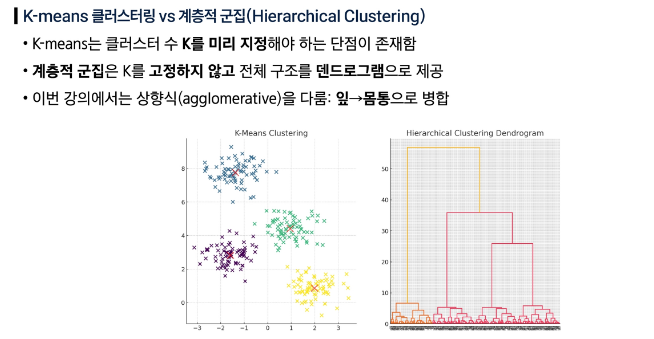
- 어디서 자를지 결정 할 수 있음(사후)
<br>

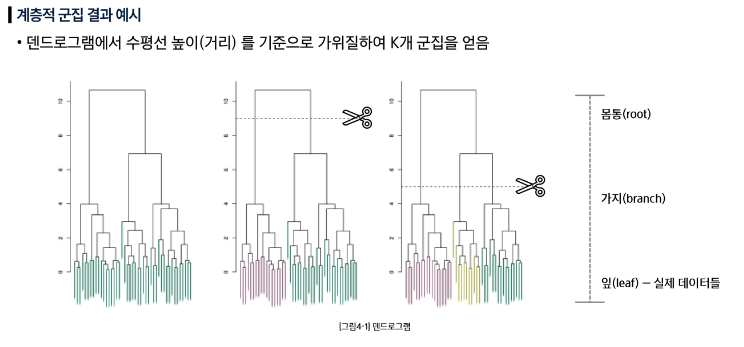

<br>
계층적 군집분석(Hierarchical Clustering)에서 덴드로그램(Dendrogram)은 데이터들이 뭉쳐가는 과정을 나무 구조로 시각화한 그림입니다.

여기서 수평선의 높이(Height)와 **군집 수 $K$의 결정 방식**은 매우 밀접한 관계를 가집니다.
<br>

 1. 덴드로그램에서 수평선 높이의 의미

덴드로그램의 Y축에 해당하는 **수평선의 높이**는 "두 군집(또는 데이터)이 하나로 합쳐질 때의 이격성(Dissimilarity) 또는 거리(Distance)"를 의미합니다.

* **낮은 높이에서 연결된 수평선**:
두 데이터/군집 간의 거리가 매우 가깝고 유사도가 높아 **빠르게 하나로 묶였음**을 뜻합니다.
* **높은 높이에서 연결된 수평선**:
두 데이터/군집 간의 차이가 커서 **서로 꽤 다른 집단인데 억지로 하나로 합쳐졌음**을 뜻합니다.

> 💡 **핵심**:
> 수평선 간의 세로 가지(Vertical Line) 길이가 길다는 것은, **"그 이전 단계까지는 서로 잘 분리되어 있던 두 군집을 합쳤다"**는 것을 의미합니다.

<br>

1. 군집 $K$개를 선정하는 데 미치는 영향

덴드로그램에서 원하는 군집 개수 $K$개를 결정하려면 특정 높이에서 수평으로 가로지르는 절단선(Cut Line)을 그어야 합니다.

```
          ┌───────┴───────┐   <-- 높이 High (K=2)
     ┌────┴────┐          │
     │         │          │   <-- [절단선 위치]
   ┌─┴─┐     ┌─┴─┐      ┌─┴─┐
   A   B     C   D      E   F

```
<br>

 ① 절단선 위치와 $K$의 관계

* 덴드로그램을 가로지르는 수평 절단선을 특정 높이에 그었을 때, 절단선과 만나는 세로 줄기의 개수가 곧 군집의 개수 $K$가 됩니다.
* 절단선을 위쪽(높은 위치)에 그을수록 $\rightarrow$ 군집 수가 **적어짐** ($K$가 작아짐).
* 절단선을 아래쪽(낮은 위치)에 그을수록 $\rightarrow$ 군집 수가 **많아짐** ($K$가 커짐).
<br>

② 최적의 $K$를 찾는 기준 (수평선 높이의 활용)

* **가장 길게 뻗은 세로 가지 구간을 탐색**:
수평선과 다음 수평선 사이의 **세로 간격(높이의 차이)이 가장 넓은 구간**에 가로 절단선을 긋는 것이 일반적입니다.
* **이유**:
세로 간격이 넓다는 것은 "그 높이 범위 동안에는 새로운 군집 병합이 일어나지 않을 정도로 각 군집이 서로 명확히 구분되어 유지되었다"는 뜻이기 때문에 가장 자연스럽고 신뢰할 수 있는 군집 분할 지점이 됩니다.

<br>

📌 요약

1. **수평선 높이** = 군집 간의 **거리(비유사성)**.
2. **높이 차이가 큰(세로 가지가 긴) 구간**에서 덴드로그램을 자르는 것이 가장 이상적인 $K$개를 선정하는 방법입니다.


## 4-2. 계층적 군집 알고리즘(상향식)
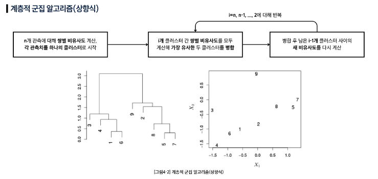
- 계층적 군집은 클러스터링의 뭉침 과정임 -> 합침의 과정
  
## 4-3. 계층적 군집 단계별 진행
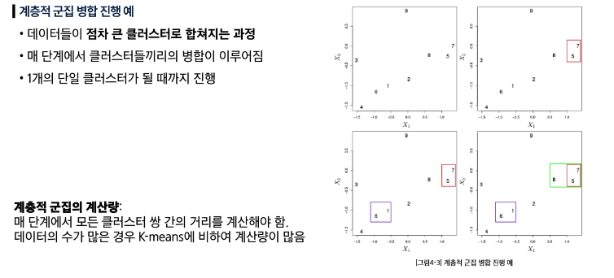
- 1단계: 7과 5가 가장 가까워서 둘을 합침 -> 한 덩어리가 됨
- 2단계: 1과 6 묶음.
  - 5와7 묶음과 8을 묶을 때 가까움의 기준을 어디로 할 것인가? 링크 유형으로 결정

## 4-4. 계층적 군집의 링크 유형
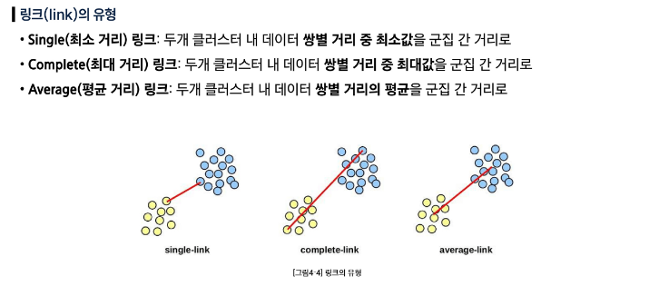
- 싱글 = 최저, 컴플 = 최장, 평균 거리 -> 3가지 다 유용하고 링크 유형은 결국 학습자가 결정해야 함. -> 이에 따라 결과가 매우 달라짐

## 4-5. 링크 유형에 따른 계층적 군집 결과
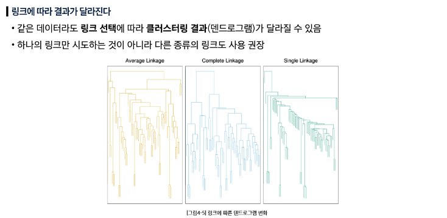
- 비지도 학습은 정답이 없기 때문에 여러 번 시도해서 어떤 것이 더 적합한지 결정

# 5. 클러스터링 시 주의점

**클러스터링 체크리스트**

* **스케일링**: 표준화(평균 0, 표준편차 1로 입력 변수 변환)가 필요한가?
$\rightarrow$ **Yes, 변수 단위 차이 영향큼.**

* **몇 개의 클러스터가 적합한지?**
$\rightarrow$ K-means·계층적 모두 어려운 문제, 합의된 정답 없음

* **단일 시도가 아닌 여러 번 시도 권장됨**
