# 📌 선형회귀
**학습 목표**
> ■ 선형회귀의 기본 아이디어를 설명할 수 있다.
>* 입력과 출력 간의 직선적 관계를 그림과 수식으로 표현한다.
>* 직선을 잘 맞추기 위해 잔차(residual)와 최소제곱법이 어떻게 쓰이는지 직관적으로 설명한다.

> ■ 회귀 계수의 의미를 해석할 수 있다.
>* 계수가 크기/부호에 따라 어떤 의미를 갖는지 설명한다.
>* 결과의 불확실성을 표준오차, 신뢰구간의 기본 개념으로 설명한다.

> ■ 모델의 성능을 평가할 수 있다.
>* 잔차 표준 오차와 결정계수($R^2$)를 계산하고, 모델이 데이터를 얼마나 잘 설명하는지 비교한다.

> ■ 다중 선형 회귀의 한계를 설명할 수 있다.
>* 변수가 상관관계가 높을 때 (다중 공선성), 해석에 문제가 생기는 이유를 설명한다.
>* 상관관계와 인과관계는 다르다는 점을 사례로 구분한다.

<br>

- 실제 응용 사례
  - 광고비와 매출액의 상관 관계 분석
  - 고객 소득, 소비 패턴을 활용한 신용점수 산출

# 1. 선형회귀
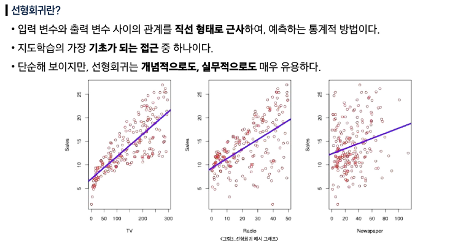

# 2. 단순선형회귀 (Simple Linear Regression)
## 2-1. 단순선형회귀: 단일 설명변수를 이용한 선형회귀
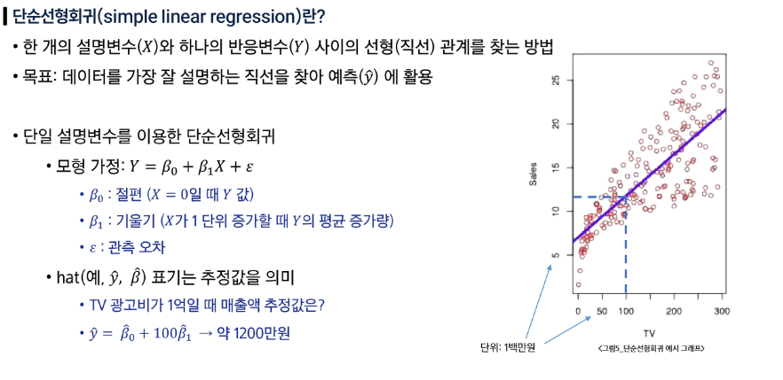

- 빨간점: 데이터(X)

## 2-2. 최소제곱법 (least squeares)❗
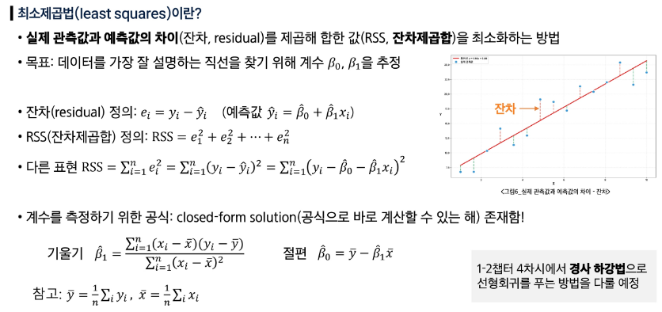
- 선형회귀에서 어떻게 저 선을 학습할 수 있는가?
  - 예측값: 선형함수 
  - 잔차: 예측값과 실제값의 차이
    - 잔차가 너무 커도 너무 작아도 좋지 않음 -> 제곱함
  - **잔차제곱합**: 모든 데이터에 관심이 있기 때문에 모든 잔차에 제곱해서 더함 (- 값도 포함되도록)
    - 잔차제곱합이 작을수록 데이터에 fit한 선
    - rss의 마지막 식은 결국 이차함수를 제곱한 것
      - 기울기는 베타 기준 최소값은 미분해서 기울기가 0일 때 최소값 찾을 수 있음
      - 절편은 최소점이면서 기울기가 0인 점을 찾는 것
  - 우리의 문제는 직선을 찾는 것임 -> **잔차를 최소화 하는 기울기, 절편**만 찾으면 됨
    - x바: x 평균/ y바: y 평균
    - 기울기: 잔차를 최소를 할 수 있는 값

## 2-3. 단순선형회귀: 광고 데이터
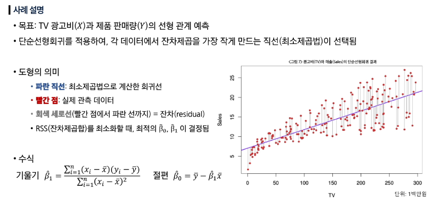
- 선에 따라 잔차는 바뀜 -> 당연하게도~
- 참함수는 알 수 없으나 최대한 가깝게 가고 싶은 것

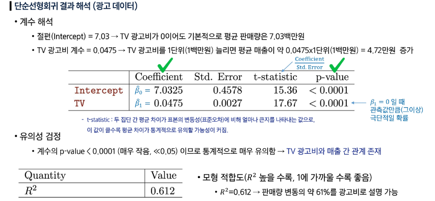
> $\beta_0$ (절편, Intercept) 및 $\beta_1$ (기울기, Slope)
- $\beta_0$햇지:절편에 대한 추정치 / b1햇지: 기울기에 대한 추정치
- std.Error: 추정치와 실제값의 차이가 생기는데 그 정도에 대한 표준편차
- t-statistic: 해당 값이 크면 클수록 x와 y와의 관계가 0에서 떨어질 확률이 매우 높다
- p-value: t-statistic의 값을 확률로 나타낸 값
- $\beta_0$=0일 때:(=기울기가 0일 때) x와 y의 관계가 무관하다. 하나도 없어.
  - 당신이 생각하는 가정을 true로 가정할 때 행 가정으로 데이터가 나올 확률이 0에 가깝기 때문에 해당 가정을(=가설을) 기각해야 합니다.
- $\beta_1$의 값이 0에 가깝다 하더라도 0이 아니라면 선형성이 있는 것임. 
  - 누군가는 0에 가깝다고 하여 선형이 낮다고 하는데 이는 틀린 설명임
  - 선형성이 크다 작다는 p-value만 보면 됨
    - 그럼 p-value가 언제 커지냐 coefficient에 비해 std.error가 꽤 클 때 -> t-statistic 가 작고 그말인 즉슨, p-value가 클 것이다 -> 이런 경우에 p-value 가 크고 작다고 말할 수 있음. 절대 p-value를 제외한 단편 지표만 보고 판단할 수 없음.
  - 예를 들어, x, y의 단위가 무엇인지도 확인 해봐야함. 단위가 백만원이라 coefficient가 기울기 0.04인데 해당 단위가 천원, 백원이라면 기울기도 훨씬 커질 것임

* 유의성 검정에서 결정계수의 설명력이 61%라는 설명이 있는데 이게 무슨 말인지 찾아보기
<details>
<summary><b>📊 회귀분석 요약표 핵심 지표 (Coefficient, Std.Error, t-statistic, p-value)</b></summary>

<div markdown="1">

### 1. 각 지표의 정의

#### ① Coefficient (회귀계수, $\hat{\beta}$)
* **정의:** 독립변수($X$)가 1단위 증가할 때 종속변수($Y$)가 평균적으로 얼마나 변화하는지 나타내는 영향력의 크기와 방향(+/-)입니다.
* **직관:** "광고비를 1만 원 늘릴 때 매출이 몇 만 원 증가하는가?"를 나타내는 수치입니다.

#### ② Std.Error (표준오차, $SE(\hat{\beta})$)
* **정의:** 표본 추출에 따라 회귀계수 추정치가 얼마나 흔들리는지(변동하는지) 나타내는 추정의 불확실성(표준편차)입니다.
* **직관:** 데이터 수가 적거나 노이즈가 심하면 표준오차가 커지며, 이는 "우리가 구한 회귀계수를 100% 신뢰하기 어렵다"는 뜻입니다.

#### ③ t-statistic (t-통계량, $t$)
* **정의:** 회귀계수 추정치가 표본 오차에 비해 얼마나 떨어진 곳에 있는지를 나타내는 상대적 크기 지표입니다.
* **귀무가설($H_0$):** $\beta = 0$ (즉, "$X$와 $Y$ 사이에는 아무런 선형 관계가 없다.")

#### ④ p-value (유의확률)
* **정의:** 귀무가설($\beta = 0$)이 실제로 참이라는 전제하에, 순수한 우연으로 현재와 같거나 더 극단적인 회귀계수가 관찰될 확률입니다.
* **직관:** p-value가 매우 작다면($0.05$ 미만), "이 결과가 우연일 리가 없으니 $X$가 $Y$에 미치는 영향이 유의미하다"고 결론을 내립니다.

#### 1단계: t-통계량 계산
$$t = \frac{\text{Coefficient}}{\text{Std.Error}} = \frac{\hat{\beta}}{SE(\hat{\beta})}$$

* **Coefficient가 커질수록** $\rightarrow$ $t$ 값의 절댓값이 증가합니다.
* **Std.Error가 작아질수록(신뢰도가 높을수록)** $\rightarrow$ $t$ 값의 절댓값이 증가합니다.

#### 2단계: p-value 계산
* 계산된 $t$-통계량을 자유도(Data 개수 - 변수 개수)에 해당하는 **t-분포(t-distribution)** 양쪽 꼬리 면적에 적용하여 p-value를 구합니다.
* $|t|$ 값이 커질수록 $\rightarrow$ 그래프의 극단(꼬리) 쪽으로 밀려나므로 p-value는 감소합니다.


### 3. 요약 및 판정 기준

| 지표 | 계산 공식 | 바람직한 조건 (관계가 유의미할 때) |
| :--- | :--- | :--- |
| **Coefficient ($\hat{\beta}$)** | 모델 학습을 통해 추정 | 0에서 멀어짐 (영향력 큼) |
| **Std.Error ($SE$)** | $\sqrt{\text{Var}(\hat{\beta})}$ | 작을수록 좋음 (추정이 정밀함) |
| **t-statistic ($t$)** | $\frac{\text{Coefficient}}{\text{Std.Error}}$ | **절댓값이 클수록 좋음** ($|t| \ge 2$ 이상) |
| **p-value ($p$)** | $P(|T| \ge |t|)$ | **작을수록 좋음** ($p < 0.05$ 보통 기준) |


> **💡 한 줄 직관 요약**  
> "Std.Error(불확실성)에 비해 Coefficient(영향력)가 충분히 크면 $\rightarrow$ t-statistic이 커지고 $\rightarrow$ p-value가 0.05 미만으로 떨어져 $X$가 $Y$에 미치는 영향이 우연이 아니라고 확신할 수 있습니다."

</div>
</details>

### 2. 4가지 지표의 수식적 관계

이 지표들은 각각 독립적으로 계산되는 것이 아니라, 하나의 연쇄적인 계산 흐름을 가지고 연결되어 있습니다.


# 3. 다중선형회귀
## 3-1. 다중선형회귀란?
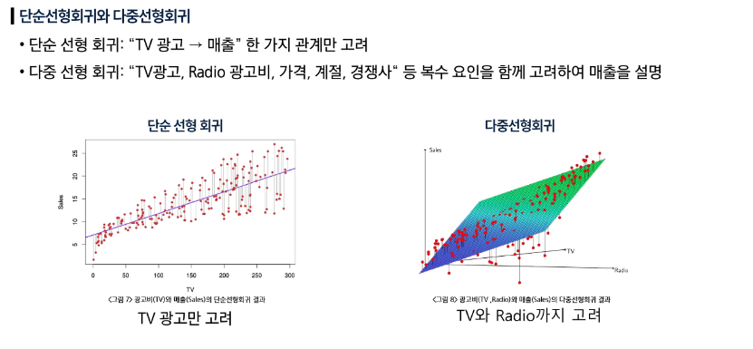
- x= 독립변수 -> 모든 베타들이 우리가 학습해야 하는 데이터임

**다중선형회귀의 개념**

* 독립 변수(설명 변수, Feature)가 여러 개 존재할 때 사용하는 회귀 분석 기법
* 단순 선형 회귀는 하나의 변수만 고려하지만, 다중 선형 회귀는 여러 독립 변수($X_1, X_2, \dots$)를 동시에 고려하여, 종속 변수($Y$)와의 관계를 구함
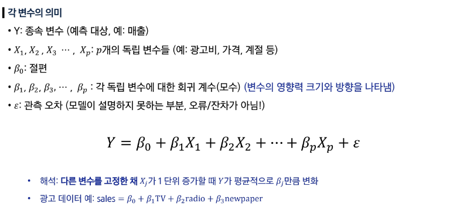
- 나머지가 고정됐을 때 어떤 베타 값이 1단위로 변했을 때 y에 어떤 영향을 주느냐가 해당 값의 영향
  - 이 말도 무슨 말인지 찾기
  

## 3-2. 다중선형회귀의 추정과 예측
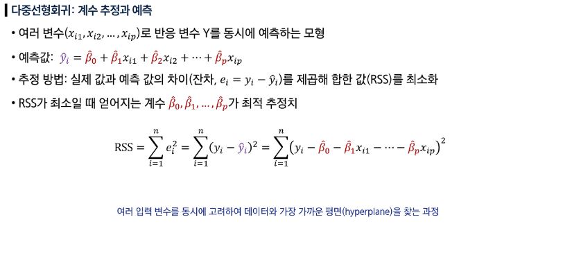
- 평면의 기울기와 절편을 찾는 것은 베타햇임

## 3-3. 다중선형회귀 계수 추정 유도(행렬 표현)❗
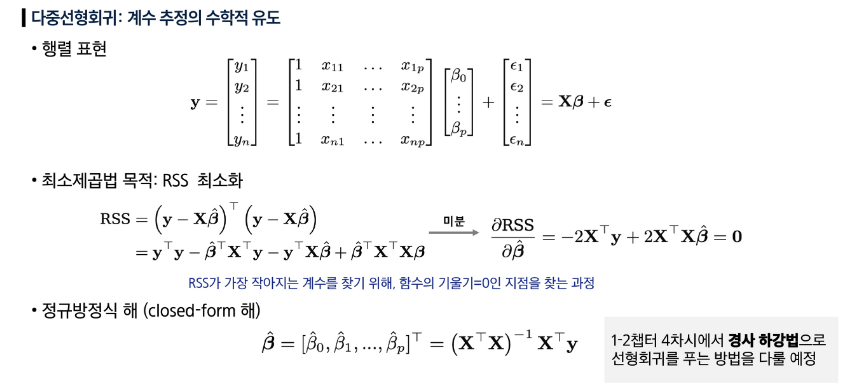
- 가지고 있는 y값을 쭉 나열해서 벡터 값으로 만듦
- y1에 해당하는 x값은 해당 행에 쭉, y2에 해당하는 x값은 해당 행들을 매트릭스로 표현
- 행렬표현의 함수는 결국 트루함수를 표현한 것
- rss= xb햇은 yi햇임 -> 결국 벡터로만 표현한 것이고 2차식임 그래서 해당 식을 **미분해서 0이 되는 값을 찾으면 됨**
*행렬벡터계산할줄알면됨,,,ㅎㅋ 하루 하면 된다네영,,-> 교수님 공부해보길 꼭 추천하심...,.,.

## 3-4. 다중선형회구 결과: 시각화
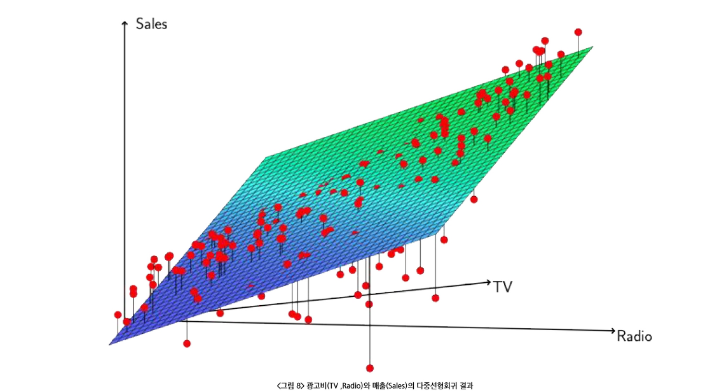

## 3-5. 다중선형회귀 결과: 광고 데이터
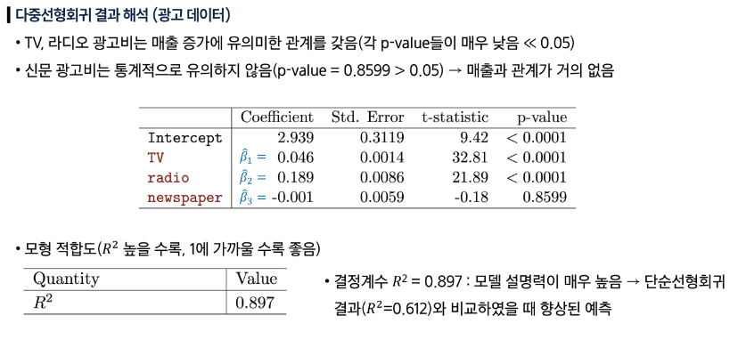
- tv, radio, newspaper 3가지에 대한 모형 적합도가 매우 높음
  
# 4. 선형회귀 주의사항
## 4-1. 검증/데이터셋 데이터를 활용한 성능 평가
▍ **선형회귀 결과 검증 및 테스트 성능**

* **훈련 데이터에서의 성능**
* 회귀식을 만들 때 최소제곱 해는 훈련 데이터만 보고 계산됨
* 학습에 사용된 훈련 데이터에서는(X과 Y의 평균적인 선형관계가 있다면) 적합(fitting)이 잘 되어 있을 것임.
* 그러나 이것은 테스트 성능을 과소평가할 가능성이 높음


* **테스트 성능 평가 필요**
* 선형회귀도 변일일반화 성능을 확인하려면 훈련에 사용되지 않은 새로운(테스트) 데이터에 적용해 봐야 함
* 수가 많거나 고차항을 사용하면 **과적합(overfitting) 문제**가 여전히 발생할 수 있음.
* 검증/교차검증을 통해서 적절한 적합을 찾을 수 있음.


▍ **선형회귀를 통해 대답할 수 있는 질문들**

* **이상적 상황: 변수들이 연관(correlation)되지 않고, 독립적일 때 $\rightarrow$ 계수 해석이 명확함**
* **문제 상황: 변수들이 서로 연관되어 있다면 $\rightarrow$ 계수 추정이 불안정해지고 해석에 혼동이 발생할 수 있음**
* **주의: 관찰 데이터의 상관관계로 인과 관계를 주장해서는 안 됨.**
* 예로 들었던, 광고 데이터는 자연스럽게 인과성이 있는 것 처럼 보이지만, 다른 많은 데이터에서 선형 관계를 보인다고 하여 인과 관계가 있는 것이 아님.
* 예: "아이스크림 소비량" (X) vs "상어에 물리는 사건" (Y)

- 우리는 상관관계를 말하는 것이지 인과관계를 말하는 것이 아님. 왜냐면 어떤 관계에 대한 적합 모델이 있어도 모든 데이터를 설명할 수 없음

### 개인정리

🚨 1. 잘못 이해하고 있거나 교정이 필요한 부분

① p-value와 선형성(기울기)의 관계

* **기존 메모 내용:** *"기울기가 0이 아니면 선형성이 있는 것, 선형성이 크다 작다는 p-value만 보면 됨"*
* **직관적 교정:** **p-value는 '관계의 세기(기울기의 크기)'를 나타내는 것이 아니라, '통계적 신뢰도'를 나타냅니다.**
* 기울기($\beta_1$)가 아무리 작아도 데이터 수가 아주 많으면 p-value는 $0.0001$ 이하로 매우 유의미하게 나올 수 있습니다.
* **p-value의 정확한 의미:** "실제로는 관계가 전혀 없는데($\beta_1 = 0$), pure 한 우연에 의해 이런 데이터 패턴이 관찰되었을 확률"입니다.
* 따라서 **p-value가 매우 작다**는 것은 *"우연일 리가 없다. X와 Y 사이에는 확실한 선형 관계가 존재한다"*는 **신뢰의 의미**이지, 기울기가 가파르다는 뜻이 아닙니다.


② unit(단위) 변화와 p-value / t-통계량의 관계

* **기존 메모 내용:** *"단위가 백만원이라 기울기가 0.04인데 천원으로 바뀌면 기울기도 커지고 p-value에도 영향"*
* **직관적 교정:** X의 단위를 변경(백만원 $\rightarrow$ 원)하면 **기울기($\beta_1$)와 표준오차(Std.Error)가 똑같은 비율로 스케일링**됩니다.
* $t\text{-statistic} = \frac{\text{Coefficient}}{\text{Std.Error}}$ 이므로, 분모와 분자가 같이 비례해서 변해 **t-통계량과 p-value는 전혀 변하지 않고 동일하게 유지**됩니다.
* 단위를 바꾼다고 해서 "X가 Y에 미치는 통계적 유의성"이 변하면 안 되기 때문입니다.


③ 테스트 성능의 과소평가 표현

* **기존 메모 내용:** *"학습 데이터 적합... 이것은 테스트 성능을 과소평가할 가능성이 높음"*
* **직관적 교정:** 훈련(Train) 데이터에만 너무 맞춰진 모델은 테스트 데이터에 가져갔을 때 성능(예측력)이 떨어집니다. 즉, **"테스트 성능이 낮게 나올 가능성이 높다(과적합 문제)"** 또는 "모델의 실제 성능을 과대평가(오판)할 수 있다"로 이해하시는 것이 훨씬 정확합니다.

---

💡 2. 노트에서 궁금하다고 적어두신 내용 추가 설명
Q1. "결정계수($R^2$)의 설명력이 61%라는 게 무슨 말인가요?"

* **해답:** "Y(종속변수)가 가지는 전체 변동성(분산) 중 61%를 우리 모델(X)이 설명해낸다"는 뜻입니다.
* **쉬운 예시:**
* 매출액이 매달 오르락내리락(변동)합니다. 이 전체 변동성을 $100%$라고 할 때, "광고비(X)라는 정보를 알고 나니 매출 변동의 $61\%$ 원인을 파악할 수 있게 되었다"는 의미입니다.
* 나머지 $39%$는 광고비 외의 다른 요소(날씨, 경쟁사 할인, 경기 등) 때문에 일어나는 설명되지 않은 변동입니다.


 Q2. "다른 변수가 고정됐을 때 $\beta$가 1단위 변할 때 Y에 주는 영향이 무슨 뜻인가요?"

* **해답:** 다중선형회귀에서 **"다른 모든 조건을 동일하게 통제했을 때(ceteris paribus)"** 해당 변수만의 순수한 영향력을 뜻합니다.
* **쉬운 예시:** $\text{매출} = \beta_0 + \beta_1(\text{TV 광고비}) + \beta_2(\text{라디오 광고비})$
* 여기서 $\beta_1 = 2.5$라면, "라디오 광고비를 똑같이 고정시켜 둔 상태에서, TV 광고비만 1만 원 늘리면 매출이 2.5만 원 증가한다"는 뜻입니다.
* 라디오 광고비의 간섭을 완전히 제거한 **TV 광고만의 순수한 효과**를 발라내어 해석하는 개념입니다.


📝 3. 핵심 한 줄 요약 정리

1. **최소제곱법 (OLS):** 실제값과 예측값의 차이인 **'잔차제곱합(RSS)'을 최소화**하는 최적의 기울기($\beta_1$)와 절편($\beta_0$)을 미분을 통해 찾아내는 과정.
2. **t-통계량 & p-value:** $X$가 $Y$에 영향을 준다는 주장이 '우연'일 가능성을 검증. **p-value가 $0.05$보다 작으면** "X와 Y 사이에는 확실한 관계가 있다"고 결론.
3. **다중공선성 (Multicollinearity):** 독립변수($X_1, X_2$)끼리 서로 강한 상관관계를 가지면, 각 변수만의 순수한 효과($\beta$)를 분리해내지 못해 **계수 추정이 매우 불안정**해짐 (주의 필요).
4. **상관관계 vs 인과관계:** 회귀분석이 알려주는 것은 수치적 관련성(상관관계)일 뿐, $X$가 원인이 되어 $Y$라는 결과를 일으켰다는 **인과관계를 증명하는 것은 아님** (예: 여름철 아이스크림 판매량 $\uparrow$ 과 상어 공격 횟수 $\uparrow$ 는 기온이라는 제3의 변수 때문이지 서로 원인관계가 아님).

정리해 두신 노트의 전체적인 뼈대와 흐름이 이미 완벽하셔서, 위에서 바로잡은 몇 가지만 수정해 두시면 복습하실 때 훨씬 매끄럽고 명확하게 이해되실 겁니다!

---------
---------
# 📌 로지스틱회귀(Logister Regression)
> **학습 목표**
>
> 분류 모델에서 로지스틱 회귀를 사용하는 이유를 이해합니다.
> 로지스틱 회귀 모형을 이해합니다.
> 신용카드 연체의 예시를 통해 분류 모델을 적용해 봅니다.

# 1. 분류(Classification)
## 1-1. 분류란?
 ▍ 분류의 정의

* **분류:** 정해진 범주(카테고리) 중 하나로 지정하는 것.
* **범주형 변수:** 수치의 크고 작음이 아니라 유한한 범주(성별, 혈액형, 지역 등)로 표현하는 변수
* 예: 눈동자 색 {black, brown, blue, green}, 이메일 종류 {spam, normal}

 ▍ 분류 함수의 목표

* **입력 ($X$, 특성 벡터):** 눈동자 이미지, 이메일 내용/제목
* **출력 ($Y \in C$, 범주):** 예, 눈동자 색 $C = \text{\{black, brown, blue, green\}}$, 이메일 $C = \text{\{spam, normal\}}$, 순서 없는 집합
* **분류 함수의 목표**
* 분류 함수 $f(X)$를 학습하여 입력 $X$가 속할 범주(카테고리)를 예측
* 범주의 직접 예측보다 각 범주에 속할 확률 $P(Y = k \mid X)$를 추정하는 것이 더 유용할 때가 많음
  
## 1-2. 예시: 신용카드 연체(Default)
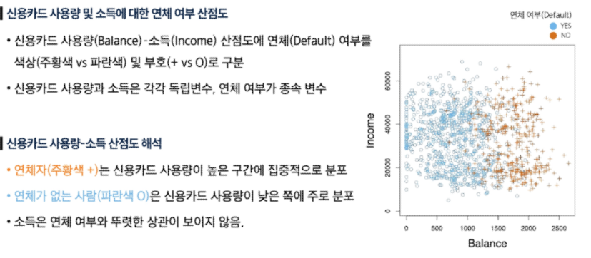
- 빨강이 yes, 파랑이 no -> 색깔 지표가 잘못되어있음

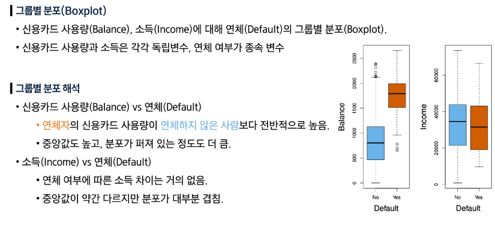

## 1-3. 분류 문제에 선형회귀를 써도 될까?
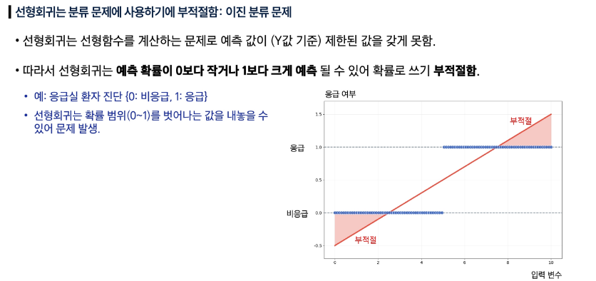

## 1-4. 분류 문제에서 적합한 모델
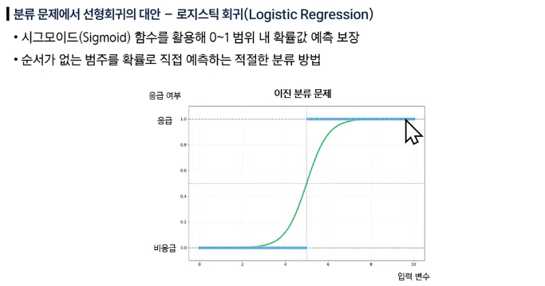
- 시그모이드 함수: 무조건 예측값은 0과 1 사이에 존재
- 시그모이드 함수를 이용해서 로지스틱 회귀 진행

# 2. 로지스틱회귀
## 2-1. 로지스틱(Logistic) 회귀의 모형식
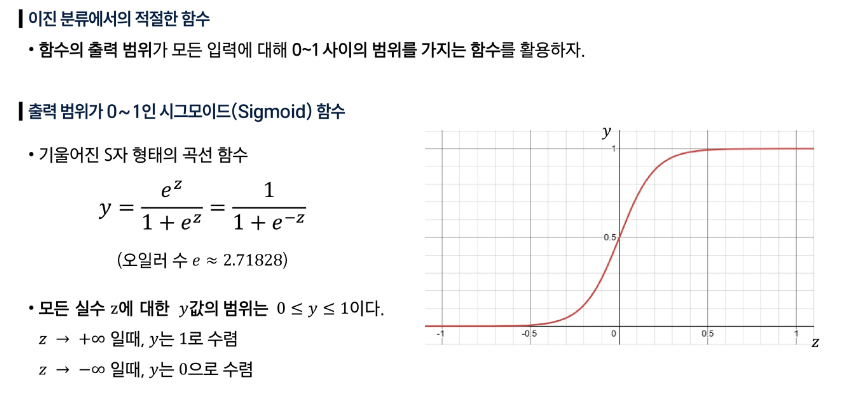
- 오일러 수가 양수라서 z가 얼마나 크거나 작아도 y는 무조건 0과 1 사이에 있음........ 왜?


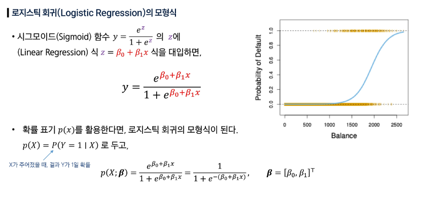
- 선형회귀 식을 대입한 것
- 무조건 0과 1이 되어야 하는 것으 아니지만 이진분류라서 주로 그렇게 두고 진행
- 여기도 선형회귀와 같이 기울기와 절편을 찾아야 함

## 2-2. 로지스틱 회귀 모형 vs 선형 모형 ❗
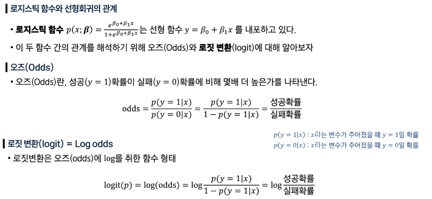
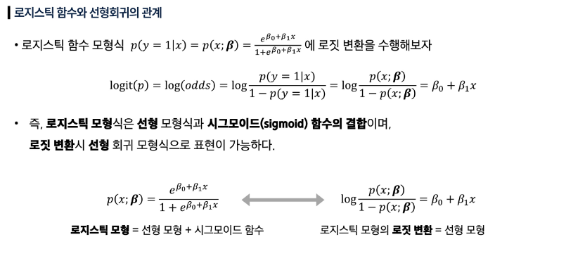
- 로짓을 하는 이유가 표현이 더 간단해짐...
  
## 2-3. MLE 활용 모수 추정❗
 ▍ 우도(Likelihood)

* 확률을 추정하는 모델을 결정했으니, 모수($\beta_0, \beta_1$)를 추정하는 방법에 대해 알아보자.
* 선형회귀에서 "현재 함수가 데이터와 오차가 작은지"를 평가하기위해 평균 제곱 오차(MSE; Mean Squared Error)를 지표로 삼았듯, 확률을 계산하는 함수를 평가하기 위해선 우도(Likelihood)를 지표로 삼는다.
* 우도란 **"현재 확률 함수(모형)가 데이터를 얼마나 잘 설명하는지"**를 나타낸 지표이다.
그러므로, 모델의 학습은 우도 값을 높여 최대화가 되도록 하는 것이 목표이며 이를 Maximum Likelihood Estimation (MLE)이라 한다.
<br>

* 우리는 이 우도를 높이고 싶은 것 
<br>

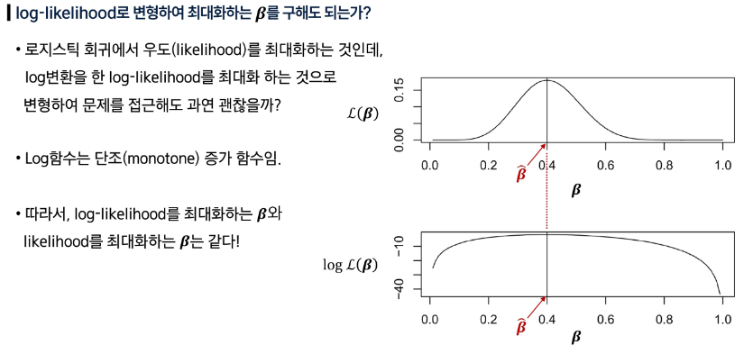
- 로그는 모노톤 함수이기 때문에 log를 씌우든 씌우지 않든 우도를 최대화하는 베타의 값은 같다.

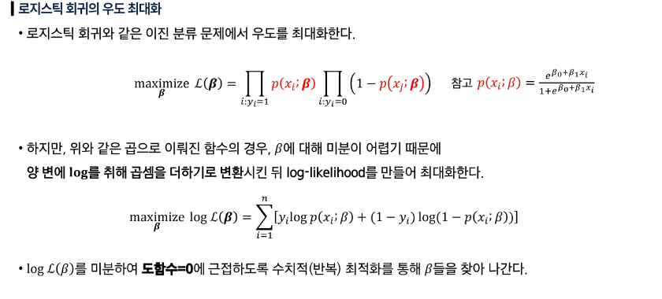
- 해당 값이 1에 가까울 수록 좋다(최대가 1임) -> P(xi;B)이 1에 가까울수록 좋음
- 1-P(xi;B) 이 0에 가까울수록 좋음 -> 그래서 P(xi;B)이 1에 가까울수록 좋아서 뒤집에서 함수를 만듦

- 그래서 우리가 하고 싶은 건 우도를 최대한 할 수 있는 베타 값을 찾는 것
- 하지만 식을 그대로 사용하면 어려워서 log를 씌운 다음에 계산 
- ...무슨 말이람...............

## 2-4. 로지스틱 회귀 결과: 신용카드 연체 데이터
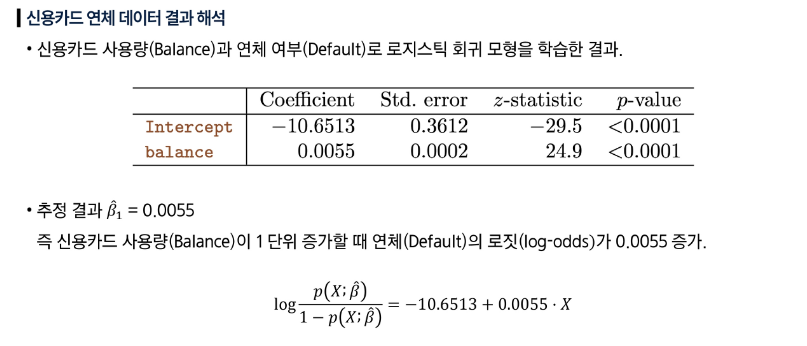
- log base는 항상 e임. 오이러 지수가 e였기 때문
- balance가 증가함에 따라 연체 여부가 증가함은 맞음 = balance의 coefficient의 값이 양이라.
  - 확률이 0.0055만큼 증가하는 것이 아니라 **로짓이 그만큼 증가**하는 것.

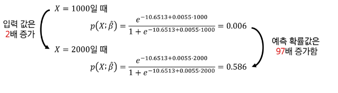
-확률은 시그모이드 형태로 증가함 -> 공간에 따라 매우 적게도 매우 크게도 증가함

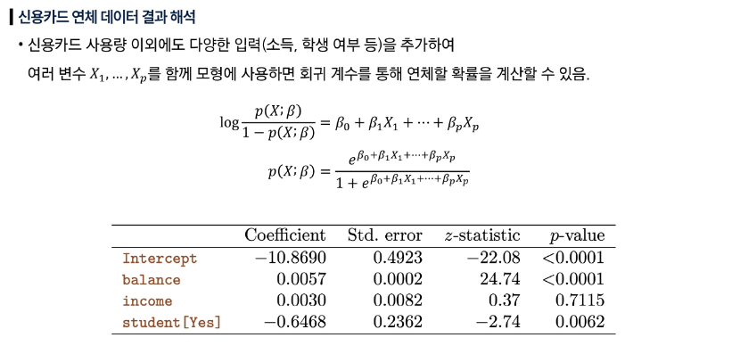
- 학생이면 연체를 덜 한다
  
### 개인 정리

❓ Q1. "$z$가 얼마나 크거나 작아도 $y$는 왜 무조건 0과 1 사이에 있을까?"

> **시그모이드 공식:** $y = \frac{1}{1 + e^{-z}}$

1. 오일러 수 $e$는 양수($\approx 2.718$)이므로, 지수 $-z$에 어떤 실수가 들어가도 $e^{-z}$는 절대 음수가 되지 않는 양수($>0$)입니다.
2. **분모($1 + e^{-z}$)는 항상 분자($1$)보다 크게 됩니다.**
3. **결과:** 분자와 분모가 모두 양수이면서 `분모 > 분자` 형태가 유지되므로, $y$ 값은 $z$가 아무리 작거나 커져도 **무조건 0과 1 사이**에 갇히게 됩니다.
* $z \rightarrow +\infty$ 이면 $e^{-z} \rightarrow 0 \implies y \rightarrow 1$
* $z \rightarrow -\infty$ 이면 $e^{-z} \rightarrow \infty \implies y \rightarrow 0$


❓ Q2. "우도(Likelihood)와 $\log$ 씌우는 식이 무슨 말인지..."

> **한 줄 요약:** 모델이 실제 데이터의 정답(0 또는 1)을 맞출 확률을 다 곱한 게 **우도(Likelihood)**이고, 미분과 컴퓨터 계산을 쉽게 하기 위해 **$\log$를 씌워서 더하기 식**으로 만든 것입니다.

* **왜 $P$와 $1-P$를 조합할까?**
* 실제 정답이 $y_i=1$ 일 때는 모델의 예측 확률 $P(x_i)$ 가 **1에 가까울수록** 좋습니다.
* 실제 정답이 $y_i=0$ 일 때는 모델이 예측한 '0일 확률'인 $1 - P(x_i)$ 가 **1에 가까울수록** 좋습니다.
* 결국 정답이 0이든 1이든, **"모델이 정답을 맞출 확률"을 모두 $1(100%)$에 가깝게 만드는 과정**입니다.


* **왜 그냥 안 곱하고 $\log$(로그)를 씌울까?**
1. **컴퓨터 오류 방지 (Underflow):** $0.5 \times 0.8 \times 0.2 \dots$ 처럼 $1$보다 작은 확률값 수천 개를 곱하면 숫자가 $0.0000...$이 되어 컴퓨터 메모리에서 사라집니다(오류).
2. **미분의 편의성:** $\log(A \times B) = \log(A) + \log(B)$ 성질을 이용하면 **곱하기가 '더하기'로 바뀝니다.**
3. **결과 동일:** 로그 함수는 단조 증가(Monotone) 함수이므로, $\text{우도}$를 최대화하는 $\beta$나 $\text{로그 우도}$를 최대화하는 $\beta$는 **완전히 동일한 값**을 가집니다.


4. 결과 해석 시 자주 틀리는 핵심 포인트 (추가/교정)

💡 계수(Coefficient) $\beta_1$의 진짜 의미: "오즈 비(Odds Ratio)"

노트에 아주 정확히 작성해 두셨듯이, $\beta_1$이 $0.0055$라고 해서 **"확률이 $0.0055$만큼 증가한다"고 말하면 틀린 해석**이 됩니다!

* **로짓(Log-Odds)의 증가:**
* $x$가 1단위 증가할 때, **$\ln(\text{Odds})$ (로짓 값)가 $\beta_1$만큼 증가**합니다.


* **오즈(Odds)의 곱셈 변화:**
* 양변에 지수($e$)를 취하면 $\text{Odds} = e^{\beta_0 + \beta_1 x}$ 가 됩니다.
* 즉, $x$가 1단위 증가하면 연체 오즈(성공확률/실패확률)가 $e^{\beta_1}$배(곱하기)가 됩니다.


> **예시:**
> $\text{balance}$의 계수 $\beta_1 = 0.0055$ 이라면, 잔액이 1달러 늘어날 때 연체할 확률 자체가 $0.0055$ 늘어나는 것이 아니라, **연체 오즈가 $e^{0.0055} \approx 1.0055$배(0.55% 증가) 곱해지는 것**입니다.


 1. 핵심 요약 카드 (복습용)

| 개념 | 선형 회귀 (Linear) | 로지스틱 회귀 (Logistic) |
| --- | --- | --- |
| **종속변수 ($Y$)** | 연속형 수치 (예: 매출액, 집값) | 범주형 (예: 연체 0/1, 스팸 0/1) |
| **예측값 범위** | $-\infty \sim +\infty$ | $0 \sim 1$ (확률값) |
| **핵심 함수** | 직선 방정식 ($Y = \mathbf{X}\boldsymbol{\beta}$) | 시그모이드 함수 ($y = \frac{1}{1 + e^{-\mathbf{X}\boldsymbol{\beta}}}$) |
| **손실/평가 지표** | 잔차제곱합 (RSS / MSE) | 로그 우도 (Log-Likelihood / Cross-Entropy) |
| **최적화 방법** | 최소제곱법 (OLS, Closed-form 해 존재) | 경사하강법 / MLE (반복적 최적화) |

-------
-------
# 📌 신경망모델(Neural Network)
>**학습 모델**
> ▍ 신경망(Neural Network)이란 무엇인가?
> * Shallow 네트워크, Deep 네트워크의 구조

>▍ 네트워크의 hidden unit은 어떤 역할을 하는가?
>* Shallow 네트워크, Deep 네트워크에서 hidden unit 및 활성화의 역할

>▍ Shallow 네트워크와 Deep 네트워크의 차이점은 무엇인가?
>* Deep 네트워크의 표현력

# 1. 모수적 함수로서의 선형 모델
## 1-1. 단순(1D) 선형모델: 모수적 함수
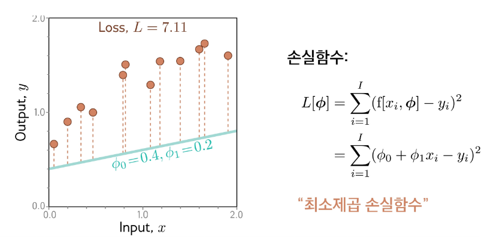

## 1-2. 단순(1D) 선형모델 학습
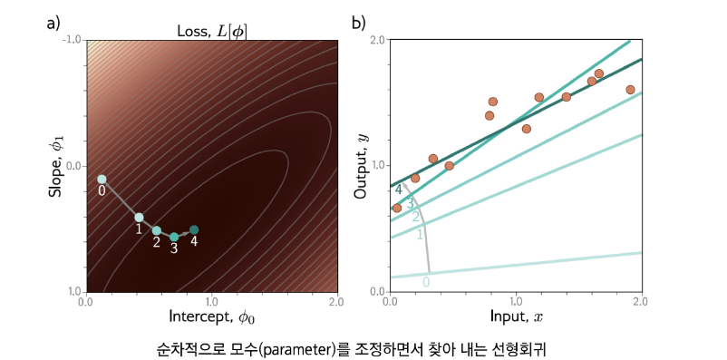


# 💯 여기 이전까지 노트북에서 복붙


# 2. Shallow 네트워크
## 2-1. Shallow 네트워크
 ▍ 정의
* 입력층(Input) - **은닉층(Hidden Layer) 1개** - 출력층(Output)으로 구성된 1개의 은닉층만 가진 신경망 구조

 ▍ 장점

* **복잡한 비선형 패턴까지 학습 가능**
* 단순 선형 모델 대비 표현력 향상


* 구조가 간단해 학습 속도가 빠르고 구현이 쉬움.
* 데이터가 충분하지 않아도 과적합 위험이 비교적 낮음.
* 
▍ 사용 예시

* 간단한 분류(Classification) 및 회귀(Regression) 문제
* XOR 같은 비선형 결정 boundary가 필요한 문제

## 2-1.shallow네트워크 VS 1D선형회귀
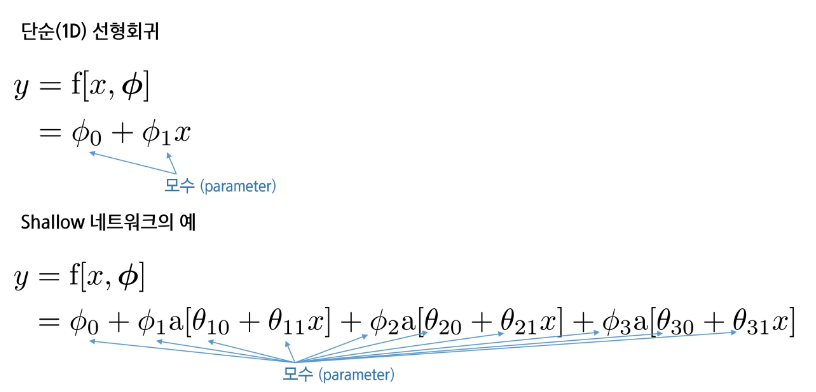
  
## 2-2. Shallow 네트워크: 활성화 함수
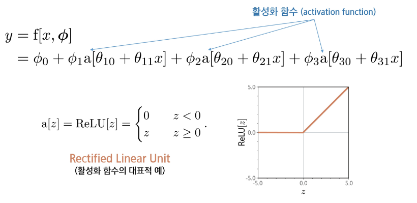
- a라는 함수(활성화 함수)가 매우 중요 -> 우리가 주로 다루는 함수는 rectified linear unit
- ReLU: 0 이하는 전부 0으로 만듦
- a는 파라미터가 아님. 단순히 오프, 온만 해주는 역할 
- <mark>활성화함수: 비선형성 부여, 입력 신호 변환(다음 레이어로 전달)</mark>
  - 복잡한 패턴 학습: 비선형 함수를 추가함으로써, 현실 세계의 복잡한 곡선이나 꺾인 형태의 데이터를 표현할 수 있게 됨.
  - 직선 모델을 벗어나기 위한 필수 장치이며, 0 이하의 값을 버리는 것은 **약간의 정보 손실을 감수하고 복잡한 비선형 패턴을 학습하기 위한 선택(Trade-off)**

<details><summary>0 이하의 값을 없애는 이유와 정보 소실에 대한 대안</summary>

**1. 활성화 함수(Activation Function)가 존재하는 이유**
   * **비선형성(Non-linearity) 부여:** 활성화 함수가 없다면 아무리 수백 개의 레이어를 쌓아도 모델은 단순한 **1차 직선 방정식**에 머무릅니다.
   * **복잡한 패턴 학습:** 선형 계산 사이에 비선형 함수를 추가함으로써, 현실 세계의 **복잡한 곡선이나 꺾인 형태의 데이터**를 표현할 수 있게 됩니다.

**2. 0 이하의 값을 0으로 없애는 이유와 그래도 되는 이유**
   * **없애는 이유 (스위치 역할):**
     * 특정 입력 구간에서 출력 신호를 0으로 만들어 **노드의 스위치를 꺼버리는 역할**을 합니다.
     * 이 스위치가 켜지고 꺼지는 경계선에서 **그래프가 꺾이는 마디**가 생기며, 이를 합성해 복잡한 형태를 만들어냅니다.


   * **그래도 되는 이유 (정보 요약 및 효율성):**
     * **노이즈 제거:** 약하거나 불필요한 신호(음수/잡음)를 차단하고 **정말 유의미한 주요 특징(양수 신호)에만 집중**합니다.
     * **연산 효율성:** 불필요한 계산량이 줄어들어 모델이 훨씬 가볍고 빠르게 학습합니다.

**3. 정보 소실에 대한 대안** -> 이후 내용에 나옴
0 이하의 값을 완전히 뭉개면서 발생하는 **정보 소실 및 '죽은 뉴런(Dying ReLU)' 현상**을 방지하기 위해 다음과 같은 대안 함수들을 사용합니다.
  * **Leaky ReLU:** 0 이하의 구간에서도 완전히 0으로 만들지 않고, 아주 작은 기울기(예: $0.01x$)를 곱해 **음수 정보의 일부를 살려둡니다.**
  * **ELU / GELU:** 0 이하 영역을 완만한 곡선 형태로 처리하여 **정보 소실을 최소화하고 부드러운 연결**을 만듭니다.

</details>

## 2-3. Shallow 네트워크: 모수
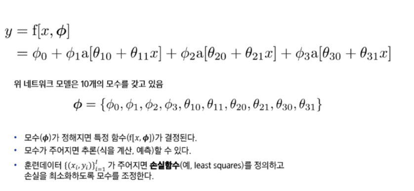

<details><summary>모수의 개수 및 영향</summary>

**1. 모수의 개수는 정해져 있는가? 어떻게 정해지며 사람이 정하는가?**

  * **정해져 있는가?:** 네, 모델의 **아키텍처(구조)를 설계하는 순간 모수의 개수는 정확히 고정**됩니다. 위 이미지 모델은 총 **10개**의 모수를 갖는 구조로 고정되어 있습니다.
  * **어떻게 정해지는가?:** 입력값의 개수, 은닉층(Hidden Layer)의 노드(뉴런) 개수, 출력값의 개수에 의해 수학적으로 결정됩니다.
  * 입력 $x$ (1개) $\rightarrow$ 은닉 노드 3개로 연결: 각 노드마다 기울기 $\theta_{i1}$과 절편 $\theta_{i0}$이 필요하므로 $3 \times 2 = 6$개
  * 은닉 노드 3개 $\rightarrow$ 출력 $y$로 연결: 각 노드의 가중치 $\phi_1, \phi_2, \phi_3$과 편향 $\phi_0$ 합쳐서 4개
  * **총합:** $6 + 4 = 10$개


* **사람이 정하는가?:** **네, 사람(설계자)이 정합니다.** 정확히 말하자면 사람은 '은닉 노드를 몇 개 둘 것인가(위 이미지에서는 3개)'와 같은 **하이퍼파라미터**를 결정하고, 이에 따라 모델 내부의 **모수(파라미터) 개수가 자동으로 확정**됩니다.
<br>

**2. 모수가 정해지면 추론과 손실함수를 정의할 수 있는 이유**

  * **추론(Inference)이 가능한 이유:**
    - 모수 $\boldsymbol{\phi}$의 구체적인 숫자값(예: $\phi_0=0.5, \theta_{10}=1.2 \dots$)이 부여되면, 미지수 형태였던 $f[x, \boldsymbol{\phi}]$가 **완벽히 완결된 하나의 계산식**이 됩니다. 따라서 새로운 입력 $x$를 집어넣기만 하면 **단 하나의 출력값 $y$(예측값)를 즉시 계산**해낼 수 있게 됩니다.
  * **손실함수(Loss Function)를 정의할 수 있는 이유:**
    - 손실함수의 핵심 역할은 "현재 내 모델이 내놓은 예측값($\hat{y}$)이 실제 정답($y$)과 얼마나 차이가 나는가?"를 측정하는 것입니다. 모수가 정해져야만 입력 $x_i$에 대한 모델의 예측값 $f[x_i, \boldsymbol{\phi}]$를 실제로 산출할 수 있고, 비로소 실제 정답 $y_i$와의 오차(예: 최소제곱법 $\sum (y_i - f[x_i, \boldsymbol{\phi}])^2$)를 계산하는 **손실함수를 수식으로 완성**할 수 있습니다.
</details>


<br>

## 2-4. Shallow 네트워크: piecewise linear 함수
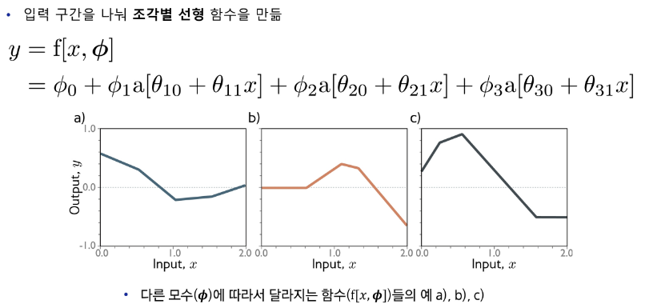
매번 업데이트(변화)되는 모수 값에 따른 최종 출력 함수 $f[x, \boldsymbol{\phi}]$ 전체의 그래프 예시들
- 은닉 노드 3개가 합쳐져 만드는 하나의 전체 함수 $f[x, \boldsymbol{\phi}]$에 대하여, 모수(가중치와 편향) 값이 달라짐에 따라 함수의 형태가 a, b, c처럼 다양하게 변화할 수 있음을 보여주는 그림
  - 위 예시에서는 은닉층이 3개임

## 2-5. Shallow 네트워크: Hidden Units
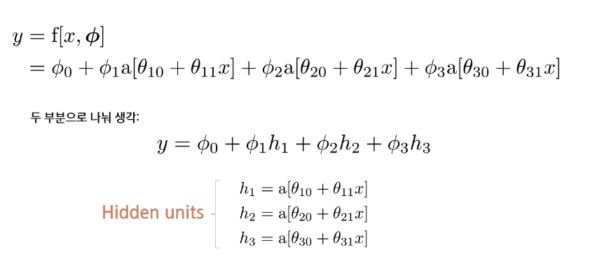
- y = h1 기준 일차식, h식은 홠성함수만 붙어있는 일차식
  
<details> <summary>h, 은닉층, 은닉노드 개념</summary>

**1. 선형 결합 + 활성화 함수 = 히든 스테이트($h$)?**

  **네, 맞습니다.**
  입력값 $x$에 선형 변환(가중치 $\theta_{i1}$과 편향 $\theta_{i0}$)을 적용한 후, 그 결과에 **활성화 함수 $a[\cdot]$까지 통과하여 최종 산출된 값**이 바로 $h$(Hidden State / Hidden Unit의 출력값)가 됩니다.

   $$h_i = a[\theta_{i0} + \theta_{i1}x]$$
<br>

**2. 은닉층(Hidden Layer)은 선형함수인가, $h$까지 포함인가?**

  **활성화 함수까지 통과한 $h$ 전체 구조를 '은닉층'이라고 부릅니다.**

  * **선형 계산 단계($z = \theta_{i0} + \theta_{i1}x$):** 단순히 입력 데이터를 선형 변환한 중간 계산 상태입니다.
  * **활성화 단계($h = a[z]$):** 비선형성을 부여하여 비로소 다음 층으로 전달될 준비가 된 완성된 상태입니다.
  * 따라서 인공신경망에서 **은닉층(Hidden Layer)의 출력값**이라고 하면 선형 결합 후 활성화 함수까지 적용을 마친 **$h_1, h_2, h_3$ 전체 세트**를 의미합니다.
<br>

**3. 은닉노드(Hidden Node) vs 은닉층(Hidden Layer)의 차이**

  두 표현은 단수(개별 요소)와 집합(전체 그룹)의 관계입니다.

  * **은닉노드 (Hidden Node / Hidden Unit):**
  * 개별 일꾼(동그라미 하나)을 뜻합니다.
  * 수식에서 $h_1, h_2, h_3$ 각각 하나하나가 독립된 **은닉노드**입니다.
  * 이미지의 `Hidden units`라는 표현이 바로 이 개별 노드들을 가리킵니다.


  * **은닉층 (Hidden Layer):**
  * 개별 노드들이 모여 있는 하나의 계층(그룹)을 뜻합니다.
  * 위 수식에서는 $h_1, h_2, h_3$라는 3개의 은닉노드가 묶여 있는 **1개의 은닉층**이 존재하는 구조입니다.

**요약 정리**

| 개념 | 수식 상 표현 | 설명 |
| --- | --- | --- |
| **은닉노드 (Hidden Unit)** | $h_1 = a[\theta_{10} + \theta_{11}x]$ | 선형 변환 + 활성화 함수를 마친 **개별 출력 단위 하나** |
| **은닉층 (Hidden Layer)** | $\{h_1, h_2, h_3\}$ | 이러한 은닉노드들이 **병렬로 모여 있는 하나의 레이어 전체** |
</details>

## 2-6.Shallow 네트워크: 각 단계별 계산
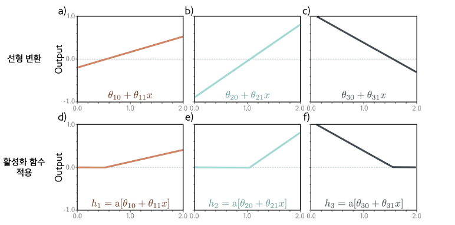
- a -> d: 렐루 액티베이션 시킴 -> 0 아래 부분(음수)은 전부 0이 되어 꺾은 선이 생김. 각각의 히든 유닛들임

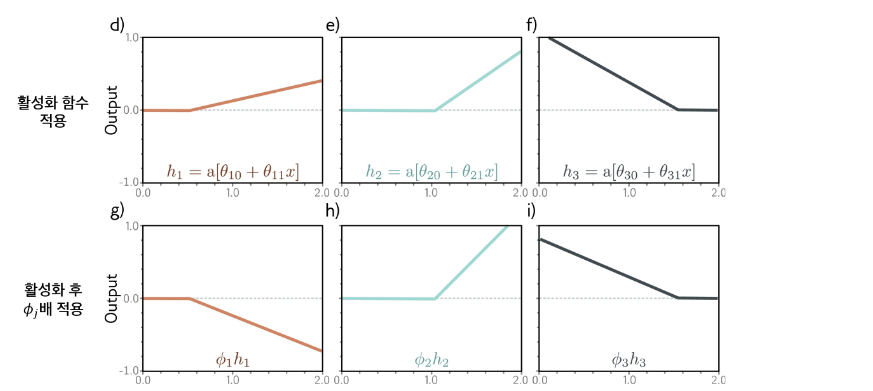
  
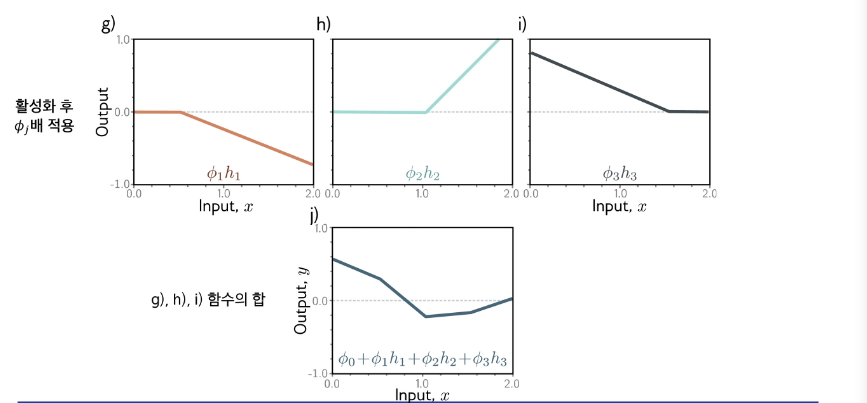
- 마지막에 함수 3개를 합침 -> 이게 shallow 뉴럴 네트워크 , 유닛 3개 있었을 때
- 히든 유닛이 3개가 있었고 꺾인 점이 3개 -> 히든 유닛이 얼마나 많냐에 따라 피스들이 점점 많아짐
<details><summary>노드 내 모수와 노드 외 모수, 활성화 후 $\phi$ 의미</summary>


이미지에서 보셨던 수식 $y = \phi_0 + \phi_1 a[\theta_{10} + \theta_{11}x] + \dots$ 을 기준으로 비교해 드리겠습니다.

- X축의 변환(기울기/절편)과 Y축의 변환(가중치/합성)
**핵심 차이점 비교**

  | 구분 | 은닉노드 내의 모수 ($\theta$) | 은닉노드에 곱해지는 모수 ($\phi$) |
  | --- | --- | --- |
  | **수식 위치** | 활성화 함수 $a[\cdot]$ **안쪽** ($\theta_{10}, \theta_{11}$) | 활성화 함수 $a[\cdot]$ **밖쪽** ($\phi_1, \phi_2, \phi_3$) |
  | **주요 역할** | 입력 데이터 $x$를 변환하고 **'꺾이는 지점(임계점)'** 결정 | 은닉노드의 출력값($h$)을 **'얼마나 크게/어떤 방향으로 반영할지'** 결정 |
  | **그래프 영향** | 꺾은선의 **X축 위치** 및 활성화 전 **기본 기울기** 변경 | 꺾은선의 **Y축 높이(크기)** 확대/축소 및 **상하 반전** |
  | **비유** | 재료(입력)를 가공해 **특징 조각을 깎아내는 역할** | 깎아낸 조각들의 **크기를 조절하고 하나로 합성하는 역할** |

**상세 역할 분석**

**1. 내의 모수 ($\theta$): 그래프가 "어디서 꺾일지" 정한다**

  * **선형함수의 기울기($\theta_{i1}$) 결정:** 맞습니다! $x$ 앞에 붙는 기울기를 결정합니다.
  * **꺾이는 위치(절편 $\theta_{i0}$) 결정:** 여기에 절편이 더해져서 **"X축의 어느 지점에서 0이 되어 꺾이기 시작할지"** 결정하게 됩니다.
  * 예: $\theta_{10} + \theta_{11}x = 0$ 이 되는 $x$ 지점에서 ReLU 활성화 함수가 꺾입니다.

 **2. 곱해지는 모수 ($\phi$): "얼마나 세게/뒤집어서 반영할지" 정한다**

  * **해당 은닉 노드의 전체 중 가중치:** 완벽하게 정확합니다!
  * $h_1, h_2, h_3$ 라는 일꾼(은닉노드)들이 각각 만들어낸 결과물에 가중치($\phi$)를 곱해서, 최종 정답 $y$를 만들 때 **"이 노드의 의견을 몇 %나, 플러스로 반영할지 마이너스로 반영할지"** 조절하는 진짜 가중치 역할을 합니다.
</details>
  
## 2-7. 네트워크 도식화
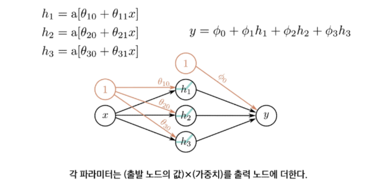
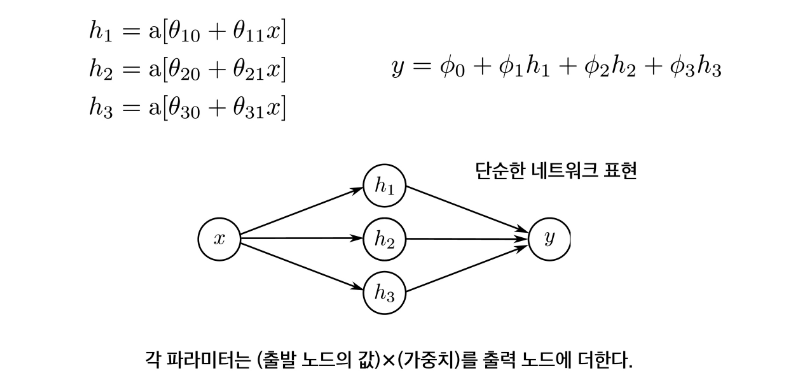

### <mark>네트워크 단계별 정리</mark>

  **1단계: 선형 변환 (입력 데이터의 1차 계산)**

  * **수식:** $\theta_{j0} + \theta_{j1}x$
  * **내용:** 입력 $x$에 노드 내 모수(기울기 $\theta_{j1}$, 절편 $\theta_{j0}$)를 적용해 선형값(직선)을 만듭니다.

  **2단계: 활성화함수 적용 (유의미한 정보 추출 및 꺾임 생성)**

  * **수식:** $h_j = a[\theta_{j0} + \theta_{j1}x]$
  * **내용:** 1단계 선형값에 활성화함수 $a[\cdot]$를 씌워 불필요한 신호는 0으로 지우고, 유의미한 정보만 남긴 꺾은선 값 $h_j$를 완성합니다.

  **3단계: 노드 외 가중치 곱셈 (각 노드의 비중 조절)**

  * **수식:** $\phi_1 h_1, \phi_2 h_2, \phi_3 h_3$
  * **내용:** 각 은닉노드에서 나온 결과물($h_j$)에 출력층 가중치($\phi_j$)를 곱해, 해당 노드가 최종 예측에 미칠 영향력(크기 및 방향)을 부여합니다.
    <details><summary>출력층 가중치는 어디서 구해지는가?</summary>
    처음부터 정해져 있는 것이 아니라, **모델의 예측 오차를 줄이는 방향으로 경사하강법(Gradient Descent)과 역전파(Backpropagation) 알고리즘을 통해 자동으로 학습**
    -> 이후에 나옴
    </details>

  **4단계: 최종 합산 및 절편 추가 (최종 예측값 $y$ 완성)**

  * **수식:** $y = \phi_0 + \phi_1 h_1 + \phi_2 h_2 + \phi_3 h_3$
  * **내용:** 각 정보의 중요성이 반영된 조각들을 모두 더하고, 기본 절편 $\phi_0$를 추가하여 최종 예측값 $y$를 합성합니다.

# 3. Shallow 네트워크의 표현력
## 3-1. 더 많은 Hidden Unit 가능
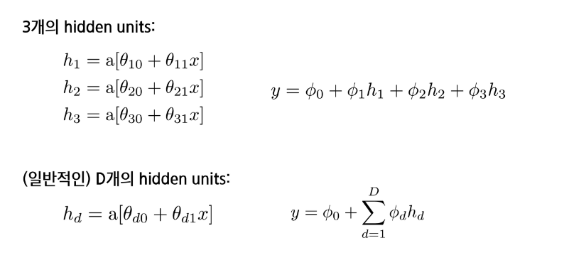

## 3-2. Hidden Unit을 많이 두면
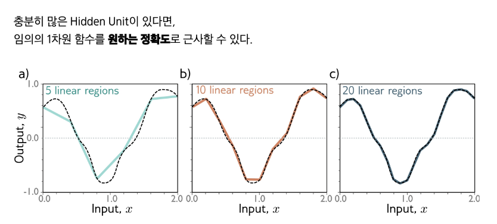

## 3-3. <mark>보편적 근사 정리</mark>
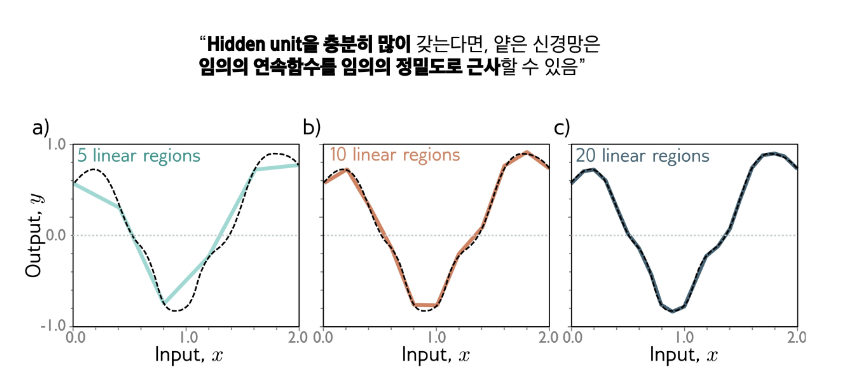
- **일차함수의 piecewise로 더한 것들** : 이 말을 이해하면 많은 것을 얻어가는 것

# 4. 다중 출력/입력
## 4-1. 2개 출력의 네트워크


## 4-2. 2개 입력의 네트워크

- input이 여러개면 히든이 일차에서 다중선형회귀가 됨
- 각각에 대해 여전히 선형식임

## 4-3. 2개 입력 네트워크: 단계별 계산
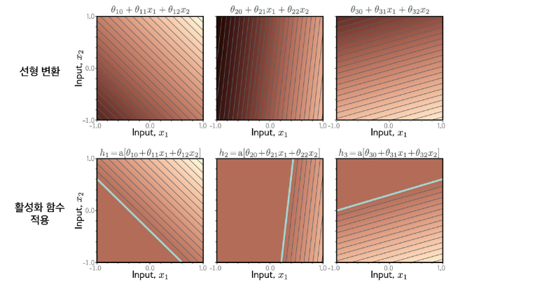
- 활성화 함수 적용 후 0보다 작은 부분이 날라감 (단색은 통으로 0임)
  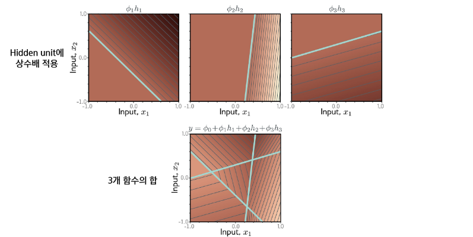
- 상수배 적용: 상수를 곱해줌
- 마지막에 합침

## 4-4. 2개 입력: From Input to Output
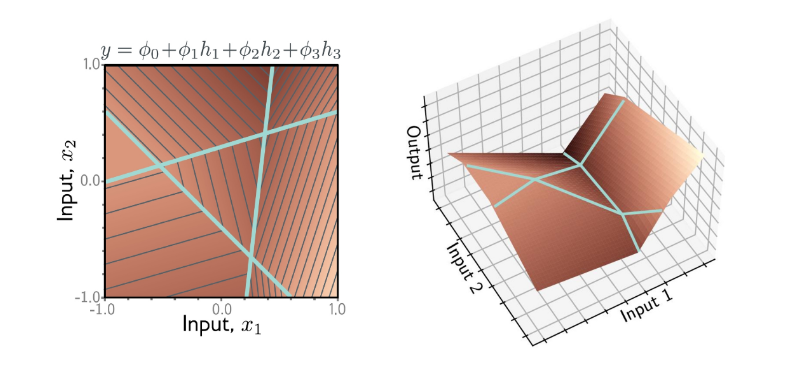
- 입력이 2개 ($x_1, x_2$): 바닥면의 X축과 Y축
- 출력이 1개 ($y$): 높이(Z축)
- 출력($y$)이 2개가 되면, 그래프가 붙어 나오는 것이 아니라 독립된 3D 곡면 2개(또는 각 정답에 대한 결과값 2개)가 따로 만들어집니다.

## 4-5. 임의의 개수를 입력, Hidden Unit, 출력
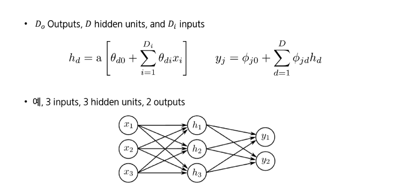
<details><summary>출력이 2개 이상일 때 어떻게 다른 모수 값을 가지는가</summary>

컴퓨터가 모든 모수를 **'동시에(같은 시점에)'** 업데이트하는 것은 맞지만, 계산에 들어가는 **'기울기(미분값)'와 '기존 값'이 서로 완전히 다르기 때문**에 최종 결과도 달라집니다.

**1. 왜 동시에 업데이트되는데 값이 달라질까?**
가중치 업데이트 공식을 다시 보면 이해가 쉬워집니다.

$$\phi_{\text{새로운 값}} = \phi_{\text{기존 값}} - (\text{학습률}) \times (\text{기울기})$$

  * **초기값의 차이 (초기화):**
  <mark>학습 시작 전, $h_1, h_2, h_3$에 들어가는 모수($\theta$)와 출력 가중치($\phi$)는 모두 서로 다른 임의의 작은 난수(Random Value)로 설정</mark>됩니다. 시작점부터 다릅니다.
  * **기울기의 차이 (역전파):**
  $\phi_1$을 업데이트할 때는 $h_1$의 값이 곱해지고, $\phi_2$를 업데이트할 때는 $h_2$의 값이 곱해집니다. $h_1$과 $h_2$의 값이 다르므로 **업데이트되는 변화량(기울기) 자체가 다릅니다.**
<br>

**요약**

1. **동시 업데이트의 의미:** '같은 시점에 계산이 실행된다'는 뜻이지, '같은 값으로 바뀐다'는 뜻이 아닙니다.
2. **값이 달라지는 이유:** <mark>**① 서로 다른 무작위 초기값**에서 출발했고, **② 역전파 시 각 노드가 전달받는 오차와 입력값($h$)이 달라서**</mark> 기울기(변화량)가 다르게 계산되기 때문입니다.
   
</details>

# 5. Deep 네트워크
## 5-1. 2개의 네트워크를 하나의 합성
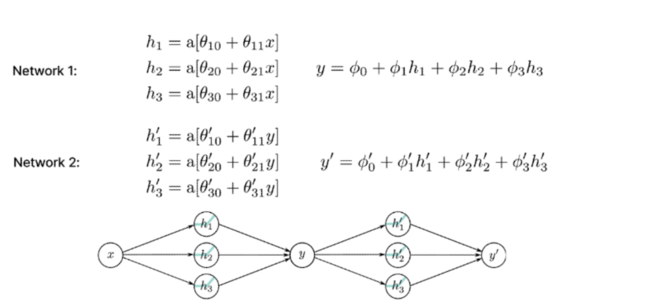
- x -> y (하나의 shallow 네트워크) -> y'(또 하나의 shallow 네트워크)

## 5-2. 합성 네트워크의 층(layer)별 출력
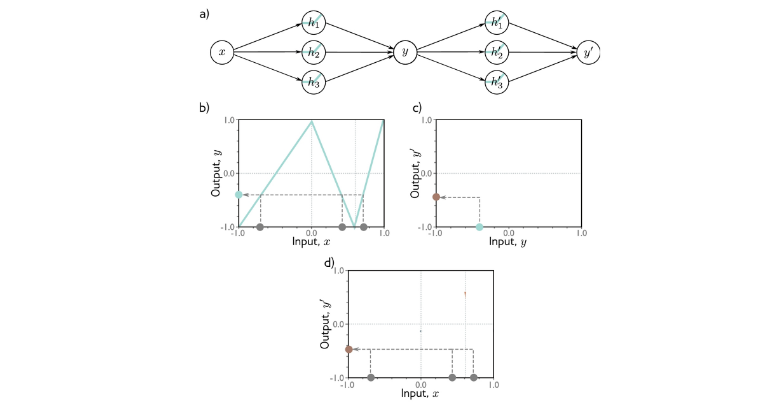
- 이미지 정리하기, 그리고 이해하기

## 5-3. "접기" 비유
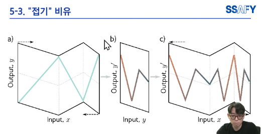

## 5-4. Shallow 네트워크와 Deep 네트워크 비교
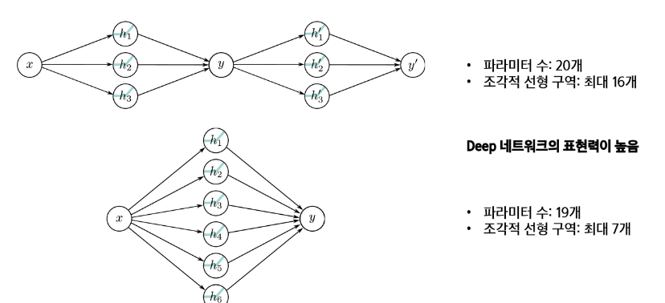
- Deep 네트워크는 파라미터 수가 거의 비슷한데 조각적 선형 구역이 훨씬 높음
- shallow 네트워크가 별로인 것이 아님

## 5-5. 2D Input: 2개의 네트워크를 하나로 합성
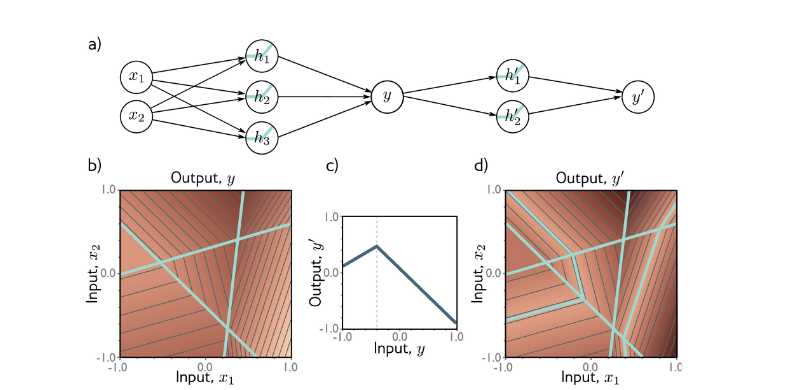

# 6. Deep 네트워크 수식 표현
<details><summary>shallow와 deep 차이</summary>

핵심 차이는 **은닉층(Hidden Layer)의 개수**와 문제를 해결하는 방식(특징 추출 능력)

| 구분 | Shallow Network (얕은 신경망) | Deep Network (깊은 신경망 / 딥러닝) |
| --- | --- | --- |
| **은닉층 개수** | 보통 **1개 ~ 2개** | 보통 **3개 이상** (수십~수백 개) |
| **특징 추출 방식** | 사람이 직접 특징(Feature)을 정제하여 입력 | 모델이 스스로 단계별 **고차원 특징을 자동 추출** |
| **표현 방식** | 넓은 은닉층을 통해 **'조각조각 이어 붙이기'** | 깊은 은닉층을 통해 **'계층적 조합'** |
| **파라미터 효율성** | 복잡한 표현을 위해 **노드 수가 기하급수적으로 증가** | 층을 깊게 쌓아 **적은 파라미터로도 복잡한 표현 가능** |
| **학습 난이도 및 오버피팅** | 상대적으로 연산량이 적고 오버피팅 위험이 낮음 | 기울기 소멸(Vanishing Gradient), 오버피팅 위험이 커 고급 기법 필요 |
<br>

**직관적인 차이 이해하기**

  **1. Shallow Network (넓게 쌓기)**

  * 하나의 은닉층에 수많은 은닉노드(너비)를 배치하는 방식입니다.
  * 비유하자면, 레고 블록을 조합하지 않고 **단 하나의 층에 수많은 조각을 펼쳐놓아** 목표 모양을 만드는 것과 같습니다.
  * 복잡한 곡선을 표현하려면 노드 수가 기하급수적으로 많이 필요해집니다.

  **2. Deep Network (깊게 쌓기)**

  * 은닉층을 여러 개 **위로(깊이)** 쌓아 올리는 방식입니다.
  * **계층적 특징 학습(Hierarchical Feature Learning):**
  * **첫 번째 층:** 단순한 선이나 점(점, 선)을 인식
  * **두 번째 층:** 선들을 조합해 단순한 모양(눈, 코, 입)을 인식
  * **세 번째 층:** 모양들을 조합해 복잡한 형태(사람 얼굴)를 인식
<br>

**요약**

  * **Shallow:** 은닉층이 적고(1~2개), 한 층 안에 노드를 늘려 표현하는 방식
  * **Deep:** 은닉층이 많아, 낮은 수준의 특징을 조합해 높은 수준의 추상적 개념을 학습하는 방식
</details>

## 6-1. 2개의 네트워크를 하나로 합성: 복잡한 수식
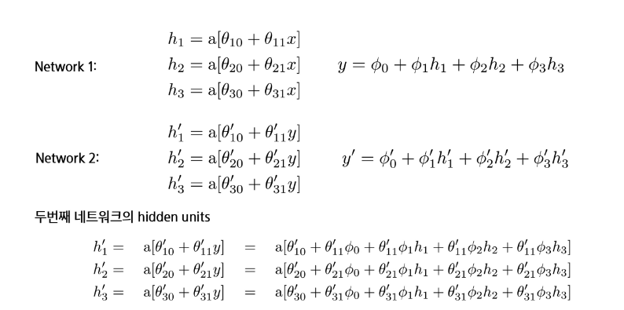
- Network2 의 y에 Network1의 y값 대입
## 6-2. 2개의 네트워크를 하나로 합성: 새로운 변수 활용
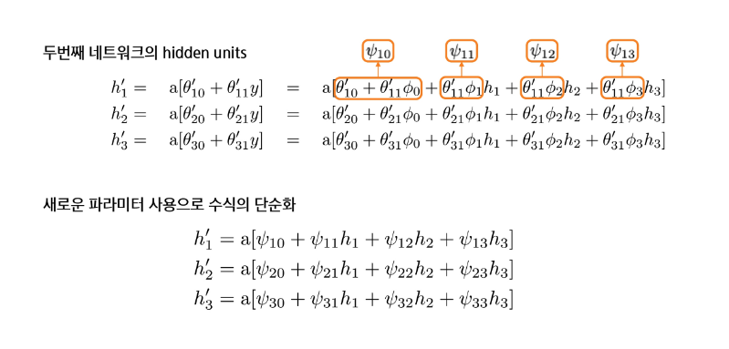
- 복잡해진 계수($\theta'_{11}\phi_1$)를 $\psi$라는 새 파라미터로 정리함
- **직관적 의미:** 첫 번째 층의 출력들($h_1, h_2, h_3$)이 두 번째 층의 노드($h'_1$)로 들어갈 때, **각각 $\psi_{11}, \psi_{12}, \psi_{13}$이라는 새로운 가중치가 곱해져 합쳐진다**는 것을 뜻합니다

## 6-3. 2층 네트워크의 표현

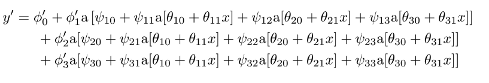
- 은닉층 2개가 서로 연결된 것으로 표현 가능
<details>

이제 두 번째 층의 최종 출력인 $y'$ 식에 우리가 구한 $h'_1, h'_2, h'_3$과 $h_1, h_2, h_3$을 순차적으로 다시 대입해 줍니다.

1. $y' = \phi'_0 + \phi'_1 \mathbf{h'_1} + \phi'_2 \mathbf{h'_2} + \phi'_3 \mathbf{h'_3}$
2. 여기서 $h'_1, h'_2, h'_3$ 자리에 Step 2에서 구한 $\psi$ 수식을 집어넣습니다.
3. 그리고 그 수식 내부의 $h_1, h_2, h_3$ 자리에 맨 처음의 $a[\theta_{j0} + \theta_{j1}x]$를 한번 더 집어넣으면 맨 아래의 거대한 최종 수식이 완성됩니다.
</details>


## 6-3. 2층 네트워크의 표현: 네트워크를 합성 함수로 봄
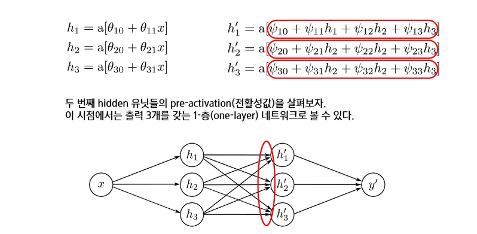
- 히든 레이어 1개, 아웃풋 3개 
-  $x \rightarrow$ 첫번째 층($h$) $\rightarrow$ 두번째 층($h'$) $\rightarrow$ 최종출력($y'$)으로 이어지는 2층 딥러닝 구조 완성


## 6-4. 2층 네트워크: 단계별 계산

- 각 값을 보면 h'1, h'2, h'3은 각각의 shallow 네트워크임. 아직 액티베이션 타기 전임

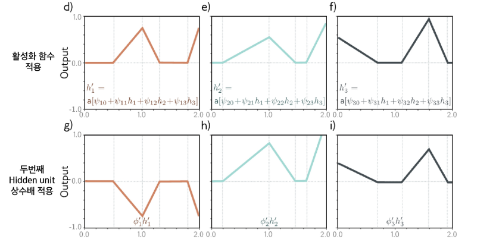
- 쭉 합쳐짐
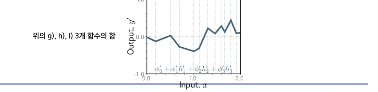
- 딥 뉴럴 네트워크의 기준은 히든이 2개 이상일 때부터

## 6-5. 용어의 단순화


**벡터 및 행렬 표현**
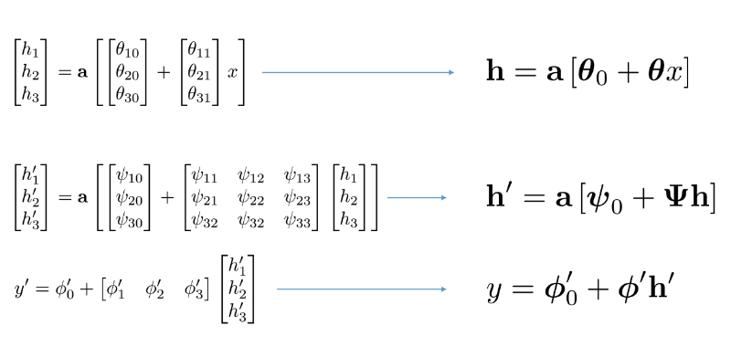
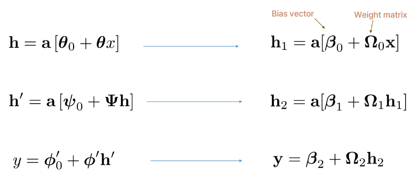
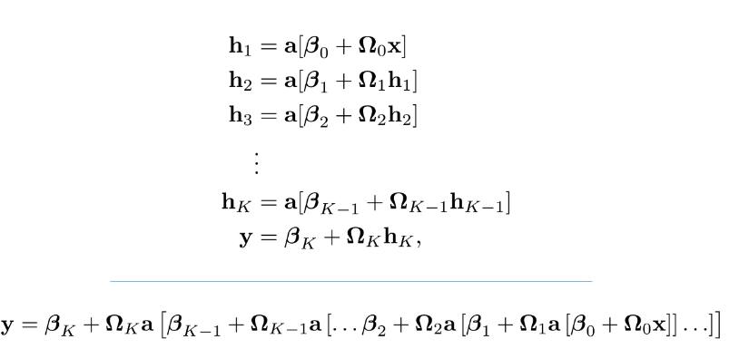

- 위 내용을 게속 반복
- bias vector, weight matrix를 곱하고 더하고 반복? 이게 무슨 말임 ㅜ
4시간 30분쯤 다시보기

## 6-6. 네트워크 도식화
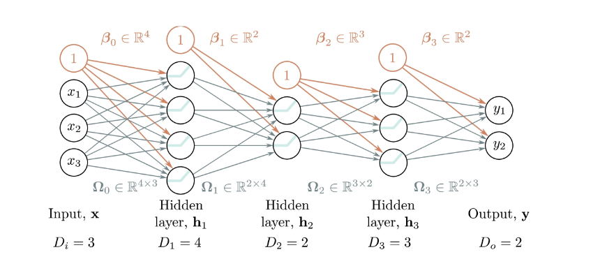
- 히든 레이어의 개수에 따라 디멘션이 달라짐 -> 이 설명임 맞나?

### 개인 정리
<details>

#### 1. 헷갈리셨던 개념 완벽 교정

❓ Q1. "파라미터(Parameter)와 모수가 같은 말인가요? $a$는 왜 파라미터가 아닌가요?"

* **파라미터 = 모수 (같은 말):** 모델이 학습을 통해 찾아내야 하는 '가중치(Weight, $\mathbf{W}$)'와 '편향(Bias, $b$)'을 의미합니다.
* **활성화 함수 $a(\cdot)$ (ReLU 등):** $a$는 모델이 스스로 학습해서 바꿔나가는 숫자가 아니라, 우리가 미리 정해놓은 '규칙(함수)'입니다.
* 예를 들어 $\text{ReLU}(z) = \max(0, z)$처럼 "0보다 작으면 0, 크면 그대로"라는 규칙 자체일 뿐이므로 학습 대상인 모수(파라미터)가 아닙니다.


❓ Q2. "Shallow 네트워크 단계별 계산: 왜 $g$만 갑자기 그래프가 아래로(음수로) 내려가나요?"

> **직관적 해설:** 출력층으로 가기 전 **'가중치(Weight, $\phi$ 또는 $w$)'가 음수($-$)**로 곱해졌기 때문입니다!

1. **d, e, f 단계:** 입력값에 선형식을 곱하고 ReLU를 씌워 0 이상의 꺾인 선(양수)들을 만듭니다.
2. **g, h, i 단계 (상수배 적용):** 출력층($y$)으로 가기 위해 각 은닉 유닛에 가중치를 곱합니다.
* 이때 특정 유닛(예: $h_1$)에 곱해지는 가중치 $\phi_1$이 음수($\phi_1 < 0$)라면, 위로 솟아있던 꺾은선이 아래로 뒤집혀 **음수 방향(아래쪽)으로 그래프가 내려가게 됩니다.**


3. **j 단계 (합치기):** 이렇게 위로 솟은 그래프($+$)와 아래로 꺼진 그래프($-$), 그리고 절편($\phi_0$)을 **모두 더하면($+$)** 마침내 울퉁불퉁하고 복잡한 최종 함수 $y$가 완성됩니다!


❓ Q3. "Bias Vector와 Weight Matrix를 곱하고 더하는 것을 반복한다? 이게 무슨 말인가요?"

딥러닝의 아무리 복잡한 은닉층 계산도 쪼개어 보면 딱 **2가지 동작의 무한 반복**입니다.

$$\mathbf{h}^{(l)} = \text{Activation}\Big( \mathbf{W}^{(l)} \mathbf{h}^{(l-1)} + \mathbf{b}^{(l)} \Big)$$

1. **선형 변환 ($\mathbf{W}\mathbf{x} + \mathbf{b}$):**
* 입력(전 단의 출력 $\mathbf{h}$)에 가중치 행렬 $\mathbf{W}$를 곱하고, 편향 벡터 $\mathbf{b}$를 더합니다. (공간을 늘리고, 회전시키고, 이동시킴)


2. **비선형 변환 ($\text{ReLU}$ 등):**
* 선형 변환된 결과에 활성화 함수를 씌워 **음수 부분을 0으로 꺾어버립니다.** (비선형성 부여)


> **요약:**
> **"행렬 곱하고 더해서 공간 바꾸기 $\rightarrow$ ReLU로 꺾기"**라는 단순한 패턴을 은닉층 개수(1층, 2층... $N$층)만큼 **사슬처럼 계속 연결(합성)**하는 것이 딥러닝 계산의 본질입니다!


#### 2. 추가로 꼭 알아야 하는 핵심 요약

💡 "보편적 근사 정리 (Universal Approximation Theorem)"

* **의미:** 은닉 유닛(Hidden Unit)이 충분히 많다면, **단 1개의 은닉층을 가진 Shallow 네트워크로도 세상의 모든 연속 함수(복잡한 곡선)를 원하는 오차 범위 내로 시늉(근사)할 수 있다**는 정리입니다.
* **쉽게 이해하기:**
* 직선 조각(Piecewise Linear)을 아주 미세하게 쪼개서 수천, 수수만 개 이어 붙이면 결국 부드러운 곡선과 거의 똑같아집니다.
* 따라서 "일차함수의 Piecewise로 더한 것"이라는 노트 메모는 이 정리를 꿰뚫는 핵심 설명입니다.


💡 왜 Shallow 대신 Deep(깊은 신경망)을 쓸까? ("접기" 비유)

* **Shallow의 한계:** 복잡한 오르락내리락 함수를 만들려면 **수천~수만 개의 Hidden Unit**이 1개 층에 일렬로 빽빽하게 필요합니다. (파라미터 폭발)
* **Deep의 혁신 (종이 접기 효과):**
* Layer를 1층씩 쌓을 때마다 공간이 반으로 접히는 효과(Fold)가 발생합니다.
* 종이를 1번 접고 싹뚝 깎으면, 종이를 펼쳤을 때 여러 개의 꺾은선이 한 번에 생기듯, **Deep 네트워크는 훨씬 적은 파라미터(노드 수)로도 폭발적인 수의 '조각적 선형 구역(Piecewise Regions)'을 형성**할 수 있습니다.
* 즉, **Deep이 Shallow보다 훨씬 적은 연산량으로 압도적인 표현력(Efficiency)을 가집니다.**


#### 3. 한눈에 보는 요약 카드

```
[입력 X]
   │
   ▼
┌──────────────────────────────────────────────┐
│  1. 선형 변환 (W1 · X + b1)                    │
│  2. 활성화 함수 (ReLU) ──> 0 이하를 꺾어서 비선형화 │
└──────────────────────────────────────────────┘
   │  <-- 여기까지가 1개 Layer (Hidden Unit들)
   ▼
┌──────────────────────────────────────────────┐
│  3. 다음 층 선형 변환 (W2 · H1 + b2)           │
│  4. 활성화 함수 (ReLU) ──> 공간을 또 접고 꺾음     │
└──────────────────────────────────────────────┘
   │  <-- 은닉층이 깊어질수록 표현력이 지수적으로 증가!
   ▼
[최종 출력 Y]

```
#### 4. 용어의 단순화 추가 정리
이 부분은 딥러닝에서 "층(Layer)을 여러 개 쌓을 때 계산이 실제로 어떻게 일어나는가?"를 가장 깔끔하게 수식으로 정리해 놓은 단원입니다.

말이 어렵게 느껴질 수 있지만, 핵심은 "아무리 깊고 복잡한 신경망도 결국 [행렬 곱하기 $\rightarrow$ 더하기 $\rightarrow$ 꺾기(활성화 함수)] 세 단계의 무한 반복"이라는 것입니다!

쉽게 직관적으로 풀어드릴게요.

 1. "bias vector, weight matrix를 곱하고 더하고 반복"의 직관적 의미

신경망의 은닉층(Hidden Layer) 하나를 통과할 때마다 일어나는 계산은 항상 **동일한 3단계 패턴**을 거칩니다.

$$\mathbf{h}^{(l)} = a\left( \mathbf{\Omega}^{(l)} \mathbf{h}^{(l-1)} + \boldsymbol{\beta}^{(l)} \right)$$

1. **가중치 행렬 곱하기 ($\mathbf{\Omega} \cdot \mathbf{h}$):**
* 이전 층에서 넘어온 값들($\mathbf{h}^{(l-1)}$)에 가중치 행렬($\mathbf{\Omega}$)을 곱합니다.
* **의미:** 입력된 정보들의 중요도를 각각 달아주고, 공간을 회전시키거나 늘리는 역할입니다.


2. **편향 벡터 더하기 ($+ \boldsymbol{\beta}$):**
* 거기에 편향 벡터($\boldsymbol{\beta}$)를 더합니다.
* **의미:** 그래프를 평행이동(위/아래, 좌/우로 이동)시켜 꺾이는 기준점 위치를 잡아줍니다.


3. **활성화 함수 씌우기 ($a(\cdot)$):**
* 위에서 계산된 결과 전체에 ReLU 같은 비선형 함수를 씌웁니다.
* **의미:** 0보다 작은 값은 0으로 날려버려서 그래프를 **'꺾어'** 줍니다.


1. 왜 이걸 행렬과 벡터로 표현할까요?

노드(유닛) 하나하나마다 일차식을 $a \cdot x + b$ 형태로 일일이 쓰면 층이 깊어질 때 식이 수십, 수백 줄로 늘어나서 사람이 알아볼 수 없게 됩니다.

그래서 모든 노드의 가중치를 하나로 묶은 표(Weight Matrix $\mathbf{\Omega}$)와 편향을 묶은 리스트(Bias Vector $\boldsymbol{\beta}$)를 만들어서 **한 줄의 행렬식으로 단순화**시킨 것입니다.

1. 층(Layer)별 계산의 반복 흐름

강의나 슬라이드에서 반복된다고 한 것은 바로 이 흐름입니다:

```text
[입력 X] 
   │
   ▼
(1층 계산) : h1 = ReLU( Ω1 · X  + β1 )  <-- Weight 곱하고 Bias 더한 뒤 꺾기
   │
   ▼
(2층 계산) : h2 = ReLU( Ω2 · h1 + β2 )  <-- 전 단 출력을 받아 똑같이 반복!
   │
   ▼
(3층 계산) : h3 = ReLU( Ω3 · h2 + β3 )  <-- 또 반복!
   │
   ▼
[최종 출력 Y] = Ω_out · h3 + β_out      <-- 마지막 출력층으로 전달

```
💡 한 줄 요약

> **"Bias vector와 Weight matrix를 곱하고 더한다는 것"**은, 신경망이 층을 거칠 때마다 **[가중치 행렬 $\mathbf{\Omega}$를 곱해서 변수들을 조합하고, 편향 $\boldsymbol{\beta}$를 더해 위치를 옮긴 뒤, ReLU로 꺾어주는 과정]**을 톱니바퀴처럼 반복하며 복잡한 패턴을 배워나간다는 뜻입니다!
</details>

-------------------
# 📌 신경망 적합(Fitting)

> **학습 목표**
>  ▍ 손실함수란 무엇일까?
> * 모델이 예측을 얼마나 잘못했는지 측정하는 함수

>▍ 학습이란 무엇일까?
> * 손실함수를 최소화하는 파라미터(모델의 가중치)를 찾는 과정

> ▍ 경사 하강법이란 무엇일까?
> * 손실함수를 줄이기 위해 기울기를 따라 내려가는 방법

> ▍ 확률적 경사 하강법(SGD)의 장점은 무엇일까?
>* 전체 데이터 대신 일부만 사용하여 업데이트별 계산량이 적은 반면 local 최소점에 빠질 확률이 적은 최적화 방법

# 1. 선형회귀 예시
## 1-1. 손실함수
 ▍ 손실함수

* **학습 데이터셋: input/output의 $I$개 쌍**
* 학습 데이터셋 표기: $\{ \mathbf{x}_i, \mathbf{y}_i \}_{i=1}^I$


* **손실함수(Loss function): 모델이 얼마나 잘못 예측하는지를 측정하는 함수**
* 값이 작을수록 모델이 더 정확하게 학습되었다는 의미
* 손실함수 정의: $L \left[ \boldsymbol{\phi}, f[\mathbf{x}_i, \boldsymbol{\phi}], \{\mathbf{x}_i, \mathbf{y}_i\}_{i=1}^I \right]$
* 손실함수의 간단한 표현: $L[\boldsymbol{\phi}]$ $\leftarrow$ 입력을 출력에 더 잘 매핑할수록 더 작은 값을 반환하는 스칼라를 돌려줌


## 1-2. 학습
 ▍ 손실함수

* **학습: 손실함수를 최소화하는 파라미터를 찾음**

$$\hat{\boldsymbol{\phi}} = \underset{\boldsymbol{\phi}}{\operatorname{argmin}} \left[ L[\boldsymbol{\phi}] \right]$$

* $\hat{\boldsymbol{\phi}}$ : 모델의 파라미터(우리가 조정해야하는 값) 찾기
* $\underset{\boldsymbol{\phi}}{\operatorname{argmin}} [L[\boldsymbol{\phi}]]$ : 손실함수 $L[\boldsymbol{\phi}]$를 가장 작게 만드는 파라미터 찾기

## 1-3. 1D 선형회귀 예


## 1-4.1D 선형회귀 학습
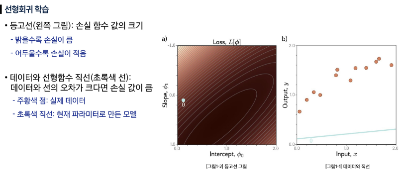

▍ 경사 하강법(gradient descent)

* 손실 함수의 값이 줄어드는 방향으로 파라미터를 이동하는 과정
  
- 경사를 따라서 내려가면 적어도 전보다 로스가 낮은 기울기와 절편을 갖겠지
- 2차 함수 미분 배우면 이해하기 쉽다 제발 투자하셈 ~~~~
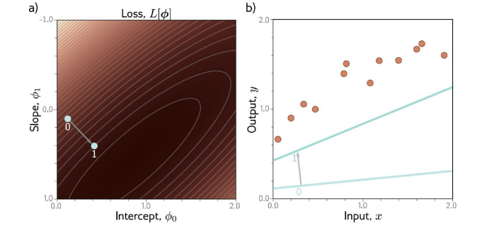

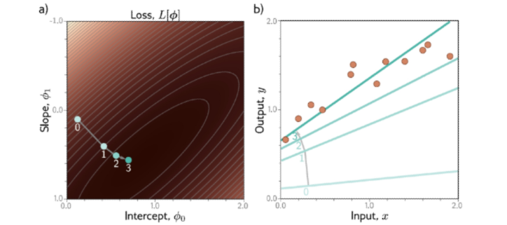
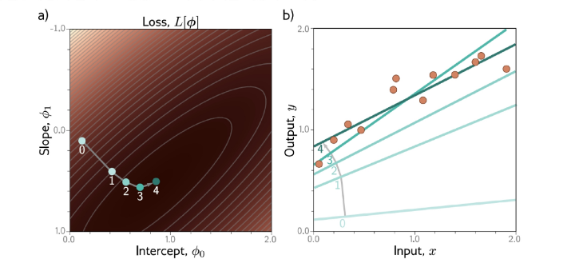

# 2. 수학 리뷰
## 2-1. 미분을 이용한 최적화

▍ 미분을 통한 기울기 이해

* 이차 함수로, 그래프는 위로 열린 포물선
* 미분 결과($2x - 4$)는 기울기를 의미
* 기울기가 0이 되는 지점이 극값(최솟값)
  
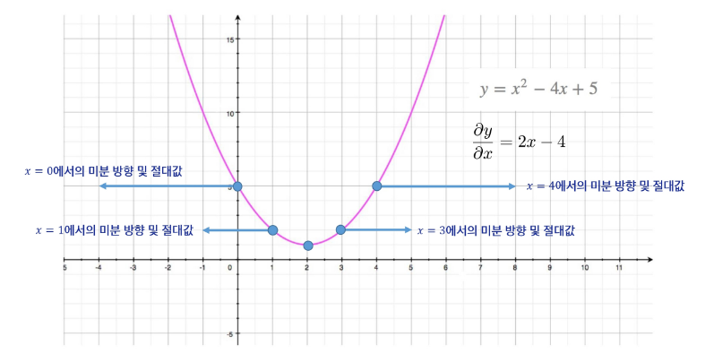
- 미분의 반대 방향으로 감

# 3. 경사하강
## 3-1. 경사하강법 
- 어디에 있든 미분을 구하고 미분의 반대 방향으로 감
  - 미분의 절대값이 클수록 크게 이동
<br>  

 ▍ 경사 하강(Gradient descent) 알고리즘

* 경사 하강법은 손실 함수 $L[\boldsymbol{\phi}]$를 최소화하기 위해 파라미터 $\boldsymbol{\phi}$를 반복적으로 갱신하는 알고리즘
* **기울기 계산:** 손실 함수 $L[\boldsymbol{\phi}]$를 파라미터 $\boldsymbol{\phi}$에 대해 편미분(각 원소에 대한 미분) 진행
* 벡터 형태의 기울기
*편미문: 각각의 값을 미분한 후 벡터화 한 것


$$\frac{\partial L}{\partial \boldsymbol{\phi}} = \begin{bmatrix} \frac{\partial L}{\partial \phi_0} \\ \frac{\partial L}{\partial \phi_1} \\ \vdots \\ \frac{\partial L}{\partial \phi_N} \end{bmatrix}$$

* **파라미터 업데이트**
* 기울기(미분값)의 **반대 방향**으로 이동해야 손실 함수가 줄어듦


$$\boldsymbol{\phi} \leftarrow \boldsymbol{\phi} - \alpha \frac{\partial L}{\partial \boldsymbol{\phi}}$$

* 여기서 $\alpha(힝상 양수임) \ge 0$는 학습률(learning rate)로, 한 번의 스텝에서 이동하는 크기를 결정

## 3-2. 경사 하강법: 단계별 계산
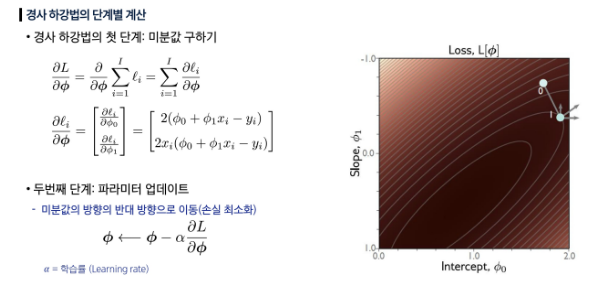
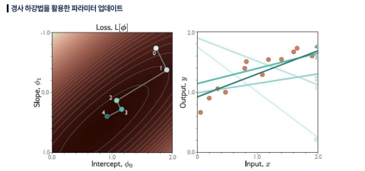


## 3-3. 한눈으로 보는 경사 하강법
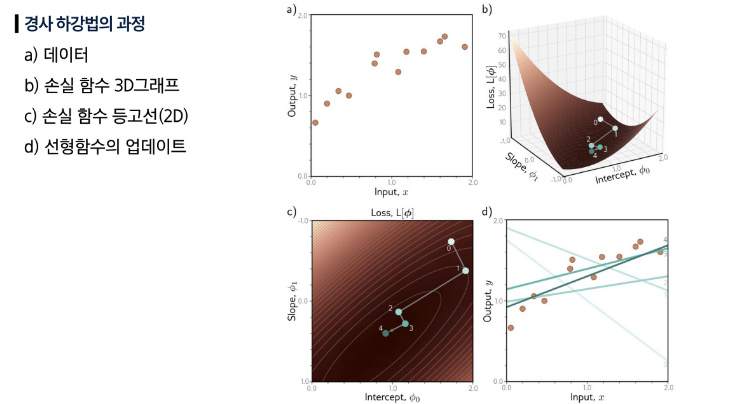
- 경사하강법은 결국 등고선에서 가장 가파른 곳이 어디냐 찾고 그 반대로 가파르게 내려가는 것
- 경사하강법에서의 선과 참함수는 다름. 왜냐 참함수를 찾는 것이 목적이나 알 수 없기 때문

## 3-4. 함수에 따른 최적화 난이도
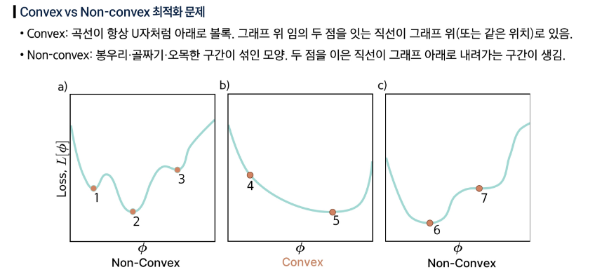

▍ Convex vs Non-convex 최적화 문제

* **손실 함수 모양에 따라 최적화의 난이도가 달라짐**
* Convex 문제: **전역(global) 최소값이 유일**함 $\rightarrow$ 최적화가 쉬움
* Non-Convex 문제: **여러 개의 지역(local) 최소값** 또는 **새들(saddle)점**이 있음 $\rightarrow$ 최적화가 어려움
  * 조건에 맞지 않는 함수들 = non-convex
  * 새들 포인트? 가뭐지...........
  * non-convex와 convex의 차이점에 대해 이해가 잘 안됨. 전역 최소값이 뭔데........... 걍 곡선 최소값이면 non-convex도 최소 하나같은디


# 4. 확률적 경사 하강법
## 4-1. 경사 하강법 vs 확률적 경사 하강법
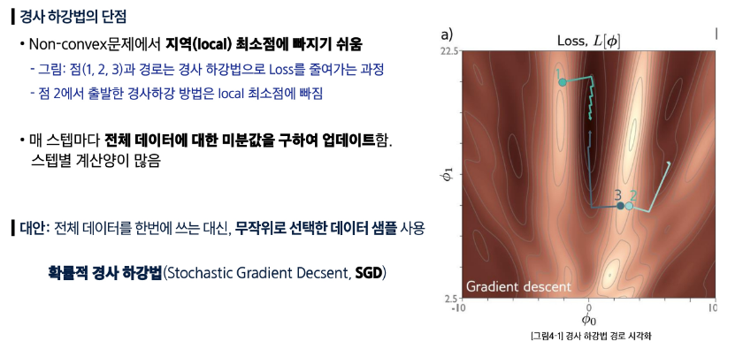
- 매 스텝마다 그 많은 데이터를 계산하는 것은 불가능함
<br>

▍ 업데이트 방식의 차이점

* **경사 하강법(Gradient Descent)**
* **전체 데이터셋을 사용**하여 기울기를 계산(미분)하고 파라미터 업데이트


$$\phi_{t+1} \leftarrow \phi_t - \alpha \sum_{\underline{i=1}}^I \frac{\partial \ell_i [\phi_t]}{\partial \phi}$$

* **확률적 경사 하강법(SGD Mini-batch 버전)**
* 무작위 확률로 샘플된 일부 데이터(batch)만 사용하여 기울기 계산


$$\phi_{t+1} \leftarrow \phi_t - \alpha \sum_{\underline{i \in \mathcal{B}_t}} \frac{\partial \ell_i [\phi_t]}{\partial \phi}$$

## 4-4. 확률적 경사 하강법의 특징
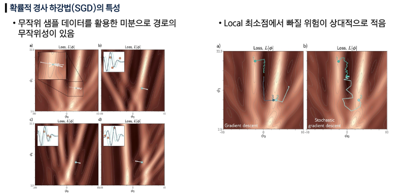
- 왜 노이즈한 방식으로 가는가? 랜덤으로 데이터를 추출해서 가장 가파른 방향으로만 가는 것이 아니기 때문
  - 대신 로컬 미니멈에 빠지지 않고 글로벌 미니멈으로 가게 됨 -> 그래서 이게 뭔 말 ㅜㅜㅜㅜㅜㅜㅜㅜ
  - 경사 하강법은 빠져나올 방법이 없음
  
<br>

▍ 확률적 경사 하강법(SGD)의 특성

* **국소 최솟값**
* 전체 데이터가 아닌 일부배치로 기울기를 계산하기 때문에 노이즈가 섞여 있음
* 노이즈가 오히려 local minima, saddle point에서 빠져나오는 도움이 됨


* **노이즈가 있지만 여전히 타당한 업데이트**
* 미니배치의 기울기는 정확한 전체 기울기가 아니지만, 평균적으로 올바른 방향 가리킴
* 학습이 점진적 최적점 방향으로 수렴


* **계산 비용 절감**
* 전체 데이터셋에서 작은 배치만 사용하므로 반복(스텝)당 연산량이 적음
* 큰 데이터셋에서 효율적으로 학습 가능


* **수렴 특성**
* full batch처럼 매끄럽게 수렴하지 않고, 무작위성 때문에 더 많이 진동(jitter, 지그재그)하면서 움직임
* 전역 최솟값 근처의 좋은 해에 도달할 수 있음. Convex 문제에서는 full-batch 경사하강보다 수렴이 늦을 수 있음

# 5. 역전파 (Backpropagation)
## 5-1. 네트워크 파라미터의 미분
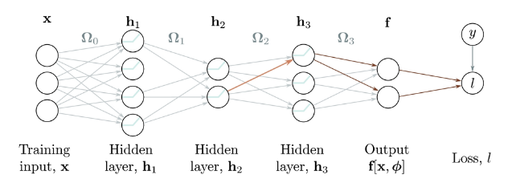
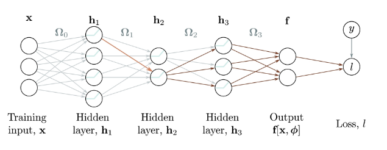
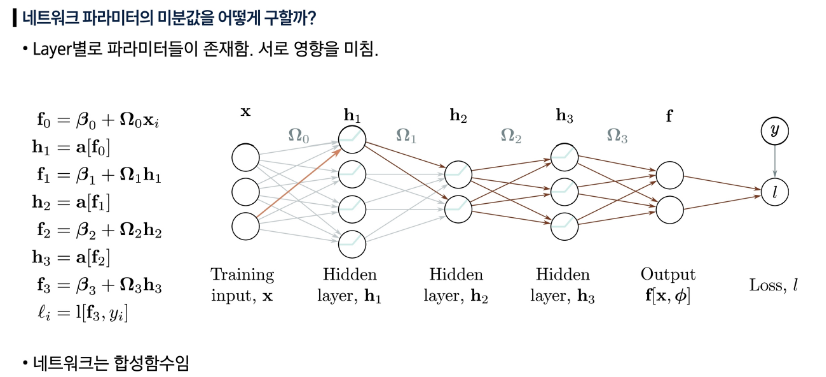

## 5-2. 합성함수의 미분: 연쇄법칙
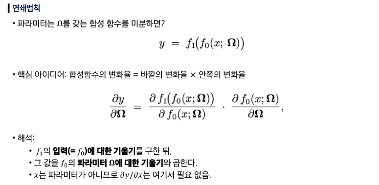


## 5-3. 역전파 ❗
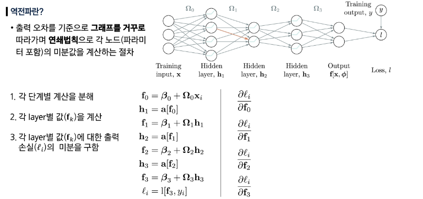
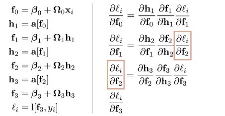
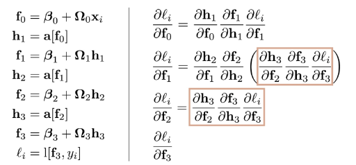
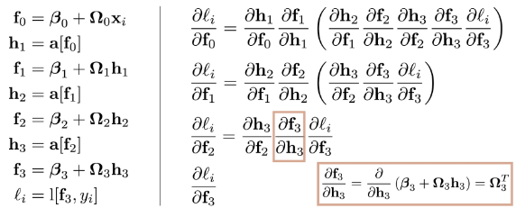
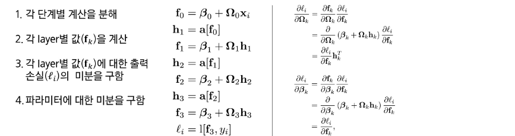
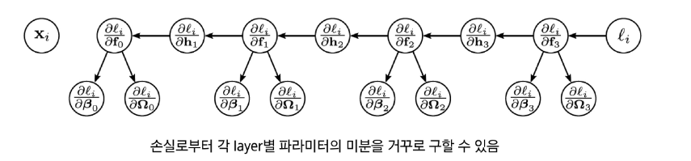


- 각 미분 결과가 왜 그렇게 되는지 이해해야 됨

히든레이어가 많더라도 무조건 이득이 아님 -=>그레이언트 곱이 계속 늘어나서 학습이 어렵다 
뎁트가(네트워크가) 깊어지면 주어진 파라미터에 비해 표현력이 깊이진다 대신 학습이 어렵다