#### 참고
https://www.youtube.com/watch?v=6s69XY025MU


# 📌 워드 임베딩과 순환신경망 기반 모델 (RNN & LSTM)

> **학습 목표**
> 단어를 숫자로 표현하는 기본 아이어들을 이해한다.
> 언어에서 '순서(문맥)'의 중요성을 설명할 수 있다.
> RNN의 기본 구조와 역할을 이해한다
> LSTM의 핵심 아이디어를 설명할 수 있다.

- 워드임베딩(단어) -> RNN(문장) -> LSTM(더 긴 문장)

# 0. 학습 시작
- 언어를 어떻게 숫자로 표현할까?
  * One-hot encoding, word embedding 등 기본 아이디어 이해

- 언어에서 ‘순서(문맥)’는 왜 중요하고 어떻게 다뤄야 할까?
  * 단어 순서와 의미의 연결성

- 순환 신경망(RNNs, LSTMs 등)은 어떻게 동작할까?
  * 기본 구조와 역할
  * 장기 의존성 문제와 LSTM의 핵심 아이디어

# 1. 워드 임베딩
## 1-1. 원-핫 인코딩
- 라벨 인코딩: 단순히 문자 데이터에 숫자 부여
  - "수박($2$)이 사과($0$)보다 크다"거나 "수박은 사과 2개를 더한 것과 같다"와 같이 숫자의 크기나 순서 관계(우선순위)를 잘못 학습할 위험이 있습니다
> **원 핫 인코딩이란?**
* 규칙 기반 혹은 통계적 자연어처리 연구의 대다수는 단어를 원자적(쪼갤 수 없는) 기호로 취급한다.  
  예: *hotel, conference, walk* 같은 단어들.
  - **고유한 범주(클래스)의 개수만큼 차원(열)을 생성** 한 뒤, 해당되는 위치에만 $1$, 나머지에는 $0$을 채워 넣습니다
    - 벡터 공간 관점에서 보면, 이는 **한 원소만 1이고 나머지는 모두 0** 인 벡터
  - 모든 범주 간의 거리가 동일($\sqrt{2}$)해지므로, 컴퓨터가 범주 간에 *부적절한 순서나 크기 관계를 학습하지 않습니다.*
<br>

$$[0 \ 0 \ 0 \ 0 \ 0 \ 0 \ 0 \ 0 \ 0 \ 0 \ 0 \ 0 \ 1 \ 0 \ 0 \ 0 \ 0 \ 0]$$
<br>

* 차원 수(= 단어 사전 크기)는 대략 다음과 같다:
  * 음성 데이터(2만) - Penn Treebank (PTB) 코퍼스(5만) - big vocab(50만) - Google 1T(1300만)
* 이를 **원-핫(one-hot) 표현**이라고 부르고, 단어를 원-핫 표현으로 바꾸는 과정을 **원-핫 인코딩(one-hot encoding)** 이라고 한다.
<br>

> **원 핫 인코딩의 문제점**
* 예시: 웹 검색
  * [삼성 노트북 배터리 사이즈] == [삼성 노트북 배터리 용량]
  * [갤럭시 핸드폰] == [갤럭시 스마트폰]

$$\text{핸드폰 } [0 \ 0 \ 0 \ 0 \ 0 \ 0 \ 0 \ 0 \ 0 \ 0 \ 0 \ 0 \ 1 \ 0 \ 0 \ 0 \ 0 \ 0]^T$$
$$\text{스마트폰 } [0 \ 0 \ 0 \ 0 \ 0 \ 0 \ 0 \ 1 \ 0 \ 0 \ 0 \ 0 \ 0 \ 0 \ 0 \ 0 \ 0 \ 0] = 0$$

* 검색 쿼리 벡터와 대상이 되는 문서 벡터들이 서로 **직교**하게 되어, 원-핫 벡터로는 유사도를 측정할 수 없다.
<br>

    *노트북 배터리 사이즈와 용량이 웹검색에서는 같은 단어로 취급 받지만 실제 언어 처리에서는 다른 문자로 구분된다.
<br>


  + 단어 간 유사도 표현 불가


#### 원-핫 인코딩 vs 워드 임베딩 비교

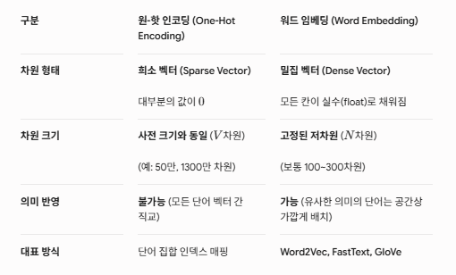


--------
## 1-2. 워드 임베딩
```
# 포함관계

1. 워드 임베딩 (Word Embedding) ── [최상위 개념: 단어를 밀집 벡터로 표현하는 기술 전체]
   │
   └── 2. Word2Vec ───────────────── [대표적인 워드 임베딩 알고리즘 중 하나]
        │
        ├── 3-1. CBOW (Continuous Bag-of-Words) ── [학습 방식 1: 주변 단어로 중심 단어 예측]
        └── 3-2. Skip-gram (SG) ────────────────── [학습 방식 2: 중심 단어로 주변 단어 예측]
```


    *원핫 임베딩을 보완하기 위해 생김
    *그 사람을 파악하기 위해선 주변 친구를 봐야하는 것처럼 해당 단어만 보는 것이 아니라 앞뒤 맥락을 봐야 더욱 정확한 의미 파악 가능

* 단어를 단어들 사이의 의미적 관계를 포착할 수 있는 **밀집(dense)되고 연속적/분산적(distributed) 벡터 표현으로 나타내는 방법**이다.
   = **분포 가설 (Distributional Hypothesis)** : "비슷한 문맥에서 쓰이는 단어들은 비슷한 의미를 가진다."
<br>

  * 원-핫 인코딩에선 은행과 금융이 완전히 독립적인(무관한) 벡터로 표현되었지만,
  * 워드 임베딩에선 두 단어의 벡터가 공간상 서로 가깝게 위치하며, 이를 통해 의미적 유사성을 반영할 수 있다.
  * 아래 벡터 의미: **'은행'이라는 단어가 7차원의 연속적인 실수(밀집 벡터, Dense Vector)로 표현된 워드 임베딩 결과**
  * 벡터의 각 숫자가 의미하는 바: 사람이 직관적으로 해석하기는 어렵지만 개념적인 특성(feature), **잠재 특성 (Latent Features)** 
<br>

$$\text{은행} = \begin{bmatrix} 0.432 \\ 0.343 \\ -0.324 \\ 0.743 \\ -0.853 \\ 0.135 \\ 0.738 \end{bmatrix} \xrightarrow{\text{예측 가능}} \begin{matrix} \text{정부} \\ \text{위기} \\ \text{규제} \\ \text{돈} \\ \dots \end{matrix}$$


  * **유사도 계산:** 코사인 유사도(Cosine Similarity) 등을 이용해 단어 간 유사한 정도를 $0 \sim 1$ 사이 수치로 계산 가능.
  * **단어 연산 (Vector Arithmetic):**

  $$\text{Vector("국왕") - Vector("남자") + Vector("여자")} \approx \text{Vector("여왕")}$$


  $$\text{Vector("파리") - Vector("프랑스") + Vector("한국")} \approx \text{Vector("서울")}$$
<br>

> 전체적인 구성 매커니즘
> 1. **초기화:** 학습 시작 전에는 무작위 작은 실수(예: $-0.01 \sim 0.01$)로 채워져 있습니다.
>2. **문맥 학습:** "은행" 주변에 "정부", "돈" 등이 자주 나온다는 것을 모델이 학습합니다.
>   - 수치의 생성 방식: 신경망 학습을 통해 스스로 최적화한 '가중치(weight)'
>   - 학습 방식: SG 모델로 '단어' -> 다른 단어 등장 확률 예측 => 예측 오차를 줄여가는 역전파 과정을 통해 단어에 할당된 벡터 가중치를 계속 미세하게 업데이트해서 완성
>3. **값 결정:** 주변 단어들을 가장 잘 예측해 내는 최적의 숫자 조합인 $[0.432, 0.343, -0.324, 0.743, -0.853, 0.135, 0.738]^T$로 최종 구성됩니다.

<br>
<br>

### Word2Vec


> **Word2Vec의 아이디어**
* Word2Vec의 아이디어는 **각 단어와 그 주변 단어들 간의 관계를 예측한다는 것이다.**
  * 어를 밀집 벡터(Dense Vector)로 변환하는 대표적인 워드 임베딩 알고리즘
  * **2층의 얕은 신경망(Shallow Neural Network)** 을 사용해 빠른 속도로 거대한 텍스트 코퍼스를 학습
<br>

#### 2가지 알고리즘: SG, CBOW
  * **Skip-grams (SG) 방식**
    * 중심 단어를 통해 주변 단어들을 예측하는 방법이다.
    * 단어의 위치(앞/뒤)에 크게 구애 받지 않는다.
    * 어떤 단어가 입력으로 들어가면 주변의 어떤 값 하나가 출력으로 나옴
  * **Continuous Bag of Words (CBOW) 방식**
    * 주변 단어들을 통해 중심 단어를 예측하는 방법이다.
    * 문맥 단어들의 집합으로 중심 단어를 맞춘다.


- 중심단어에 대한 임베딩 -> 주변 단어에 대한 분포 확률 예측 -> 예측된 확률이 실제로 정답값이랑 얼마나 차이가 나는지(로스 확인)
  - 여기서 인코딩과 디코딩은 무엇일까?


- cbow: 주변의 값을 입력으로 삼음
  - 주변의 값 50만개가 있다면 출력값으로 구두가 될 확률 (50만개의 입력값을 통한 확률값)
- sg: 주변의 값을 출력으로 삼음
- 임베딩은 사람으로 치면 사고의 상태 ~> 대충 상태가 이렇구나 이해 


- 위 이미지는 하나의 예시임
  - 4개의 단어를 입력으로(인코딩?) 삼고 해당 입력을 다 더해서 디코더를 통해 brown과 얼마나 차이가 나는지 학습을 시킴
  - 인코딩이 브라운과 전혀 상관이 없다면 디코더도 브라운과 전혀 상관이 없는 결과가 나올 것임
  - 관련이 생기려면 주어진 값과 연관이 잘 되도록...?


- sg: t번째 단어가 들어왔을 때 t-1 , t-2 ... 등 여러번 출력값에 대한 확률을 풀어냄. 대신 학습이 느림. 그렇지만 성능은 좋음
- cbow: 샘플 1개

#### Word2Vec의 한계점
- **문맥에 따른 다의어 구분 불가 (Static Embedding):**
  - 고정된 단어 벡터 하나만 생성하므로, "배(Fruit)"를 먹는 배, 타는 배, 사람 배 중 어떤 의미로 썼는지 문맥에 맞춰 바꾸지 못합니다. (이를 극복하기 위해 이후 BERT, GPT 같은 문맥 의존적 임베딩이 등장함)

- **사전에 없는 단어(OOV, Out-of-Vocabulary) 처리 불가:**
  - 학습 데이터에 없던 신조어나 오탈자가 들어오면 벡터를 생성할 수 없습니다. (이를 개선한 모델이 FastText)


#### 인코딩, 디코딩, 임베딩
```
[사람의 언어] ──(인코딩/임베딩)──> [컴퓨터의 수치 공간] ──(디코딩)──> [사람의 언어]
  "고양이"     ──>  [0, 1, 0]  ──>  [0.24, -0.15, ...] ────>     "Cat" / "고양이"
                  (인코딩)            (임베딩)
```


| 개념 | 주요 목적 | 변환 방식 | 결과물 형태 |
| --- | --- | --- | --- |
| **인코딩 (Encoding)** | 문자를 컴퓨터가 다룰 수 있는 **숫자** 표현으로 **단순 변환** | 정수 매핑 (Label) 또는 원-핫 변환 (One-Hot) | **이산적 수치 / 희소 벡터** (예: `[0, 0, 1, 0]`) |
| **임베딩 (Embedding)** | 숫자를 **의미와 문맥이 담긴 연속 공간**으로 압축/표현 | 신경망 가중치 학습 (Word2Vec, NN Embedding) | **밀집 벡터 (Dense Vector)** (예: `[0.432, -0.324, ...]`) |
| **디코딩 (Decoding)** | 컴퓨터가 계산한 수치/벡터 결과를 사람의 언어나 원래 형태의 데이터로 **재복원** | 확률 분포 계산 (Softmax) 및 단어 추출 | **문장 / 단어 / 텍스트** |

-------

# 2. 순차적 데이터

- 비디오, 텍스트 , 오디오 모두 시퀀스 데이터임

> **순차적 데이터의 특징**
* 순차적 데이터는 다른 데이터와 구별되는 특징들이 존재한다.
* **특징**
  1. 순서가 중요하다
     * 데이터의 순서가 바뀌면 의미가 달라진다.
     * 예시: 나는 너를 사랑해 $\neq$ 너는 나를 사랑해
  2. **장기 의존성(Long-term dependency)**
     * 멀리 떨어진 과거의 정보가 현재/미래에 영향을 준다.
     * 예시: “여러 개의 문 중 파란 문을 열고 안으로 들어가면, 너는 (?)를 찾게 될거야.”
  3. **가변 길이(Variable length)**
     * 순차 데이터는 길이가 일정하지 않고, 단어 수도 제각각이다.
<br>


# 3. RNN
앞서 다룬 원-핫 인코딩, 워드 임베딩, 인코딩/디코딩 개념들이 문장의 단어들을 수치화하는 방법이었다면, **RNN은 그렇게 수치화된 단어 시퀀스(문장)를 순차적으로 읽고 처리하는 모델**


**one to one 특징**
  - 하나의 입력 x -> 하나의 출력 y
  - 순서 고려하지 않음 (데이터간 독립)
  - 내부 기억 X
  - 가중치 W가 각 위치마다 다르게 적용

**RNN 특징**
  - 시퀀스 데이터 입력/출력
  - 순서 고려함
  - 내부 기억 있음 (Stateful / Hidden State) -> 다음 계산에 영향 0
  - 문장 길이가 5개 단어든 100개 단어든 시간에 따라 반복해서 적용되는 **가중치는 완벽히 동일한 하나의 값(Shared Weights)을 재사용**  
    - **가중치가 같은 이유** => 파라미터 효율적
      - 입력 시퀀스 길이가 가변적
      - 위치 불변성: 특정 단어나 패턴이 어느 위치에 등장하더라도 동일한 의미/ 역할 수행해야 함
      - 학습 파라미터(모수) 수 절약 및 오버피팅 방지

## 3-1. RNN 입출력 구조


| 구조 | 특징 | 대표적인 활용 예시 |
| --- | --- | --- |
| **One-to-Many** | 1개 입력 $\rightarrow$ 시퀀스 출력 | 하나의 이미지를 보고 설명 문장을 생성하는 **Image Captioning** |
| **Many-to-One** | 시퀀스 입력 $\rightarrow$ 1개 출력 | 영화 리뷰 문장을 읽고 긍정/부정을 판단하는 **감성 분석(Sentiment Analysis)** |
| **Many-to-Many** | 시퀀스 입력 $\rightarrow$ 시퀀스 출력 | 번역기(**Seq2Seq**), 프레임별 동영상 분류 |

#### RNN 실생활 예시
*금융권 주가 예측 및 매출 예측 (시계열 데이터 분석)*
- 구조: Many-to-One
- 동작 방식:
  - 최근 30일간의 주가(월, 화, 수 ... 금) 데이터를 순서대로 RNN에 입력합니다.
  - 하루하루 흐르는 주가의 변동 트렌드와 패턴을 은닉 상태에 누적하여, 내일의 예상 주가(단일 수치) $y_{t+1}$을 출력합니다.

*스마트폰 자동 완성과 오타 교정 (언어 모델링)*
- 구조: Language Model (Many-to-Many / Many-to-One)
- 동작 방식:
  - 사용자가 키보드로 "오늘 날씨가 참"까지 입력했을 때, RNN은 지금까지 입력된 단어들의 시퀀스를 은닉 상태에 저장해 둡니다.
  - 이전 문맥을 바탕으로 그 다음에 올 확률이 가장 높은 단어로 "좋다", "맑다", "춥다" 등을 실시간으로 추천해 줍니다.


<br>

## 3-2. RNN 핵심 원리

> **RNN의 핵심 원리: "기억력(State)을 가진 신경망"**

기존의 일반적인 신경망(Feedforward Neural Network)은 입력을 받으면 단방향으로 계산하고 끝납니다. 이전 입력이 무엇이었는지 기억하지 못합니다.

반면 RNN은 **이전 단계의 계산 결과(은닉 상태, Hidden State)를 자기 자신에게 다시 입력으로 전달**합니다.

* **동작 방식:**
1. $t$ 시점의 입력값 $x_t$ (예: 현재 단어 임베딩 벡터)를 받습니다.
2. $t-1$ 시점(바로 이전)에서 넘겨받은 은닉 상태 $h_{t-1}$ (기억)를 함께 가져옵니다.
3. 두 값을 조합하여 현재 시점의 은닉 상태 $h_t$를 새로 계산합니다.
4. 이 $h_t$는 출력값으로 쓰이거나, 다음 시점($t+1$)의 입력 계산을 위해 전달됩니다.


$$\text{수식 표현: } h_t = \tanh(W_x x_t + W_h h_{t-1} + b)$$
<br>


- 비선형 변화를 함 
- 히든 벡터는 우리가 그 값을 정확히 알 수 없기 때문에 히든이라는 단어를 씀
- 같은 과정을 반복한다고 해서 recurrent neural network


#### 주요 수식 및 변수 기호

| 기호 | 명칭 | 의미 및 역할 |
| --- | --- | --- |
| $x_t$ | **현재 입력 (Input)** | $t$번째 시점에 모델로 들어오는 입력 데이터 (예: $t$번째 단어의 임베딩 벡터) |
| $h_t$ | **현재 은닉 상태 (Hidden State)** | 이전 정보와 현재 입력을 종합하여 생성된 **$t$시점의 기억/문맥 벡터** |
| $h_{t-1}$ | **이전 은닉 상태** | 바로 전 시점($t-1$)에서 전달받은 이전까지의 기억 |
| $y_t$ | **현재 출력 (Output)** | $t$번째 시점의 예측 결과값 |
| $\tanh$ | **활성화 함수 (Activation)** | 하이퍼볼릭 탄젠트 함수 (수치 범위를 **$-1 \sim 1$로 정규화**하여 기울기 폭주 방지) |


#### 가중치(Weight) 기호

| 기호 | 명칭 | 의미 및 역할 |
| --- | --- | --- |
| $W_{xh}$ | **입력-은닉 가중치** | 입력 데이터($x_t$)가 현재 은닉 상태($h_t$)에 미치는 영향력을 조절 |
| $W_{hh}$ | **은닉-은닉 가중치** | 이전 은닉 상태($h_{t-1}$)가 현재 은닉 상태($h_t$)에 미치는 영향력을 조절 |
| $W_{hy}$ | **은닉-출력 가중치** | 은닉 상태($h_t$)를 바탕으로 최종 출력($y_t$)을 계산할 때 적용되는 가중치 |
| $W$ | **전체 가중치 세트** | 모든 시점($t=1 \dots T$)에서 동일하게 재사용(공유)되는 가중치들의 집합 |


#### 그림 속 연산 및 손실(Loss) 기호

* **$f_W$ (순환 셀 / Recurrent Cell):**
  * $h_t = \tanh(W_{hh} h_{t-1} + W_{xh} x_t)$ 연산을 실제로 수행하는 **RNN의 핵심 계산 블록**


* **$L_t$ (시점별 손실 / Step Loss):**
  * $t$번 째 시점의 예측값($y_t$)과 실제 정답 간의 오차


* **$L$ (전체 손실 / Total Loss):**
  * 모든 시점의 오차를 다 더한 최종 손실값 ($L = \sum_{t=1}^{T} L_t$)
  * 이 $L$을 최소화하는 방향으로 가중치 $W$들을 역전파(Backpropagation) 학습함
<br>

## 3-3.RNN의 특징
* RNN은 **한 번에 하나의 요소를 처리**하고, 정보를 앞으로 전달한다.
* **펼쳐서 보면**, RNN은 각 층이 하나의 시점을 나타내는 깊은 신경망처럼 보인다.
* RNN은 hidden state를 유지하면서 **가변 길이 데이터를 처리**할 수 있다.
* RNN의 출력은 **과거 입력에 영향을 받는다**는 점에서, feedforward 신경망과 다르다.
<br>

## 3-4. RNN 한계: 기울기 소실, 장기의존성

<br>

1. 기울기 소멸/폭주(역전파 과정에서 0 혹은 폭발적으로 커짐) 
2. 장기 의존성 문제(문장이 길어질수록 앞부분 잊음) 
   
- 실제로 로스가 잘 떨어지지 않음 , 파라미터 학습이 잘 되지 않음 -> 그 이유가 기울기 소실 문제 때문임
- 역전파 과정에서 1보다 작은 실수 값으로 계속 곱해짐 -> 신호가 약해짐 -> 이미지의 초록색 처럼 가까이 있는 관계는 학습을 잘 하지만 빨간색처럼 떨어져 있는 관계들끼리는 학습이 잘 되지 않음 
  - 예시로, 그 영화가 재미없었다.
    - 내용은 재미있었지만 조크가 재미없었다의 경우, 영화 자체보다 해당 부분이 재미없었다는 뜻이지만 실제로는 영화가 재미없었다는 뜻으로 해석할 수도 있음. -> 벡터의 값을 잘 저장하는 것이 중요함


<br>

## 3-5. RNN의 한계를 극복한 발전 모델들

이 장기 기억력 문제를 해결하기 위해 RNN 내부 구조를 개선한 모델들이 등장했습니다.

* **LSTM (Long Short-Term Memory):**
  * 내부에 셀 상태(Cell State)와 3가지 게이트(Forget, Input, Output Gate)를 추가하여 **어떤 정보를 기억하고 버릴지 스스로 제어** 하도록 설계된 대표적 모델.
<br>

* **GRU (Gated Recurrent Unit):**
  * LSTM의 구조를 더 간결하게 **경량화(2개 게이트)** 하여 **계산 속도를 높인** 모델.
<br>

* **Transformer (Attention Mechanism):**
  * 순차적으로 읽는 RNN의 한계 자체를 벗어나, **문장 전체 단어 간의 관계를 한 번에 병렬 처리**하는 현대 LLM(GPT, BERT 등)의 핵심 기반 기술.


---

# 4. LSTMs
> **LSTMs란?**
* **기울기 소실 문제를 해결**하기 위해, 1997년에 제안된 RNN의 한 종류
* LSTMs의 특징
  * 시점 $t$ 에서 RNN은 길이가 $n$인 벡터 **hidden state $h_t$** 와 **cell state $C_t$** 를 가진다.
    * Hidden state는 short-term information을 저장한다.
    * Cell state는 **long-term information을 저장**한다.
  * LSTMs는 cell state에서 정보를 **읽고(read)**, **지우고(erase)**, **기록(write)** 할 수 있다.
<br>


- rnn: 정보를 tanh에 전부 넣음. 해당 입력값에 대한 판단을 하진 않음
- lstm: 불필요한 정보를 선택적으로 저장함.


- 결과값이 0과 1사이의 값으로 결정됨
- forget gate: 값을 얼마나 잊을지
- input gate: 얼마나 저장이 될지
- output gate: 저장된 값을 어떻게 어떤 걸 출력할지를 결정
- cell state: 정보 저장 공간
<br>

> **게이트의 동작?**
  * 매 시점마다 게이트의 각 요소는 **열림(1)**, **닫힘(0)**, 혹은 **그 사이의 값**으로 설정된다.
  * 게이트는 동적으로 계산되며, 현재 입력과 hidden state 등 문맥에 따라 값이 정해진다.

> **게이트가 동적이라는 수식적 의미**
- **고정**된 부분 (정적): 학습을 통해 완성된 **가중치 행렬($W$)과 편향($b$)** 은 모델이 훈련을 마친 후 고정되어 있습니다.
- 동적인 부분: 들어오는 현재 입력($x_t$)과 이전 기억($h_{t-1}$)은 시점($t$)마다 매번 달라집니다.
- 결과: 이 둘을 결합하여 시그모이드($\sigma$) 함수에 넣기 때문에, 출력값인 게이트의 값($0 \sim 1$)도 매 시점마다 완전히 새로운 수치로 동적 계산됩니다.

<details>
<summary><b>실제 문장에서의 동적 제어 예시</b></summary>

> **대상 문장:** *"주어가 복수(Plural)일 때, (중간 수식어구들...), 동사를 복수형으로 쓴다."*

1. 주어가 등장했을 때 ($t = 1$)

* **상황:** 현재 입력 $x_t$가 주어("학생들")임을 인식합니다.
* **Input Gate ($i_t$):** 게이트를 $0.95$ (완전히 엶)로 동적 계산하여 *"주어가 복수형이다"*라는 정보를 장기 기억(Cell State)에 강하게 저장합니다.

---

2. 수식어구가 이어질 때 ($t = 2 \dots 10$)

* **상황:** 입력 $x_t$로 쓸데없는 수식어("공원에서 운동을 하고 있던...")가 계속 들어옵니다.
* **Forget Gate ($f_t$):** *"주어가 복수형"*이라는 기존 장기 기억을 잊지 않기 위해 게이트를 $0.98$ (보존)로 유지합니다.
* **Input Gate ($i_t$):** 쓸데없는 수식어 정보는 장기 기억에 넣지 않기 위해 게이트를 $0.05$ (닫음)로 낮게 동적 계산합니다.

---
3. 마침내 동사가 등장했을 때 ($t = 11$)

* **상황:** 입력 $x_t$로 동사 위치가 들어옵니다.
* **Output Gate ($o_t$):** 지금까지 가지고 있던 장기 기억(*"아까 주어가 복수였음"*)을 밖으로 꺼내어 동사의 형태를 결정하기 위해 게이트를 $0.9$ (엶)로 동적 계산합니다.
* **Forget Gate ($f_t$):** 주어-동사 호응이라는 목적을 달성했으므로, 복수 주어 기억을 지우기 위해 게이트를 $0.1$ (지움)로 낮춥니다.

</details>

<br>

- Forget Gate와 Input Gate는 각각 자신만의 독립된 입력 가중치 행렬, 은닉 가중치 행렬, 편향 벡터를 가집니다.


- element별 곱 -> 결과값을 출력 = 값이 0인 부분은 전부 날림
    - 출력 값이 0과 매우 가까운 값 혹은 1과 매우 가까운 실수 값에서 결정되기 때문에 0과 매우 가까운 값은 0으로 판단함


- Ct: t번째 cell state는 필요한 영역만 activate
  - 필요한 정보는 업데이트 함
  

- Ct의 정보가 비선형성을 더하고 정보 선택을 통해 ht 표현을 만듦

----

- rnn: 무조건 같은 매커니즘을 통해서 누적시킴
- lstm: 히든스테이트, 벡터는 무한하지 않기 때문에 정보를 효과적으로 저장하기 위해서 불필요한 정보를 제거하고 필요한 정보만을 저장하기 위해 3개의 gate 존재. 절대적이진 않음 사람이 개발한 엔지니어링이기 때문. lstm도 버전이 여러개. 우리가 아이디어를 제시할 수도 있음


#### 질문 정리
<details>
> 오개념 교정 (잘못 알고 계셨던 부분)

- ❌ **잘못된 이해**: "cbow: 주변의 값 50만개가 있다면 출력값으로 구두가 될 확률..."

* ⭕ **올바른 개념**: 50만 개는 단어 사전(Vocabulary)의 전체 크기(차원)입니다. 주변 단어 50만 개를 입력으로 쓰는 것이 아니라, 설정한 윈도우 크기(예: 앞뒤 2개씩 총 4개 단어)의 입력값만 받아서 단어 사전(50만 개) 중 어떤 단어가 중심에 올지 **확률 분포(50만 차원)를 출력**하는 것입니다.

- ❌ **잘못된 이해**: "Forget gate: 출력 값이 0과 매우 가까운 값 혹은 1과 매우 가까운 실수 값에서 결정되기 때문에 0과 매우 가까운 값은 0으로 판단함"

* ⭕ **올바른 개념**: 판단해서 0으로 바끄는 이분법적 방식이 아니라, **시그모이드($\sigma$) 함수의 연산 결과(0~1 사이의 실수 값)를 그대로 요소별 곱(Element-wise multiplication, $\odot$)** 해줍니다. 0.01이면 과거 정보의 1%만 남기고 99%를 삭제(Erase)하는 연속적인 개념입니다.

- ❌ **잘못된 이해**: "무조건 cell state에 값을 저장 후 output gate를 통해 출력"

* ⭕ **올바른 개념**: $C_t$(Cell State)는 **외부로 직접 출력되지 않고 내부에서 길게 흐르는 장기 기억 통로**입니다. 외부(다음 층이나 최종 출력)로 나가는 값은 $C_t$에 $\tanh$를 취한 뒤 Output Gate($o_t$)와 곱해진 $h_t$(Hidden State, 단기 기억)입니다.
<br>

> RNN 수식 및 파라미터 해설

노트에서 작성하셨던 **"RNN의 hidden state, tanh, $y_t$, $W_t$, $f_W$의 의미"** 정리입니다.

1) RNN의 기본 수식

$$h_t = \tanh(W_{hh} h_{t-1} + W_{xh} x_t + b_h)$$

$$y_t = f_W(h_t) = W_{hy} h_t + b_y$$

* **$x_t$ (Input)**: $t$ 시점의 입력 데이터 (예: $t$번째 단어의 임베딩 벡터)
* **$h_{t-1}$ (Previous Hidden State)**: 이전 시점($t-1$)에서 넘어온 은닉 상태 (과거의 문맥 정보)
* **$h_t$ (Current Hidden State)**: 현재 시점($t$)의 은닉 상태 (과거 정보 + 현재 입력을 합친 상태). **내부 작동 방식을 사람이 직접 해석하기 어렵기 때문에 'Hidden'이라 부릅니다.**
* **$\tanh$ (Hyperbolic Tangent)**: 비선형 활성화 함수로, 가중치 곱으로 인해 값이 무한히 발산하는 것을 막고 $-1 \sim 1$ 사이로 값을 **압축** (Squeeze)해 줍니다.
* **$W_{xh}, W_{hh}, W_{hy}$ (Parameters/Weights)**: 모델이 학습해야 할 가중치 행렬(Weight Matrices)입니다.
* $W_{xh}$: 현재 입력($x_t$)을 얼마나 반영할지 결정
* $W_{hh}$: 이전 기억($h_{t-1}$)을 얼마나 반영할지 결정
* $W_{hy}$: 현재 기억($h_t$)으로 예측 결과($y_t$)를 만들 때 사용
* 💡 **특징**: 이 파라미터들은 모든 시점($t=1, 2, 3...$)에서 동일하게 공유(Share)됩니다.


* **$y_t$ / $f_W$**: $t$ 시점의 최종 출력값이며, $f_W$는 은닉 상태 $h_t$를 출력 형태에 맞게 변환해 주는 선형 연산(또는 Softmax) 함수를 뜻합니다.
<br>

> LSTM Gate별 전용 파라미터 해설

"Forget gate만을 위해 존재하는 파라미터가 뭐라고? / $W_i, b_i$는 무엇인가?"에 대한 답변입니다.

LSTM은 정보 흐름을 제어하기 위해 4개의 독립된 신경망 레이어(가중치/편향 세트)를 가집니다.

| 게이트 / 역할 | 수식 | 전용 가중치 ($W$) | 전용 편향 ($b$) | 의미 |
| --- | --- | --- | --- | --- |
| **Forget Gate ($f_t$)** | $f_t = \sigma(W_f \cdot [h_{t-1}, x_t] + b_f)$ | $W_f$ | $b_f$ | 이전 Cell State 정보 중 **얼마나 잊을지** ($0 \sim 1$) |
| **Input Gate ($i_t$)** | $i_t = \sigma(W_i \cdot [h_{t-1}, x_t] + b_i)$ | $W_i$ | $b_i$ | 새로 들어온 정보 중 **얼마나 저장할지** ($0 \sim 1$) |
| **Candidate Cell ($\tilde{C}_t$)** | $\tilde{C}_t = \tanh(W_c \cdot [h_{t-1}, x_t] + b_c)$ | $W_c$ | $b_c$ | 새로 저장할 **후보 정보의 내용** ($-1 \sim 1$) |
| **Output Gate ($o_t$)** | $o_t = \sigma(W_o \cdot [h_{t-1}, x_t] + b_o)$ | $W_o$ | $b_o$ | 업데이트된 Cell State 중 **얼마나 내보낼지** ($0 \sim 1$) |

💡 핵심 요약

* **$W_f, b_f$**: Forget Gate 전용 파라미터
* **$W_i, b_i$**: Input Gate 전용 파라미터
* 각각의 Gate는 **자기만의 독립된 $W$와 $b$를 가지고 있어서**, "어떤 정보는 잊고, 어떤 정보는 기억할지"를 **독립적인 학습을 통해 스스로 터득**하게 됩니다!
</details>

# 5. 확인문제 및 정리
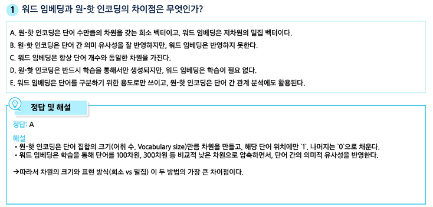
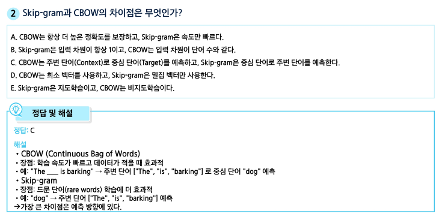
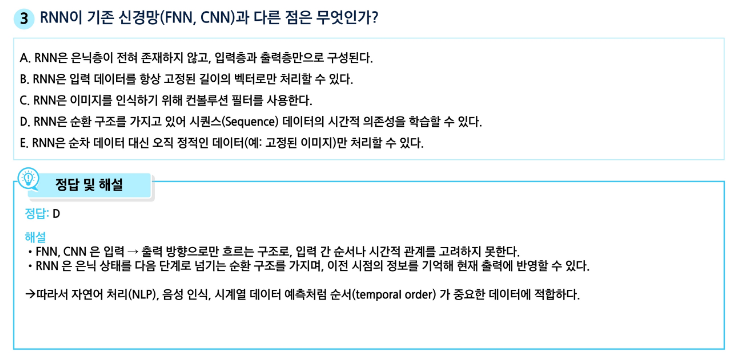
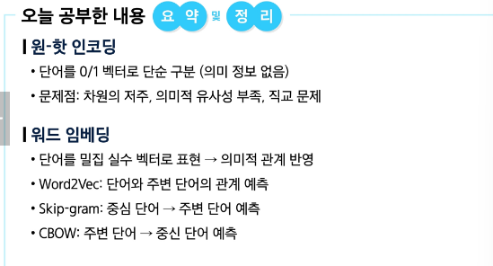
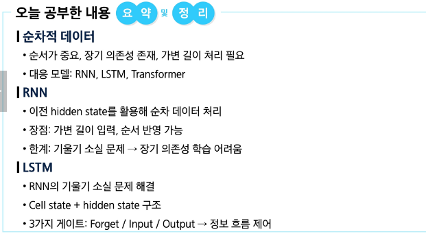


-------
# 📌 자연어 생성 모델 (Seq2Seq, Attention)
> **학습 목표**
> 언어 모델의 개념과 역할을 설명할 수 있다.
> 언어 모델이 문맥을 바탕으로 단어의 확률을 얘측하는 방식을 이해한다
> Seq2Seq 구조의 기본 아이디어(인코더-디코더)를 설명할 수 있다.
> Attention 메커니즘의 개념과 필요성을 설명할 수 있다.

## 0. 학습 시작
> 언어 모델이란 무엇일까?
* 언어 모델의 정의와 역할
* 단어 예측을 통한 문맥 이해

> Seq2Seq은 어떻게 작동할까?
* 인코더-디코더 구조
* 입력과 출력 길이가 다른 시퀀스 처리

> Attention은 왜 필요할까?
* Bottleneck problem 해결
* 중요한 단어에 집중하는 메커니즘


# 1. 언어모델이란?


- P(the cat sat on the mat): the가 발생할 확률 * 캣이 나오고 더가 있을 확률 * sat이 있고 더캣이 있을 확률 * 온이 있고 더캣샛이 있을 확률 ....


- 핸드폰 / 구글만 봐도 모델의 크기의 따라 추천 가능 언어의 범위가 다름 -> 언어모델 탑재하고 있음


- uni: 1개 / bi: 2개/ tri: 3개 연결....
- 4 이상은 잘 쓰지 않음


- 정답 y랑 차이를 구하는 것 -> 시행 착오를 통해 로스 구하고 업데이트하고 반복

> **언어모델 사용 예시: Statistical Machine Translation**

* 하지만, SMT에는 한계가 존재했다.
  * 구조적 복잡성
  * 많은 수작업
  * 언어 별 자원 구축 필요
  * **$\rightarrow$ 유지 및 확장에 어려움 존재**

* 이런 한계로 인해, 이후의 기계 번역 연구는 **Neural Machine Translation (NMT)** 으로 넘어가게 되었다.


# 2.Seq2Seq


> **Translation이 어려운 이유**
* 번역 문제는 입력과 출력의 길이가 다를 수 있다.
  * 영어: the black cat drank milk (5개의 단어)
  * 프랑스어: le chat noir a bu du lait (7개의 단어)
* $\rightarrow$ 따라서, NMT에서는 길이가 다른 시퀀스 간의 매핑을 처리할 수 있어야 한다.

> **Seq2Seq의 아이디어**
* 2개의 LSTM을 이용하자
  * 한 LSTM은 입력 시퀀스를 한 타임스텝씩 읽어 고정된 차원의 큰 벡터 표현을 얻기 (Encoder)
  * 다른 LSTM은 앞에서 얻은 벡터로부터 출력 시퀀스를 생성하기 (Decoder)


- 인코더는 영어가 들어왔을 때 벡터로 변환
  - 입력 시퀀스를 압축
- 디코더는 언어모델로 문장을 만들어냄
  - 압축된 정보로 새로운 시퀀스 생성


#### 학습 수행: Teacher Forcing


- 학습이 잘못됐을 경우 이후 연속적인 오류가 발생함
  - 이걸 해결하기 위해 정답 sos를 주고 le를 예측 (정답) -> le를 주고 chat를 예측 (정답) -> noir를 주고 a를 예측 반복 = 순차, 이를 teacher forcing 이라고 함

#### 토큰 출력 방법: Greedy Inference

- k = 1인 경우와 같음
- inference는 한 번이라 되돌릴 수 없어서 과적합이나 오버피킹이 발생할 수 있음.
- 그래서 처음에는 teacher forcing으로 학습하고 후에 갈수록 모델이 예측한 값을 넣도록 할 수도 있음.

#### 토큰 출력 방법: Beam Search
.png)
- 한 번의 후보가 아닌 여러 개의 후보를 본다
- 이미지는 k=2인 경우
  - le - chat 과 le -chien의 각 50만개의 경우를 고려하며 더 확률이 높은 단어를 추적하며 그 이후 단계를 앞의 단계와 같이 반복한다
  - 계속 k개의 후보를 유지하기 때문에 빔서치
  - k개를 1개로 두면 그리디 인퍼런스랑 같음

# 3. Attention 
#### Seq2Seq의 한계: the bottleneck problem
- 트랜스포머를 이해하기 위해 중요한 개념

- rnn 대신 lstm을 쓸 수 있지만 차원이 고정된다는 점은 동일함 (한계)
- Attention: 내가 필요한 정보를 직접 검색해서 찾아보는 것
<br>

#### Attention의 인사이트
* **Attention**은 디코더가 단어를 생성할 때, **인코더 전체 hidden state 중 필요한 부분을 직접 참조**할 수 있도록 한다.
* 즉, 매 타임스텝마다 “어떤 단어/구절에 집중할지”를 가중치로 계산해, bottleneck 문제를 완화했다.
<br>

<br>

#### Attention 동작 방식


- 모든 벡터 단어와의 관계에 대한 히든 스테이트를 살펴봄
- 어텐션 스코어를 일반적으로 알파로 표현함 - 알파값으로 히든스테이트에 대한 가중치를 구함


<details><summary> ⭐ 어텐션 작동 방식 및 의미</summary>

  **Bahdanau Attention(또는 Luong Attention) 메커니즘을 적용한 Seq2Seq 기계 번역 모델** 의 동작 과정

  영어 문장(`"<SOS> the black cat drank milk <EOS>"`)을 입력받아 프랑스어 문장(`"le chat noir a bu du lait <EOS>"`)으로 번역할 때, **첫 번째 단어($y_1$)를 출력하기 위해 입력 문장의 어느 부분에 집중하는지**를 시각화한 그림입니다.


 1. 하단 데이터 및 상태 기호

  * **$h_1, h_2, \dots, h_7$ (인코더 은닉 상태, Encoder Hidden States):**
    * **의미:** 입력 문장의 각 단어(`<SOS>`, `the`, `black`, `cat`, `drank`, `milk`, `<EOS>`)를 인코더(RNN/LSTM)가 읽으면서 생성한 각 시점의 은닉 상태 벡터입니다.
    * **원리:** 각 $h_i$는 해당 위치의 단어 정보와 그 이전 단어들의 문맥 정보를 담고 있습니다.


  * **$s_1$ (디코더 은닉 상태, Decoder Hidden State):**
    * **의미:** 디코더가 첫 번째 단어($y_1$)를 예측하기 바로 직전의 은닉 상태입니다.
    * **원리:** 현재 디코더가 "번역 문장의 첫 단어로 무엇을 내보내야 할까?"를 고민하는 상태(Query 역할)입니다.

 --------
  2. 어텐션 계산 블록 및 함수

  * **$A(1, 1), A(1, 2), \dots, A(1, 7)$ (어텐션 스코어, Attention Score):**
    * **의미:** 디코더의 첫 번째 시점 상태($s_1$)와 인코더의 각 단어 상태($h_i$) 사이의 **유사도/연관성 점수**입니다.
    * **원리:** $A(1, i) = \text{score}(s_1, h_i)$ 연산을 수행합니다. 디코더가 첫 단어를 출력하려 할 때, 인코더의 $i$번째 단어가 얼마나 관련이 깊은지 수치화한 값입니다. (그림에서 $s_1$로부터 나온 화살표들이 모든 $A(1, i)$ 블록으로 들어가는 이유입니다.)


  * **`softmax` (소프트맥스 함수):**
    * **의미:** 계산된 스코어들($A(1, 1) \dots A(1, 7)$)을 **합이 $1(100%)$인 확률값으로 변환**해 주는 함수입니다.
  * **결과 (상단 주황색 히스토그램):**
    * 소프트맥스를 통과하여 나온 결과값 $\alpha_i^1$이 상단의 주황색 막대그래프입니다.
    * 그래프를 보면 **2번째 막대(`the`)가 매우 높게 출력**된 것을 볼 수 있습니다. 즉, 디코더가 프랑스어 관사 `"le"`($y_1$)를 출력할 때 영어의 `"the"`($h_2$)에 집중(Attention)해야 함을 모델 스스로 판단한 것입니다.

 ------
  3. 핵심 수식 의미

  $$a_1 = \sum \alpha_i^1 h_i$$

  * **수식 명칭:** **컨텍스트 벡터 (Context Vector) $a_1$**
    * **의미:** 인코더의 모든 단어 정보($h_i$)를 소프트맥스 확률 비율($\alpha_i^1$)만큼 가중합(Weighted Sum)하여 **하나로 압축한 3D 문맥 벡터**입니다.
    * **원리:**
    * $\alpha_i^1$: $1$번째 디코더 시점에서 $i$번째 인코더 단어에 부여된 어텐션 가중치(확률값)입니다.
    * 중요도가 높은 단어(예: `the`)의 $h_2$ 정보는 크게 가져오고, 관련이 적은 단어들(`drank`, `milk` 등)의 정보는 아주 적게 가져와서 섞습니다.
    * 이렇게 만들어진 $a_1$은 디코더 $s_1$과 합쳐져 최종적으로 프랑스어 단어 $y_1$ (`"le"`)을 정확하게 출력하는 데 사용됩니다.

  --------
  4. 한 눈에 보는 처리 순서 요약

  ```text
  1. [s_1] 디코더가 첫 단어를 출력할 준비를 함 (Query)
  2. [A(1, i)] s_1과 인코더의 모든 단어(h_1~h_7)의 유사도를 계산함
  3. [softmax] 점수를 확률(주황색 막대)로 바꿈 -> 'the' 단어 점수가 가장 높음
  4. [a_1 = ∑ α * h] 확률 비율대로 h_1~h_7을 섞어 '컨텍스트 벡터(a_1)' 생성
  5. [y_1] s_1과 a_1을 조합해 정답인 "le"를 출력!

  ```
</details>

<details><summary> ⭐ 컨텍스트 벡터($a$) 가중합 개념</summary>
  🥤 비유 예시: "나만의 맞춤 과일주스 만들기"

  여러 가지 과일 재료가 준비되어 있고, 각 과일의 맛(성분)을 섞어 하나의 새로운 주스를 만드는 상황입니다.

  * **인코더의 히든 스테이트 ($h_i$):** 개별 과일이 가진 **'진짜 맛과 영양 성분'** (예: 사과 맛, 바나나 맛, 딸기 맛)
  * **소프트맥스 확률 비율 ($\alpha_i$):** 우리가 레시피에 넣을 **'과일의 비율(%)'** (합쳐서 $100\%$)
  * **컨텍스트 벡터 ($a$):** 이 비율대로 과일들을 믹서기에 넣고 갈아서 만든 **'최종 맞춤 주스'**


  0. 쉬운 숫자 계산 예시

  영어 문장 `"the black cat"`을 읽고 인코더가 만들어낸 3개의 히든 스테이트가 다음과 같다고 해볼게요.

  *(이해를 돕기 위해 각 단어의 의미 특징을 단순한 점수 $10$점 만점으로 표현했습니다)*

  * **$h_1$ (`the`):** `[관사 성향: 9, 색상 성향: 0, 동물 성향: 0]`
  * **$h_2$ (`black`):** `[관사 성향: 0, 색상 성향: 9, 동물 성향: 1]`
  * **$h_3$ (`cat`):** `[관사 성향: 0, 색상 성향: 1, 동물 성향: 9]`

  -------

  1. "검은색"이라는 프랑스어 단어(`noir`)를 번역해 출력해야 하는 시점

  디코더가 어텐션 스코어와 소프트맥스를 계산했더니, 지금 출력할 단어는 **색상 관련 단어인 `black`에 $80\%$ 집중**해야 한다고 판단했습니다.

  * **소프트맥스 확률 비율 ($\alpha$):**
  * `the` ($\alpha_1$) = **$0.10$** ($10\%$)
  * `black` ($\alpha_2$) = **$0.80$** ($80\%$)
  * `cat` ($\alpha_3$) = **$0.10$** ($10\%$)


  ------

  2. 컨텍스트 벡터 ($a = \sum \alpha_i h_i$) 가중합 계산

  각 단어의 히든 스테이트($h_i$)에 결정된 확률 비율($\alpha_i$)을 곱해서 모두 더합니다.

  $$\begin{aligned} a &= (0.10 \times h_1) + (0.80 \times h_2) + (0.10 \times h_3) \\ &= 0.10 \times [9, 0, 0] + 0.80 \times [0, 9, 1] + 0.10 \times [0, 1, 9] \\ &= [0.9, 0, 0] + [0, 7.2, 0.8] + [0, 0.1, 0.9] \\ &= [0.9, 7.3, 1.7] \end{aligned}$$

  --------

  3. 완성된 컨텍스트 벡터($a$)의 의미

  최종 계산된 컨텍스트 벡터 `[0.9, 7.3, 1.7]`을 보면 **색상 성향 점수가 $7.3$으로 압도적으로 높게 추출**되었습니다.

  즉, "모든 단어의 정보($h_i$)를 다 가지고 오되, 지금 당장 필요한 단어(`black`)의 정보를 $80\%$ 비율로 강력하게 섞어서 만든 맞춤형 정보 덩어리"가 바로 컨텍스트 벡터입니다.
</details>

<details><summary>⭐ Query 와 Value</summary>

  1. 🔍**Query (쿼리) = $s_2$ (디코더의 2번째 은닉 상태)**

  * **그림에서의 위치:** 오른쪽 초록색 상자 중 두 번째 셀인 $s_2$입니다.
  * **의미:** *"지금 두 번째 번역 단어($y_2$)를 내보내야 하는데, 입력 문장에서 어떤 단어를 참고해야 하지?"* 하고 **질문을 던지는 주체**입니다.
  * **원리:** $s_2$에서 출발한 화살표들이 위쪽의 $A(2,1) \sim A(2,7)$ 블록으로 사방으로 퍼져나가는 이유가 바로 입력 단어들($h_1 \sim h_7$)에게 질문을 던지는 과정이기 때문입니다.


  2. 📦**Value (밸류) = $h_1, h_2, h_3, h_4, h_5, h_6, h_7$ (인코더의 모든 은닉 상태들)**

  * **그림에서의 위치:** 왼쪽 파란색 상자들인 **$h_1 \sim h_7$** (입력 단어 `<SOS>`, `the`, `black`, `cat`, `drank`, `milk`, `<EOS>` 각각의 문맥 정보)입니다.
  * **의미:** 쿼리의 질문을 받아 실제로 꺼내와서 조합할 '원문 정보/내용물'입니다.
  * **원리:** 수식 $a_2 = \sum \alpha_i^2 h_i$를 보면, 소프트맥스로 구한 주황색 확률 비율($\alpha_i^2$)을 곱해서 최종적으로 더해주는 대상이 바로 $h_i$(Value)입니다.
  *(참고로 이 그림 같은 전통적 Seq2Seq 구조에서는 $h_i$가 Key 역할과 Value 역할을 동시에 수행합니다.)*

  

  💡 그림 전체 동작 한 줄 요약

  > **Query ($s_2$)**가 입력 단어들에게 질문을 던져 주황색 막대그래프(확률)를 얻은 뒤, 점수가 높은 `black`($h_3$)과 `cat`($h_4$)의 **Value ($h_i$)** 정보들을 많이 섞어서 **컨텍스트 벡터 ($a_2$)**를 만들어냅니다!
</details>

<br>
<br>


- 타임스탬프(h1~h7까지의 값)를 통해 전해온 값들은 과정이 반복될수록 해당 값이 희석되기 때문에 값을 직접적으로 검색해서 전달해주는 어텐션이 필요함

<br>

#### Attention의 효과
  1. **NMT(Neural Machine Translation) 성능 향상**
     * 디코더가 소스 문장 전체가 아닌, 필요한 부분에만 집중할 수 있기 때문이다.

  2. **Bottleneck Problem 해결** = 병목 제거
     * 디코더가 인코더의 모든 hidden states에 직접 접근할 수 있다.

  3. **Vanishing Gradient Problem 완화**
     * Attention은 멀리 떨어진 단어도 직접 연결할 수 있게 해준다.
     = 기울기 소실


- 어텐션 쓴 모델(search~50)과 아닌 모델(enc~50) 비교
  - x: 번역하고자 하는 문장 길이
  - y: 번역 스코어
- 어텐션을 씀에도 불구하고 히든 벡터 스테이트가 줄어들면 성능 차이가 발생하긴 함
- 그럼에도 쓰지 않는 모델보다는 더 나은 성능을 보임. 그렇다고 50보다 100이 좋냐 그렇지도 않음. 적당한 히든스테이트가 필요


- 흰색: 1에 가까움 / 검정: 0에 가까움
- 모델 해석 가능성을 위해서도 어텐션 이용 가능

#### Attention: Query와 Values


| 스코어 함수 | 수식 | 특징 및 용도 |
| --- | --- | --- |
| **Dot Product** | $s^T h$ | 가장 기본적이고 단순함 ($s$와 $h$ 차원이 같아야 함) |
| **Multiplicative** | $s^T W h$ | 차원이 달라도 가능하며 $W$를 통해 유사도 관계를 더 잘 학습함 |
| **Additive** | $v_a^T \tanh(W_h h + W_s s)$ | 소형 신경망을 거치는 방식 (Bahdanau 어텐션의 표준 방식) |
- multiplicative의 값은 : 스칼라
  - w: 매트릭스
  - 계산을 해야 하는 매트릭스가 있을 수도 있고 없을 수도 있음

- 히든 state로만 번역할 때는 해석하기 어려웠는데 어텐션은 실제 잘 번역되고 있는지 확인이 어느 정도 가능하다


<br>
<br>

#### 개인 질문
<details><summary>개인 질문 정리 및 FAQ</summary>

  > **오개념 교정 (잘못 알고 계셨던 부분)**

  > ❌ **잘못된 이해**: "로스값을 통해 재학습...?"

  * ⭕ **올바른 개념**: Seq2Seq 학습 시, 인코더와 디코더는 별개로 학습되는 것이 아니라 **하나의 거대한 신경망처럼 연결되어 동시에 학습**됩니다. 디코더의 예측값과 정답($y$) 사이의 차이(Loss)를 구하고, 이 Loss를 기반으로 인코더와 디코더에 있는 **모든 가중치(Parameters)를 한꺼번에 업데이트**합니다.

  > ❌ **잘못된 이해**: (Beam Search 이미지 설명 중) "le - chat 과 le -chien의 각 50만개의 경우를 고려..."

  * ⭕ **올바른 개념**: 50만 개(단어 사전 크기)의 모든 경우를 다 그리는 것이 아닙니다. 빔 크기(k)가 2라면, 첫 단계에서 확률이 가장 높은 단어 **2개만** 남깁니다(예: 'le', 'un'). 그 다음 단계에서는 'le' 뒤에 올 50만 개, 'un' 뒤에 올 50만 개를 다 계산해보고, 그중 누적 확률이 가장 높은 **상위 2개의 문장 조합**('le chat', 'le chien')만 남기며 추적합니다.

  > ❌ **잘못된 이해**: (N-gram) " uni: 1개 / bi: 2개/ tri: 3개 연결...."

  * ⭕ **올바른 개념**: 단어들의 단순한 '연결' 개수가 아니라, "확률을 계산할 때 고려하는 직전 단어의 개수"를 뜻합니다. Bigram은 바로 전 단어 1개, Trigram은 전 전 단어까지 2개를 보고 현재 단어의 확률을 예측합니다.

  ---

  > **Attention 동작 원리 FAQ (궁금하셨던 점)**

  노트에 질문으로 남기셨던 **Attention의 수학적 표기와 동작 방식**에 대한 상세 설명입니다.

  Q1. "a(2,l)은 h1에 대한 출력값인데... a(x, y)에서 x,y가 나타내는 의미와 어떻게 사용되는지?"

  * **질문하신 표기($\alpha_{2,1}$)의 의미**:
  * $\alpha_{i, j}$는 "디코더의 $i$번째 타임스텝에서, 인코더의 $j$번째 hidden state($h_j$)에 집중하는 정도(가중치)"를 의미합니다.
  * 즉, $\alpha_{2,1}$은 **디코더가 두 번째 단어($y_2$)를 예측할 때, 인코더의 첫 번째 입력 단어 정보($h_1$)를 얼마나 참고할지** 나타내는 확률값($0\sim1$)입니다.


  * **어떻게 사용되나요? (Context Vector 생성)**:
  * 인코더의 모든 hidden state($h_1, h_2, \dots$)에 이 가중치($\alpha$)를 곱한 후 모두 더합니다. 이를 Context Vector($c_i$)라고 부르며, 해당 시점 디코더의 새로운 입력으로 사용됩니다.

  $$c_2 = \alpha_{2,1}h_1 + \alpha_{2,2}h_2 + \alpha_{2,3}h_3 + \dots$$


  *(즉, 노트에 쓰신 "a1의 값을 s1에 넣어서..."는, 정확히는 모든 인코더 스테이트의 가중합인 Context Vector를 디코더에 입력으로 넣는 과정입니다.)*


  Q2. "매 y마다 늘 새로운 어텐션 a1, a2를 구하는가? 그렇다면 매번 새로운 h1~h7의 어텐션을 구하는 것인가?"

  * **A. 네, 정확합니다.**
  * 디코더가 새로운 단어를 예측할 때마다(매 타임스텝마다) 현재 디코더의 상태($s_i$)가 달라지므로, **인코더의 어느 부분에 집중해야 할지도 매번 달라집니다.**
  * 예를 들어, 프랑스어 번역 문장의 첫 단어('le')를 만들 때의 어텐션 가중치 분포와 두 번째 단어('chat')를 만들 때의 분포는 완전히 새로 계산됩니다.


  Q3. "디코더 벡터와 인코더의 벡터를 곱해서 유사도를 구한 후 이를 가중치로 변경..?"

  * **A. 네, 그것이 Attention Score를 구하는 기본 아이디어입니다.**
  * 디코더의 현재 상태 벡터($s_{i-1}$)와 인코더의 각 상태 벡터($h_j$) 사이의 유사도(Score)를 계산합니다.
  * 이 Score값들에 **Softmax 함수**를 취해주면, 합이 1이 되는 확률값인 Attention Weight($\alpha$)로 변환됩니다.


  Q4. "multiplicative의 값은 : 스칼라 / w: 매트릭스 ... 계산을 해야 하는 매트릭스가 있을 수도 있고 없을 수도 있음"

  * **A. 네, 맞습니다.** Attention Score를 구하는 방식(f(a))은 여러 가지가 있습니다.
  1. **Dot Product (점곱)**: 두 벡터를 그냥 내적합니다. ($s^T \cdot h$) - 별도의 파라미터($W$)가 없습니다.
  2. **Multiplicative (General)**: 노트에 있는 것처럼 중간에 학습 가능한 행렬 $W$를 둡니다. ($s^T \cdot W \cdot h$) - $W$를 통해 두 벡터 사이의 관계를 더 복잡하게 학습할 수 있습니다.


  * 최종 결과는 유사도를 나타내는 **스칼라(숫자 1개)** 값이 나옵니다.
</details>

# 4. 확인문제 및 정리
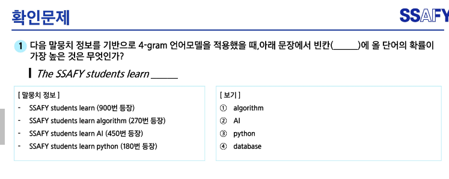
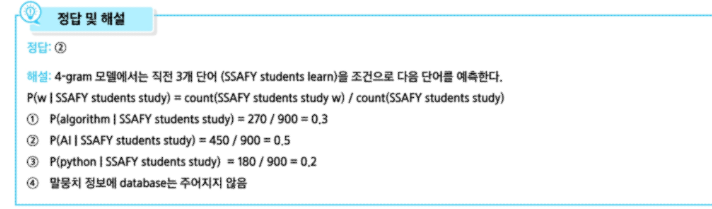
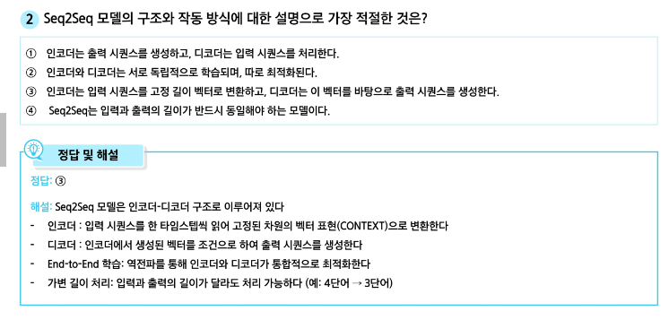
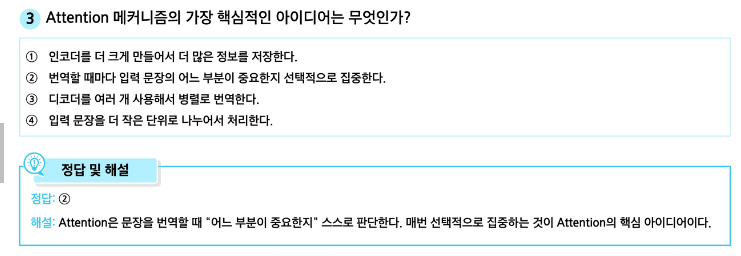
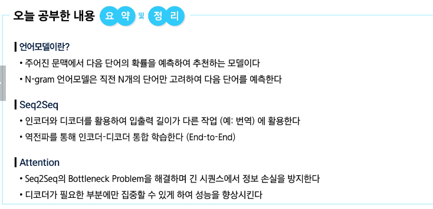


--------
# 📌 Transformer
> **학습 목표**
> Transformer의 등장 배경과 필요성을 설명할 수 있다.
> Self-Attention의 기본 개념과 동작 원리를 이해한다.
> Transformer의 전체 구조(인코더, 디코더 블록)를 설명할 수 있다.

# 0.학습 시작
> **Transformer란 무엇이며, 왜 필요한가?**
* RNN의 한계와 Attention의 필요성

> **Transformer는 어떻게 작동할까?**
* Self-Attention, Multi-Head Attention, Feed-Forward 구조 등

> **Transformer는 어떤 응용이 있을까?**
* 번역, 요약, 대화, 대형 언어모델의 기반

# 1.Self-Attention
- 키: 속성/ 쿼리: 값을 구해아 하는 문장 요소들
  - soft max: 확률을 뽑고 다음으로 넘기기 위해서
  - 각 문장 요소에서 연관성을 어떻게 구하는거지?
- 셀프어텐션을 함으로써 요소들끼리 관계 확인
<br>

#### RNN의 한계점: 장기 의존성, 병렬화


#### Self-Attention 장점

- 한 문장 내에서 어텐션이라고 해서 셀프어텐션이라고 함
    - rnn 아키텍처를 대처하는 어텐션
    - 이미지에서 보내는 숫자 1은 인코딩 되는 순서
      - 같은 숫자는 모두 똑같이 동시 인코딩
      - 시간 오래 걸리지 않고 희석되지 않음
<br>


- 일반 어텐션은 어떤 인코더와 디코더의 어텐션이었는데 셀프어텐션은 인코더 혹은 디코던 내에서의 어텐션
- '거기'라는 단어가 있다면 거기라는 자기 자신을 포함해서 어텐션
- 모든 단어들의 어텐션을 업데이트하기 위해서 이와 같은 방식을 선택
<br>

#### Self-Attention 동작

- wq, wk, wv : 학습 가능한 매트릭스
<details><summary>가중치 행렬 'W'</summary>

  1. **셀프 어텐션에서 가중치 행렬 $W$의 정의**

  셀프 어텐션에는 입력 데이터를 각각 **Query, Key, Value**라는 3가지 서로 다른 관점의 공간으로 변환하기 위한 **3개의 독자적인 가중치 행렬**이 존재합니다.

  * **$W_Q$ (Query 가중치 행렬):** 입력 단어를 "다른 단어에게 질문을 던지는 형태(Query)"로 변환하는 행렬
  * **$W_K$ (Key 가중치 행렬):** 입력 단어를 "질문에 답하기 위한 검색용 라벨(Key)"로 변환하는 행렬
  * **$W_V$ (Value 가중치 행렬):** 입력 단어를 "실제 전달할 의미/문맥 내용물(Value)"로 변환하는 행렬

  > **왜 $W$를 곱해 따로 변환할까요?**
  > 입력 단어 임베딩 벡터($x$) 하나만으로는 질문, 검색 라벨, 실제 내용이라는 3가지 서로 다른 역할을 동시에 수행하기 어렵습니다. 따라서 각각의 목적에 맞게 **'각도를 다르게 틀어주는 필터(렌즈)'** 역할을 하는 것이 바로 $W$ 행렬입니다.

  ---

  **2. $W$를 사용해 Q, K, V를 구하는 계산 예시**

  예를 들어 "Thinking"이라는 단어 하나가 들어왔을 때, 가중치 행렬 $W$가 어떻게 적용되는지 숫자로 보겠습니다.

  ① 입력 단어 임베딩 벡터 ($x$)

    단어 "Thinking"의 임베딩 벡터가 차원수 2짜리 수치라고 가정해 봅시다.

  * $x_{\text{Thinking}} = \begin{bmatrix} 1 & 2 \end{bmatrix}$

  ② 가중치 행렬 ($W_Q, W_K, W_V$)

    모델 초기화 시점에 $W$ 행렬들이 (예: $2 \times 3$ 크기로) 준비되어 있습니다.

  * $W_Q = \begin{bmatrix} 0.1 & 0.2 & 0.1 \\ 0.3 & 0.0 & 0.4 \end{bmatrix}$

  ③ 행렬 곱을 통한 Query 벡터 ($Q$) 생성

  입력 벡터 $x$에 가중치 행렬 $W_Q$를 곱하면, "Thinking" 단어만의 **Query 벡터**가 완성됩니다.

  $$Q_{\text{Thinking}} = x_{\text{Thinking}} \cdot W_Q = \begin{bmatrix} 1 & 2 \end{bmatrix} \cdot \begin{bmatrix} 0.1 & 0.2 & 0.1 \\ 0.3 & 0.0 & 0.4 \end{bmatrix} = \begin{bmatrix} 0.7 & 0.2 & 0.9 \end{bmatrix}$$

  동일한 방식으로 $W_K$와 $W_V$를 곱해 Key 벡터($K$)와 Value 벡터($V$)도 각각 얻어냅니다.

  ---

  3. **학습 가능한 $W$는 '어떻게' 구해지는가? (학습 원리)**

  가중치 행렬 $W_Q, W_K, W_V$ 내부의 수치들은 사람이 직접 정해주는 것이 아닙니다. 딥러닝의 핵심 학습 메커니즘인 **무작위 초기화 $\rightarrow$ 순전파 $\rightarrow$ 오차 계산 $\rightarrow$ 역전파(Backpropagation)** 과정을 거쳐 자동으로 최적화됩니다.

  ```text
  [1. 무작위 초기화] ──> [2. 예측 및 오차(Loss) 계산] ──> [3. 역전파 (Gradient)] ──> [4. W 경사하강법 업데이트]
  (랜덤 숫자로 출발)      (예: 번역/다음 단어 오차)        (W가 오차에 미친 영향 계산)     (최적의 W 수치로 조정)

  ```

  1) **초기화 (Random Initialization):**
  * 모델을 처음 만들 때는 $W_Q, W_K, W_V$ 내부의 숫자들을 가우스 분포나 Xavier/He 초기화 기법을 이용해 **랜덤한 수치**로 채워 넣습니다.


  2) **순전파 (Forward Pass):**
  * 랜덤한 $W$를 사용해 셀프 어텐션을 계산하고, 최종 문장 예측이나 번역 결과를 만듭니다. 처음에는 무작위 수치이므로 엉뚱한 예측 결과가 나옵니다.


  3) **오차(Loss) 계산:**
  * 모델의 예측값과 실제 정답(Ground Truth)을 비교하여 손실(Loss)을 구합니다.


  4) **역전파 (Backpropagation) 및 업데이트:**
  * 연쇄 법칙(Chain Rule)을 통해 "최종 오차를 줄이려면 $W_Q, W_K, W_V$ 내부의 수치를 각각 어느 방향으로 얼마나 수정해야 하는가?"에 대한 기울기(Gradient)를 계산합니다.
  * 경사하강법(Gradient Descent / Adam Optimizer)을 통해 $W$ 내부의 수치들을 미세하게 업데이트합니다.

  $$W \leftarrow W - \eta \cdot \frac{\partial \text{Loss}}{\partial W}$$

  ---

  💡 요약 및 결론

  * **정의:** $W_Q, W_K, W_V$는 단어 임베딩 벡터를 **Query(질문), Key(검색 라벨), Value(실제 내용)라는 3가지 맞춤형 역할 벡터로 변환해 주는 학습 가능한 선형 가중치 행렬**입니다.
  * **구해지는 방식:** 처음엔 **랜덤한 값**으로 시작하지만, 대량의 데이터(텍스트)를 학습하면서 오차를 줄이는 방향으로 **역전파(Backpropagation)를 통해 $W$ 안의 모든 값들이 자동으로 최적화**됩니다.
</details>
<br>


- 주어진 단어에 쿼리랑 키를 곱함 -> 어텐션 값을 구함 a


- a * v = (어텐션 * 가중치) 합 => h


#### Self-Attention: Key, Query, Value

- 트랜스포머에서는 키, 쿼리, 밸류의 역할을 구분해서 학습을 함


#### Self-Attention의 한계
* 이렇듯, Self-Attention은 단어 간 관계를 효율적으로 잡아내는 강력한 메커니즘이지만, 한계가 존재한다.
* **한계**
  1. **순서 정보 부재** $\rightarrow$ 단어 간 유사도만 계산하기 때문에, 단어의 순서를 고려하지 않는다.

  2. **비선형성 부족** $\rightarrow$ Attention 계산은 본질적으로 가중 평균 연산이라는 선형 결합에 불과하기 때문에, 복잡한 패턴이나 깊은 표현력을 담기 어렵다.   
    - 셀프어텐션을 연이어 한다고 해도 한 번을 한 것과 같은 동일한 값을 출력함. 딥러닝이 강조하는 비선형이 없다고 볼 수 있음.

  3. **미래 참조 문제** $\rightarrow$ 언어 모델은 시퀀스를 왼쪽에서 오른쪽으로 생성해야 하지만, Self-Attention은 모든 단어를 동시에 보기 때문에, 아직 생성되지 않아야 할 미래 단어를 참조한다.
<br>

#### Self-Attention 한계 해결

- 두 가지 방법에 대한 자세한 설명....

##### Feed-Forward Network 추가하기

- FF: Feed-Forword
- 512 차원이 있다면 1024차원으로 만들고 비선형성 추가 -> 다시 512차원으로 변경
- ​​핵심은 선형적인 결합에 non-linear activation function의 비선형성을 추가해준다는 것
  
<details><summary> Fully Connected Layer + ReLU</summary>

**1. Feed-Forward Network (FFN) 개요**

  Feed-Forward Network (피드포워드 신경망)는 정보가 오직 한 방향(입력에서 출력 방향)으로만 흐르는 가장 기본적인 형태의 인공신경망입니다. 순환 신경망(RNN)처럼 이전 상태로 돌아가는 **순환 고리(Loop)가 존재하지 않습니다** .

  이 구조는 크게 **Fully Connected Layer (완전 연결층)와 ReLU(비선형 활성화 함수)의 조합** 으로 구성됩니다.
<br>

 2. 핵심 구성 요소

**① Fully Connected Layer (Dense Layer / 전결합층)**

  * **정의**: 이전 레이어의 **모든 노드**가 다음 레이어의 **모든 노드**와 빠짐없이 연결되어 있는 구조입니다.
  * **역할**: 각 입력값에 가중치($W$)를 곱하고 편향($b$)을 더한 뒤 선형 결합(Linear Combination)을 수행하여 특징을 추출합니다.
  * **수식**:

  $$\mathbf{z} = \mathbf{W}\mathbf{x} + \mathbf{b}$$


**② ReLU (Rectified Linear Unit) 활성화 함수**

  * **정의**: Fully Connected Layer만 거치면 모델은 단순한 선형 방정식의 연속(Linear Transformation)이 되므로, 복잡한 비선형 관계를 학습할 수 없습니다. 이를 해결하기 위해 비선형성을 부여하는 활성화 함수입니다.
  * **동작 방식**: 입력값이 0 이하면 `0`을 반환하고, 0보다 크면 입력값 **그대로**를 반환합니다.
  * **수식**:

  $$\text{ReLU}(x) = \max(0, x)$$


  * **장점**: 연산이 매우 단순하고, 딥러닝 학습 시 고질적인 문제인 **기울기 소실(Vanishing Gradient) 문제를 완화**해 주어 널리 쓰입니다.


**3. 작동 원리 및 흐름**

  1) **입력 ($\mathbf{x}$)**: 데이터가 네트워크로 들어옵니다.
  2) **가중합 연산 (Fully Connected)**: 입력을 받아 가중치를 곱하고 편향을 더해 선형 변환을 거칩니다.
  3) **비선형 활성화 (ReLU)**: 선형 변환된 결과값에 ReLU를 통과시켜 음수 영역을 0으로 자르고 비선형성을 추가합니다.
  4) **출력**: 이 과정을 여러 층(Hidden Layers) 반복하여 최종 결과를 도출합니다.
</details>
<br>

##### Masked Self-Attention

- 왜 미래 단어에 해당하는 항목에 무한대를 넣는가?
  - softmax 함수를 통과하면서 0에 수렴
- 더 깊은 layer로 갈 수록 더 복잡한 표현을 이끌어내기 위해 서로 다른 matrix를 이용한다고 생각하시면 됩니다.

### ⭐Self-Attention 정리

<br>


# 2.Transformer: self-attention 핵심 매커니즘 신경망 구조
- self-attention -> 셀프어텐션의 병목 -> 셀프어텐션의 한계 해결 기술 -> Transformer


### Multi-Headed Attention: 다양한 관점에서 단어 파악

- 이제는 정말 많은 20만개 이상의 단어를 넣을 수 있기 때문에 단어 하나에 가중치를 더하지 않는다


- 각 쿼리 차원은 64를 권장함-> *8 하면 512가 되기 위해... 왜?
  <details>

  트랜스포머 원논문(*Attention Is All You Need*)에서 전체 모델 차원($d_{\text{model}}$)을 **512** 로 잡고, 헤드 개수를 **8개** 로 나누면서 각 헤드의 차원($d_k$)을 **64** ($512 / 8 = 64$)로 권장한 것에는 **하드웨어 효율성, 연산량 균형, 그리고 표현력(Capacity)** 측면의 이유가 있습니다.

  ---

  ##### 1. GPU/TPU 하드웨어 최적화 (Tensor Core 및 메모리 정렬)

  * 현대의 GPU와 TPU는 행렬 연산(Matrix Multiplication)을 극단적으로 빠르게 처리하도록 설계되어 있습니다.
  * 하드웨어 메모리 구조나 병렬 연산 장치(예: NVIDIA GPU의 **Tensor Core**)는 메모리 크기나 행렬의 차원이 2의 거듭제곱($2^n$)이거나 특정 블록 크기(8, 16, 32, 64 등)로 딱 맞아떨어질 때 가장 높은 연산 효율(대역폭 및 처리 속도)을 냅니다.
  * 64라는 숫자는 하드웨어가 병렬 처리를 수행하기에 매우 효율적인 대표적인 "2의 배수 크기" 블록 단위입니다.

  ##### 2. 전체 연산량(Computational Cost)의 유지
  * 헤드 1개당 512차원이므로, 8개를 합친 전체 가중치 행렬의 크기가 어마어마하게 커져 **연산량이 8배 폭증**하게 됩니다.


  * 반대로 전체 차원을 헤드 개수로 똑같이 나누면(`512 / 8 = 64`), **전체 모델의 파라미터 수와 연산량을 512차원 하나를 쓸 때와 거의 동일하게 유지**하면서도, 병렬로 여러 시각(8개의 헤드)을 확보할 수 있는 가성비 좋은 구조가 됩니다.

  ##### 3. 표현력(Capacity)과 차원의 적정선

  * **너무 작은 차원 (예: 8이나 16)**: 각 단어의 복잡한 의미나 문맥 정보를 담아내기에는 공간이 너무 좁아 표현력이 떨어집니다.
  * **너무 큰 차원 (예: 256 이상을 헤드마다 부여)**: 연산량이 지나치게 무거워지고 과적합(Overfitting) 위험이 커집니다.
  * **64차원**: 실험적으로 각 단어 토큰의 다양한 특징(문법, 의미, 수식 관계 등)을 압축해서 담아내기에 손실이 적으면서도 충분한 표현력을 가지는 최적의 스위트 스팟(Sweet Spot)으로 검증되었기 때문에 관례적으로 널리 쓰이게 되었습니다.
  </details>
<br>  

### Scaled Dot Product

- 차원이 커질수록 더한 값이 커짐
- 일반적으로 한개의 단어가 아닌 multi의 단어가 있는데 512개에서 가중치를 모두 다르게 하기 위해 어텐션 값이 극단적으로 0과 1 혹은 1/n이 되기를 원하지 않음
- 그래서, 값을 조정함으로써 적당한 값으로 변환
  - d =512 / n = 8 -> 루트(64) -> 8  = 차원에 대해서 루트값을 씌운 것으로 차원을 안정되게 하기 위함(스케일링)
  <details><summary>왜 스케일링이 필수적인가?</summary>

  ##### 1. 차원이 커질수록 내적(Dot Product) 값이 커지는 이유

  Query($Q$)와 Key($K$)의 각 차원값이 평균이 0이고 분산이 1인 정규분포를 따른다고 가정해 보겠습니다.
  두 벡터의 내적($Q K^T$)은 결국 여러 차원의 값들을 곱해서 다 더한 것입니다.

  * 차원이 커질수록(예: $d_k = 64$), 더하는 항의 개수가 많아지기 때문에 **내적 결과값의 분산도 함께 커집니다.**
  * 즉, 차원이 클수록 내적 값의 절댓값이 **터무니없이 크거나 작아지는 극단적인 값**들이 자주 발생하게 됩니다.

  ##### 2. Softmax 함수의 문제점 (왜 극단적인 값을 피해야 하는가?)

  Attention Score에 Softmax를 취해서 확률값(0~1 사이)으로 만드는 과정에서, 내적 값이 너무 커지면 문제가 생깁니다.

  * **기울기 소실(Vanishing Gradient)**: Softmax 함수는 입력값이 커지면 특정 값만 1에 수렴하고 나머지는 거의 0에 가까워집니다(S자 모양 곡선의 양 끝 평평한 구간).
  * 이 상태가 되면, **어떤 단어가 다른 단어에 아주 미세하게 더 높은 점수를 받았다는 이유로 특정 단어에만 어텐션 가중치가 100% 몰빵(0 또는 1)되고, 나머지 단어들은 완전히 무시됩니다.**
  * 이렇게 되면 모델이 다양한 단어의 문맥을 골고루 살펴보지 못하고(다양성 상실), 역전파 시 **기울기가 소실되어 학습이 멈춰버립니다.**

  ##### 3. 해결책: $\sqrt{d_k}$로 나누어주기 ($\frac{Q K^T}{\sqrt{d_k}}$)

  작성해주신 대로 각 헤드의 차원이 $d_k = 64$일 때, 그 제곱근인 $\sqrt{64} = 8$로 전체 내적 값을 나누어 줍니다.

  * **분산 안정화**: 표준편차($\sqrt{d_k}$)로 나누어주면, 값이 커져서 분산이 넓어졌던 분포가 다시 **정규분포 수준(분산이 1인 상태)으로 안정화**됩니다.
  * **학습 안정성 확보**: Softmax에 입력되는 값들이 적당한 범위(너무 크지도 작지도 않은 값)를 유지하게 되므로, 어텐션 가중치가 0이나 1로 극단적으로 치우치지 않고 **다양한 단어들의 정보를 부드럽게(Smooth) 골고루 참조**하며 안정적으로 학습할 수 있게 됩니다.
  </details>
<br>

### Residual Connection/ Layer Normalization


- pi= 포지션 ,xi...? xy...?, oi...?
- 모듈마다 희석되지 않고 더해짐 = residual connecition이 의미가 있음
  <details>

   **학습을 안정적이고 원활하게 만들기 위해 사용하는 핵심 기술 2가지**

  ##### 1. Residual Connection (잔차 연결 / Skip Connection)

  - 문제 상황

    신경망 층(Layer)을 50개, 100개씩 아주 깊게 쌓으면 모델이 똑똑해질 것 같지만, 실제로는 층이 너무 깊어지면 정답 신호(Gradient)가 뒤로 전달되다가 사라지거나(Gradient Vanishing) 너무 폭발(Exploding)해서 학습이 전혀 안 되는 문제가 생깁니다.

  - 해결책: "입력을 그대로 더해주자!"

  * **기존 방식 (왼쪽 그림):**
    입력 $X^{(i-1)}$을 받아 Layer를 거쳐 바로 다음 출력 $X^{(i)}$를 만듭니다. 층이 깊어질수록 원본 정보가 손실됩니다.
    * **Residual Connection (빨간 상자 그림):**
    입력 $X^{(i-1)}$을 Layer에 넣어서 나온 결과에 원래 입력 $X^{(i-1)}$을 그냥 있는 그대로 더해(+)줍니다.

  - 핵심 아이디어: "차이(잔차, Residual)만 배워라"

    * Layer가 전체 정답을 처음부터 끝까지 다 만들어낼 필요 없이, "원래 입력에서 조금 더 보완해야 할 차이(잔차)가 무엇인가?"만 학습하도록 부담을 줄여주는 것입니다.
    * 오른쪽 손실 함수 지형(Loss Landscape) 그림처럼:
    * **[no residuals]:** 층이 깊으면 지형이 울퉁불퉁해서 최적의 정답(골짜기)을 찾기 힘듭니다.
      * $$\text{Layer}(X) = Y$$
    * **[residuals]:** 잔차 연결을 쓰면 지형이 매끄러워져서 정답을 아주 쉽게 찾아갑니다.
      * $$\text{Layer}(X) = Y - X$$
  - 💡 왜 이게 학습을 훨씬 쉽게 만들까요?
    - 만약 특정 Layer가 더 이상 뭔가를 배울 필요가 없고, 이전 단계의 결과를 그대로 유지하는 게 최선인 상황이라고 해볼게요.기존 방식: Layer가 자기 자신을 통과한 값이 입력값과 똑같이 나오도록($\text{Layer}(X) = X$) 복잡한 가중치들을 아주 정교하게 조절해야 합니다. (이건 생각보다 매우 어렵습니다.)
    - 잔차 연결: Layer가 그냥 0을 출력하도록만 하면 됩니다 ($\text{Layer}(X) = 0 \implies 0 + X = X$). 신경망 입장에서 모든 가중치를 0으로 만들어 버리는 것은 아주 쉽습니다!


  ##### 2. Layer Normalization (층 정규화)

  - 문제 상황

    딥러닝 모델에서 데이터를 한 층 한 층 통과시킬 때마다 내부 수치들(hidden vector 값)이 널뛰기를 합니다.

    어떤 층을 지나면 값이 1000이 되었다가, 다음 층에서는 0.0001이 되는 식이죠. 이렇게 **값이 커졌다 작아졌다 들쑥날쑥하면 모델 학습이 매우 불안정** 해집니다.

  - 해결책: "수치들의 기준을 일정하게 통일하자!"

    * **Layer Normalization**은 각 레이어를 통과할 때마다 출력값(hidden vector)의 **평균을 0, 표준편차를 1** 근처로 깔끔하게 정돈(정규화)해 줍니다.
    * 마치 반 학생들이 시험을 봤을 때 점수 차이가 너무 심하면 표준점수로 변환해서 비교하기 쉽게 만드는 것과 같습니다.
    * 덕분에 **학습이 튕겨 나가지 않고 매우 안정적이고 빠르게 진행** 됩니다.

  ##### 한 줄 요약

    > * **Residual Connection:** 지름길을 만들어 원본 정보를 보존하고 **"차이만 학습"**하게 하여 깊은 신경망 학습을 가능하게 함.
    > * **Layer Normalization:** 값들이 들쑥날쑥하지 않게 **"수치 기준을 정돈"** 하여 학습을 안정적이고 빠르게 만듦.
    > 
    > 

    보통 Transformer 구조에서는 이 두 가지를 조합해 **`LayerNorm(X + SubLayer(X))`** 형태로 함께 사용합니다! 
    </detials>


- 첫번째 어턴션은 각 인코더, 디코더의 multi-head attention
  - 인코더: 영어/ 디코더: 프랑스어
- 이미지에서 빨간 네모 박스가 두번째 어텐션임
  - cross attention의 과정 이해하기ㅜㅜ
  - 키는 영어 쿼리는 프랑스어일 때 이때 통과되는 값은 영어 => 영어와 프랑스어를 concat으로 더함 = 두 정보를 더함
  - 벡터는 어떤 공간에서의 표현. 방향성 0 -> 벡터의 정보가 더해진다고 해서 이전의 방향성을 가진 벡터가 사라진 것이 아닌 정보가 더해진 새로운 벡터가 생긴 것.


>트랜스포머를 써야 하는 이유 ??
- rnn: 시간이 오래 걸리고 파라미터를 설계해야 함
- transformer: 동시성, 똑같은 모듈 반복됨


- 트랜스포머는 번역에 최적화됨. 


- 어텐션의 활용에 따른 rnn, cnn, nlp, transformer 설명 및 신경망과의 관계는 뭘까? (신경망과 관계가 없다면 없음으로 표현)


# 📌 사전 학습 기반 언어 모델
- 인코더 구조만 쓰거나 디코더 구조만 쓰거나 할 수 있음

>**학습 목표**
> - 사전학습(Pretraining)의 개념과 필요성을 설명할 수 있다.
> - Encoder 기반 모델(예: BERT)의 구조와 주요 활용 사례를 이해한다.
> -Encoder-Decoder 기반 모델(예: T5)의 특징과 응용 분야를 설명할 수 있다.
> - Decoder 기반 모델(예: GPT)의 구조와 강점을 이해한다.
> - In-Context Learning (ICL)이 등장하게 된 배경과 그 의미를 설명할 수 있다.
> - ICL 능력을 끌어 올리기 위한 대표적인 prompting 기법 (CoT, Zero-shot CoT)을 이해한다.

# 0. 학습 시작

> **사전학습(Pretraining)이란 무엇인가? 왜 중요한가?**
* 대규모 데이터 기반의 사전학습 개념과 필요성

> **대표적 모델 유형은 어떻게 구분되는가?**
* Encoder 기반, Encoder-Decoder 기반, Decoder 기반

> **각각 어떤 모델이 존재하는가?**
* BERT, T5, GPT 등 주요 모델 소개

> **In-Context Learning과 발전된 prompting 기법은 무엇인가?**
* ICL의 등장 배경과 의미
* Chain-of-Thought, Zero-shot CoT 등 대표 기법

# 1. 사전학습이란?
> **사전학습이란?**
* 사전학습이란 대규모 데이터 셋을 이용해, 모델이 데이터의 일반적인 특징과 표현을 학습하도록 하는 과정이다.
* 특히 언어 모델은, 인터넷의 방대한 텍스트(웹 문서, 책, 뉴스 등)을 활용해 비지도학습 방식으로 학습되어, 일반적인 언어 패턴, 지식, 문맥 이해 능력을 습득한다.
  


# 2.Encoder 모델


- web에서 정말 많은 대용량 데이터를 가져와도 이미 정답을 가져온 것과 마찬가지이기 때문에 ㄱㅊ


- 요즘에 잘 안 쓰는 방식
  


- 개체 여부를 BIO 태그로 구분함
  - 개체가 아닌 경우: O


- 파인튜닝만 했더니~


# 3.Encoder-Decoder 모델


- 텍스트로 구성된 모든 문제를 해결하도록 하자 문제를 구분할 수 있는 prefix를 달아서 어떤 문제인지만 구분하도록 하자. 
  - prefix 발전 -> 인프런...?
  - prefix: cola sentence, stsb sentence, translate english to german, summarize


# 4. Decoder 모델


# 5.In-Context Learning


- 디코더는 다음 단어를 만들기에 최적화됨
- 중요: rnn, transformer, gpt in-context learning

#### 개인 정리
 1. ⚠️ 오개념 교정 & 핵심 보완

- BERT의 학습 방식 (MLM & NSP)

* ❌ **잘못 파악하기 쉬운 점**: "NSP(Next Sentence Prediction)는 요즘 잘 안 쓰는 방식이다."
* ⭕ **핵심 정리**:
* **MLM (Masked Language Model)**: 문장 중간의 단어를 `<MASK>` 처리하고 맞추는 대표적 **양방향(Bi-directional)** 사전 학습 방식입니다.
* **NSP (Next Sentence Prediction)**: 두 문장이 이어지는 문장인지 패러그래프 수준에서 맞추는 task입니다. 노트에 적어두신 것처럼 **RoBERTa 등 후속 연구에서 NSP 효과가 미비하거나 오히려 성능을 떨어뜨린다는 것이 밝혀져 최근 인코더 모델 학습 시에는 NSP를 제거하거나 다른 Task(SOP 등)로 대체**하는 추세입니다.


- T5 (Encoder-Decoder)의 Prefix 개념

* ❌ **잘못 파악하기 쉬운 점**: "Prefix 발전 $\rightarrow$ 인프런...?"
* ⭕ **핵심 정리**:
* T5는 모든 자연어 처리 문제를 **"Text-to-Text"** 프레임워크로 통합했습니다.
* 입력을 줄 때 문장 앞에 `Translate English to German:`, `Summarize:` 같은 Prefix(프리픽스/접두사)를 붙여서 모델이 어떤 Task를 수행해야 하는지 지시합니다.
* 이 아이디어는 이후 파인튜닝 없이 프롬프트만으로 지시를 수행하는 **Prompting / Instruction Tuning / In-Context Learning** 개념의 중요한 발판이 되었습니다.


- BIO 태깅 (개체명 인식, NER)

* ⭕ **핵심 정리**:
* **B (Begin)**: 개체명(Entity)이 시작하는 토큰
* **I (Inside)**: 개체명 내부/연속되는 토큰
* **O (Outside)**: 개체명이 아닌 일반 토큰 (노트에 잘 정리하셨습니다!)


💡 대표 모델 계열별 핵심 요약 (BERT vs T5 vs GPT)

| 구분 | **Encoder 기반 (예: BERT)** | **Encoder-Decoder 기반 (예: T5)** | **Decoder 기반 (예: GPT)** |
| --- | --- | --- | --- |
| **주요 특징** | 양방향(Bi-directional) 문맥 참조 | 입력을 읽는 인코더 + 생성하는 디코더 | 단방향(Causal / Auto-regressive) 생성 |
| **주요 목적** | **문장 이해 및 분류** (NLU) | **복합 변환 Task** (번역, 요약 등) | **자연어 생성** (NLG, 대화, 창작) |
| **대표 모델** | BERT, RoBERTa, ELECTRA | T5, BART | GPT-1, 2, 3, 4, LLaMA |
| **학습/사용 방식** | 주로 다운스트림 태스크에 **Fine-tuning** | Text-to-Text 형태의 Fine-tuning | **In-Context Learning (Prompting)** |


❓ In-Context Learning & Prompting 기법 FAQ

Q1. In-Context Learning(ICL)이란 무엇이고, Fine-tuning과 어떻게 다른가요?

* **A.**
* **Fine-tuning (미세조정)**: 새로운 데이터셋으로 모델의 **가중치(Weight)를 직접 업데이트**합니다.
* **In-Context Learning**: 가중치를 전혀 업데이트하지 않고, **입력 프롬프트(Context) 안에 예시(Few-shot)나 지시문만 제공**하여 모델이 그 자리에서 패턴을 이해하고 정답을 생성하도록 만드는 기법입니다. (GPT-3에서 본격 도입)


Q2. Shot의 종류 (Zero-shot, One-shot, Few-shot) 구분

* **Zero-shot**: 예시를 전혀 주지 않고 지시문만 제공 (예: "다음 문장을 감정분석해줘: 오늘 기분이 좋다.")
* **One-shot**: 정답 예시 1개 제공
* **Few-shot**: 정답 예시 2~3개 이상 제공

Q3. Chain-of-Thought (CoT)와 Zero-shot CoT는 왜 효과적인가요?

* **CoT (Chain-of-Thought)**:
* 단순히 "질문 $\rightarrow$ 정답" 예시만 주는 것이 아니라, "질문 $\rightarrow$ 중간 추론 과정 $\rightarrow$ 정답"의 형태로 예시를 줍니다.
* 복잡한 산수나 논리 추론 문제에서 모델이 단계별로 생각하게 만들어 정답률을 획기적으로 올려줍니다.


* **Zero-shot CoT**:
* 예시를 작성하기 귀찮을 때, 질문 끝에 "Let's think step by step (단계별로 천천히 생각해 보자)"라는 문구만 붙여주는 기법입니다.
* 이 한 마디만으로도 디코더 모델이 중간 추론 과정을 스스로 만들어내며 정답률이 대폭 상승합니다.