#### 참고
https://www.youtube.com/watch?v=6s69XY025MU

# 📌 워드 임베딩과 순환신경망 기반 모델 (RNN & LSTM)

> **학습 목표**
> 단어를 숫자로 표현하는 기본 아이어들을 이해한다.
> 언어에서 '순서(문맥)'의 중요성을 설명할 수 있다.
> RNN의 기본 구주와 역할을 이해한다
> LSTM의 핵심 아이디어를 설명할 수 있다.

- 워드임베딩(단어) -> RNN(문장) -> LSTM(더 긴 문장)

# 0. 학습 시작
- 언어를 어떻게 숫자로 표현할까?
  * One-hot encoding, word embedding 등 기본 아이디어 이해

- 언어에서 ‘순서(문맥)’는 왜 중요하고 어떻게 다뤄야 할까?
  * 단어 순서와 의미의 연결성

- 순환 신경망(RNNs, LSTMs 등)은 어떻게 동작할까?
  * 기본 구조와 역할
  * 장기 의존성 문제와 LSTM의 핵심 아이디어

# 1. 워드 임베딩
## 1-1. 원-핫 인코딩
> **원 핫 인코딩이란?**
* 규칙 기반 혹은 통계적 자연어처리 연구의 대다수는 단어를 원자적(쪼갤 수 없는) 기호로 취급한다.  
  예: *hotel, conference, walk* 같은 단어들.
* 벡터 공간 관점에서 보면, 이는 한 원소만 1이고 나머지는 모두 0인 벡터를 의미한다.

$$[0 \ 0 \ 0 \ 0 \ 0 \ 0 \ 0 \ 0 \ 0 \ 0 \ 0 \ 0 \ 1 \ 0 \ 0 \ 0 \ 0 \ 0]$$

* 차원 수(= 단어 사전 크기)는 대략 다음과 같다:
  * 음성 데이터(2만) - Penn Treebank (PTB) 코퍼스(5만) - big vocab(50만) - Google 1T(1300만)
* 이를 **원-핫(one-hot) 표현**이라고 부르고, 단어를 원-핫 표현으로 바꾸는 과정을 **원-핫 인코딩(one-hot encoding)**이라고 한다.
 

> **원 핫 인코딩의 문제점**
* 예시: 웹 검색
  * [삼성 노트북 배터리 사이즈] == [삼성 노트북 배터리 용량]
  * [갤럭시 핸드폰] == [갤럭시 스마트폰]

$$\text{핸드폰 } [0 \ 0 \ 0 \ 0 \ 0 \ 0 \ 0 \ 0 \ 0 \ 0 \ 0 \ 0 \ 1 \ 0 \ 0 \ 0 \ 0 \ 0]^T$$
$$\text{스마트폰 } [0 \ 0 \ 0 \ 0 \ 0 \ 0 \ 0 \ 1 \ 0 \ 0 \ 0 \ 0 \ 0 \ 0 \ 0 \ 0 \ 0 \ 0] = 0$$

* 검색 쿼리 벡터와 대상이 되는 문서 벡터들이 서로 **직교**하게 되어, 원-핫 벡터로는 유사도를 측정할 수 없다.
 

    *노트북 배터리 사이즈와 용량이 웹검색에서는 같은 단어로 취급 받지만 실제 언어 처리에서는 다른 문자로 구분된다.
 

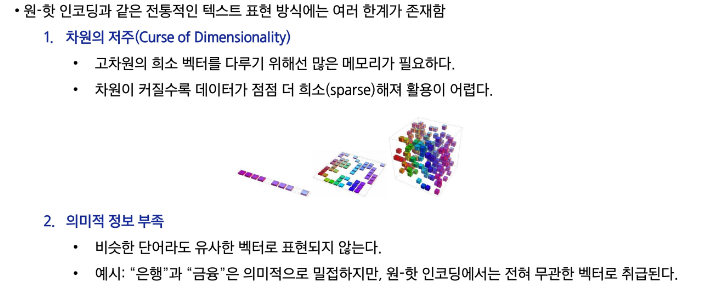

## 1-2. 워드 임베딩
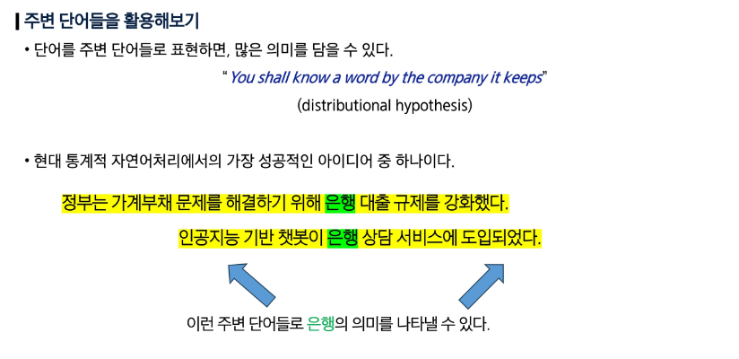
    *원핫 임베딩을 보완하기 위해 생김
    *그 사람을 파악하기 위해선 주변 친구를 봐야하는 것처럼 해당 단어만 보는 것이 아니라 앞뒤 맥락을 봐야 더욱 정확한 의미 파악 가능

* 단어를 단어들 사이의 의미적 관계를 포착할 수 있는 **밀집(dense)되고 연속적/분산적(distributed) 벡터 표현으로 나타내는 방법**이다.
 

  * 원-핫 인코딩에선 은행과 금융이 완전히 독립적인(무관한) 벡터로 표현되었지만,
  * 워드 임베딩에선 두 단어의 벡터가 공간상 서로 가깝게 위치하며, 이를 통해 의미적 유사성을 반영할 수 있다.
 

$$\text{은행} = \begin{bmatrix} 0.432 \\ 0.343 \\ -0.324 \\ 0.743 \\ -0.853 \\ 0.135 \\ 0.738 \end{bmatrix} \xrightarrow{\text{예측 가능}} \begin{matrix} \text{정부} \\ \text{위기} \\ \text{규제} \\ \text{돈} \\ \dots \end{matrix}$$

*덴서하면서도 컨티뉴하다

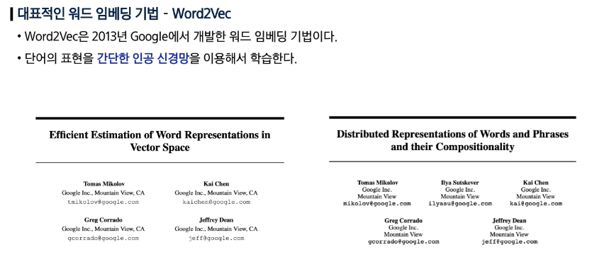
> **Word2Vec의 아이디어**
* Word2Vec의 아이디어는 **각 단어와 그 주변 단어들 간의 관계를 예측한다는 것이다.**

* Word2Vec엔 두 가지 알고리즘이 존재한다.
  * **Skip-grams (SG) 방식**
    * 중심 단어를 통해 주변 단어들을 예측하는 방법이다.
    * 단어의 위치(앞/뒤)에 크게 구애 받지 않는다.
    * 어떤 단어가 입력으로 들어가면 주변의 어떤 값 하나가 출력으로 나옴
  * **Continuous Bag of Words (CBOW) 방식**
    * 주변 단어들을 통해 중심 단어를 예측하는 방법이다.
    * 문맥 단어들의 집합으로 중심 단어를 맞춘다.

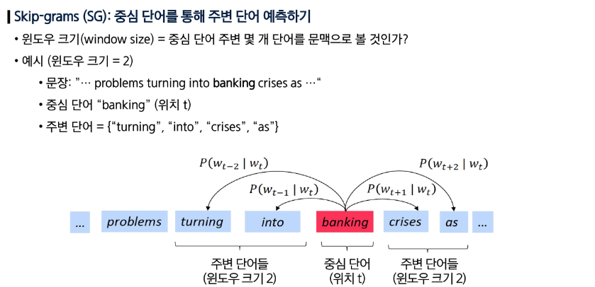

- 중심단어에 대한 임베딩 -> 주변 단어에 대한 분포 확률 예측 -> 예측된 확률이 실제로 정답값이랑 얼마나 차이가 나는지(로스 확인)
  - 여기서 인코딩과 디코딩은 무엇일까?

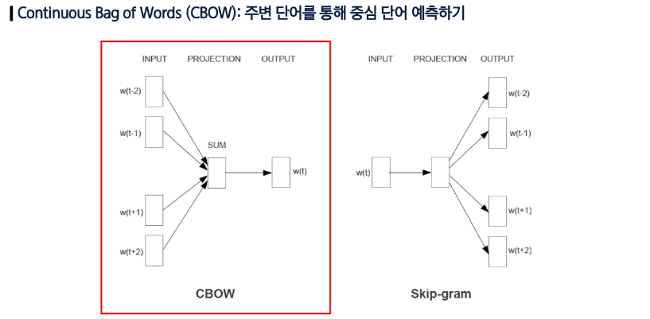
- cbow: 주변의 값을 입력으로 삼음
  - 주변의 값 50만개가 있다면 출력값으로 구두가 될 확률 (50만개의 입력값을 통한 확률값)
- sg: 주변의 값을 출력으로 삼음
- 임베딩은 사람으로 치면 사고의 상태 ~> 대충 상태가 이렇구나 이해 

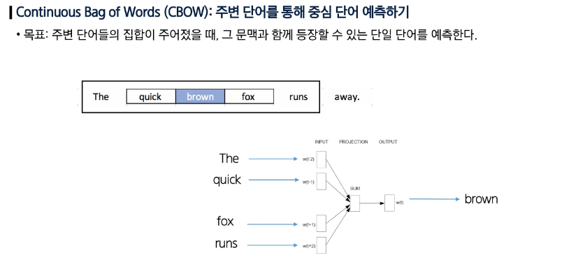
- 위 이미지는 하나의 예시임
  - 4개의 단어를 입력으로(인코딩?) 삼고 해당 입력을 다 더해서 디코더를 통해 brown과 얼마나 차이가 나는지 학습을 시킴
  - 인코딩이 브라운과 전혀 상관이 없다면 디코더도 브라운과 전혀 상관이 없는 결과가 나올 것임
  - 관련이 생기려면 주어진 값과 연관이 잘 되도록...?

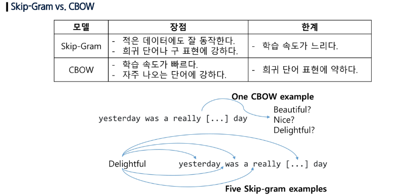
- sg: t번째 단어가 들어왔을 때 t-1 , t-2 ... 등 여러번 출력값에 대한 확률을 풀어냄. 대신 학습이 느림. 그렇지만 성능은 좋음
- cbow: 샘플 1개

=> 이러이러한 이유로 워드임베딩이 떠오르고 있음

*내 질문: 여기서 말하는 인코더와 디코더는 무엇인가?

    💡 핵심 요약

    * **인코더 (Encoder = '단어를 의미 공간으로 축소/압축')**
    * 원-핫 벡터처럼 **고차원의 단어 데이터**를 모델이 이해할 수 있는 저차원의 밀집 벡터(임베딩)로 변환하는 역할을 합니다.
    * 쉽게 말해, 단어의 의미를 포함한 "사고 및 문맥 상태 Vector"로 축약하는 단계입니다.

    * **디코더 (Decoder = '압축된 의미로 정답 단어를 예측/복원')**
    * 인코딩된 밀집 벡터를 바탕으로, **원하는 목적(주변 단어 또는 중심 단어)에 맞게 확률 분포 형태로 다시 펼쳐서 예측**하는 역할을 합니다.
    * 인코더가 뽑아낸 의미 벡터가 정답 단어와 가깝게 나오도록 매개변수(무게중심)를 조정하며 학습을 완성합니다.

    🔍 Word2Vec 구조별 적용 예시

    * **CBOW (주변 단어 $\rightarrow$ 중심 단어)**
    * **인코더**: 주변 단어들(입력)을 각각 임베딩 벡터로 변환한 후, 이들의 평균(Sum/Average)을 내어 **하나의 문맥 상태**를 만드는 과정.
    * **디코더**: 만들어진 문맥 상태 벡터를 가지고 **중심 단어가 무엇일지 확률**을 계산하여 맞추는 과정.

    * **Skip-gram (중심 단어 $\rightarrow$ 주변 단어들)**
    * **인코더**: 중심 단어(입력) 1개를 **의미 상태 벡터**로 변환하는 과정.
    * **디코더**: 이 의미 상태 벡터를 가지고 **주변 단어들이 나올 확률 분포**를 여러 번 예측해 내는 과정.

# 2. 순차적 데이터
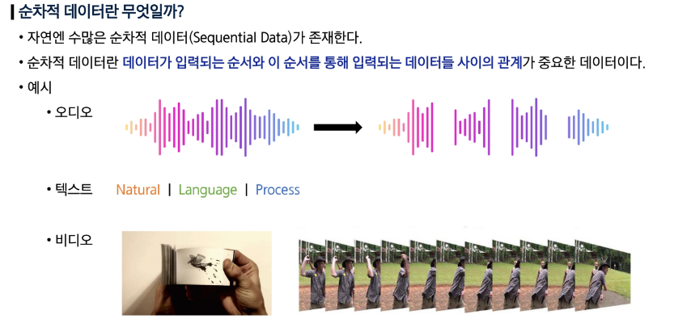
- 비디오, 텍스트 , 오디오 모두 시퀀스 데이터임

> **순차적 데이터의 특징**
* 순차적 데이터는 다른 데이터와 구별되는 특징들이 존재한다.
* **특징**
  1. **순서가 중요하다**
     * 데이터의 순서가 바뀌면 의미가 달라진다.
     * 예시: 나는 너를 사랑해 $\neq$ 너는 나를 사랑해
  2. **장기 의존성(Long-term dependency)**
     * 멀리 떨어진 과거의 정보가 현재/미래에 영향을 준다.
     * 예시: “여러 개의 문 중 파란 문을 열고 안으로 들어가면, 너는 (?)를 찾게 될거야.”
  3. **가변 길이(Variable length)**
     * 순차 데이터는 길이가 일정하지 않고, 단어 수도 제각각이다.
 

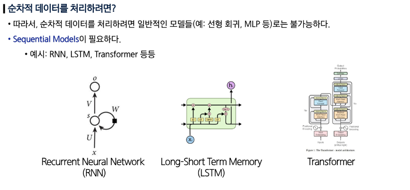

# 3. RNN
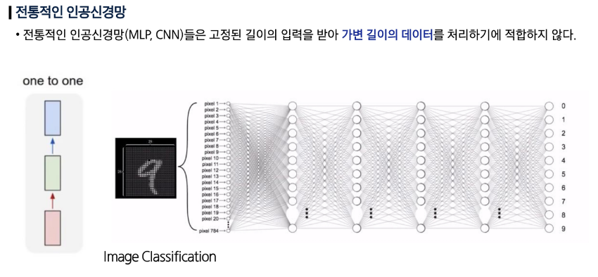
- 전부 독립적인 고정된 값을 입력하고(가지고 있고) 고정된 값을 출력받음
- 단어와 단어의 순서를 고려해야 함 -> 그러다보니 고정이 안됨

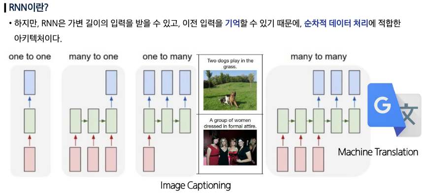
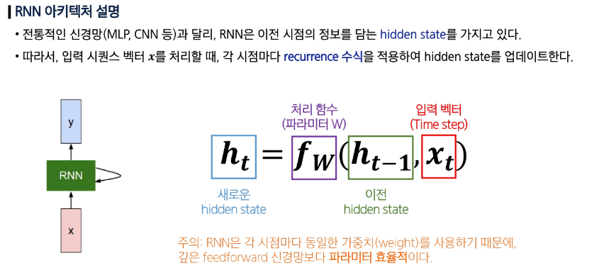
- t번째의 히든스테이트를 만들기 위해서 ...어떤 함수요...?

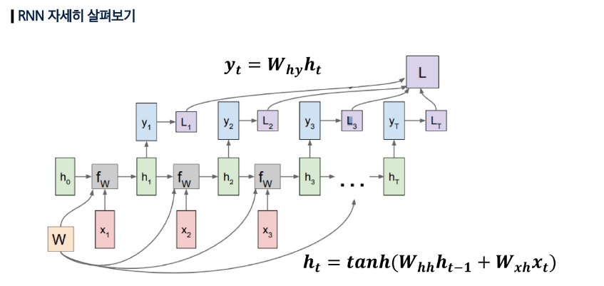
- 비선형 변화를 함 
- 히든 벡터는 우리가 그 값을 정확히 알 수 없기 때문에 히든이라는 단어를 씀
- rnn 함수에서 듯하는 히든 스테이트, tanh의 정의와 함수 및 각 함수 요소의 의미 설명 필요
- yt, wt 그리고 그 안의 파라미터는 어떤 거며, fw는 뭐임?
 

> **RNN의 특징**
* RNN은 **한 번에 하나의 요소를 처리**하고, 정보를 앞으로 전달한다.
* **펼쳐서 보면**, RNN은 각 층이 하나의 시점을 나타내는 깊은 신경망처럼 보인다.
* RNN은 hidden state를 유지하면서 **가변 길이 데이터를 처리**할 수 있다.
* RNN의 출력은 **과거 입력에 영향을 받는다**는 점에서, feedforward 신경망과 다르다.
 

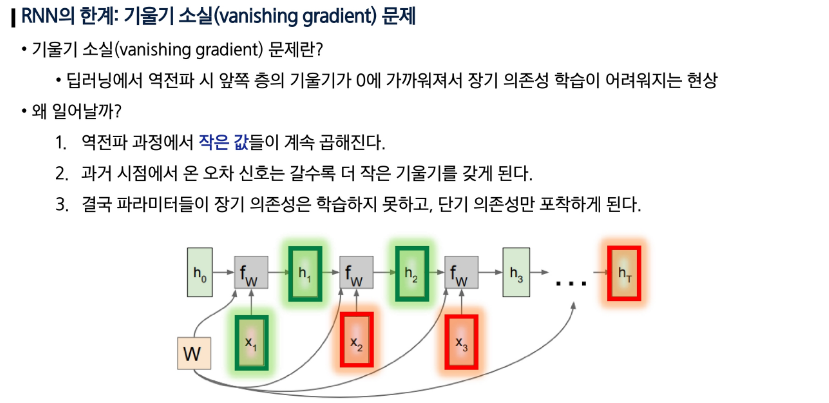
- 실제로 로스가 잘 떨어지지 않음 , 파라미터 학습이 잘 되지 않음 -> 그 이유가 기울기 소실 문제 때문임
- 역전파 과정에서 1보다 작은 실수 값으로 계속 곱해짐 -> 신호가 약해짐 -> 이미지의 초록색 처럼 가까이 있는 관계는 학습을 잘 하지만 빨간색처럼 떨어져 있는 관계들끼리는 학습이 잘 되지 않음 
  - 예시로, 그 영화가 재미없었다.
    - 내용은 재미있었지만 조크가 재미없었다의 경우, 영화 자체보다 해당 부분이 재미없었다는 뜻이지만 실제로는 영화가 재미없었다는 뜻으로 해석할 수도 있음. -> 벡터의 값을 잘 저장하는 것이 중요함

# 4. LSTMs
> **LSTMs란?**
* 기울기 소실 문제를 해결하기 위해, 1997년에 제안된 RNN의 한 종류
* LSTMs의 특징
  * 시점 $t$ 에서 RNN은 길이가 $n$인 벡터 **hidden state $h_t$** 와 **cell state $C_t$** 를 가진다.
    * Hidden state는 short-term information을 저장한다.
    * Cell state는 **long-term information을 저장**한다.
  * LSTMs는 cell state에서 정보를 **읽고(read)**, **지우고(erase)**, **기록(write)** 할 수 있다.
 

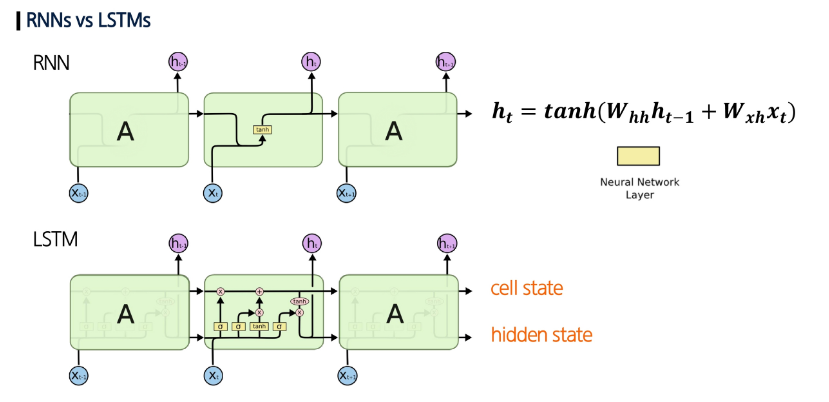
- rnn: 정보를 tanh에 전부 넣음. 해당 입력값에 대한 판단을 하진 않음
- lstm: 불필요한 정보를 선택적으로 저장함.

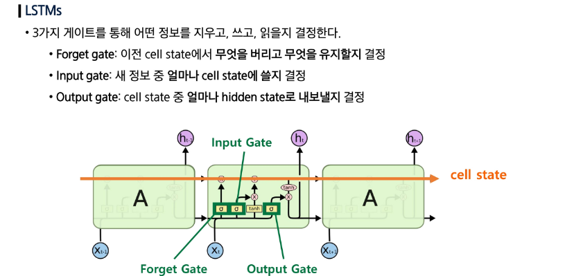
- 결과값이 0과 1사이의 값으로 결정됨
- forget gate: 값을 얼마나 잊을지
- input gate: 얼마나 저장이 될지
- output gate: 저장된 값을 어떻게 어떤 걸 출력할지를 결정
- cell state: 정보 저장 공간
 

> **게이트의 동작?**
  * 매 시점마다 게이트의 각 요소는 **열림(1)**, **닫힘(0)**, 혹은 **그 사이의 값**으로 설정된다.
  * 게이트는 동적으로 계산되며, 현재 입력과 hidden state 등 문맥에 따라 값이 정해진다.

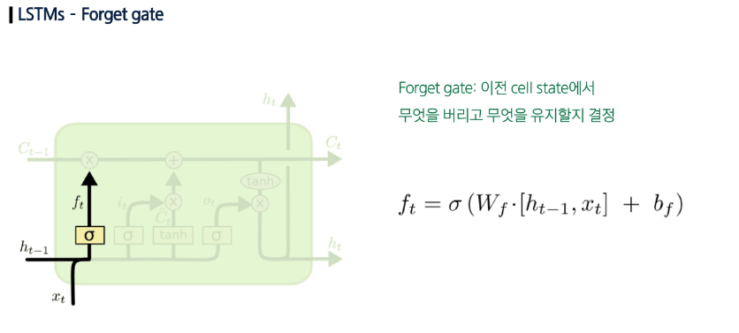
- element별 곱 -> 결과값을 출력 = 값이 0인 부분은 전부 날림
    - 출력 값이 0과 매우 가까운 값 혹은 1과 매우 가까운 실수 값에서 결정되기 때문에 0과 매우 가까운 값은 0으로 판단함
    - forget gate 만을 위해서 존재하는 파라미터가 뭐라고???
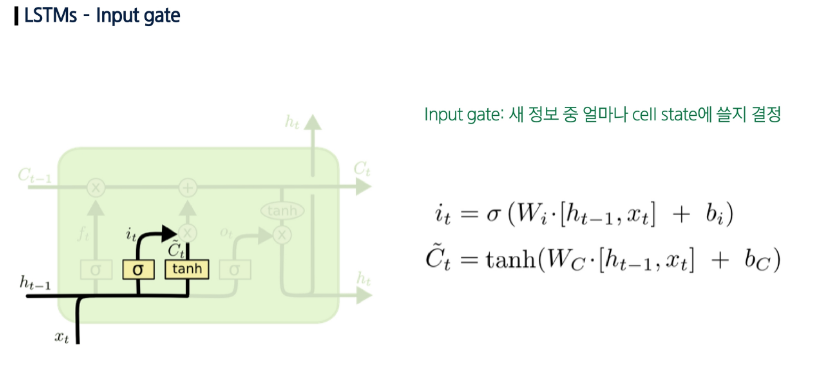
- wi, bi (?): input gate 만을 위해 존재하는 파라미터
- 무조건 cell state에 값을 저장 후 output gate를 통해 출력

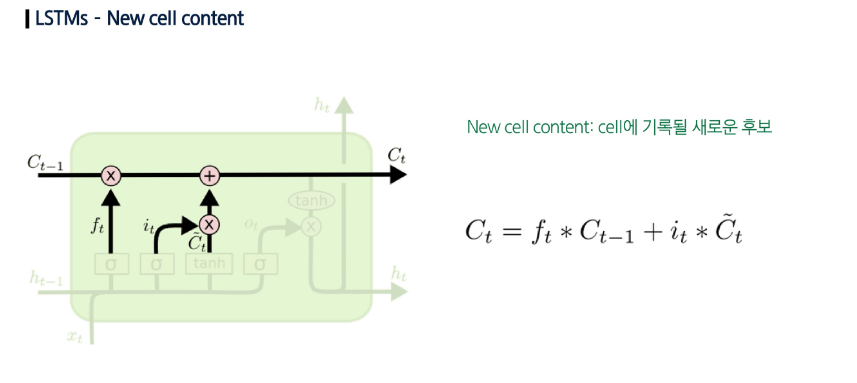
- Ct: t번째 cell state는 필요한 영역만 activate
  - 필요한 정보는 업데이트 함
  
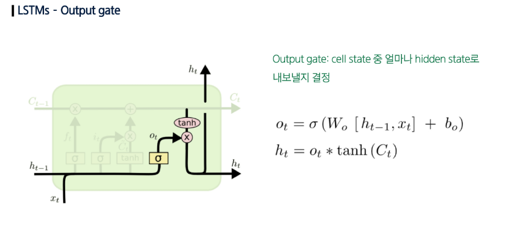
- Ct의 정보가 비선형성을 더하고 정보 선택을 통해 ht 표현을 만듦

----

- rnn: 무조건 같은 매커니즘을 통해서 누적시킴
- lstm: 히든스테이트, 벡터는 무한하지 않기 때문에 정보를 효과적으로 저장하기 위해서 불필요한 정보를 제거하고 필요한 정보만을 저장하기 위해 3개의 gate 존재. 절대적이진 않음 사람이 개발한 엔지니어링이기 때문. lstm도 버전이 여러개. 우리가 아이디어를 제시할 수도 있음

#### 질문 정리
> 오개념 교정 (잘못 알고 계셨던 부분)

- ❌ **잘못된 이해**: "cbow: 주변의 값 50만개가 있다면 출력값으로 구두가 될 확률..."

* ⭕ **올바른 개념**: 50만 개는 단어 사전(Vocabulary)의 전체 크기(차원)입니다. 주변 단어 50만 개를 입력으로 쓰는 것이 아니라, 설정한 윈도우 크기(예: 앞뒤 2개씩 총 4개 단어)의 입력값만 받아서 단어 사전(50만 개) 중 어떤 단어가 중심에 올지 **확률 분포(50만 차원)를 출력**하는 것입니다.

- ❌ **잘못된 이해**: "Forget gate: 출력 값이 0과 매우 가까운 값 혹은 1과 매우 가까운 실수 값에서 결정되기 때문에 0과 매우 가까운 값은 0으로 판단함"

* ⭕ **올바른 개념**: 판단해서 0으로 바끄는 이분법적 방식이 아니라, **시그모이드($\sigma$) 함수의 연산 결과(0~1 사이의 실수 값)를 그대로 요소별 곱(Element-wise multiplication, $\odot$)** 해줍니다. 0.01이면 과거 정보의 1%만 남기고 99%를 삭제(Erase)하는 연속적인 개념입니다.

- ❌ **잘못된 이해**: "무조건 cell state에 값을 저장 후 output gate를 통해 출력"

* ⭕ **올바른 개념**: $C_t$(Cell State)는 **외부로 직접 출력되지 않고 내부에서 길게 흐르는 장기 기억 통로**입니다. 외부(다음 층이나 최종 출력)로 나가는 값은 $C_t$에 $\tanh$를 취한 뒤 Output Gate($o_t$)와 곱해진 $h_t$(Hidden State, 단기 기억)입니다.
 

> RNN 수식 및 파라미터 해설

노트에서 작성하셨던 **"RNN의 hidden state, tanh, $y_t$, $W_t$, $f_W$의 의미"** 정리입니다.

1) RNN의 기본 수식

$$h_t = \tanh(W_{hh} h_{t-1} + W_{xh} x_t + b_h)$$

$$y_t = f_W(h_t) = W_{hy} h_t + b_y$$

* **$x_t$ (Input)**: $t$ 시점의 입력 데이터 (예: $t$번째 단어의 임베딩 벡터)
* **$h_{t-1}$ (Previous Hidden State)**: 이전 시점($t-1$)에서 넘어온 은닉 상태 (과거의 문맥 정보)
* **$h_t$ (Current Hidden State)**: 현재 시점($t$)의 은닉 상태 (과거 정보 + 현재 입력을 합친 상태). **내부 작동 방식을 사람이 직접 해석하기 어렵기 때문에 'Hidden'이라 부릅니다.**
* **$\tanh$ (Hyperbolic Tangent)**: 비선형 활성화 함수로, 가중치 곱으로 인해 값이 무한히 발산하는 것을 막고 $-1 \sim 1$ 사이로 값을 압축(Squeeze)해 줍니다.
* **$W_{xh}, W_{hh}, W_{hy}$ (Parameters/Weights)**: 모델이 학습해야 할 가중치 행렬(Weight Matrices)입니다.
* $W_{xh}$: 현재 입력($x_t$)을 얼마나 반영할지 결정
* $W_{hh}$: 이전 기억($h_{t-1}$)을 얼마나 반영할지 결정
* $W_{hy}$: 현재 기억($h_t$)으로 예측 결과($y_t$)를 만들 때 사용
* 💡 **특징**: 이 파라미터들은 모든 시점($t=1, 2, 3...$)에서 동일하게 공유(Share)됩니다.

* **$y_t$ / $f_W$**: $t$ 시점의 최종 출력값이며, $f_W$는 은닉 상태 $h_t$를 출력 형태에 맞게 변환해 주는 선형 연산(또는 Softmax) 함수를 뜻합니다.
 

> LSTM Gate별 전용 파라미터 해설

"Forget gate만을 위해 존재하는 파라미터가 뭐라고? / $W_i, b_i$는 무엇인가?"에 대한 답변입니다.

LSTM은 정보 흐름을 제어하기 위해 4개의 독립된 신경망 레이어(가중치/편향 세트)를 가집니다.

| 게이트 / 역할 | 수식 | 전용 가중치 ($W$) | 전용 편향 ($b$) | 의미 |
| --- | --- | --- | --- | --- |
| **Forget Gate ($f_t$)** | $f_t = \sigma(W_f \cdot [h_{t-1}, x_t] + b_f)$ | $W_f$ | $b_f$ | 이전 Cell State 정보 중 **얼마나 잊을지** ($0 \sim 1$) |
| **Input Gate ($i_t$)** | $i_t = \sigma(W_i \cdot [h_{t-1}, x_t] + b_i)$ | $W_i$ | $b_i$ | 새로 들어온 정보 중 **얼마나 저장할지** ($0 \sim 1$) |
| **Candidate Cell ($\tilde{C}_t$)** | $\tilde{C}_t = \tanh(W_c \cdot [h_{t-1}, x_t] + b_c)$ | $W_c$ | $b_c$ | 새로 저장할 **후보 정보의 내용** ($-1 \sim 1$) |
| **Output Gate ($o_t$)** | $o_t = \sigma(W_o \cdot [h_{t-1}, x_t] + b_o)$ | $W_o$ | $b_o$ | 업데이트된 Cell State 중 **얼마나 내보낼지** ($0 \sim 1$) |

💡 핵심 요약

* **$W_f, b_f$**: Forget Gate 전용 파라미터
* **$W_i, b_i$**: Input Gate 전용 파라미터
* 각각의 Gate는 **자기만의 독립된 $W$와 $b$를 가지고 있어서**, "어떤 정보는 잊고, 어떤 정보는 기억할지"를 **독립적인 학습을 통해 스스로 터득**하게 됩니다!

-------
# 📌 자연어 생성 모델 (Seq2Seq, Attention)
> **학습 목표**
> 언어 모델의 개념과 역할을 설명할 수 있다.
> 언어 모델이 문맥을 바탕으로 단어의 확률을 얘측하는 방식을 이해한다
> Seq2Seq 구조의 기본 아이디어(인코더-디코더)를 설명할 수 있다.
> Attention 메커니즘의 개념과 필요성을 설명할 수 있다.

## 0. 학습 시작
> 언어 모델이란 무엇일까?
* 언어 모델의 정의와 역할
* 단어 예측을 통한 문맥 이해

> Seq2Seq은 어떻게 작동할까?
* 인코더-디코더 구조
* 입력과 출력 길이가 다른 시퀀스 처리

> Attention은 왜 필요할까?
* Bottleneck problem 해결
* 중요한 단어에 집중하는 메커니즘

# 1. 언어모델이란?
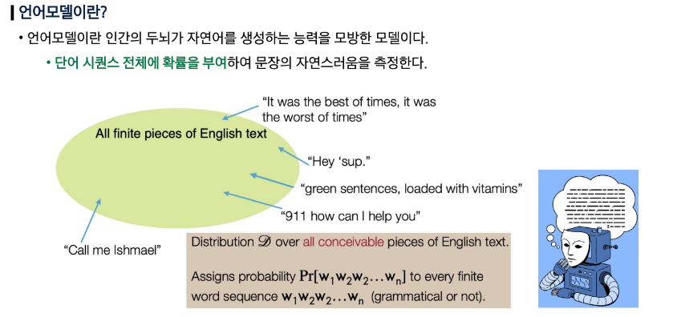
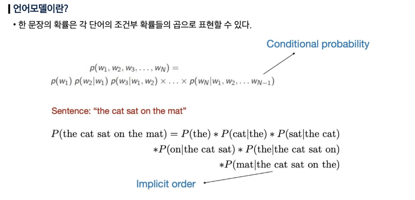
- P(the cat sat on the mat): the가 발생할 확률 * 캣이 나오고 더가 있을 확률 * sat이 있고 더캣이 있을 확률 * 온이 있고 더캣샛이 있을 확률 ....

- 핸드폰 / 구글만 봐도 모델의 크기의 따라 추천 가능 언어의 범위가 다름 -> 언어모델 탑재하고 있음

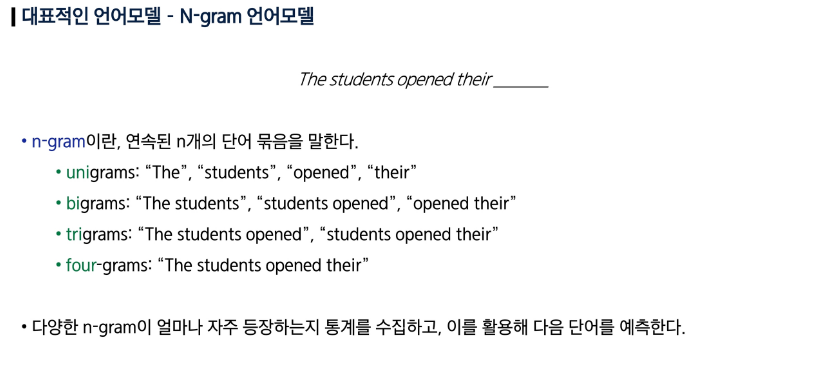
- uni: 1개 / bi: 2개/ tri: 3개 연결....
- 4 이상은 잘 쓰지 않음

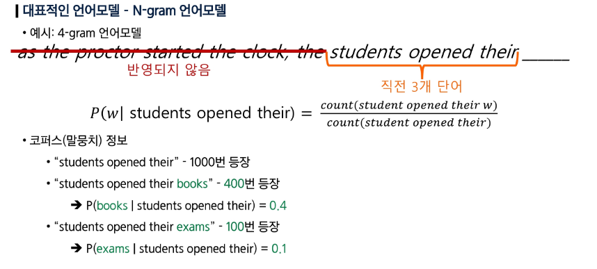

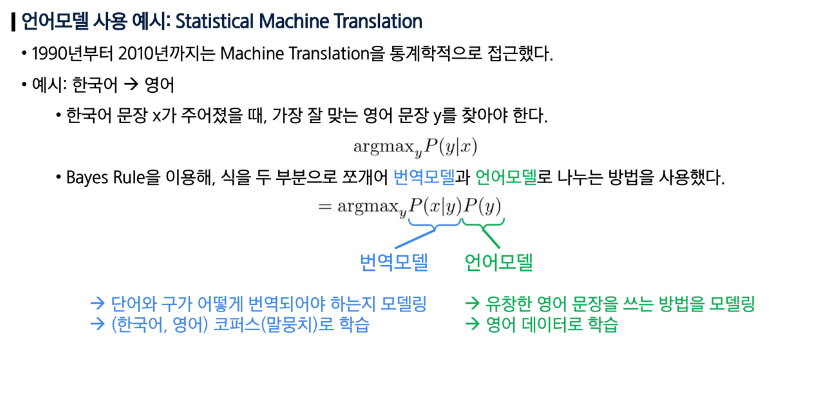
- 정답 y랑 차이를 구하는 것 -> 시행 착오를 통해 로스 구하고 업데이트하고 반복

> **언어모델 사용 예시: Statistical Machine Translation**

* 하지만, SMT에는 한계가 존재했다.
  * 구조적 복잡성
  * 많은 수작업
  * 언어 별 자원 구축 필요
  * **$\rightarrow$ 유지 및 확장에 어려움 존재**

* 이런 한계로 인해, 이후의 기계 번역 연구는 **Neural Machine Translation (NMT)**으로 넘어가게 되었다.

# 2.Seq2Seq

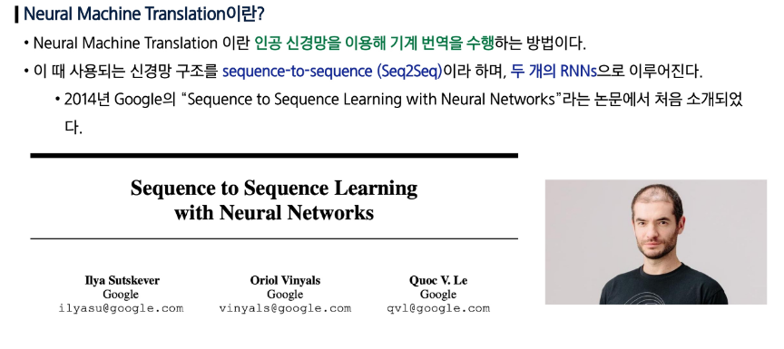
#언어모델 사용 예시: Statistical Machine Translation

* 하지만, SMT에는 한계가 존재했다.
  * 구조적 복잡성
  * 많은 수작업
  * 언어 별 자원 구축 필요
  * **$\rightarrow$ 유지 및 확장에 어려움 존재**

* 이런 한계로 인해, 이후의 기계 번역 연구는 **Neural Machine Translation (NMT)**으로 넘어가게 되었다.

> **Translation이 어려운 이유**
* 번역 문제는 입력과 출력의 길이가 다를 수 있다.
  * 영어: the black cat drank milk (5개의 단어)
  * 프랑스어: le chat noir a bu du lait (7개의 단어)
* $\rightarrow$ 따라서, NMT에서는 길이가 다른 시퀀스 간의 매핑을 처리할 수 있어야 한다.

> **Seq2Seq의 아이디어**
* 2개의 LSTM을 이용하자
  * 한 LSTM은 입력 시퀀스를 한 타임스텝씩 읽어 고정된 차원의 큰 벡터 표현을 얻기 (Encoder)
  * 다른 LSTM은 앞에서 얻은 벡터로부터 출력 시퀀스를 생성하기 (Decoder)

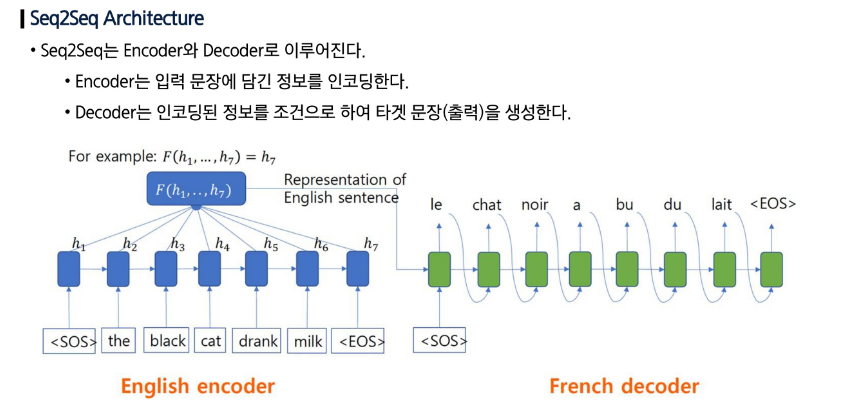

- 인코더는 영어가 들어왔을 때 벡터로 변환
- 디코더는 언어모델로 문장을 만들어냄

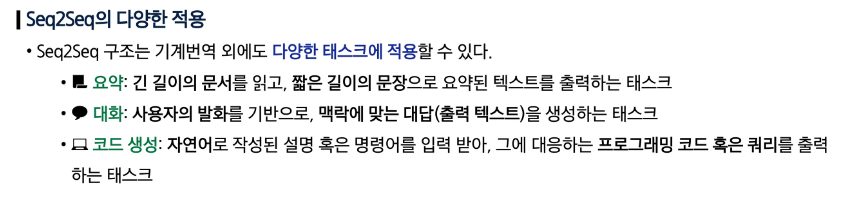
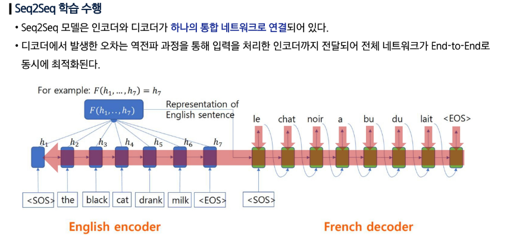
- 정답인 le의 예측 확률값만 보게 됨
- 학습값과 예측값을 인코더, 디코더를 통해 학습하고 로스값을 통해 재학습...?
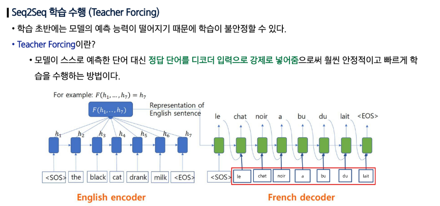
- 학습이 잘못됐을 경우 이후 연속적인 오류가 발생함
  - 이걸 해결하기 위해 정답 sos를 주고 le를 예측 (정답) -> le를 주고 chat를 예측 (정답) -> noir를 주고 a를 예측 반복 = 순차, 이를 teacher forcing 이라고 함

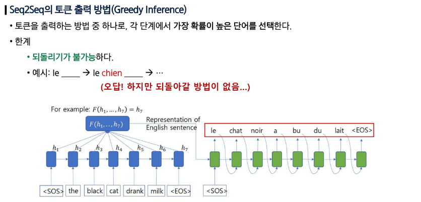
- inference는 한 번이라 되돌릴 수 없어서 과적합이나 오버피킹이 발생할 수 있음.
- 그래서 처음에는 teacher forcing으로 학습하고 후에 갈수록 모델이 예측한 값을 넣도록 할 수도 있음.
  
.png)
- 한 번의 후보가 아닌 여러 개의 후보를 본다
- 이미지는 k=2인 경우
  - le - chat 과 le -chien의 각 50만개의 경우를 고려하며 더 확률이 높은 단어를 추적하며 그 이후 단계를 앞의 단계와 같이 반복한다
  - 계속 k개의 후보를 유지하기 때문에 빔서치
  - k개를 1개로 두면 그리디 인퍼런스랑 같음

# 3. Attention 
- 트랜스포머를 이해하기 위해 중요한 개념
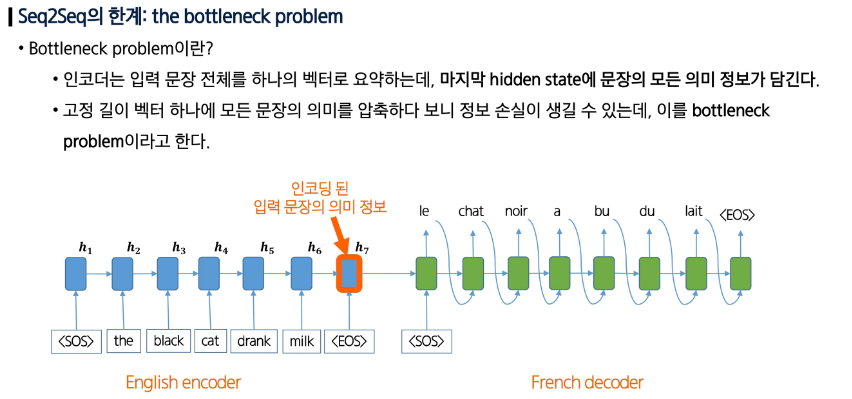
- rnn 대신 lstm을 쓸 수 있지만 차원이 고정된다는 점은 동일함 (한계)
- Attention: 내가 필요한 정보를 직접 검색해서 찾아보는 것

> **Attention의 인사이트**
* **Attention**은 디코더가 단어를 생성할 때, **인코더 전체 hidden state 중 필요한 부분을 직접 참조**할 수 있도록 한다.
* 즉, 매 타임스텝마다 “어떤 단어/구절에 집중할지”를 가중치로 계산해, bottleneck 문제를 완화했다.

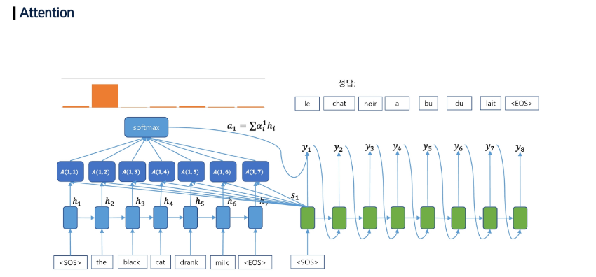

- 모든 벡터 단어와의 관계에 대한 히든 스테이트를 살펴봄
- 어텐션 스코어를 일반적으로 알파로 표현함 - 알파값으로 히든스테이트에 대한 가중치를 구함
- a1의 값을 s1에 넣어서 y1으로 변환하도록 디코더에 넣는 것이 어텐션?

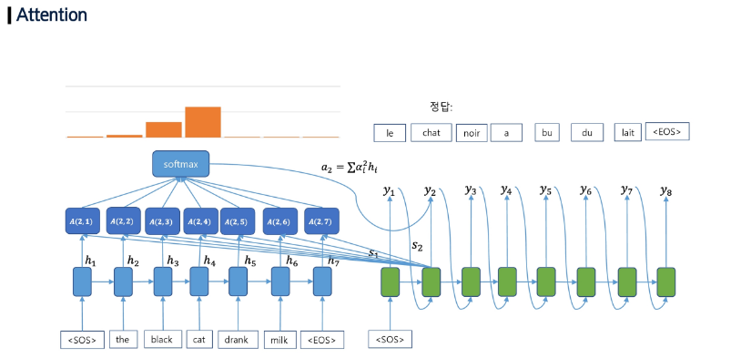

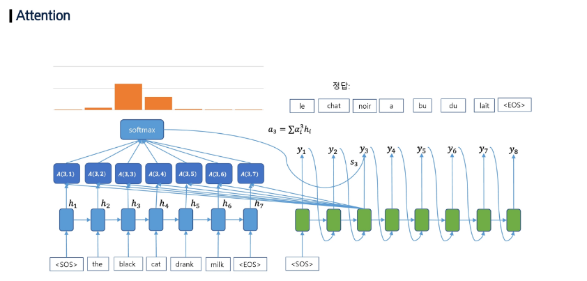
- 타임스탬프(h1~h7까지의 값)를 통해 전해온 값들은 과정이 반복될수록 해당 값이 희석되기 때문에 값을 직접적으로 검색해서 전달해주는 어텐션이 필요함
- f(a) 어떻게 score를 만들어 낼까?
  - 디코더 벡터와 인코더의 벡터를 곱해서 유사도를 구한 후 이를 가중치로 변경..?
  - a(2,l)은 h1에 대한 출력값인데 a(x, y)에서 x,y가 나타내는 의미와 어떻게 사용되는지?
  - 그러면 y1, y2... 각 y마다 늘 새로운 어텐션 a1, a2를 구하는가? 그렇다면 매번 새로운 h1~h7의 어텐션을 구하는 것인가?
 

> **Attention의 효과**
* Attention mechanism은 많은 장점이 존재한다.
  1. **NMT 성능 향상**
     * 디코더가 소스 문장 전체가 아닌, 필요한 부분에만 집중할 수 있기 때문이다.

  2. **Bottleneck Problem 해결** = 병목 제거
     * 디코더가 인코더의 모든 hidden states에 직접 접근할 수 있다.

  3. **Vanishing Gradient Problem 완화**
     * Attention은 멀리 떨어진 단어도 직접 연결할 수 있게 해준다.

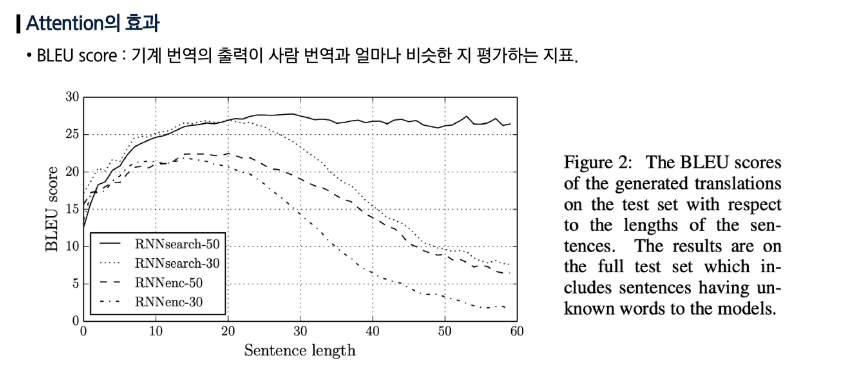
- 어텐션 쓴 모델(search~50)과 아닌 모델(enc~50) 비교
  - x: 번역하고자 하는 문장 길이
  - y: 번역 스코어
- 어텐션을 씀에도 불구하고 히든 벡터 스테이트가 줄어들면 성능 차이가 발생하긴 함
- 그럼에도 쓰지 않는 모델보다는 더 나은 성능을 보임. 그렇다고 50보다 100이 좋냐 그렇지도 않음. 적당한 히든스테이트가 필요

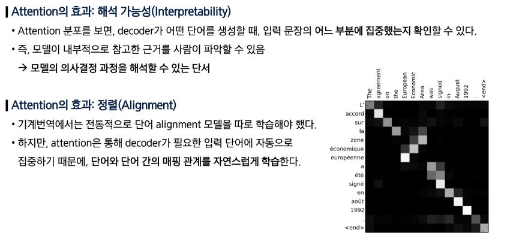
- 흰색: 1에 가까움 / 검정: 0에 가까움
- 모델 해석 가능성을 위해서도 어텐션 이용 가능

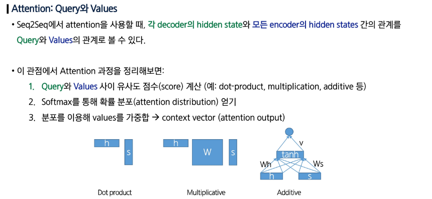
- multiplicative의 값은 : 스칼라
  - w: 매트릭스
  - 계산을 해야 하는 매트릭스가 있을 수도 있고 없을 수도 있음

- 히든 state로만 번역할 때는 해석하기 어려웠는데 어텐션은 실제 잘 번역되고 있는지 확인이 어느 정도 가능하다

------
#### 개인 질문
> **오개념 교정 (잘못 알고 계셨던 부분)**

> ❌ **잘못된 이해**: "로스값을 통해 재학습...?"

* ⭕ **올바른 개념**: Seq2Seq 학습 시, 인코더와 디코더는 별개로 학습되는 것이 아니라 **하나의 거대한 신경망처럼 연결되어 동시에 학습**됩니다. 디코더의 예측값과 정답($y$) 사이의 차이(Loss)를 구하고, 이 Loss를 기반으로 인코더와 디코더에 있는 **모든 가중치(Parameters)를 한꺼번에 업데이트**합니다.

> ❌ **잘못된 이해**: (Beam Search 이미지 설명 중) "le - chat 과 le -chien의 각 50만개의 경우를 고려..."

* ⭕ **올바른 개념**: 50만 개(단어 사전 크기)의 모든 경우를 다 그리는 것이 아닙니다. 빔 크기(k)가 2라면, 첫 단계에서 확률이 가장 높은 단어 **2개만** 남깁니다(예: 'le', 'un'). 그 다음 단계에서는 'le' 뒤에 올 50만 개, 'un' 뒤에 올 50만 개를 다 계산해보고, 그중 누적 확률이 가장 높은 **상위 2개의 문장 조합**('le chat', 'le chien')만 남기며 추적합니다.

> ❌ **잘못된 이해**: (N-gram) " uni: 1개 / bi: 2개/ tri: 3개 연결...."

* ⭕ **올바른 개념**: 단어들의 단순한 '연결' 개수가 아니라, "확률을 계산할 때 고려하는 직전 단어의 개수"를 뜻합니다. Bigram은 바로 전 단어 1개, Trigram은 전 전 단어까지 2개를 보고 현재 단어의 확률을 예측합니다.

---

> **Attention 동작 원리 FAQ (궁금하셨던 점)**

노트에 질문으로 남기셨던 **Attention의 수학적 표기와 동작 방식**에 대한 상세 설명입니다.

Q1. "a(2,l)은 h1에 대한 출력값인데... a(x, y)에서 x,y가 나타내는 의미와 어떻게 사용되는지?"

* **질문하신 표기($\alpha_{2,1}$)의 의미**:
* $\alpha_{i, j}$는 "디코더의 $i$번째 타임스텝에서, 인코더의 $j$번째 hidden state($h_j$)에 집중하는 정도(가중치)"를 의미합니다.
* 즉, $\alpha_{2,1}$은 **디코더가 두 번째 단어($y_2$)를 예측할 때, 인코더의 첫 번째 입력 단어 정보($h_1$)를 얼마나 참고할지** 나타내는 확률값($0\sim1$)입니다.

* **어떻게 사용되나요? (Context Vector 생성)**:
* 인코더의 모든 hidden state($h_1, h_2, \dots$)에 이 가중치($\alpha$)를 곱한 후 모두 더합니다. 이를 Context Vector($c_i$)라고 부르며, 해당 시점 디코더의 새로운 입력으로 사용됩니다.

$$c_2 = \alpha_{2,1}h_1 + \alpha_{2,2}h_2 + \alpha_{2,3}h_3 + \dots$$

*(즉, 노트에 쓰신 "a1의 값을 s1에 넣어서..."는, 정확히는 모든 인코더 스테이트의 가중합인 Context Vector를 디코더에 입력으로 넣는 과정입니다.)*

Q2. "매 y마다 늘 새로운 어텐션 a1, a2를 구하는가? 그렇다면 매번 새로운 h1~h7의 어텐션을 구하는 것인가?"

* **A. 네, 정확합니다.**
* 디코더가 새로운 단어를 예측할 때마다(매 타임스텝마다) 현재 디코더의 상태($s_i$)가 달라지므로, **인코더의 어느 부분에 집중해야 할지도 매번 달라집니다.**
* 예를 들어, 프랑스어 번역 문장의 첫 단어('le')를 만들 때의 어텐션 가중치 분포와 두 번째 단어('chat')를 만들 때의 분포는 완전히 새로 계산됩니다.

Q3. "디코더 벡터와 인코더의 벡터를 곱해서 유사도를 구한 후 이를 가중치로 변경..?"

* **A. 네, 그것이 Attention Score를 구하는 기본 아이디어입니다.**
* 디코더의 현재 상태 벡터($s_{i-1}$)와 인코더의 각 상태 벡터($h_j$) 사이의 유사도(Score)를 계산합니다.
* 이 Score값들에 **Softmax 함수**를 취해주면, 합이 1이 되는 확률값인 Attention Weight($\alpha$)로 변환됩니다.

Q4. "multiplicative의 값은 : 스칼라 / w: 매트릭스 ... 계산을 해야 하는 매트릭스가 있을 수도 있고 없을 수도 있음"

* **A. 네, 맞습니다.** Attention Score를 구하는 방식(f(a))은 여러 가지가 있습니다.
1. **Dot Product (점곱)**: 두 벡터를 그냥 내적합니다. ($s^T \cdot h$) - 별도의 파라미터($W$)가 없습니다.
2. **Multiplicative (General)**: 노트에 있는 것처럼 중간에 학습 가능한 행렬 $W$를 둡니다. ($s^T \cdot W \cdot h$) - $W$를 통해 두 벡터 사이의 관계를 더 복잡하게 학습할 수 있습니다.

* 최종 결과는 유사도를 나타내는 **스칼라(숫자 1개)** 값이 나옵니다.

# 📌 Transformer
> **학습 목표**
> Transformer의 등장 배경과 필요성을 설명할 수 있다.
> Self-Attention의 기본 개념과 동작 원리를 이해한다.
> Transformer의 전체 구조(인코더, 디코더 블록)를 설명할 수 있다.

# 0.학습 시작
> **Transformer란 무엇이며, 왜 필요한가?**
* RNN의 한계와 Attention의 필요성

> **Transformer는 어떻게 작동할까?**
* Self-Attention, Multi-Head Attention, Feed-Forward 구조 등

> **Transformer는 어떤 응용이 있을까?**
* 번역, 요약, 대화, 대형 언어모델의 기반

# 1.Self-Attention
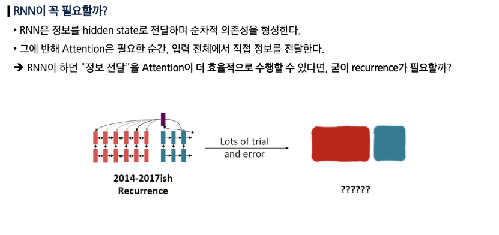
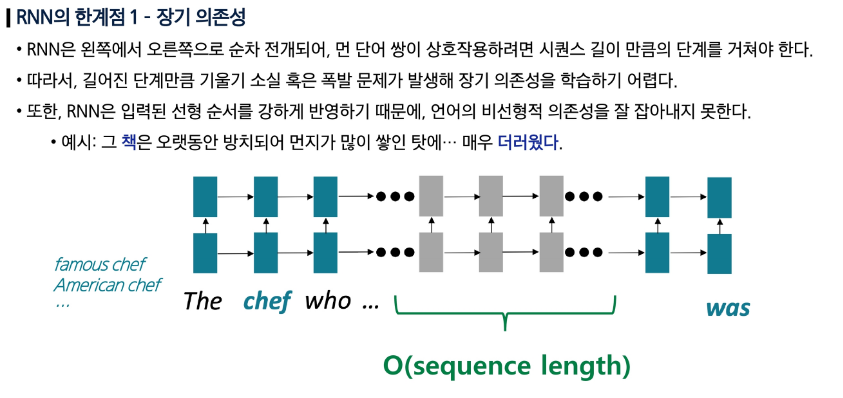
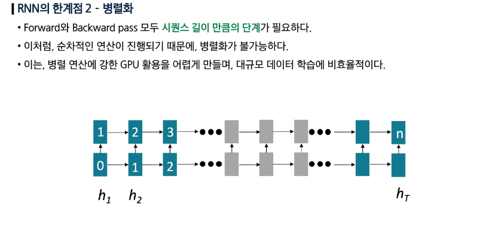

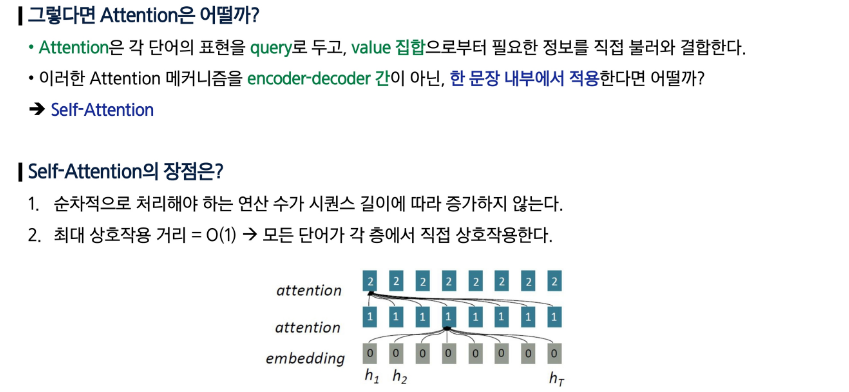
- 한 문장 내에서 어텐션이라고 해서 셀프어텐션이라고 함
    - rnn 아키텍처를 대처하는 어텐션
    - 이미지에서 보내는 숫자 1은 인코딩 되는 순서
      - 같은 숫자는 모두 똑같이 동시 인코딩
      - 시간 오래 걸리지 않고 희석되지 않음

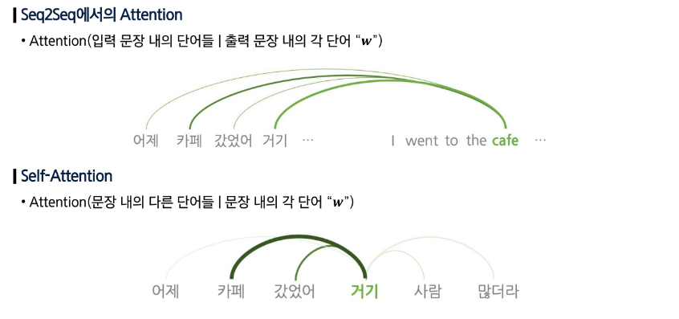
- 일반 어텐션은 어떤 인코더와 디코더의 어텐션이었는데 셀프어텐션은 인코더 혹은 디코던 내에서의 어텐션
- '거기'라는 단어가 있다면 거기라는 자기 자신을 포함해서 어텐션
- 모든 단어들의 어텐션을 업데이트하기 위해서 이와 같은 방식을 선택

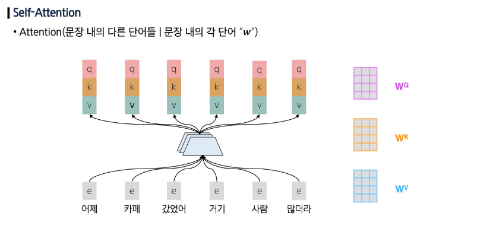
- wq, wk, wv : 학습 가능한 매트릭스

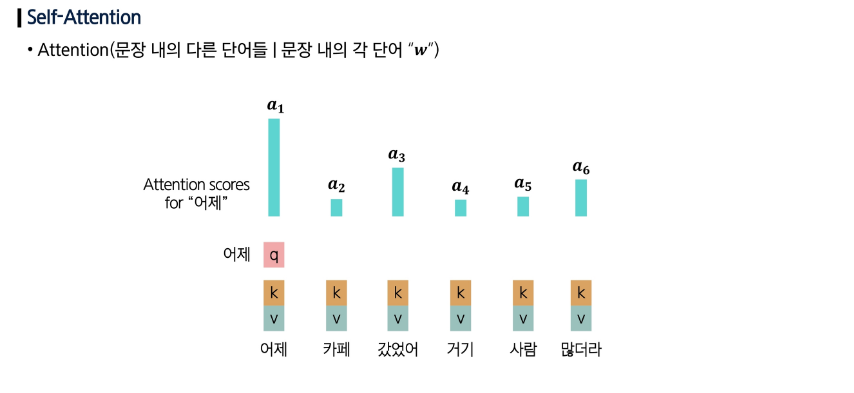

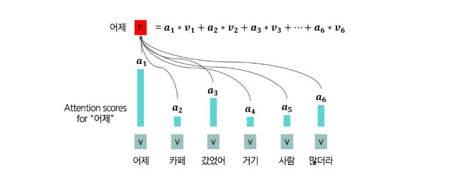
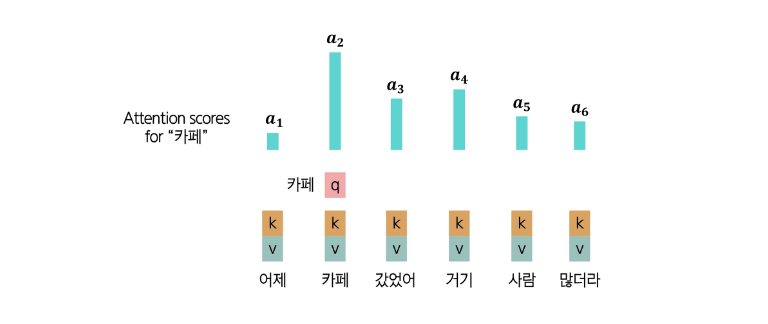
- 주어진 단어에 쿼리랑 키를 곱함 -> 어텐션 값을 구함 a

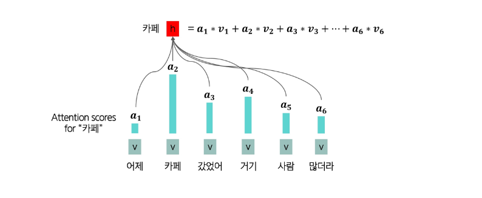
- a * v = (어텐션 * 가중치) 합 => h

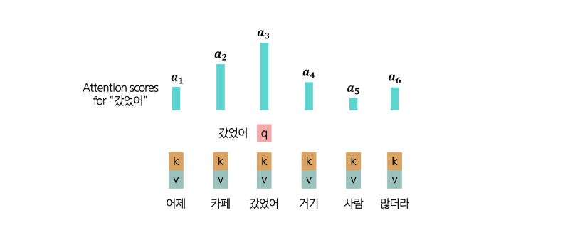
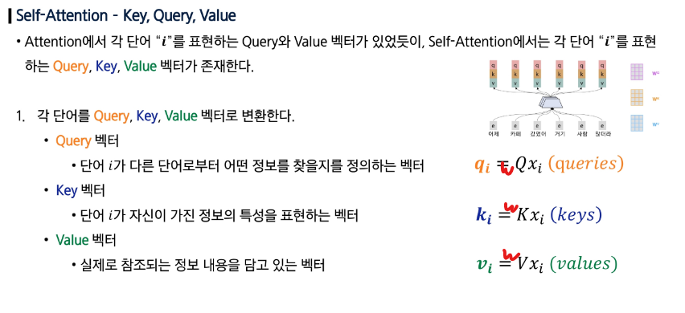
- 트랜스포머에서는 키, 쿼리, 밸류의 역할을 구분해서 학습을 함


> **Self-Attention의 한계**
* 이렇듯, Self-Attention은 단어 간 관계를 효율적으로 잡아내는 강력한 메커니즘이지만, 한계가 존재한다.
* **한계**
  1. **순서 정보 부재** $\rightarrow$ 단어 간 유사도만 계산하기 때문에, 단어의 순서를 고려하지 않는다.

  2. **비선형성 부족** $\rightarrow$ Attention 계산은 본질적으로 가중 평균 연산이라는 선형 결합에 불과하기 때문에, 복잡한 패턴이나 깊은 표현력을 담기 어렵다.   
    - 셀프어텐션을 연이어 한다고 해도 한 번을 한 것과 같은 동일한 값을 출력함. 딥러닝이 강조하는 비선형이 없다고 볼 수 있음.

  3. **미래 참조 문제** $\rightarrow$ 언어 모델은 시퀀스를 왼쪽에서 오른쪽으로 생성해야 하지만, Self-Attention은 모든 단어를 동시에 보기 때문에, 아직 생성되지 않아야 할 미래 단어를 참조한다.


- 두 가지 방법에 대한 자세한 설명....

- FF: Feed-Forword
- 512 차원이 있다면 1024차원으로 만들고 비선형성 추가 -> 다시 512차원으로 변경
- ​​핵심은 선형적인 결합에 non-linear activation function의 비선형성을 추가해준다는 것

- 왜 미래 단어에 해당하는 항목에 무한대를 넣는가?
- 더 깊은 layer로 갈 수록 더 복잡한 표현을 이끌어내기 위해 서로 다른 matrix를 이용한다고 생각하시면 됩니다.


# 2.Transformer
- self-attention -> 셀프어텐션의 병목 -> 셀프어텐션의 한계 해결 기술 -> Transformer


- 이제는 정말 많은 20만개 이상의 단어를 넣을 수 있기 때문에 단어 하나에 가중치가 더하지 않는다


- 각 쿼리 차원은 64를 권장함-> *8 하면 512가 되기 위해... 왜? 굳이..?
  

- 차원이 커질수록 더한 값이 커짐
- 일반적으로 한개의 단어가 아닌 multi의 단어가 있는데 512개에서 가중치를 모두 다르게 하기 위해 어텐션 값이 극단적으로 0과 1 혹은 1/n이 되기를 원하지 않음
- 그래서, 값을 조정함으로써 적당한 값으로 변환
  - d =512 / n = 8 -> 루트(64) -> 8  = 차원에 대해서 루트값을 씌운 것으로 차원을 안정되게 하기 위함


- pi= 포지션 ,xi...? xy...?, oi...?
- 모듈마다 희석되지 않고 더해짐 = residual connecition이 의미가 있음


- 첫번째 어턴션은 각 인코더, 디코더의 multi-head attention
  - 인코더: 영어/ 디코더: 프랑스어
- 이미지에서 빨간 네모 박스가 두번째 어텐션임
  - cross attention의 과정 이해하기ㅜㅜ
  - 키는 영어 쿼리는 프랑스어일 때 이때 통과되는 값은 영어 => 영어와 프랑스어를 concat으로 더함 = 두 정보를 더함
  - 벡터는 어떤 공간에서의 표현. 방향성 0 -> 벡터의 정보가 더해진다고 해서 이전의 방향성을 가진 벡터가 사라진 것이 아닌 정보가 더해진 새로운 벡터가 생긴 것.


>트랜스포머를 써야 하는 이유 ??
- rnn: 시간이 오래 걸리고 파라미터를 설계해야 함
- transformer: 동시성, 똑같은 모듈 반복됨


- 트랜스포머는 번역에 최적화됨. 


- 어텐션의 활용에 따른 rnn, cnn, nlp, transformer 설명 및 신경망과의 관계는 뭘까? (신경망과 관계가 없다면 없음으로 표현)

# 📌 사전 학습 기반 언어 모델
- 인코더 구조만 쓰거나 디코더 구조만 쓰거나 할 수 있음

>**학습 목표**
> - 사전학습(Pretraining)의 개념과 필요성을 설명할 수 있다.
> - Encoder 기반 모델(예: BERT)의 구조와 주요 활용 사례를 이해한다.
> -Encoder-Decoder 기반 모델(예: T5)의 특징과 응용 분야를 설명할 수 있다.
> - Decoder 기반 모델(예: GPT)의 구조와 강점을 이해한다.
> - In-Context Learning (ICL)이 등장하게 된 배경과 그 의미를 설명할 수 있다.
> - ICL 능력을 끌어 올리기 위한 대표적인 prompting 기법 (CoT, Zero-shot CoT)을 이해한다.

# 0. 학습 시작

> **사전학습(Pretraining)이란 무엇인가? 왜 중요한가?**
* 대규모 데이터 기반의 사전학습 개념과 필요성

> **대표적 모델 유형은 어떻게 구분되는가?**
* Encoder 기반, Encoder-Decoder 기반, Decoder 기반

> **각각 어떤 모델이 존재하는가?**
* BERT, T5, GPT 등 주요 모델 소개

> **In-Context Learning과 발전된 prompting 기법은 무엇인가?**
* ICL의 등장 배경과 의미
* Chain-of-Thought, Zero-shot CoT 등 대표 기법

# 1. 사전학습이란?
> **사전학습이란?**
* 사전학습이란 대규모 데이터 셋을 이용해, 모델이 데이터의 일반적인 특징과 표현을 학습하도록 하는 과정이다.
* 특히 언어 모델은, 인터넷의 방대한 텍스트(웹 문서, 책, 뉴스 등)을 활용해 비지도학습 방식으로 학습되어, 일반적인 언어 패턴, 지식, 문맥 이해 능력을 습득한다.
  


# 2.Encoder 모델


- web에서 정말 많은 대용량 데이터를 가져와도 이미 정답을 가져온 것과 마찬가지이기 때문에 ㄱㅊ


- 요즘에 잘 안 쓰는 방식
  


- 개체 여부를 BIO 태그로 구분함
  - 개체가 아닌 경우: O


- 파인튜닝만 했더니~


# 3.Encoder-Decoder 모델


- 텍스트로 구성된 모든 문제를 해결하도록 하자 문제를 구분할 수 있는 prefix를 달아서 어떤 문제인지만 구분하도록 하자. 
  - prefix 발전 -> 인프런...?
  - prefix: cola sentence, stsb sentence, translate english to german, summarize


# 4. Decoder 모델


# 5.In-Context Learning


- 디코더는 다음 단어를 만들기에 최적화됨
- 중요: rnn, transformer, gpt in-context learning

#### 개인 정리
 1. ⚠️ 오개념 교정 & 핵심 보완

- BERT의 학습 방식 (MLM & NSP)

* ❌ **잘못 파악하기 쉬운 점**: "NSP(Next Sentence Prediction)는 요즘 잘 안 쓰는 방식이다."
* ⭕ **핵심 정리**:
* **MLM (Masked Language Model)**: 문장 중간의 단어를 `<MASK>` 처리하고 맞추는 대표적 **양방향(Bi-directional)** 사전 학습 방식입니다.
* **NSP (Next Sentence Prediction)**: 두 문장이 이어지는 문장인지 패러그래프 수준에서 맞추는 task입니다. 노트에 적어두신 것처럼 **RoBERTa 등 후속 연구에서 NSP 효과가 미비하거나 오히려 성능을 떨어뜨린다는 것이 밝혀져 최근 인코더 모델 학습 시에는 NSP를 제거하거나 다른 Task(SOP 등)로 대체**하는 추세입니다.

- T5 (Encoder-Decoder)의 Prefix 개념

* ❌ **잘못 파악하기 쉬운 점**: "Prefix 발전 $\rightarrow$ 인프런...?"
* ⭕ **핵심 정리**:
* T5는 모든 자연어 처리 문제를 **"Text-to-Text"** 프레임워크로 통합했습니다.
* 입력을 줄 때 문장 앞에 `Translate English to German:`, `Summarize:` 같은 Prefix(프리픽스/접두사)를 붙여서 모델이 어떤 Task를 수행해야 하는지 지시합니다.
* 이 아이디어는 이후 파인튜닝 없이 프롬프트만으로 지시를 수행하는 **Prompting / Instruction Tuning / In-Context Learning** 개념의 중요한 발판이 되었습니다.

- BIO 태깅 (개체명 인식, NER)

* ⭕ **핵심 정리**:
* **B (Begin)**: 개체명(Entity)이 시작하는 토큰
* **I (Inside)**: 개체명 내부/연속되는 토큰
* **O (Outside)**: 개체명이 아닌 일반 토큰 (노트에 잘 정리하셨습니다!)

💡 대표 모델 계열별 핵심 요약 (BERT vs T5 vs GPT)

| 구분 | **Encoder 기반 (예: BERT)** | **Encoder-Decoder 기반 (예: T5)** | **Decoder 기반 (예: GPT)** |
| --- | --- | --- | --- |
| **주요 특징** | 양방향(Bi-directional) 문맥 참조 | 입력을 읽는 인코더 + 생성하는 디코더 | 단방향(Causal / Auto-regressive) 생성 |
| **주요 목적** | **문장 이해 및 분류** (NLU) | **복합 변환 Task** (번역, 요약 등) | **자연어 생성** (NLG, 대화, 창작) |
| **대표 모델** | BERT, RoBERTa, ELECTRA | T5, BART | GPT-1, 2, 3, 4, LLaMA |
| **학습/사용 방식** | 주로 다운스트림 태스크에 **Fine-tuning** | Text-to-Text 형태의 Fine-tuning | **In-Context Learning (Prompting)** |

❓ In-Context Learning & Prompting 기법 FAQ

Q1. In-Context Learning(ICL)이란 무엇이고, Fine-tuning과 어떻게 다른가요?

* **A.**
* **Fine-tuning (미세조정)**: 새로운 데이터셋으로 모델의 **가중치(Weight)를 직접 업데이트**합니다.
* **In-Context Learning**: 가중치를 전혀 업데이트하지 않고, **입력 프롬프트(Context) 안에 예시(Few-shot)나 지시문만 제공**하여 모델이 그 자리에서 패턴을 이해하고 정답을 생성하도록 만드는 기법입니다. (GPT-3에서 본격 도입)

Q2. Shot의 종류 (Zero-shot, One-shot, Few-shot) 구분

* **Zero-shot**: 예시를 전혀 주지 않고 지시문만 제공 (예: "다음 문장을 감정분석해줘: 오늘 기분이 좋다.")
* **One-shot**: 정답 예시 1개 제공
* **Few-shot**: 정답 예시 2~3개 이상 제공

Q3. Chain-of-Thought (CoT)와 Zero-shot CoT는 왜 효과적인가요?

* **CoT (Chain-of-Thought)**:
* 단순히 "질문 $\rightarrow$ 정답" 예시만 주는 것이 아니라, "질문 $\rightarrow$ 중간 추론 과정 $\rightarrow$ 정답"의 형태로 예시를 줍니다.
* 복잡한 산수나 논리 추론 문제에서 모델이 단계별로 생각하게 만들어 정답률을 획기적으로 올려줍니다.

* **Zero-shot CoT**:
* 예시를 작성하기 귀찮을 때, 질문 끝에 "Let's think step by step (단계별로 천천히 생각해 보자)"라는 문구만 붙여주는 기법입니다.
* 이 한 마디만으로도 디코더 모델이 중간 추론 과정을 스스로 만들어내며 정답률이 대폭 상승합니다.