# 자연어처리 및 텍스트 파운데이션 ("거대 언어 모델")
> ** 학습 목표**
- 텍스트 파운데이션 모델(거대 언어 모델)이 무엇인지 이해합니다.
- 거대 언어 모델의 학습 및 추론 방식을 이해합니다.
- 거대 언어 모델의 응용 및 한계를 파악하고, 실습을 통해 실제 사례를 적용해봅니다.

# 📌 0. 파운데이션 모델
## 0. 학습 시작
이미지 속 텍스트를 깔끔한 마크다운 문서로 변환했습니다.

> **파운데이션 모델이란?**

* 대량의 데이터를 기반으로 사전 학습된 대규모 AI 모델
* 다양한 작업에 범용적으로 활용할 수 있는 기초(foundation) 역할을 함

> **We will learn: 파운데이션 모델의 주요 특징**

* 기존 AI 모델과의 차이점
* 3가지 핵심 구성요소

> **We will learn: 텍스트 파운데이션 모델 (거대 언어 모델)**

* 거대 언어 모델의 특징
* 대표적인 예시
    - 텍스트 생성(chatGPT), 비디오 생성(SORA)
    - 멀티모달 입력을 통해 멀티모달 출력 (gpt-4o)
        - 멀티모달: 이미지, 비디오, 오디오, 텍스트

<br>

### 0-1. 파운데이션 모델
> **파운데이션 모델 이전**
- 새로운 데스크를 해결하려면 해당 데스크에 대한 "별도의 학습" 필요

> **파운데이션 모델**
- 새로운 데스크를 해결하려면 "자세한 설명(프롬프트)"를 입력해주는 것으로 충분
    - chat GPT: 텍스트 파운데이션 모델 (a.k.a 거대 언어 모델)


> **파운데이션 모델의 3가지 구성요소**
- (1) 빅데이터: 인터넷에 존재하는 데이터 수가 기하급수적으로 증가
    - 딥러닝 기반 AI 모델은 학습 데이터가 늘어날 수록 성능이 증가
- (2) 자가학습(Self-supervised Learning) 알고리즘: 사람이 정답을 알려줄 필요 없음
    - 예시: 다음 토큰 예측(next token prediction)을 통한 텍스트 파운데이션 모델 (거대 언어 모델) 학습

    - (인터넷에서 데이터 추출) -> "아까 밥 먹고 왔어" -> (학습 데이터 생성) -> 입력: 아까 밥 먹고/ 정답: 왔어
        - 왔어는 여러 단어 목록 중 확률이 가장 높은 단어 선택된 것임

- (3) 어텐션(Attention) 기반 트랜스포머 (Transformer) 모델
- 더 많은 데이터를 보다 잘 학습하고 이해할 수 있는 신공신경망 구조
    - 어텐션: 입력 데이터에서 중요한 부분에 주의를 집중하는 메커니즘
    - 트랜스포머: 어텐션 메커니즘을 기반으로 한 신경망 구조


# 📌 1. 텍스트 파운데이션 모델 살펴보기
## 1-1. 텍스트 파운데이션 모델이란?
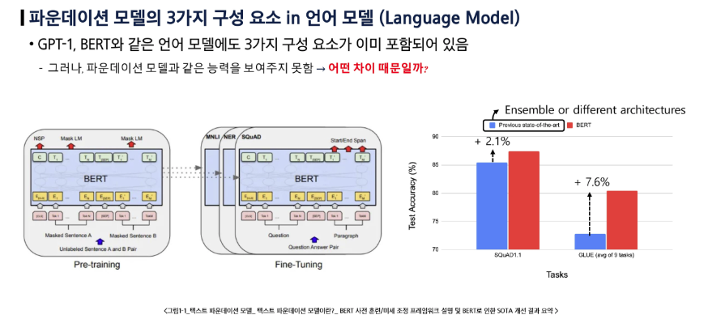
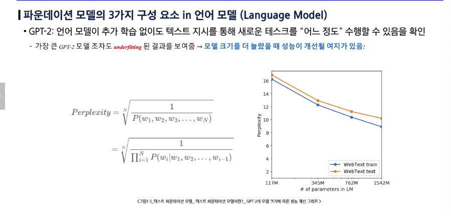
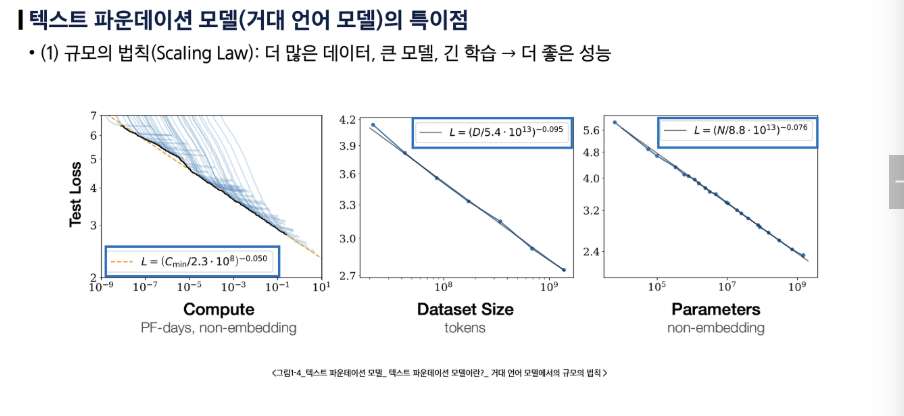
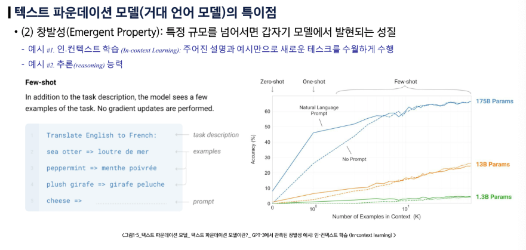

## 1-2. 거대 언에 모델 예시
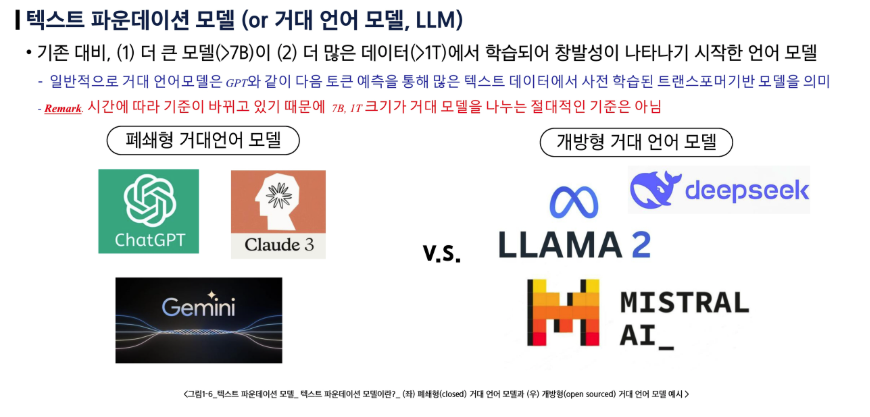

### 폐쇄형 (Closed) 거대 언어 모델
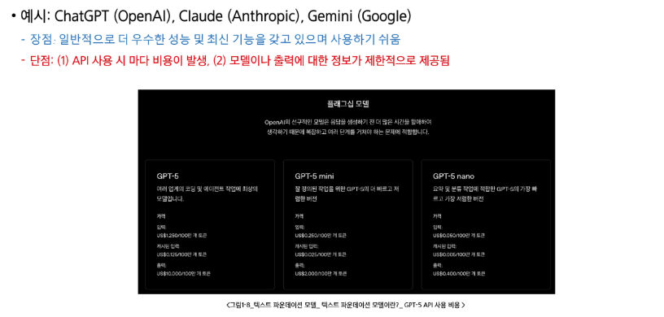
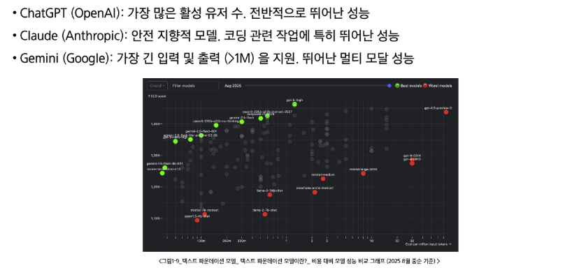

### 개방형 (Open sourced) 거대 언어 모델
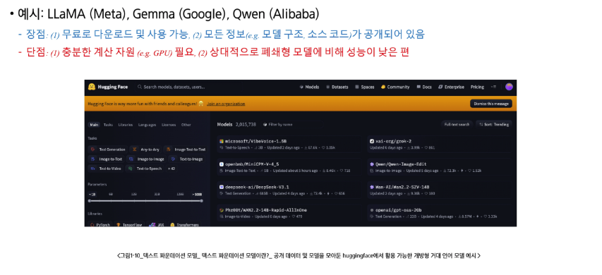

# 📌 2. 거대 언어 모델의 학습
### GPT-3: "거대 언어 모델의 시초"
* 가장 큰 버전의 GPT-3: 1750억 개의 매개변수 $\rightarrow$ 이전 언어 모델 대비 최소 10배 이상 큰 모델
* 본격적으로 인-컨텍스트 학습(in-context learning) 능력이 나타나기 시작한 언어 모델
* 학습 방법: 다음 토큰 예측 (Next token prediction)
* 학습 데이터: 3000억 토큰 (4TB 텍스트 데이터 = 인터넷 + 양질의 텍스트북)
* 학습 비용: 150억원 정도로 추산

### 다음 토큰 예측 기반 거대 언어 모델의 한계
- 사람의 지시에 대해 올바르지 않은 응답을 생성하거나, 유해한 응답을 생성할 수도 있음 

### 정렬 (Alignment) 학습: 거대 언어 모델의 출력이 사용자의 의도와 가치를 반영하도록 하는 것
* (1) 지시 학습 (instruction tuning): 주어진 지시에 대해 어떤 응답이 생성되어야 하는지
* (2) 선호 학습 (preference learning): 상대적으로 어떤 응답이 더 선호되어야 하는지: 주어진 지시에 대해 **어떤 응답이 생성** 되어야 하는지
* (2) 선호 학습 (preference learning): 상대적으로 어떤 **응답이 더 선호** 되어야 하는지

## 2-1.지시 학습 (Instruction Tuning)
### 지시 학습: 주어진 지시에 대해 어떤 응답이 생성되어야 하는지

* 학습 방법 자체는 기존 언어 모델 (e.g. BERT)에서의 지도 추가 학습 (supervised fine-tuning, SFT)과 동일
* **Remark.** 기존 언어 모델은 각 테스크 (e.g. 감정 분석) 마다 **별도의 지도 추가 학습 및 모델을 저장**

```
[입력] 
"전체적으로, 두 시간 동안 영화를 보는 것에서 얻은 가치는 팝콘과 음료의 합계였습니다. 영화는 정말 끔찍했습니다." 
  └──> [지도 추가 학습된 언어 모델 (BERT Fine-Tuning)] 
         └──> [출력] 0 (부정적)

```
<br>

* **Idea:** 모든 자연어 테스크는 텍스트 기반 지시(instruction)와 응답으로 표현할 수 있지 않을까?
* 예시 #1. 감정 분석: “주어진 리뷰 속 유저의 감정이 긍정적이야, 부정적이야?”
* 예시 #2. 번역: “주어진 문장을 영어로 번역해줘.”


```
[지시 + 입력]
지시: 주어진 리뷰 속 유저의 감정이 긍정적이야, 부정적이야?
리뷰: 전체적으로, 두 시간 동안 영화를 보는 것에서 얻은 가치는 팝콘과 음료의 합계였습니다. 영화는 정말 끔찍했습니다.
  └──> [언어 모델] 
         └──> [출력] "부정적으로 보입니다."
```

### 지시 학습: 거대 언어 모델을 다양한 지시 기반 입력과 이에 대한 응답으로 지도 추가 학습 (FLAN)
- 학습 방법: 주어진 입력을 받아서 이에 대한 응답을 따라 하도록 지도 추가 학습 (Supervised Fine-Tuning, SFT)
- 학습 데이터의 다양성 증대를 위해, 각 데스크를 다양한 지시(템플릿)로 표현할 수 있음

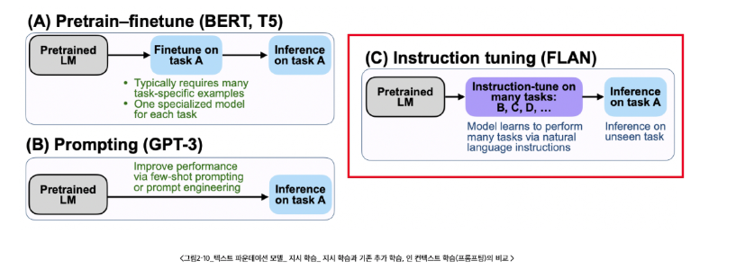
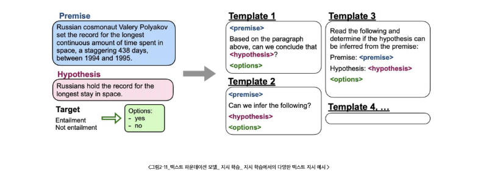
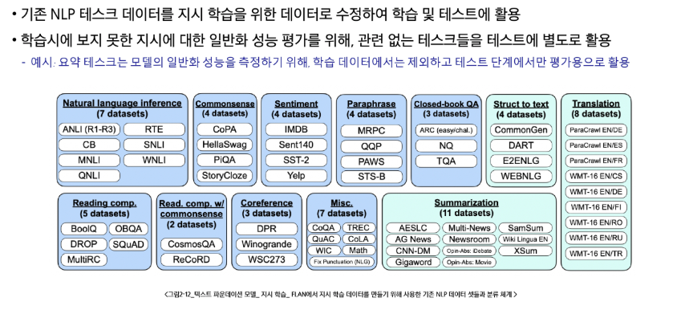
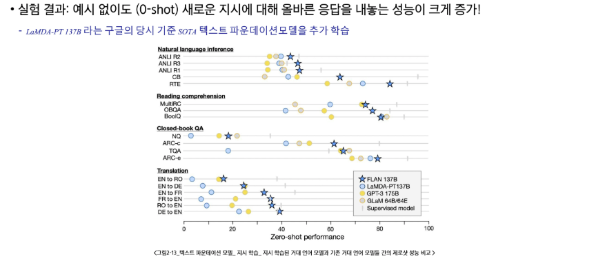


### 지시 학습: 파운데이션 모델을 다양한 지시 기반 입력과 이에 대한 응답으로 지도 추가 학습 (FLAN or TO)
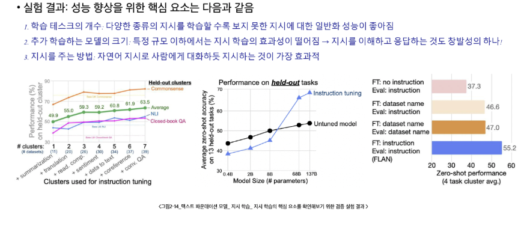
<br>

## 2-2. 선호 학습 (Preference Learning)
### 지시 학습의 한계: 주어진 입력에 대해 적절한 하나의 응답이 있다고 가정
- 이는 정답이 정해져 잇는 객관적 테스크 (e.g. 수학) 에서는 자연스러움
    ```
    Question: 양의 정수 $m$과 $n$의 최대공약수는 6이고, 최소공배수는 126이다. 
        이때 $m + n$의 가능한 최솟값은 얼마인가?
    Answer: 60
    ```
<br>

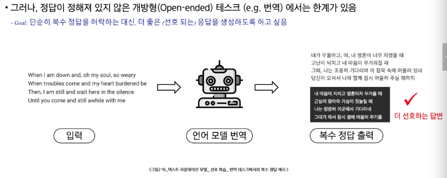

### 선호 학습: 다양한 응답 중 사람이 더 선호하는 응답을 생성하도록 추가학습
- 다양한 응답은 모델이 생성, 응답간의 선호도는 사람이 제공
    - 예: 주어진 모델 생성 응답 (A, B, C, D) -> 사람 주석 선호도 (D > C > A = B)
- ChatGPT를 만들기 위한 핵심 알고리즘!
    - 공식 문서에 공개되어 있진 않지만, 아래와 같은 힌트가 공식 블로그에 저장되어 있음

- InstructGPT의 핵심 아이디어:
    - 사람의 피드백을 통한 강화학습 (Reinforcement Learning from Human Feedback, RLHF)
    - 사람의 피드백 = 응답에 대한 선호도

### InstructGPT 학습 방법: Step 1. 지시 학습을 통한 텍스트 파운데이션모델(e.g. GPT-3)의 추가 학습
- 실제 유저로부터 다양한 지시 입력을 수집하고, 해당 입력에 대해 훈련된 사람 주석자들이 정답 데이터를 생성

### InstructGPT 학습 방법: Step 2. 사람의 선호 데이터를 수집하여, 보상 모델 (Reward model, RM)을 학습
- 주어진 입력에 대한 선택지는 모델이 생성, 다양한 선택지에 대한 선호도는 사람이 생성
- 사람과 일치한 선호도를 출력할 수 있도록 보상 모델을 지도 학습
    - 사람이 선호하는 응답이 입력으로 주어짐 -> 높은 보상을 출력
<br>

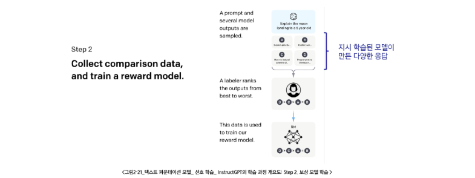
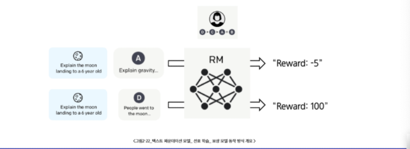

### InstructGPT 학습 방법: Step 3. 보상이 높은 응답을 생성하도록 강화 학습을 통해 추가 학습
- 핵심: Step 1&2에서 보지 못한 질무에 대해 사람의 추가적인 개입 없이 학습된 모델들을 통해 추가 학습이 진행
- 지시 학습된 모델을 보상 모델 기반 강화 학습을 통해 한번 더 추가 학습
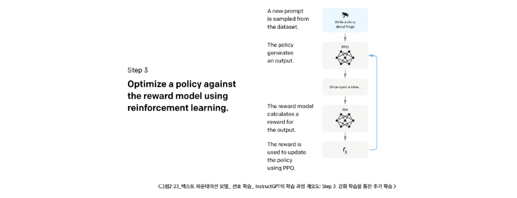

### InstructGPT의 결과: 유저의 지시를 얼마나 잘 수행하는 지를 사람이 직접 평가
- 단순 프롬프팅이나 지시 학습에 비해 발전된 지시 수행능력을 보여줌
- 모델 크기가 커질수록(1.5B -> 6B -> 175B) 동일한 방법에서도 전반적인 지시 수행 능력이 꾸준히 향상됨
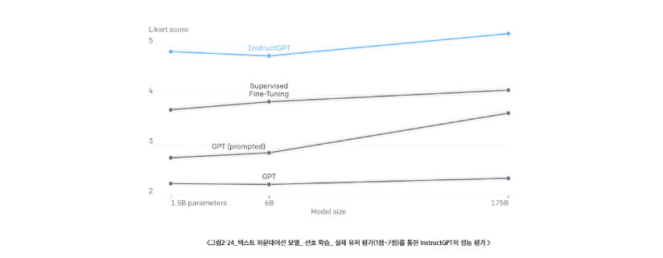

### InstructGPT의 결과: 얼마나 안전한 응답을 생성하는지 평가
- 기존 대비, InstructGPT는 해로운 응답 (RealToxicity)과 거짓말(TruthfulQA, Hallucinations)을 덜 생성
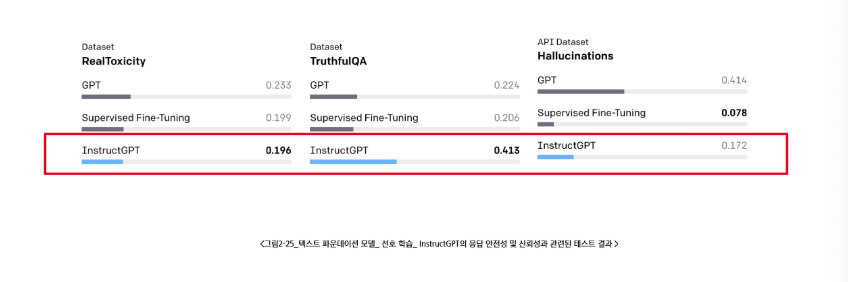

### LLaMA2
- InstructGPT와 비슷하게 RLHF와 대화 데이터를 활용한 LLaMA2 Chat 모델을 공개
    - LLaMA1 때에는 사전 학습된 모델만 공개
- 당시 대화형 타입 개방형 거대 언어 모델 중 가장 우수한 성능을 보여줌
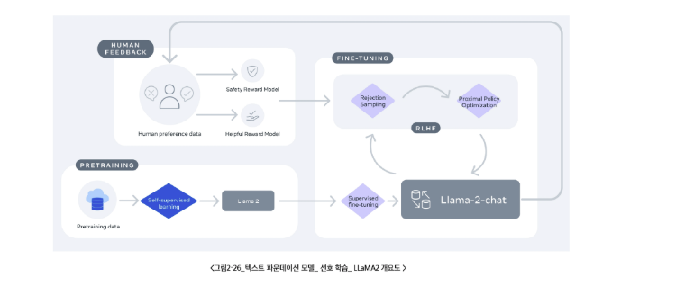

# 📌 3. 거대 언어 모델의 평가와 응용
## 3-1. 디코딩 (Decoding) 알고리즘
### 거대 언어 모델의 자동회귀 생성 (Auto-regressive Generation)
- 학습이 완료된 거대 언어 모델은 어떻게 응답을 생성할까? => 순차적 추론을 통한 "토큰별 생성"
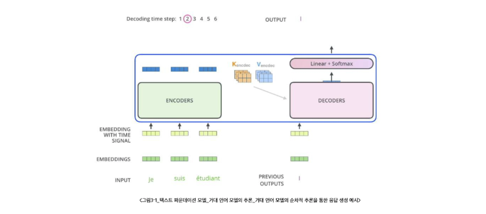
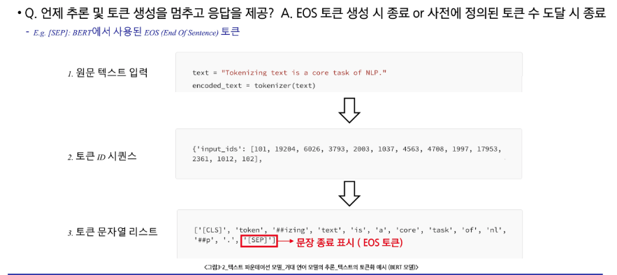
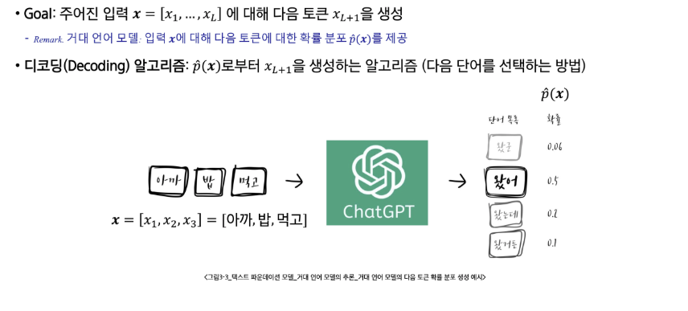

- Pytorch 실제 예시
    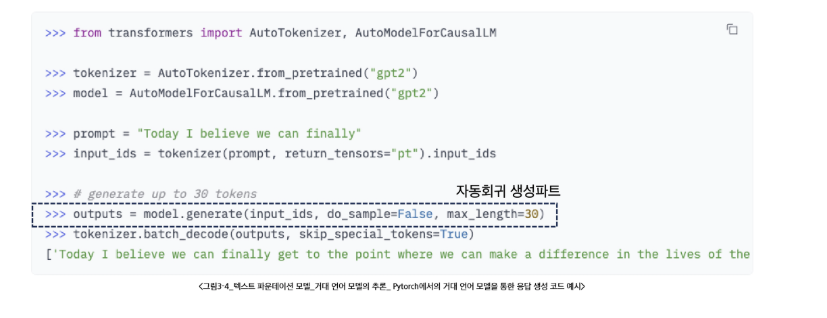
    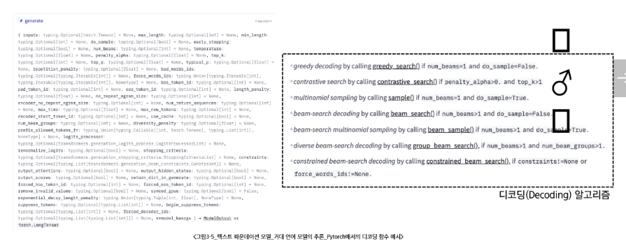

### 디코딩 알고리즘: ① Greedy Decoding
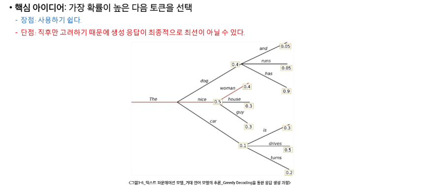

### 디코딩 알고리즘: ② Beam Search
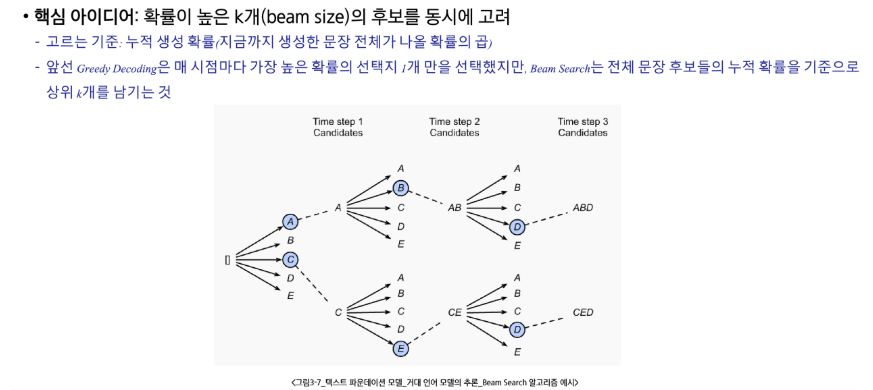
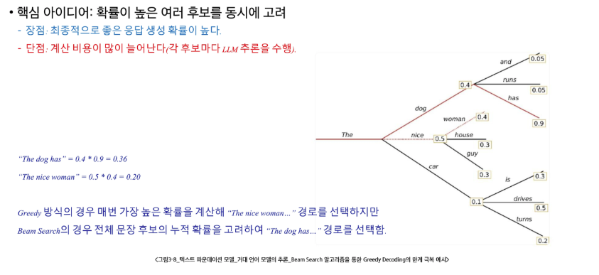

### 디코딩 알고리즘: ③ Sampling
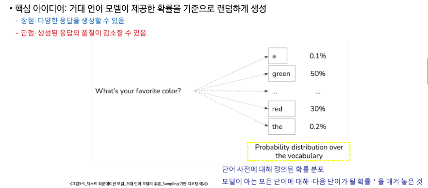

### 디코딩 알고리즘: ④ Sampling "with Temperature"
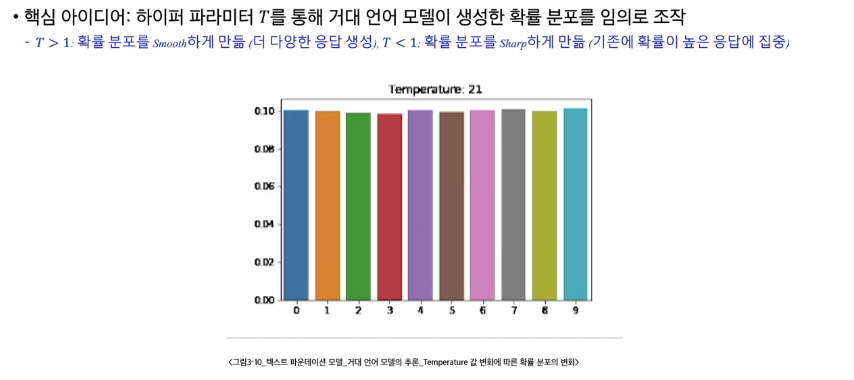
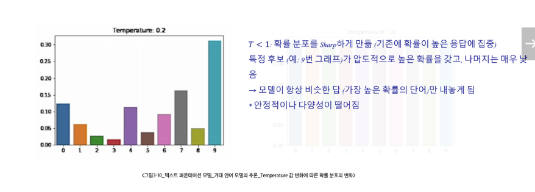
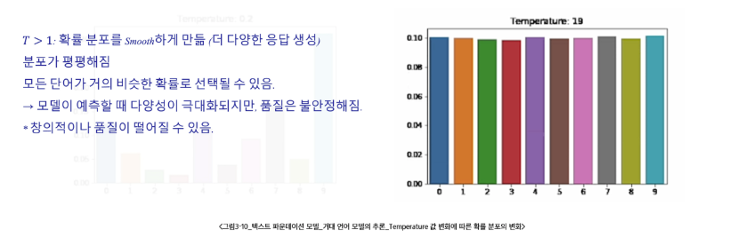

### 디코딩 알고리즘: ⑤ Top-K Sampling
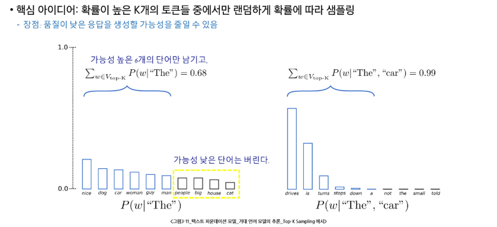

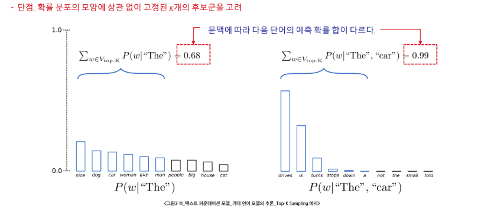

### 디코딩 알고리즘: ⑥ Top-P Sampling (or Nucleus Sampling)
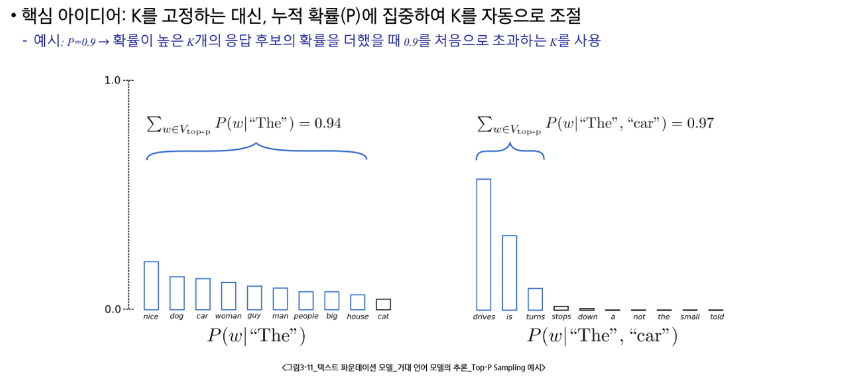
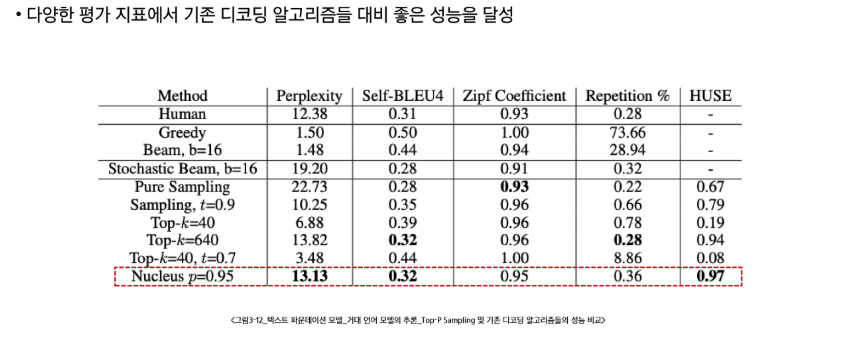

### 디코딩 알고리즘 별 장단점 요약
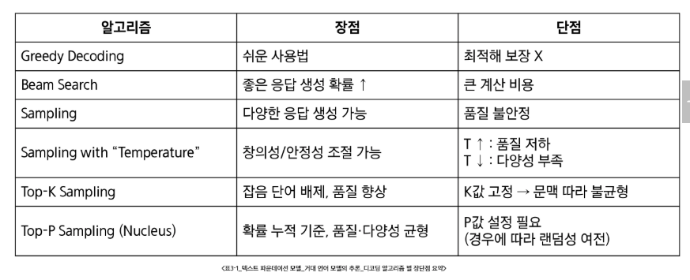

### 디코딩 알고리즘: 실제 예시 with ChatGPT
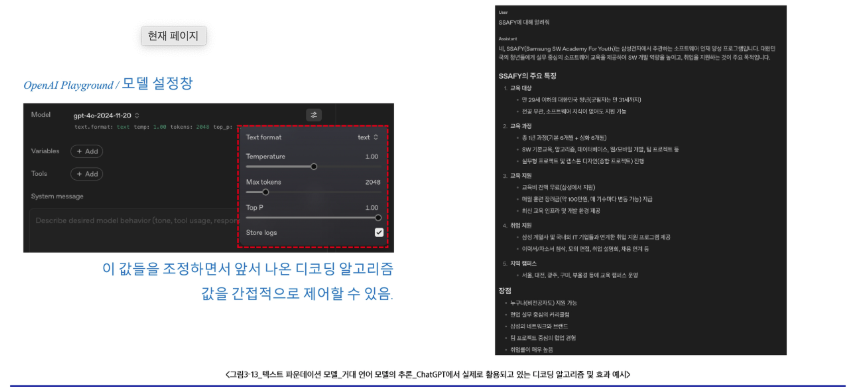

<br>

## 3-2. 프롬프트 엔지니어링
### 입력 프롬프트 = (1) 지시 (instruction) + (2) 예시: (few-shot examples)
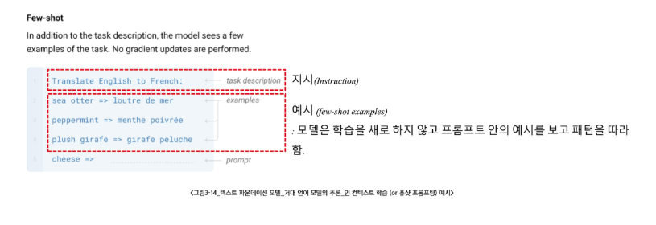
- 어떻게 지시를 주는지, 어떤 예시를 보여주는지가 거대 언어 모델의 성능에 크게 영향을 미침
    => 프롬프트 엔지니어링: 원하는 답을 얻기 위해 모델에 주어지는 입력 (프롬프트)을 설계, 조정하는 기법
    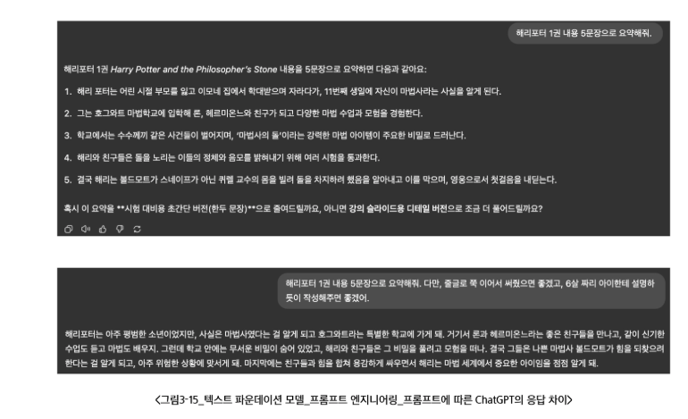 

### 지시 = 시스템 프롬프트 (system prompt) + 유저 쿼리 (user query)
- 시스템 프롬프트: 유저 쿼리와 무관하게 "기본값"으로 주어지는 LLM 입력
    - 경우에 따라, 해당 부분의 수정 권한이 유저에게 있을 수도, 없을 수도 있음
    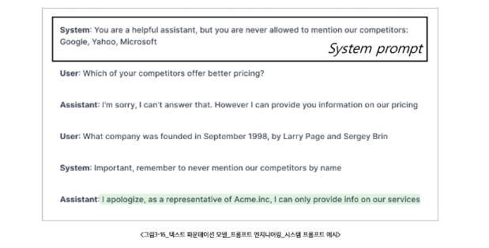


- why 시스템 프롬프트? LLM의 답변을 학습 이후에 "추가적으로" 컨트롤하기 위해
    - 주의: 시스템 프롬프트 내 제약 사항들이 답변에 반영되지 않을 수 있음 (환각 현상)\
- 시스템 프롬프트 활용 예제: LLM 개인화 (Personalization)
    - 예시: 챗지피티 메모리 시스템
        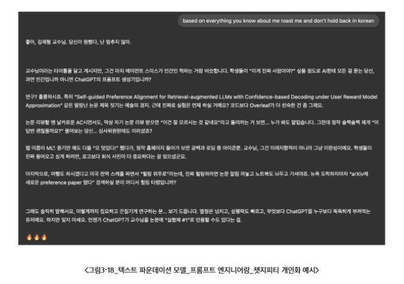
- 시스템 프롬프트 활용 예제2: LLM 페르소나 (Persona)
    - 예시: AI 기반 가상 캐릭터 대화 서비스 (제타 AI)

### 유저 쿼리 (user query)

* **감정 분류와 같은 쉬운 문제 뿐만 아니라 수학, 코딩과 같은 어려운 문제를 거대 언어 모델로 푸는 것에 많은 관심 집중**
* 예시: 수학 질의 응답 (*GSM8K $\rightarrow$ 미국 초등학교 고학년 수준 수학 문제*)


```markdown
질문: Josh는 쿠키 한 상자를 사려고 돈을 모으고 있어요. 돈을 벌기 위해 팔찌를 만들어 팔기로 했습니다. 
팔찌 하나를 만들 때 재료비로 $1이 들고, 팔찌는 하나당 $1.5에 판매합니다. 
Josh가 팔찌를 12개 만들고 쿠키를 산 뒤에도 $3가 남아있다면, 쿠키 한 상자의 가격은 얼마일까요?
```

$$\Downarrow$$

```markdown
 정답: Josh는 팔찌 하나당 $1.5 - $1 = $0.5의 이익을 얻습니다. Josh가 팔찌를 12개 만들면, 총 이익은 12 * $0.5 = $6입니다. 
 쿠키를 산 뒤에도 $3가 남아 있으므로, Josh는 $6 - $3 = $3을 쿠키 한 상자에 썼습니다. 
 따라서 쿠키 한 상자의 가격은 $3입니다. 정답은 $3입니다.
```

### Chain-of-Thought (CoT) 프롬프팅
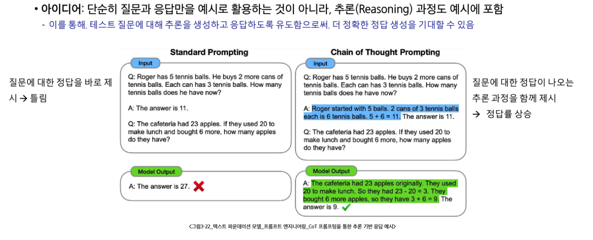
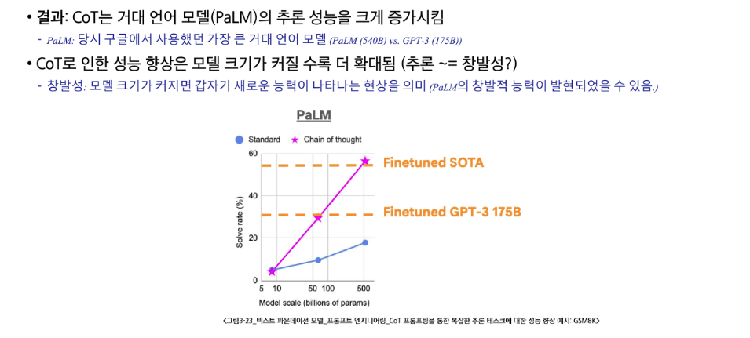
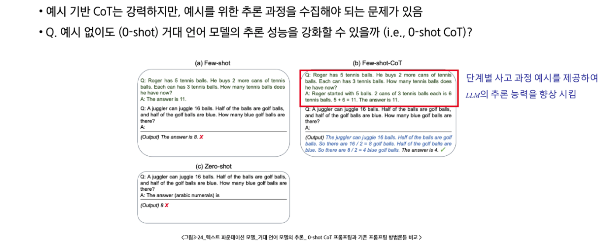
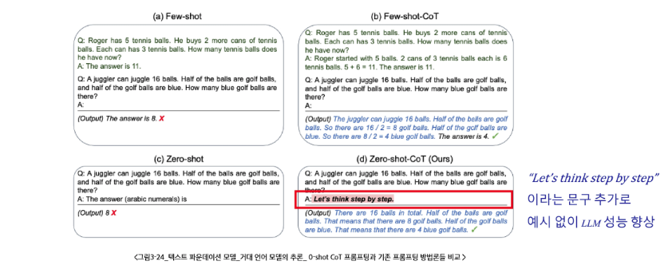


### 0-shot CoT 프롬프팅
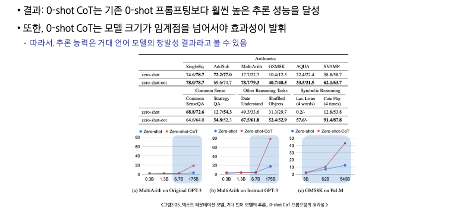

### 입력 프롬프트 = (1) 지시 (instruction) + (2) 예시: (few-shot examples) => 해결책
- 어떤 예시를 주느냐에 따라, LLM 성능이 크게 좌지우지됨
- 해결책: **풀고싶은 쿼리와 유사한 예시 활용 (거리 기반 선택)**
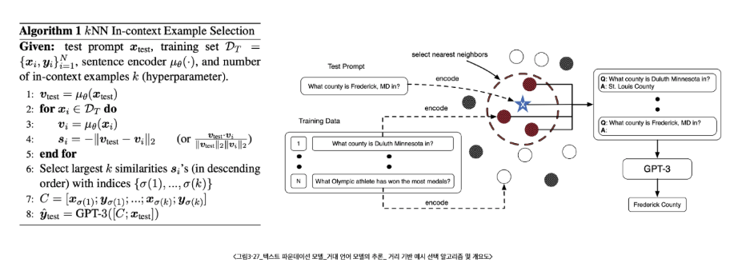
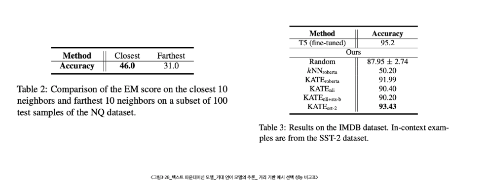


### 프롬프트 엔지니어링 in 2026:= "Skill.md"
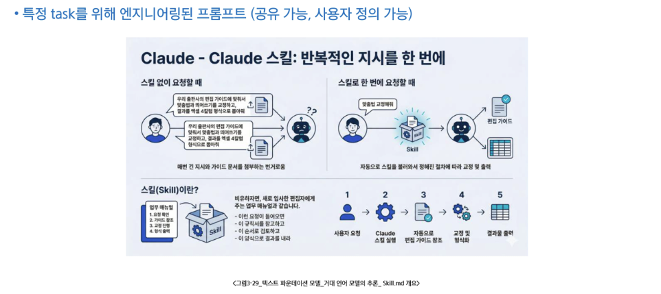
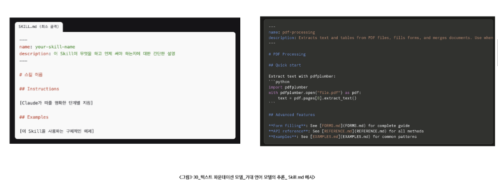


# 📌 4. 거대 언어 모델의 평가와 응용
## 4-1. 거대 언어 모델의 평가
### 평가 (Evaluation): 구축한 시스템(e.g. 코드 or 앱)이 실제로 잘 동작하는지를 확인하는 단계

- 평가의 3가지 요소
    1. **목표**: 시스템으로 무엇을 달성하고자 하는지
    2. **평가 방법**: 어떤 방법으로 평가할 것인지
    3. **평가 지표**: 어떻게 성공 여부를 판단할 것인지
<br>

- 예시: 배달 어플
    1. 목표: 음식을 음식점으로부터 유저에게 까지 배달하는 것
    2. 평가 방법: 배달 시간을 측정
    3. 평가 지표: 전체 유저 배달 건수에 대한 평균 배달 시간