

강의 요약 정리

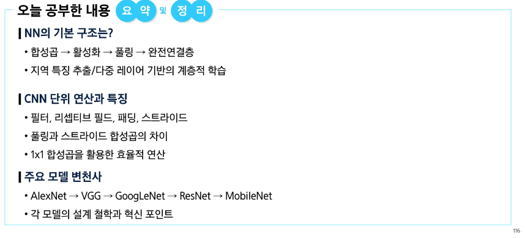
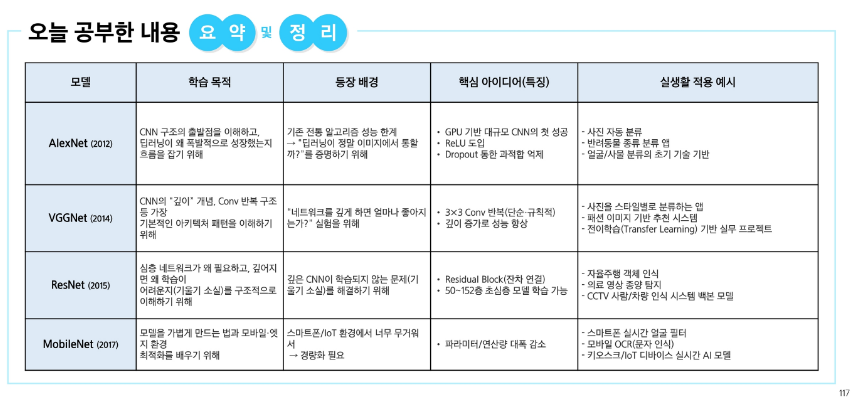

# 딥러닝 및 이미지 모델
> **학습 목표**
> 이미지 속의 텍스트를 마크다운 형식으로 변환한 내용입니다.
> * 이미지 기반 학습 모델의 구조와 작동 방식을 이해합니다.
> * 대표적 CNN 기반 이미지 모델의 변천사를 배우게 됩니다.
> * 이미지 분류 문제에서 실습을 통해 주요 이미지 모델을 적용해봅니다.

# 📌 CNN 모델
## 0. 학습 시작
> **CNN 모델의 기본 구조는 무엇이며, 왜 이미지 과업에서 중요한가?**
    * CNN 모델의 기원 및 모델 주요 모듈 소개
> **CNN의 단위 연산과 디자인 철학은 어떻게 발전했을까?**
    * 계층 깊이, 스케일, 학습 방법, 경량화
> **CNN 기반 주요 모델은 어떻게 변화해왔고, 왜 중요한가?**
    * 깊이와 효율성을 동시에 높이는 방향으로 개선
 

> **산업 현장 사례**

* 금형 표면 스크래치 검출
* 식품/의약품의 이물질 검출
* PCB 불량 자동 판정
* 부품과 기판 사이의 접합이 불완전한 냉땜, 표면에 남은 플럭스 잔여물, 납땜부 미세 크랙 등 불량 검출

> **내 일상 속에서 찾아볼 수 있는 사례**

* 성동구, 픽토그램 활용 '안심우회전시설' 첫 설치
* 인공지능(AI) 카메라를 이용하여 차량, 보행자 등을 실시간으로 감지
* 상황에 맞게 움직이는 픽토그램을 모니터로 표출하는 방식으로 교통사고를 효율적으로 예방
 

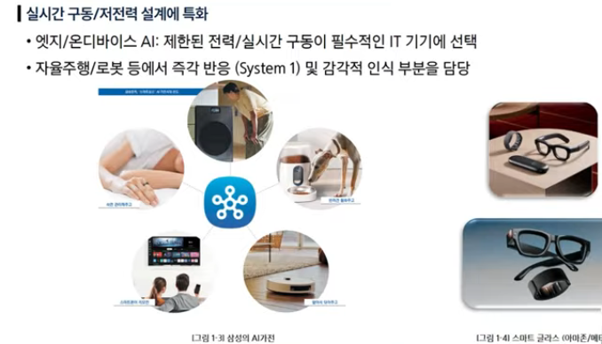

--------
## 1.CNN 살펴보기
### 1.1 CNN vs. FCN
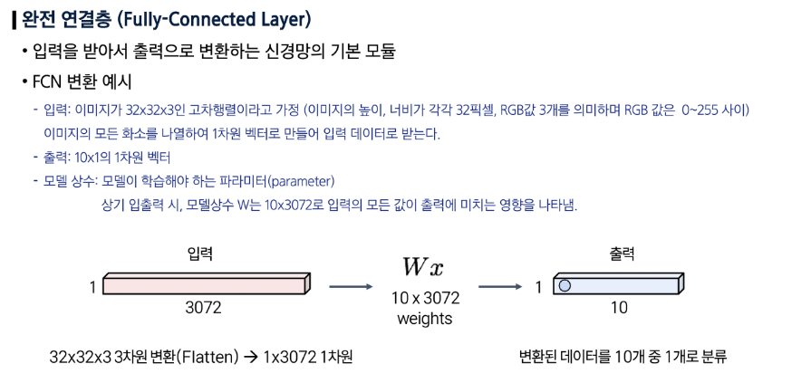
- 이미지 입력 -> w*입력, 10 output을 받는 일차원 행렬로 변경 후 출력

#### 합성곱 레이어
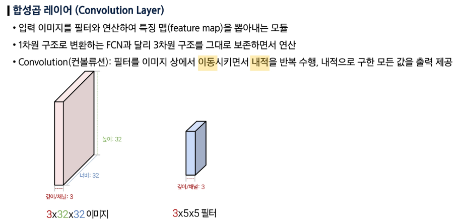
- 앞에서 하는 FCN과 유사하지만 두 벡터 간 내적의 반복
- 컨볼류션: 원래 존재하던 이미지 필터를 위해 만들어둔 식
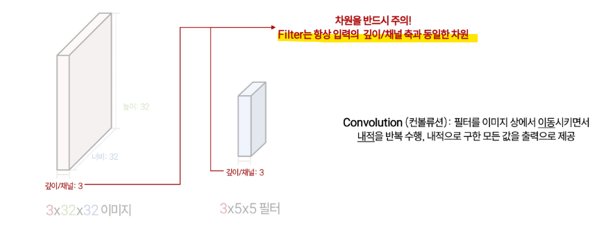
- 필터가 동일하면 원하는 화소값으로 변경 가능
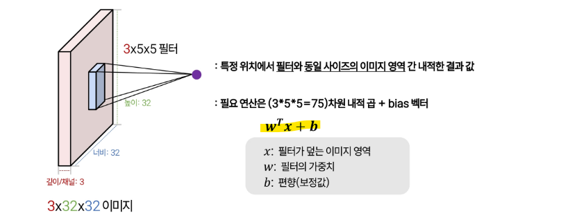
- 내적 곱 + BIAS 벡터 => 하나의 상수 생성
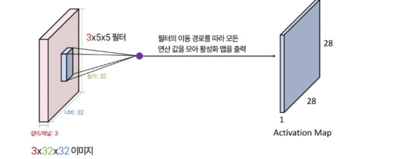
- 연산 값을 모은 활성화 맵은 크기가 줄어듦
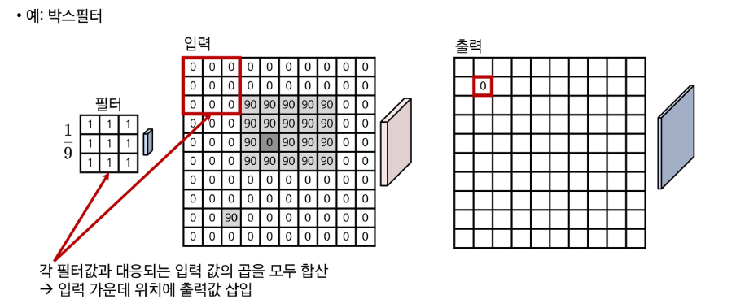
- 값이 잘 정의되려면 필터와 내가 대상으로 하는 입력 대상의 값이 같아야 한다. 각 (i, j)의 내적 후 값을 합함
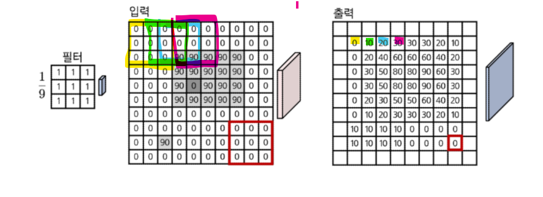
- 가장 가장자리 영역을 처리하지 않게 되는 이유는? -> 이게 cnn 연산을 하는 이유
  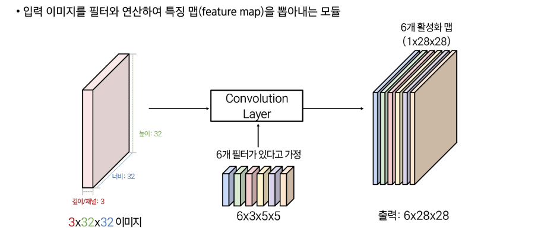
  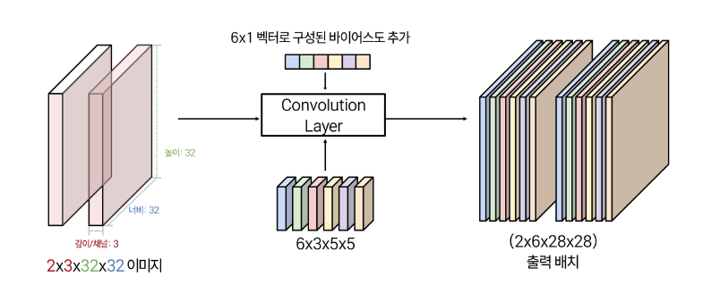
- 컨볼류션 필터를 사용할 때는 하나의 필터만 사용하는 경우는 거의 없음. n개의 필터가 있다면 각 필터는 독립적으로 존재
- 필터의 개수만큼 바이어스가 필요하다
- 필터와 바이어스는 각 컨볼류션 층에서 정의되는 상수
- 3은 이미지 색으로 그 앞에 다른 수가 곱해져 있다면 그만큼 이미지의 수가 들어옴을 알 수 있음 여기선 2
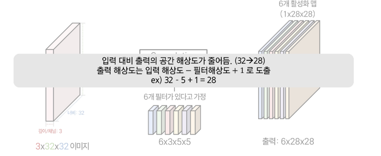
- 우리가 채우고 싶지만 값을 알 수 없어서 채우지 못하는 부분은 가장 가까운 값에서 가져와서 참조한다.
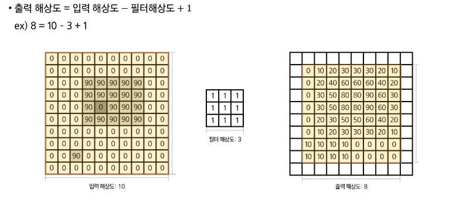
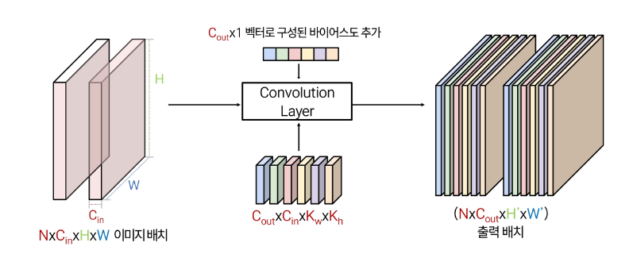

## 1-2. CNN 모델 구조 - 중첩
#### 합성곱 레이어
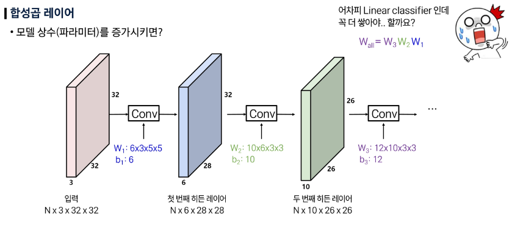
- 상수를 곱하는 것이 의미가 없게 됨 왜?

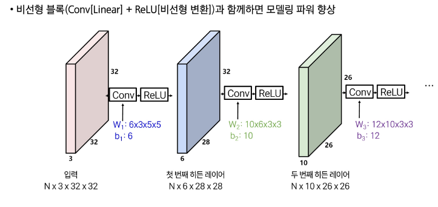
- 그래서 비선형으로 만드는 ReLU 도입

#### 필터 시각화
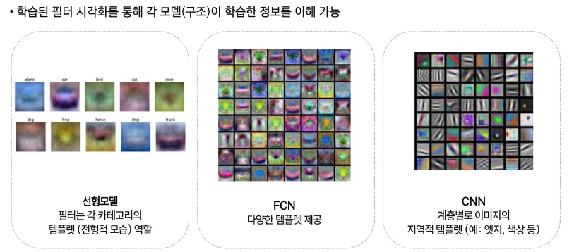
- 선형모델: **대표 템플릿**을 찾음
  - w * x의 형태 였음 
  - y = 3072(w) * 10(x)
  - y는 10개의 확률을 나타내며 각 클래스에 대응하는 값
  - w가 각각이 의미하는 것이 뭐냐? 클래스에서 가장 대표되는 템플릿이더라.  
    - 1번째는 plane 2번째는 car ...
  - 단점은 대표값으로만 한정이 되니 다양한 형태의 자동차 템플릿을 볼 수 없음 => 일반호 어려움 
    - 예시: 자동차 중에서도 빨간 자동차라면? 분류 어려움
 

- FCN: **다양한 템플릿** 제공
  - 선형모델 fcn을 한 번만 적용했을 때의 경우인데 만약 fcn을 여러 개를 이어서 그 사이에 비선형모델을 넣는다면? -> 다양한 템플렛 제공 가능 -> 성능 개선 가능
 

- CNN: **지역적 템플릿** 찾음
  - FCN과 어떻게 다를까? 계층별로 다른 템플릿 제공 가능
  - 지역적 패턴 탐색 -> 레이어 상승 시마다 점진적으로 다루는 패턴 탐색 범위가 넓어짐 -> 최종적으로 이미지 객체를 보게됨 
  - 예를 들어 우리가 다루는 모든 이미지 개체가 다양한 종류이 새라면?
    - 우리는 이 새들을 구분하는 기준이 부리의 모양, 색깔의 차이 등을 고려해야 함 -> cnn의 장점과 같음

#### 중첩과 수용영역
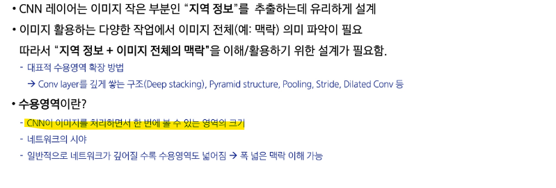
- 네트워크 디자인을 할 때도 수용영역을 넓게 하려는 노력을 함 -> 왜 넓게 하려고 하는지 ?
- 입력에 가까울 수록 지역적으로 작은 부분만 봄

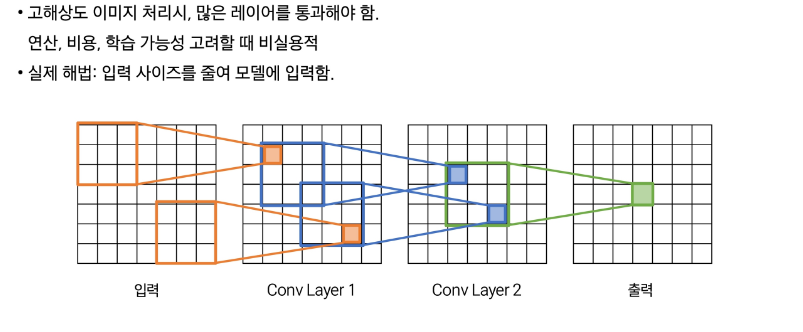
- 왜 레이어를 쌓을 수록 수용영역이 넓어질까요?
- 모든 레이어는 3*3임 
 -> 이 지역만 보면 수용영역이 3*3이 끝임
- 하지만, 입력 이후 conv layer 1의 3*3은 한 칸 마다 입력의 3*3의 값이 입력돼 있기 때문에 똑깥은 3*3을 보지만 conv layer1 의 3*3은 입력의 훨씬 큰 부분을 본 것과 같음
- 최종적으로 출력값은 모든 영역을 본 값이다.

### 1-2. CNN 모델 구조 - 풀링
#### 풀링: 효율적 연산 및 위치 변화의 강건성 확보
- 풀링: 이미지 사이즈 축소
  - 개수 자체를 줄여버림
  - 해상도를 줄이기 때문에 연산이 크게 줄인다 + 위치 이동을 강건하게 함

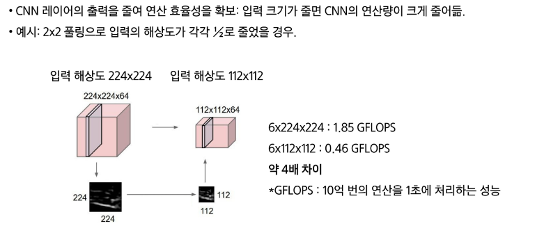
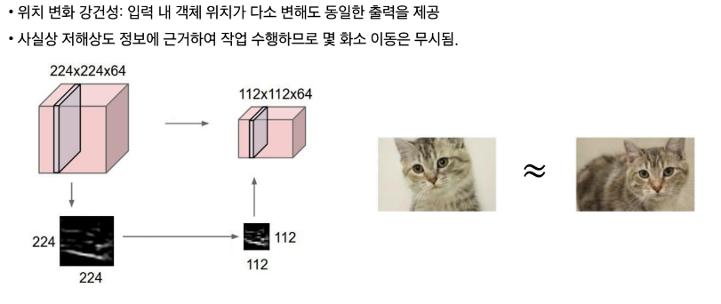
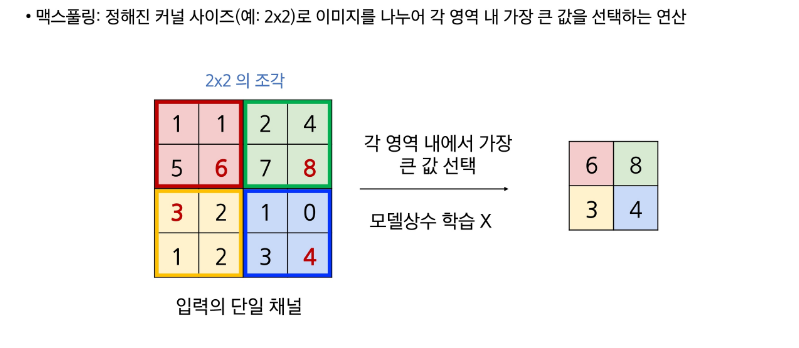

### 1-2. CNN 모델 구조 - 스트라이드 합성곱
#### 스트라이드 합성곱: 풀링 한계 개선
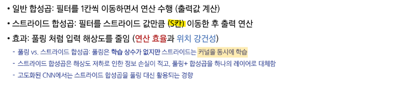
- 풀링의 단점
  - 풀링을 쓰려면 풀링을 별도 선언해야 함.
  - 해상도를 없애면서 정보 손실 유발 -> 저항 불가
- 스트라이드 합성곱은 선언을 s칸 씩 선언함
  - 풀링을 여러번 한 듯한 효과가 있음

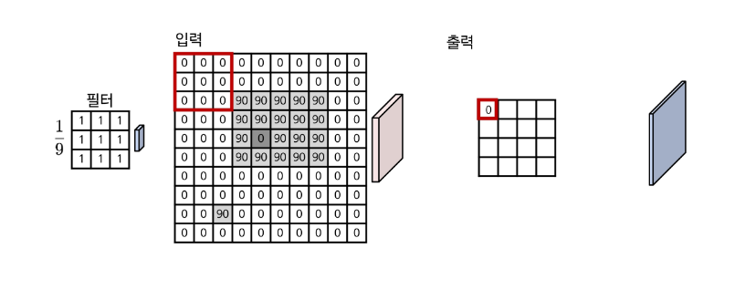

#### 스트라이드 2의 사례
- s: 2
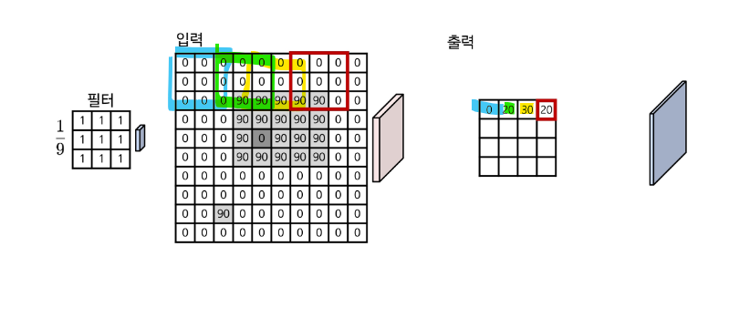

---------
## 2. CNN 기반 모델 변천사
#### 2010~2017년까지의 CNN 모델
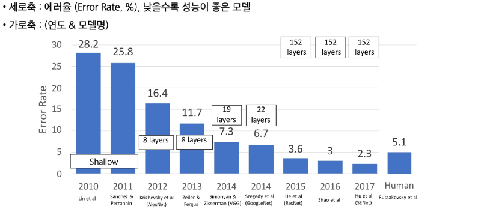
- 사람도 5% 정도의 오답율이 있음. 사람 정도까지의 발전을 이룬 것

### 2-1.AlexNet
#### 5개의 합성곱 계층과 3개의 완전연결 계층으로 구성된 8계층 CNN 모델
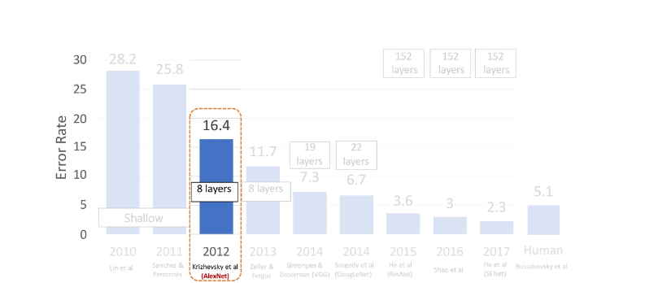
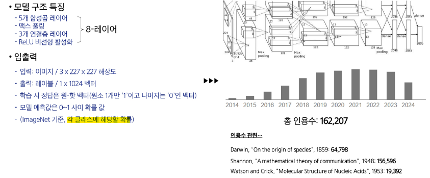
- 예측은 정확하지 않기 때문에 0~1 사이로 변환
- 입력이 각 클래스에 해당할 확률!

#### Image input 224, 2*GPU
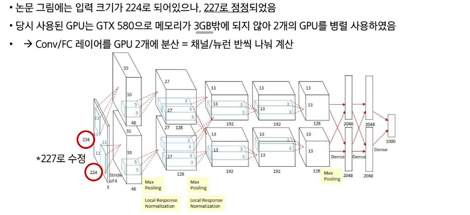
- 메모리가 작아서 병렬 사용

#### Image input 227, 1*GPU
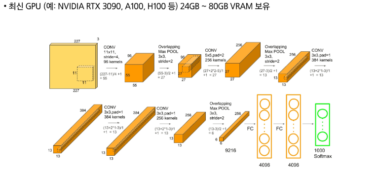

#### AlexNet 단계별 구조
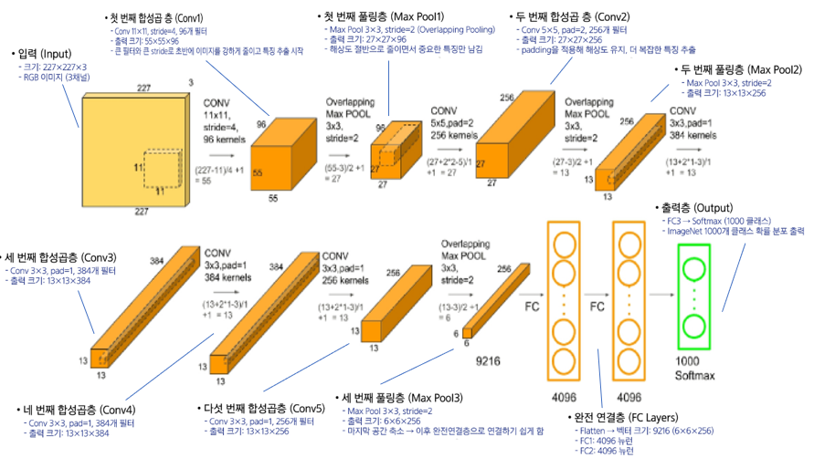

#### AlexNet 출력 사이즈 계산법[Conv1]
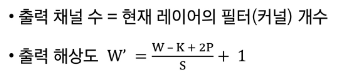
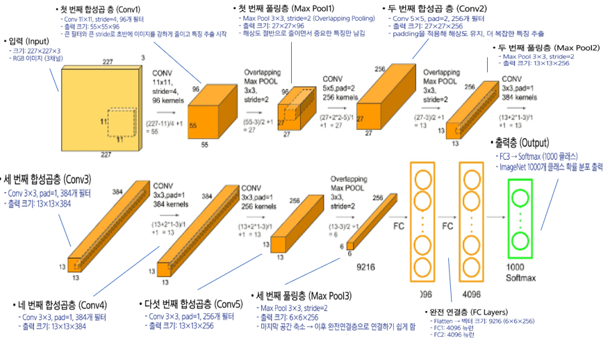

#### AlexNet 연산비용 계산법[Conv1]
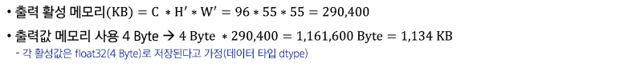
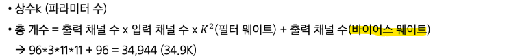
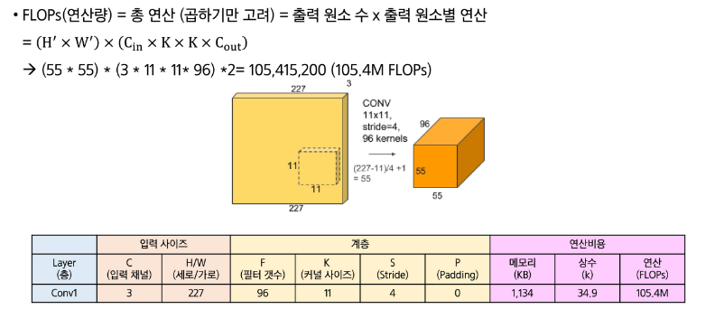

#### AlexNet[2Groups]
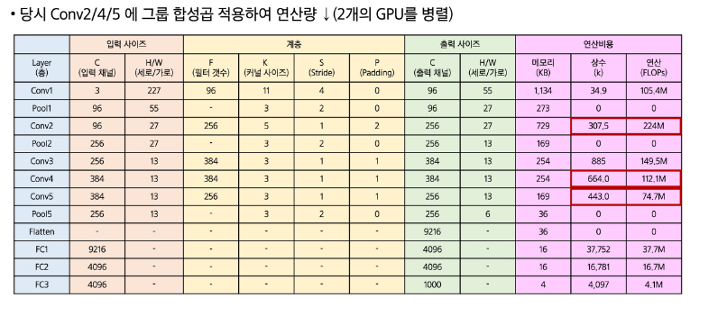

#### Memory[1Group]
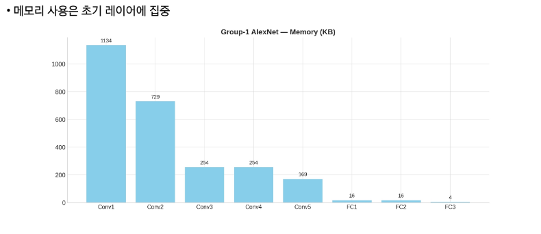

#### Params[1Group]
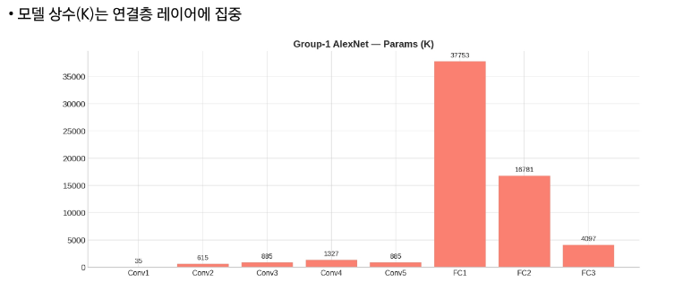

#### FLOPs[1Group]
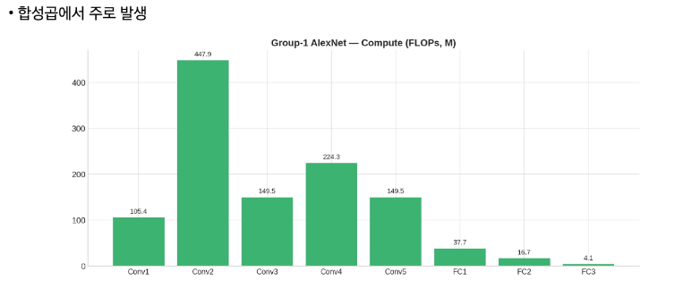

---------
### 2-2. VGGNet
#### 5개의 합성곱 블록 + 맥스 풀링 구조
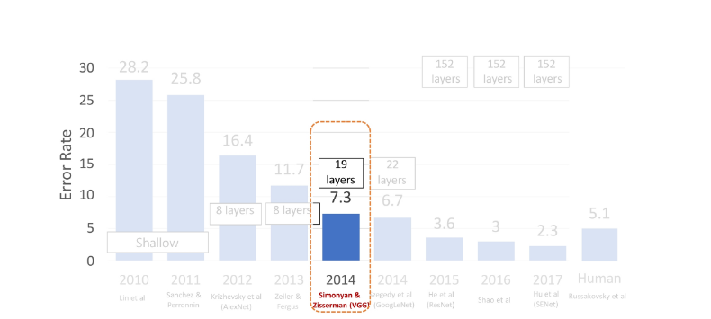

#### VGG-16 기준
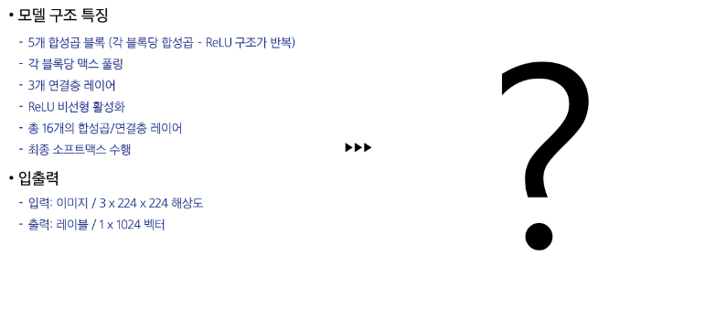

#### 모델 비교
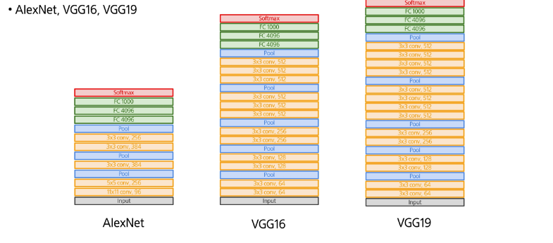

#### VGG의 레슨
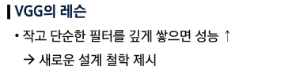

#### VGG의 디자인 룰
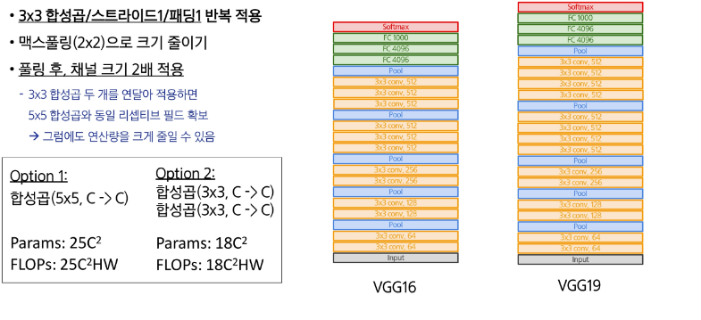
- 맥스풀링으로 크기를 줄였는데도 채널 크기는 2배를 적용해서 연상량을 크게 줄일 수 있음
- **AlexNet에서는 레이어별 연산량 차이가 매우 큼.**
* **VGG는 해상도를 줄일 때 마다 채널을 늘려 레이어별 연산량 차이를 줄임.**

#### AlexNet vs VGGNet: VGG는 거대한 모델
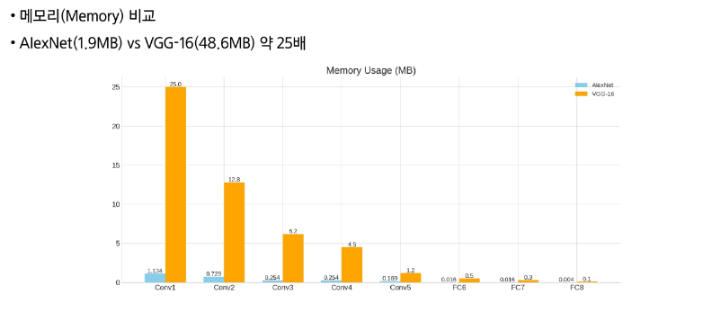
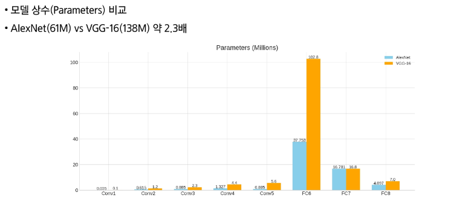
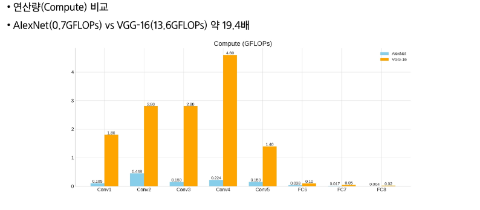

#### 모델 특징
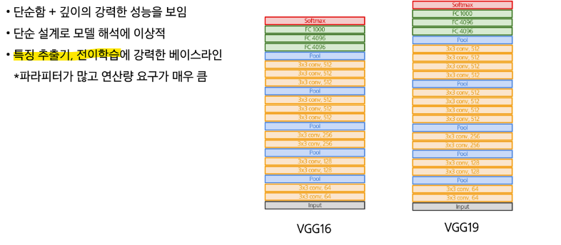

-------
### 2-3. ResNet
#### 합성곱 블록(VGG유사)과 잔차(Residual) 블록

- 어떻게 가능했고 왜 어려웠는가?
  - VGG와 유사한 블록과 잔차를 이용함
  - 잔차 블록의 역할 : 입력 받아 패스

#### 모델 구조 특징 (ResNet-50 기준)


#### ResNet의 등장 배경

- VGG 이후 배치 정규화가 도입되면서 10개 레이어 이상을 충분히 학습할 수 있게 됨. => 성능 증가로 20 레이어까지 가능해짐. 그러나, 더 깊게 하면 상수는 더 많이 쓰임에도 트레이닝 에러가 높아짐 = 과적합이 아닌 학습이 안됨. 왤까? => 그러면 최소한 20레이어의 성능은 보장해야 되지 않나? -> 잔차의 등장. 

#### ResNet의 아이디어

- 작은 레이어보다 성능이 안나올 것 같으면 차라리 값을 0으로 만들어버려라 = 원본 성능을 보장하도록

#### Residual Block(잔차블록)

- 반한된 값 f(x)가 성능을 더 나쁘게 할 것 같으면 값을 0으로 만들어라

#### ResNet 잔차블록 (깊게 보기)

- 3 * 3을 깊게 하면 5 * 5와 같은 성능, vgg
- 입력 = 출력의 해상도를 맞춰주는 과정이 필요
- 보틀넥: 줄임


#### Stem 구조


#### ResNet-18과 ResNet-34


#### 다양한 조합


#### 잘 알려진 ResNet 학습 레시피


#### 최종 요약


-------
### 2-4. MobileNet
#### 목표: 모바일/임베디드 환경에서 구동 가능

- 공간과 채널을 분리하여 연산 = 깊이로 한 번, 화소로 한 번 연산함
  
#### 깊이별 합성곱/화소별 합성곱 예시


- 어떻게 효율적이고 가볍게 연산 할 수 있을까?에 대한 해답 

#### 이후 모델에 영향력
 

----------
## 확인문제


-------
# 📌 다양한 신경망 모델
> **학습 목표**
> CNN의 한계를 이해하고, 이미지 인식에서 왜 새로운 접근이 필요한지 확인
> RNN, Attention 기반 Transformer의 핵심 아이디어와 구조를 파악하고, 각 모델이 해결하는 문제를 이해
> 모델 별 설계 철학과 특징을 비교하며, 데이터 유형(이미지, 시퀀스, 긴 맥락의 중요성)에 따른 적절한 모델을 선택

## 1. CNN의 한계
### 1-1. CNN의 구조 및 장점
#### 합성곱 구조의 특성


### 1-2. CNN의 핵심 한계
#### CNN은 데이터 순서(order) 무시


#### 긴 거리 의존성 고려 부족


#### 픽셀 단위 복원 하계

## 2. 시퀀스 데이터 처리: RNN
### 2-1. RNN(Recurrent Neural Nets)
- 이전이 이후에 영향을 주는 구조

#### Input Layer

#### 패치 순서 (위치) 정보 제공
#### 회전 포지션 임베딩

- 최신 포지션 임베딩으로 많이 쓰이고 있으며, 해상도 변화에는 영향을 받지 않지만 매번 회전 계산해야 함


p73부연 설명

@대전_3반_장준태
​​아하..

@대전_3반_장준태
​​그럼 다 해봐야겠군요

@대전_3반_장준태
​​아 그냥 다 해준다는 말이네요 전 알고 있어서 걔네만 해준다는 건줄 알았어요

@서울_8반_안홍규
​​우우... 두뇌 속 어탠션 파라미터가 꼬여버렸다...

@대전_3반_장준태
​​그쵸

@대전_3반_장준태
​​단순..

@광주_3반_양병운
​​단순?

@대전_3반_장준태
​​입력에서의 유사도를 확인

@대전_3반_장준태
​​셀프 어텐션

@서울_4반_박소진
​​자기 자신 안에서 다른 패치와의 유사성 점검

@서울_18반_정현수
​​뇌내 가중치 행렬에 기울기 소실이 일어난거같아요..

@대전_3반_장준태
​​-> 유사도 판단

@대전_3반_장준태
​​군집화

@광주_4반_이원희
​​오,,

@서울_17반_김예진
​​비지도 학습에서의 분류문제처럼

@대전_3반_장준태
​​그저 학습한 파라미터를 가지고 출력을 했을뿐인데 비슷한 부류가 있더라?

@서울_22반_정연수
​​귀엽다

@대전_3반_장준태
​​교차 어테ㅐㄴ션

@대전_1반_조호현
​​chillwcat

@대전_3반_장준태
​​디코더의 출력을 인코더의 키 쿼리와 어텐션이었나

@서울_18반_정현수
​​역시 고양이는 액체였던걸로..

@서울_6반_반규리
​​chillwcat

@서울_5반_오유정
​​너무 귀엽다

@서울_5반_오유정
​​고양이 만지면서 수업 듣고 싶다

@서울_17반_김예진
​​북슬북슬

@대전_3반_장준태
​​강하다

@대전_6반_이승섭
​​픽셀 전체로 하면 너무 많아서 패치를 사용하고 가중치를 붙인다.

@대전_3반_장준태
​​어텐션은 포지션까지 준다고 했던 거 같은데

@대전_3반_장준태
​​아 그게 트랜스포머인건가

@광주_4반_임태민
​​장기 의존성..

@광주_4반_이원희
​​그럴것같아용

@서울_19반_이은영
​​와 한눈에 비교 정리를 너무 잘해주시네요

@대전_3반_장준태
​​감사합니다

@서울_19반_이은영
​​?

@서울_17반_김예진
​​어느 정도는

@서울_17반_김예진
​​완화가능

@대전_3반_장준태
​​킹텐션

@서울_22반_정연수
​​어텐션이 세군

@대전_3반_장준태
​​위치 인코딩

@서울_17반_김예진
​​오

@대전_5반_임승화
​​까꿍

@서울_8반_김영상
​​어텐션의 단점 = 비싼 컴퓨터 필요함

@대전_3반_장준태
​​ㅠ.ㅠ

@대전_6반_이승섭
​​자연어 처리에서도 뭔가 위치 인코딩이 있었던 같기도 하고,,,,,,

@서울_19반_이은영
​​오? 단어 대신 패치를 넣네

@서울_17반_김예진
​​"건물을 모두 클릭하세요"

@서울_19반_이은영
​​저게 벡터화로 한줄이 되는게 아니라 매트릭스로 들어가는 걸까요?

@대전_3반_장준태
​​읽을 때 그렇게 읽을 거 같아요 끊어서

@광주_4반_이원희
​​흠흠

@대전_3반_장준태
​​패치와 위치 인코딩은 더한다

@서울_22반_정연수
​​메모리가 커야하나

@서울_18반_정현수
​​한마디로 위치정보 넣어준다?

@대전_3반_장준태
​​그쵸

@서울_5반_오유정
​​교안에 없네요..?

@대전_6반_이승섭
​​신기한 기술들이 많네, ,,,

@대전_3반_장준태
​​메모리가 더 커야하는지는 모르겠네요 토큰 위치 정보를 담은 벡터와 패치의 임베딩 정보와 더해서 해주기 때만에 일단 벡터 하나는 메모리를 더 쓰는 거 정도,,?

@광주_1반_염예지
​​오잉 교재 업데이트가 안된건가요?

@구미_3반_김경찬
​​음...

@대전_3반_장준태
​​키 쿼리 유사도 밸류는 키의 임베딩

@서울_4반_박소진
​​Q*K/root(d)

@서울_5반_오유정
​​어텐션은 키와 쿼리의 유사도

@서울_5반_오유정
​​여러개의 인코더

@광주_4반_이원희
​​많이쓰는구나

@서울_5반_오유정
​​우와

@서울_5반_오유정
​​애니메이션

@서울_17반_김예진
​​와 움직인다

@서울_07반_이승진
​​우와

@서울_5반_오유정
​​재밌어요

@대전_5반_조수연
​​어...

@서울_5반_오유정
​​아....

@서울_5반_오유정
​​계속 반복되네 ㅋㅋㅋ

@대전_6반_조은아
​​우와

@광주_4반_이원희
​​오홍

@구미_2반_김영웅
​​지린다

@대전_5반_박상범
​​오

실시간 채팅에 오신 것을 환영합니다. 개인정보를 보호하고 YouTube 커뮤니티 가이드를 준수하는 것을 잊지 마세요.
자세히 알아보기

@서울_04반_남효식
​​읭

@서울_5반_오유정
​​오 의외

@대전_3반_장준태
​​무겁다

@서울_5반_오유정
​​빅데이터에서 우수??

@대전_3반_장준태
​​옥수수

@구미_2반_최묘석
​​규모의 경제 ㄷㄷ

@서울_8반_김영상
​​먹여야 할 데이터도 늘어나고, 사용해야 하는 메모리 리소스도 늘어나고, 이게 다 돈이다.

@서울_22반_정연수
​​고점은 높은데 비용이 드는 친구

@대전_3반_장준태
​​창발성이 없나봐요

@서울_5반_오유정
​​작을수록 큰 모델???

@서울_5반_오유정
​​누가 이름 이렇게 만들었어

@대전_3반_장준태
​​진짜,,

@대전_6반_이승섭
​​resnet 위대하다

@광주_4반_이원희
​​비교할만혀

@대전_3반_장준태
​​데이터 증강 -> 데이터를 각도라든지 보는 방향 등등으로 바꾸는 데이터 합성 -> 지피티야 이 데이터 보고 데이터 만들어줘

@광주_1반_염예지
​​데이터를 증강한다는 것이 hidden unit개수를 늘리는 것인가요..?

@광주_3반_손영주
​​학습 데이터가 많다는 거 같아요

@대전_3반_장준태
​​데이터의 개수를 늘린다라는 말이라고 이해하시면 될 거 같아요(아마,,)

@서울_5반_오유정
​​말그대로 데이터를 늘린다는 거 같아요

@서울_5반_오유정
​​거대 데이터에서 우수하니까..

@구미_3반_김경찬
​​그... 데이터 증강이

@광주_1반_염예지
​​감사합니다

@대전_3반_장준태
​​학습 파라미터가 다르게 나온다라고 이해하면 되는 거겠죠?

@구미_3반_김경찬
​​전에 데이터 합성 배웠잖아요?

@서울_8반_김영상
​​데이터 증강은 기존 데이터를 사용하여 모델 최적화 및 일반화를 개선할 수 있는 새 데이터 샘플을 생성하는 것 (IBM의 설명)

@서울_4반_양성호
​​이미지 데이터를 회전, 색반전, crop 등등을 해서 데이터 개수를 늘린다고 생각하면 됩니다.

@구미_3반_김경찬
​​그거라 보면 돼요

@광주_5반_최진우
​​경량화...

@광주_4반_이원희
​​ㅇㅎ

@서울_5반_오유정
​​다들 굉장히 똑똑하시군요

@서울_21반_방승현
​​🐱🐶🐶

@대전_3반_장준태
​​지도학습 vs 비지도학습

@구미_3반_김경찬
​​아 증류 종종 요즘 뉴스에도 공격적 증류 학습이니 뭐니 하던데 그게 이건가보네

@대전_3반_장준태
​​지도학습과 비지도학습을 둘 다 하면서 확인을 하는 방식인가

@구미_3반_김경찬
​​그냥 이렇게 생각하심 돼요

@구미_3반_김경찬
​​지금 데이터가 라벨링이 안된 데이터잖아요?

@서울_5반_오유정
​​왜 개가 0.8인데 정답이 고양이죳

@대전_3반_장준태
​​그쳐

@구미_3반_김경찬
​​근데 그걸 다른 좋은 모델 사용해서 입력값 출력값 확인해서

@구미_3반_김경찬
​​그걸 라벨링된 데이터처럼 사용하는거에요

@대전_3반_장준태
​​아하

@구미_3반_김경찬
​​그러면 좋은 모델의 가중치를 그걸 이용해서 학습한 구린 모델들이

@구미_3반_김경찬
​​따라 가거든요

@대전_3반_장준태
​​오..

@대전_3반_장준태
​​그래서 선생님을 따라가도록이군요

@구미_3반_김경찬
​​요번에 중국에서도 관련 비슷한 학습법으로 미국 AI 날먹했다고 뉴스에서 말이 많더라구요

@서울_8반_김영상
​​서당개가 3년차에 풍월을 읊으면 증류학습이 잘 된 건지

@서울_5반_오유정
​​아 구린모델이 고양이라 출력하는데 선생님 모델을 따라가도록 학습시키는건가

@대전_3반_장준태
​​선생 하나 학습 시켜서 그걸 이용해 나머지 모델들도 그 선생과 비슷하게 만든다라는 거죠? 데이터를 선생에서 만들어서 정답을 주기에 일단 좋고?

@구미_3반_김경찬
​​네 맞아요

@대전_3반_장준태
​​오오

@구미_3반_김경찬
​​수학문제 못푸는 꼬꼬마들이 그걸 풀어야하는데

@구미_3반_김경찬
​​답은 선생님이 갖고 있으니 가서 물어보고 학습한다

@서울_19반_이은영
​​뭔가 상속같네요

@구미_3반_김경찬
​​대충 이렇게 생각하면 쉬울듯

