# 딥러닝 및 이미지 파운데이션 모델
# 📌 AI 파운데이션 모델 개념 및 대표 모델
>**학습 목표**
    - AI 파운데이션 모델의 개념을 이해하고, 특징을 설명할 수 있다.
    - Pre-training, Fine-tuning, Zero/Few-shot 개념을 구분할 수 있다.
    - 기존 머신러닝 모델과의 차이를 이해할 수 있다.
    - 대표적 AI 파운데이션 모델 중 하나인 CLIP 모델의 개념과 역량을 알아본다.

## 🔻 파운데이션 모델의 개념
### 1-1. 파운데이션 모델(Foundation model)이란?
#### AI 모델이란?

#### 이상적인 AI 모델
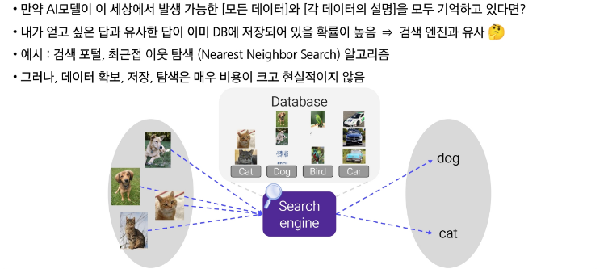

#### 현실적인 기계학습 모델
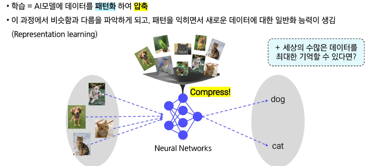

#### 파운데이션 모델이란?
- 대규모 데이터로 사전학습한 후, 다양한 문제/작업에 범용적으로 빠르게 적응 활용 할 수 있는 기반 AI 모델
- 미국 스탠포드 대학 사람 중심 AI 연구소에서 2021년 출간된 보고서[1]에서 새로운 범주로 구분을 시작
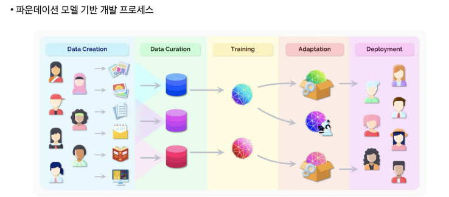

#### 기존 AI모델 vs 파운데이션 모델
- 기존 딥러닝 개발 패러다임 : 아기와 같이 언어, 시각, 청각, 촉각 등 기본적인 것들부터 배워 나가야 함
- 파운데이션 모델 패러다임 : 거대 모델(커다란 뇌) + 대규모 데이터 학습 (많은 지식과 경험) 기반
  ⇒ 새로운 일을 처음 접해도 금방 배우고 잘할 수 있음

#### 파운데이션 모델 특징: 대규모 사전학습, 적응성, 범용성
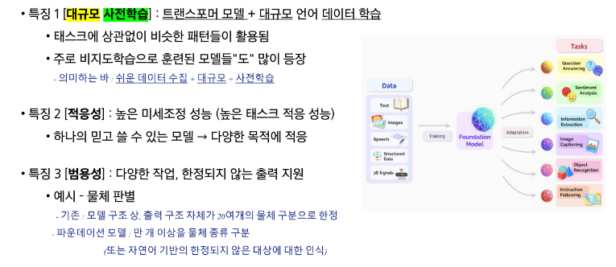

#### 파운데이션 모델에 의한 AI 모델 개발의 변화
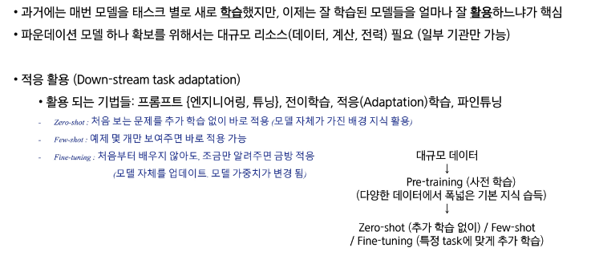
- 전이학습과 파인튜닝은 같은 단어라고 봐도 무방
- 학습을 하나도 하지 않고 모델의 입력에 들어가는 프롬프트 입력을 잘하면 엔지니어링
- 학습이 돼있는 모델의 프롬프트에 내용을 추가하면 튜닝

## 🔻 대표적 이미지 파운데이션 모델: CLIP
### AGI를 향해서
- AI는 사람의 지능과 유사점/차이점 분석을 통해 발전
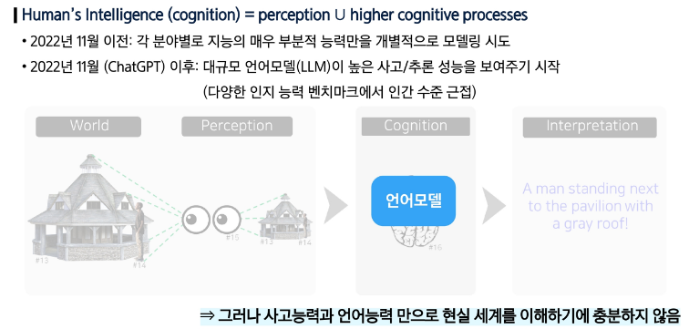
= 언어모델 이전에 세상을 이해하는 눈이 필요함 -> 시각언어모델

### 시각언어모델
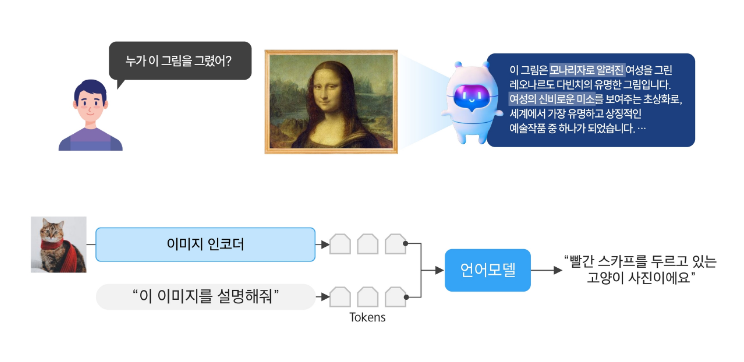
- 시각언어모델 = 멀티모달모델 이라고도 함

#### 예시: GPT-4(2023)
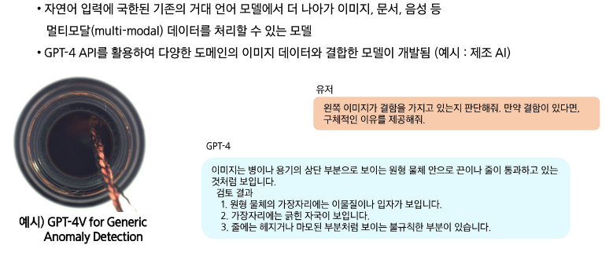
- 추가 예시: sketch-to-web page(HTML)= 요구사항 적은 이미지를 웹 구성해달라고 했더니 해줌

#### 예시: Computer use, Claude
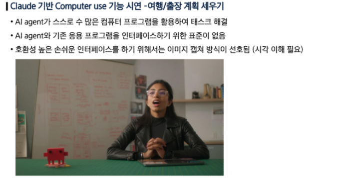

### 1-1. <mark>CLIP(2021)</mark> by OpenAI
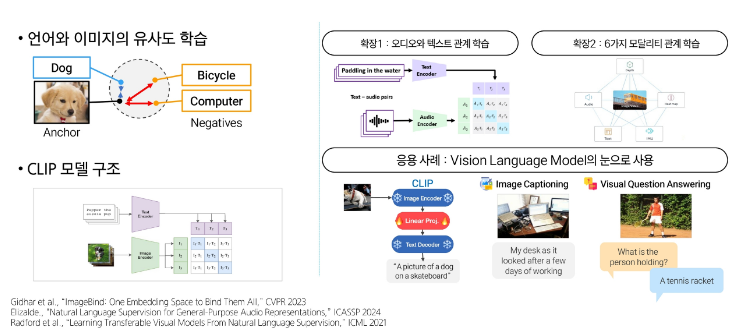
- 언어와 이미지를 둘 다 이해하는 모델임 => 이미지를 언어로 변환 가능
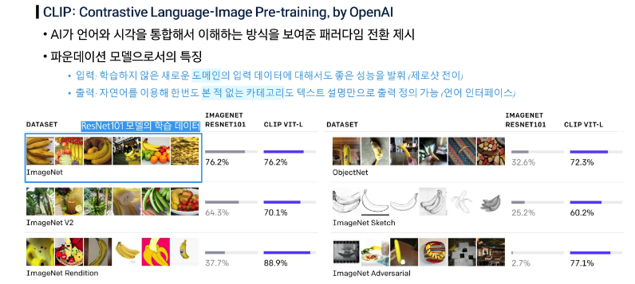

#### CLIP: 대조 학습 기반(Contrastive Pre-training)의 언어-이미지 사전 학습

- <mark>alt-text<mark>: Alternative Text(대체 텍스트)의 줄임말로, 웹 페이지나 문서에 삽입된 이미지를 설명하는 텍스트
  - 이미지가 화면에 표시되지 않거나 시각적으로 확인하기 어려울 때, 이미지 대신 전달되는 설명 문구 역할

### 1-2.CLIP 구조 - 텍스트 인코더 (Transformer 기반  Text Encoder)
#### Remind - Transformer

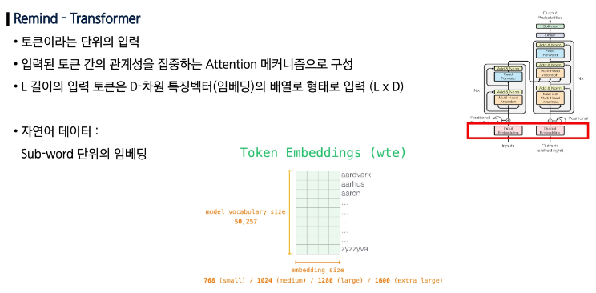

### 1-3.CLIP 구조 - 이미지 인코더 (ViT: Vision Transformer, 2020)
#### Remind - Vision Transformer
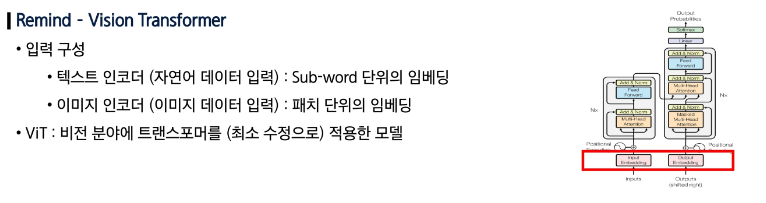
여기 구조 ppt 로 정리

- 구조에서 mlp head만 수정하면 다른 작업으로 활용 가능

### 1-4. CLIP (2021) 학습
#### 대조 학습(Contrastive learning)
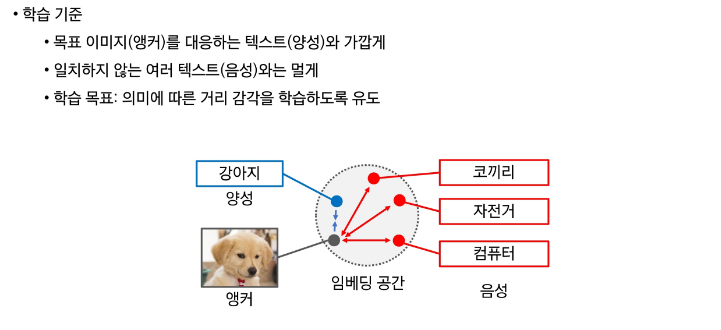
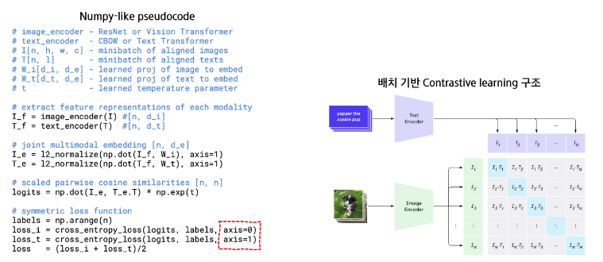
- t, i 는 각 같은 숫자와 배치돼있음 -> 서로 내접 -> 코사인 유사도 (-1 ~ 1까지의 값출력)
  - 파란색은 pair
  - 나머지  off-diagonal...?

#### Softmax
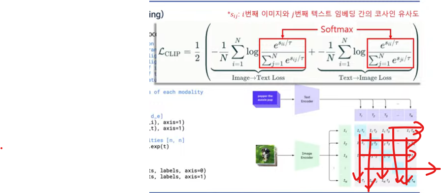
- softmax 값: 0 ~ 1
  - 분자: 특정  it의 값, 분모: 특정 값이 포함된 해당 줄의 모든 값 합
  - 다 합치면 늘 1이기 때문에 확률과 비슷하다는 특징이 있음
- L.clip: 손실함수기 때문에 갑이 낮을수록 좋고 softmax 값이 1에 가까워질수록 0에 가까워지기 때문에 1에 가까울수록 좋다

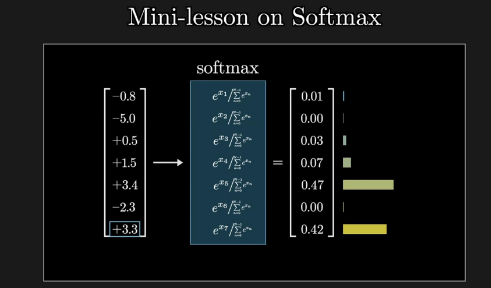
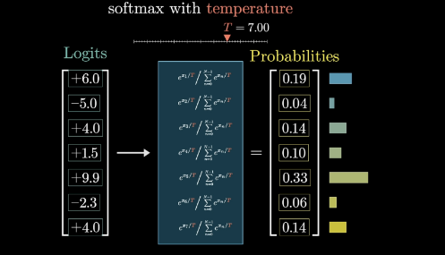
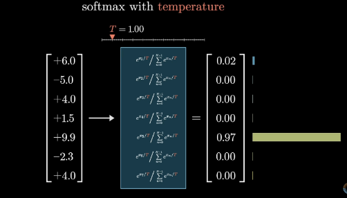
- temperature 변화에 따른 softmax 변화
  - 온도(Temperature, $T$) 파라미터: 모델이 예측한 점수(Logit) 차이를 얼마나 예민하게 반영할지를 조절
  

    ##### 1. 수식 정의

    기본 소프트맥스 수식에서 각 Logit 값 $z_i$를 온도 $T$ ($T > 0$)로 나눕니다.

    $$P_i = \frac{e^{z_i / T}}{\sum_{j} e^{z_j / T}}$$

    ##### 2. 온도($T$) 변화에 따른 분포 변화

    ① 낮은 온도 ($T < 1.0$) $\rightarrow$ **확신 / 뾰족함 (Sharp)**

    * $z_i / T$의 값이 커지면서 원래 Logit 간의 **상대적 격차가 극대화**됩니다.
    * 가장 높은 점수를 가진 클래스의 확률이 $1$에 가까워지고, 나머지는 $0$에 가까워집니다.
    * $T \to 0$에 가까워질수록 **Argmax(One-Hot Vector)** 동작에 수렴합니다.
    * **특징:** 예측이 매우 보수적이고 규칙적으로 변하며 무작위성이 줄어듭니다.

    ② 기본 온도 ($T = 1.0$) $\rightarrow$ **표준 소프트맥스**

    * 원래의 Logit 차이를 있는 그대로 반영하는 표준 확률 분포입니다.

    ③ 높은 온도 ($T > 1.0$) $\rightarrow$ **창의성 / 완만함 (Flat)**

    * $z_i / T$의 값이 작아지면서 Logit 간의 **상대적 격차가 줄어듭니다.**
    * $e^{z_i / T} \to e^0 = 1$이 되므로, 모든 클래스의 확률이 서로 비슷해집니다.
    * $T \to \infty$에 가까워질수록 균등 분포(Uniform Distribution, $\frac{1}{N}$)에 수렴합니다.
    * **특징:** 다양한 단어나 클래스가 선택될 가능성이 높아지며, 무작위성과 다양성이 증가합니다.

    ##### LLM/AI 모델 생성에서의 의미

    * **낮은 Temperature ($0.1 \sim 0.3$):** 코딩, 수학 문제 풀이, 정답이 명확한 요약 과제에 적합 (일관성 높음, 헛소리 줄어듦).
    * **중간 Temperature ($0.7 \sim 1.0$):** 일반 대화 및 지식 답변에 적합 (자연스러움 유지).
    * **높은 Temperature ($1.2 \sim 1.5+$):** 소설 쓰기, 아이디어 브레인스토밍 등 창의적 작업에 적합 (다양성 증가, 비정형적 답변).
  

 

- positive 효과는 높아지게 유사도는 낮아지게
- 결국 한 값이 커지면 대조 학습과 비슷한 결과

### 1-5. CLIP  간단 응용
#### 제로샷 이미지 인식기
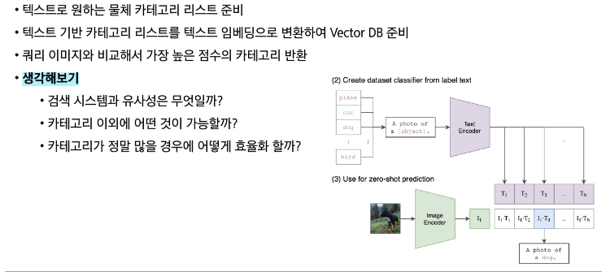
- 유사도가 높은 값의 클래스를 가져온다
- 어떻게 효율화 할까? -> 검색 시스템과 유사하다는 점 기억하기

### 1-6.SigLIP(2023)
#### SigLIP은 softmax 대신 sigmoid 기반 손실함수

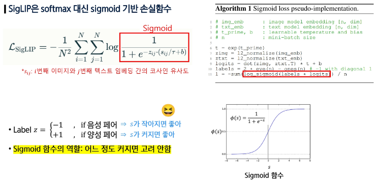

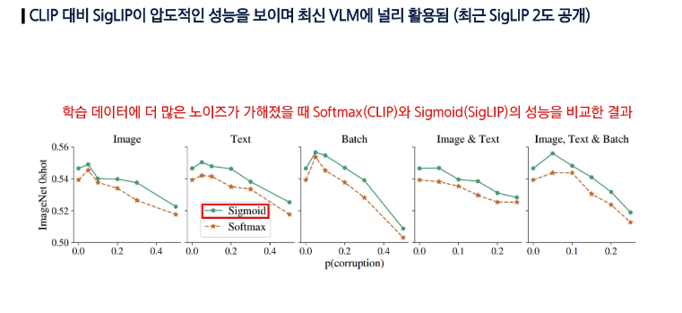

### 멀티모달 정합 응용
#### 멀티모달 정합(Multi-modal Alignment)
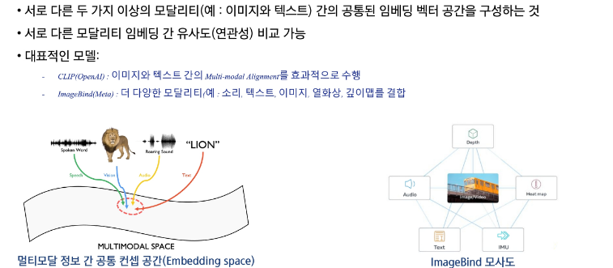

#### ImageBIND - One Embedding Space To Bind Them All

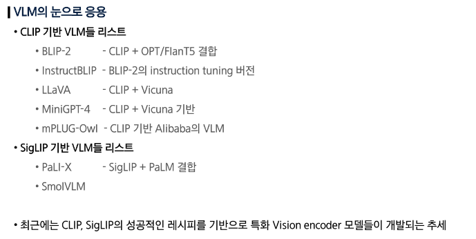

## 심화. CLIP 모델의 고급 응용
### 멀티모달 정합 손실함수로 활용
#### 서로 다른 모달리티(예: 이미지와 텍스트) 간의 변환
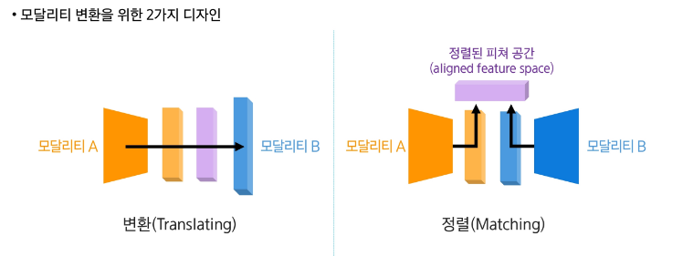

#### 멀티모달 정합을 활용
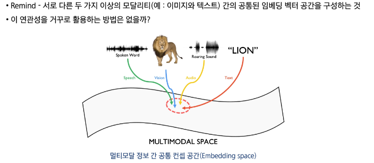

#### 정합(Matching)을 통한 크로스모달 변환
• 멀티모달 정합 손실 함수(Multi-modal alignment loss)
  - Multi-modal 데이터(예시 : 이미지와 텍스트) 사이에 정렬된 정도를 측정
  - 대표적인 텍스트-이미지 손실함수 : CLIP loss / Score Distillation Sampling(SDS) loss
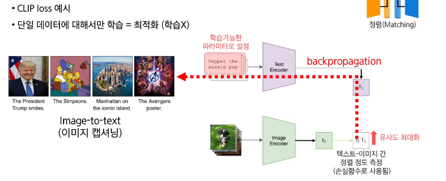
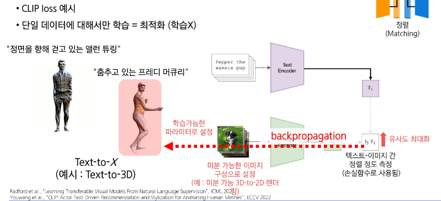
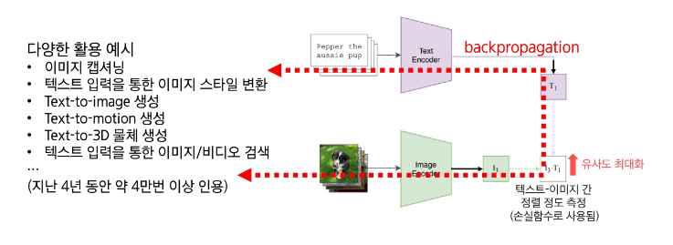

#### 응용 결과 예제: ZeroCLIP
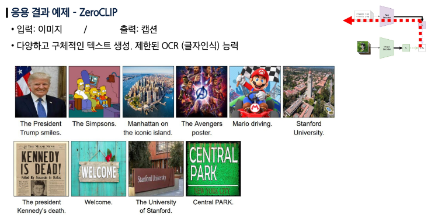

#### 응용 결과 예제: StyleCLIP
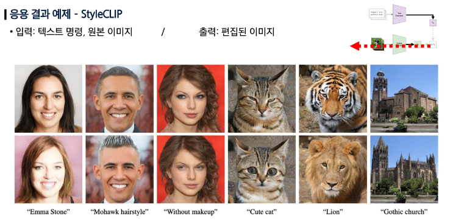

#### 응용 결과 예제: CLIP-Actor
- 입략: 텍스트 설명/ 출력: 3D 에니메이팅 아바타

### 요약 정리
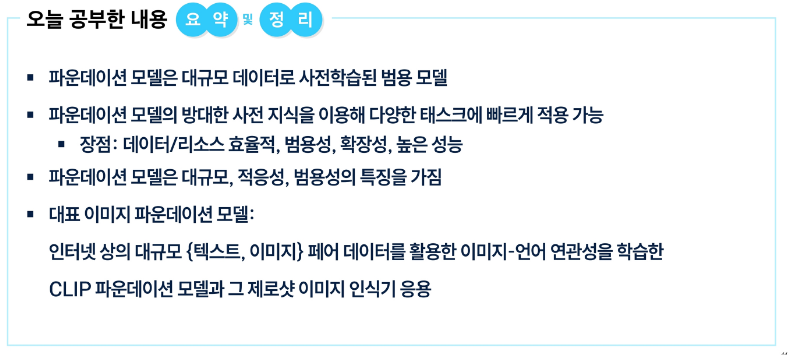

# 📌Vision-Language Model(VLM)
> **학습 목표**
> - 고도화된 CLIP 계열인 SigLIP의 등장 배경에 대해서 이해한다.
> - Vision-Language Model 의 구조 및 구축 패턴에 대해서 파악한다.
> - LLaVA, Qwen-VL, InternVL 등 최신 시각-언어 파운데이션 모델들의 발전 동향에 대해서 설명할 수 있다.
> - (심화) 추가 학습을 요구하지 않는 CLIP계열 멀티모달 정합 모델의 심화 응용 사례를 파악한다.

## Vision-Language Model(VLM)
- agi를 향해서:  clip -> llm

### 3-1. 멀티모달 언어 모델
#### 이미지, 소리, 비디오 등 다양한 모달리티를 함께 이해하고 처리할 수 있는 언어 모델
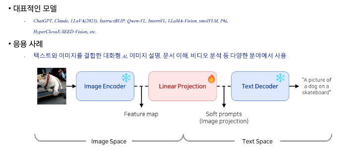

### 3-2.LLaVA(Large Language and Vision Assistant; 2023)
#### Vision 과 Language 모델을 결합한 모델(VLM)로, 텍스트와 이미지를 동시에 이해

#### LLaVA 모델 특징
• 효율적인 메모리 사용 : 적은 자원으로 큰 모델을 효과적으로 학습
• 다중 모달 학습 : 텍스트와 시각 데이터를 결합하여 응답을 생성
• Fine-tuning : 특정 작업에 맞춰 모델을 미세조정하여 사용

#### step1: 사전 학습(Pre-training)
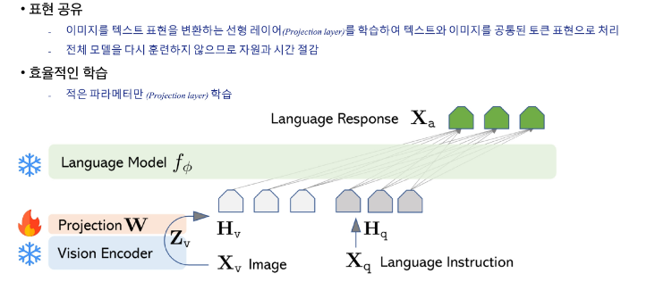

#### step2: Fine-tuning
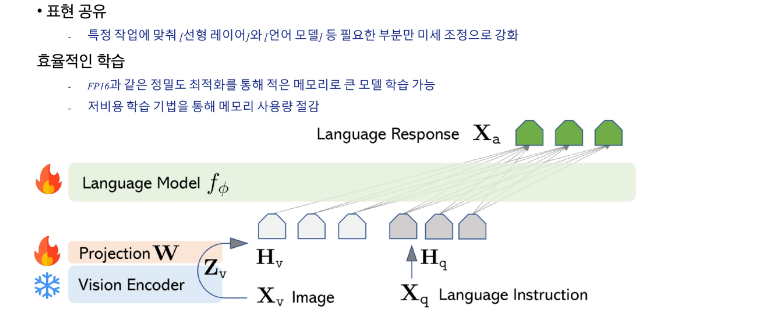

#### LLaVA 학습 데이터(합성 데이터)

### 3-3. 최신 공개 VLM 모델들
#### Qwen-VL (Alibaba)

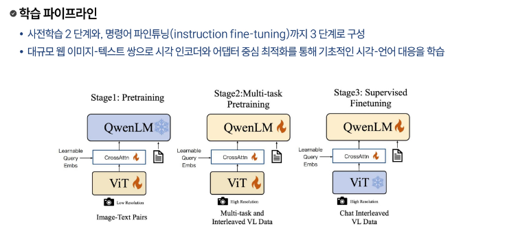

#### Qwen2-VL
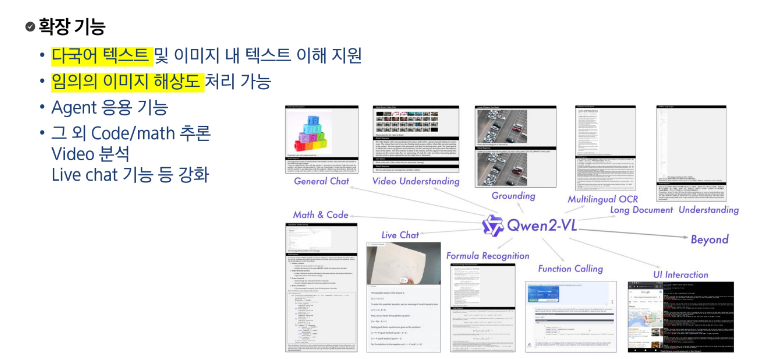
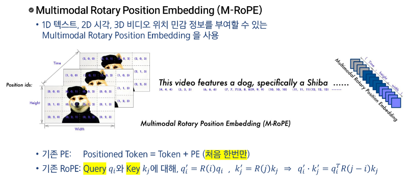
- **멀티모달로타리포지션임베딩**

#### Qwen2.5-VL
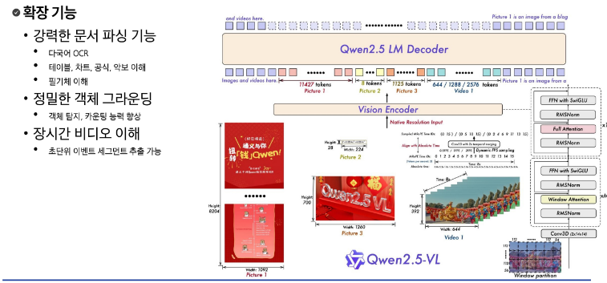

#### Qwen2.5-Omni
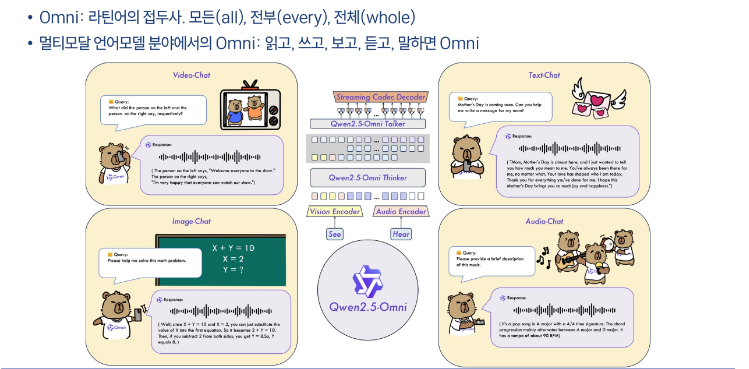
- 노생성x

#### Qwen3-VL
- 코딩 가능

#### InternVL (2024)
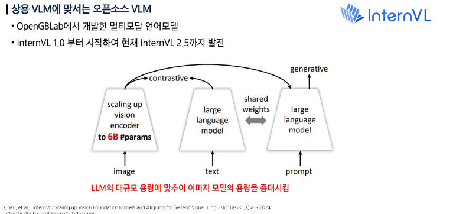

### 3-4.VLM의 성능을 높이는 트릭
#### Set pf Mark(SoM)
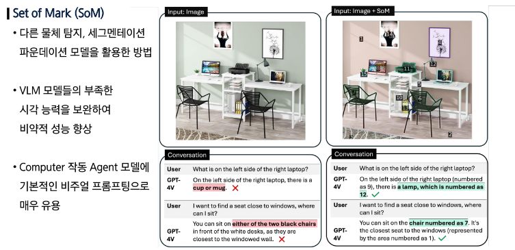

### 3-5.  도메인 특화 파운데이션 모델들
#### 의료
- 의료 이미지를 입력 받아, 병적 진단 및 원인 설명 등의 태스크 수행
- Contrastive learning을 통해 학습
  - BiomedCLIP 모델 구조

- **MedCLIP(2022)**
  - 의료 텍스트와 이미지 임베딩을 정합시킨 의료용 CLIP 모델
  - 텍스트 입력으로부터 이미지 상의 질병을 탐지하거나 특정 종류의 의료 이미지를 검색하는 방식 등으로 활용 가능

- **LLaVA-Med(2023)**
  - LLaVA를 의료 데이터에 파인튜닝한 의료 특화 모델
  - 의료 이미지를 포함한 지시문 데이터(visual instruction-following data)를 통해 의료 이미지 기반 챗봇 대화가 가능한 멀티모달 모델

- 색깔을 빨간색으로 넣어야 인식한다. 얘네도 색 선호도가 있음

#### 제조업
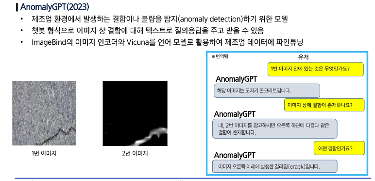

#### 3D 언어 모델
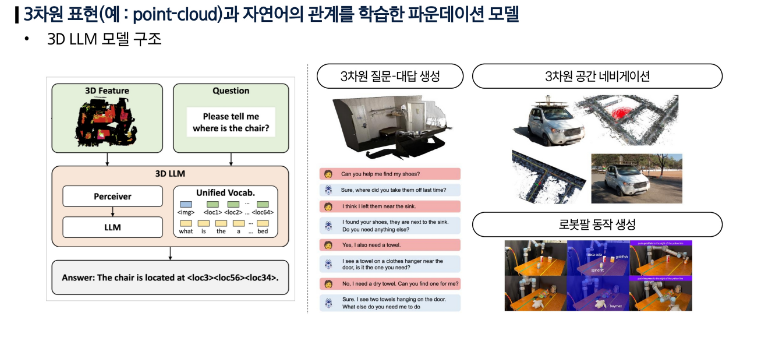

#### 로봇 행동 모델
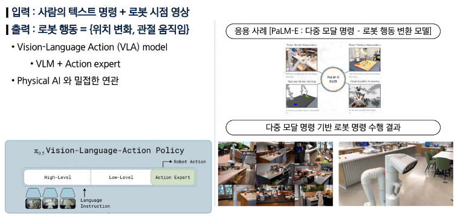

# small VLM과 파운데이션 모델들 소개
## Small Vision-Language Models(sVLM)
### 1-1.OpenVLM
- VLM 성능 리더보드: 너무 무겁다

### 1-2.sVLM
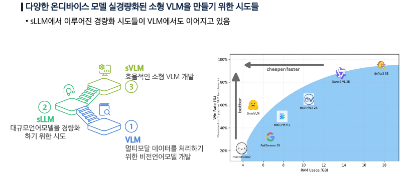

### 1-3. SmolVLM
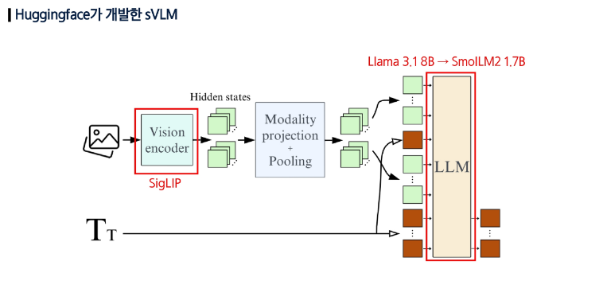

### 1-4. Moondream 0.5B
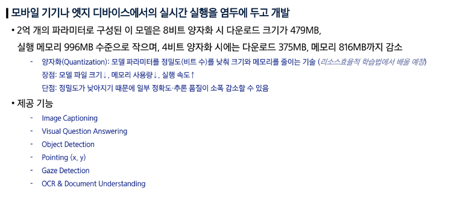
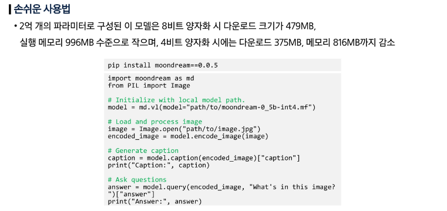

여기서부터 재정리

## 한국어 sVLM
### 2-1. 언어별 구조적, 형태적 차이에 따른 토큰화 복잡성
#### 언어별 토근 길이 격차 (토큰 정보밀도 차이)
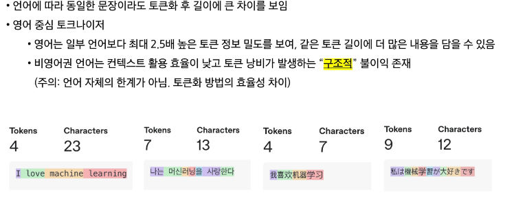

#### 토큰나이저의 언어 편중 이슈
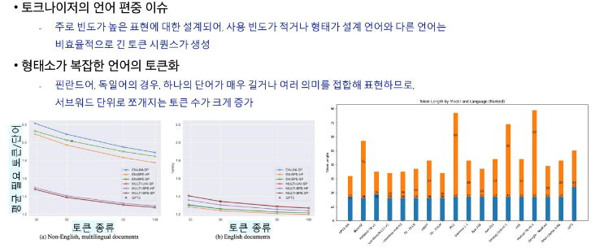

#### 토큰을 줄이려는 시도 - 한국어
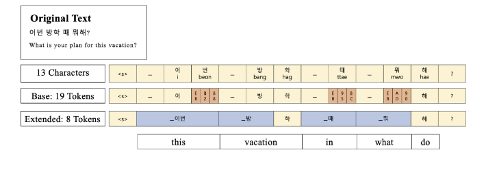

### 2-3. 이미지 생성 모델
#### 생성 모델 기초
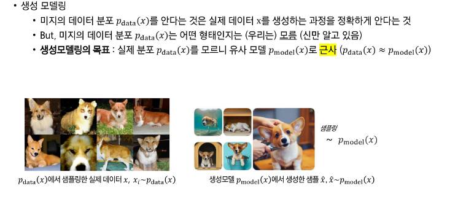
- 데이터 분포 Pdata(x) 는 알 수 없음. 우리가 태어날 때 어떤  x, y 가 만나서 생성될 지 알 수 없는 것처럼
  - 분포는 생성되는 과정

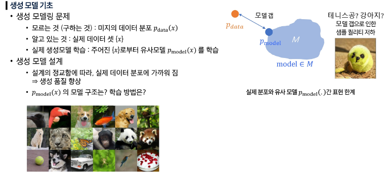
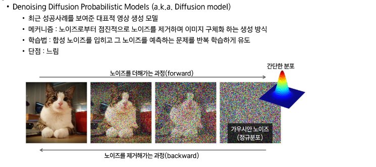
- 가우시안: 정규분포 -> 쓰기 쉬워서
- 디퓨전모델: 랜덤 샘플링 -> 가우시안 정규 분포 생성 -> 조금씩 디노이즈 -> 이미지 생성

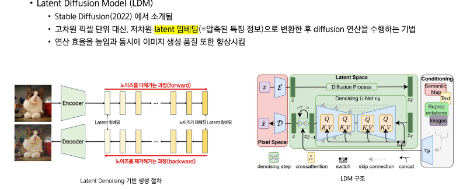
- 디퓨전 모델이 최선이야? -> LDM
- 저해상도 -> 노이즈 더함 -> 노이즈 없애면서 생성

# 개인화, 합성 데이터 활용 사례
> **학습 목표**
> - 도메인 특화, 개인화 모델 확보를 위한 적응 학습법들이 어떤 것들이 있는지 설명할 수 있다.
> - 적응 학습법들의 개념을 구분하여 설명할 수 있다.
> - 합성데이터의 사례를 파악하고, 역할과 응용법을 고찰한다.
> - (실습) HuggingFace와 Gradio를 활용해 간단한 모델 서빙과 배포를 할 수 있다.

## 파운데이션 모델의 주 응용 방법: 적응 학습
### 1-1. 파운데이션 모델 + Fine-tuning

#### 파운데이션 모델 (Foundation model)과 미세조정(Fine-tuning)이 필요한 이유

• 방대한 데이터로 학습된 초대형 딥러닝 모델. 다양한 작업이나 범용적인 문제에 바로 적용 가능
• 최근에는 텍스트 뿐만 아니라 이미지, 오디오, 비디오 등의 다양한 입력 데이터를 처리할 수 있는 멀티모달로 확장
• 하지만 최신 정보나 특정한 작업/도메인에 최적화 되어 있지 않아, 즉시 활용이 어려운 경우가 반드시 있음

#### 미세조정 (Fine-tuning): 추가 학습을 통해 이미 학습된 모델을 조금만 튜닝하는 것

• 미세 조정(fine-tuning)을 통해 특정 작업에 특화된 모델을 개발할 수 있다

• 파운데이션 모델 + Fine-tuning = 실용적인 개인화 파운데이션 모델
  - 적은 데이터로 학습 가능
  - 학습 리소스 절약 가능
  - 특정 작업에 대한 우수한 성능

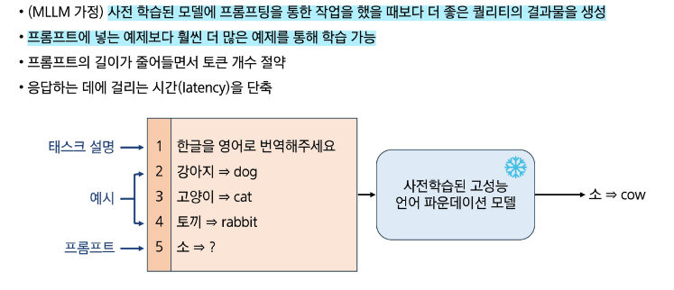
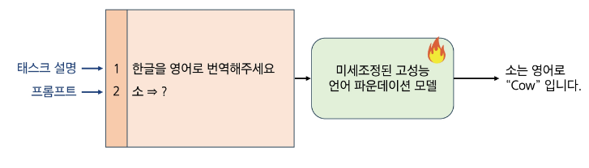

#### 하이퍼파라미터 - Learning Rate
- gradient(경사): 미분을 통해 구한 기울기
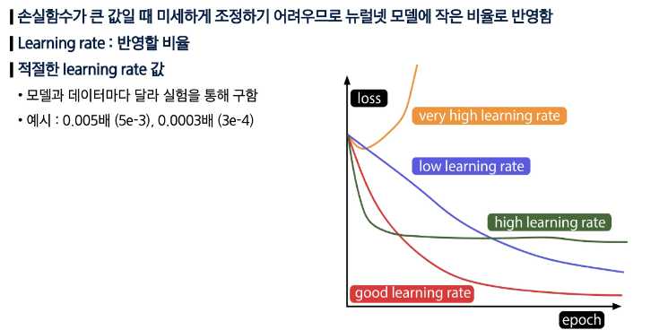
