# 딥러닝 및 이미지 파운데이션 모델
# 📌 AI 파운데이션 모델 개념 및 대표 모델
>**학습 목표**
    - AI 파운데이션 모델의 개념을 이해하고, 특징을 설명할 수 있다.
    - Pre-training, Fine-tuning, Zero/Few-shot 개념을 구분할 수 있다.
    - 기존 머신러닝 모델과의 차이를 이해할 수 있다.
    - 대표적 AI 파운데이션 모델 중 하나인 CLIP 모델의 개념과 역량을 알아본다.

## 🔻 파운데이션 모델의 개념
### 1-1. 파운데이션 모델(Foundation model)이란?
#### AI 모델이란?


#### 이상적인 AI 모델


#### 현실적인 기계학습 모델


#### 파운데이션 모델이란?
- 대규모 데이터로 사전학습한 후, 다양한 문제/작업에 범용적으로 빠르게 적응 활용 할 수 있는 기반 AI 모델
- 미국 스탠포드 대학 사람 중심 AI 연구소에서 2021년 출간된 보고서[1]에서 새로운 범주로 구분을 시작


#### 기존 AI모델 vs 파운데이션 모델
- 기존 딥러닝 개발 패러다임 : 아기와 같이 언어, 시각, 청각, 촉각 등 기본적인 것들부터 배워 나가야 함
- 파운데이션 모델 패러다임 : 거대 모델(커다란 뇌) + 대규모 데이터 학습 (많은 지식과 경험) 기반
  ⇒ 새로운 일을 처음 접해도 금방 배우고 잘할 수 있음

#### 파운데이션 모델 특징: 대규모 사전학습, 적응성, 범용성


#### 파운데이션 모델에 의한 AI 모델 개발의 변화

- 전이학습과 파인튜닝은 같은 단어라고 봐도 무방
- 학습을 하나도 하지 않고 모델의 입력에 들어가는 프롬프트 입력을 잘하면 엔지니어링
- 학습이 돼있는 모델의 프롬프트에 내용을 추가하면 튜닝

## 🔻 <mark>대표적 이미지 파운데이션 모델: CLIP</mark>
### AGI를 향해서
- AI는 사람의 지능과 유사점/차이점 분석을 통해 발전

= 언어모델 이전에 세상을 이해하는 눈이 필요함 -> 시각언어모델

### 시각언어모델

- 시각언어모델 = 멀티모달모델 이라고도 함

#### 예시: GPT-4(2023): 멀티모달 처리

- 추가 예시: sketch-to-web page(HTML)= 요구사항 적은 이미지를 웹 구성해달라고 했더니 해줌

#### 예시: Computer use, Claude


### 1-1. CLIP(2021) by OpenAI

- 언어와 이미지를 둘 다 이해하는 모델임 => 이미지를 언어로 변환 가능
- 확장1: 오디오와 텍스트 관계 학습
- 확장2: 6가지 모달리티 관계 학습
- 응용 사례: vision language model의 눈으로 사용
  - 이미지 -> 텍스트 인코더 -> 디코더 -> 추론 
  - image captioning
  - visual question answering


#### CLIP: <mark>대조 학습 기반(Contrastive Pre-training)의 언어-이미지 사전 학습</mark>


- <mark>alt-text</mark>: Alternative Text(대체 텍스트)의 줄임말로, 웹 페이지나 문서에 삽입된 이미지를 설명하는 텍스트
  - 이미지가 화면에 표시되지 않거나 시각적으로 확인하기 어려울 때, 이미지 대신 전달되는 설명 문구 역할

### 1-2.CLIP 구조 - 텍스트 인코더 (Transformer 기반  Text Encoder)
#### Remind -Transformer


<details><summary>sub-word 정의 및 인코더 순서</summary>

- sub word: OpenAI에서 제안한 **BPE(Byte Pair Encoding) 토큰화 기법**
  - 자주 등장하는 단어는 하나의 토큰으로 유지하지만, 희귀한 단어나 복합어, 오타 등은 더 작은 단위인 서브워드(Sub-word) 단위로 쪼개어 처리
<br>

- **sub word 인코더 순서**
  - 텍스트 입력: "a photo of a cat"

  - 토큰화 (BPE): 시작 토큰(<SOT>)과 끝 토큰(<EOT>)을 추가하고 서브워드 ID로 변환
    - 예: [<SOT>, "a", "photo", "of", "a", "cat", <EOT>]

  - 텍스트 트랜스포머(Text Transformer):

  - 토큰 임베딩 + 위치 임베딩(Positional Embedding) 후 멀티 헤드 어텐션(Multi-Head Attention) 수행

  - 최종 임베딩 추출:
    - <EOT>(End of Text) 위치의 출력 벡터를 가져와 이미지 특징 벡터와 동일한 차원으로 사영(Projection) 후 코사인 유사도를 계산합니다.

</details>
<br>

### 1-3.CLIP 구조 - 이미지 인코더 (ViT: Vision Transformer, 2020)
#### Remind - Vision Transformer

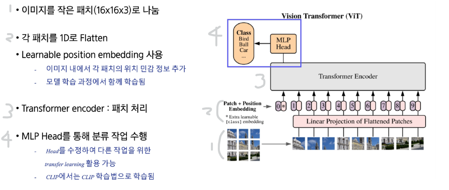

<details><summary>Linear Projection + Position Embedding 비교</summary

##### 1. 한눈에 보는 비교

| 구분 | **Linear Projection of Flattened Patches** | **Learnable Position Embedding** |
| --- | --- | --- |
| **역할** | 패치 데이터(이미지 정보)의 **차원 맞추기 및 특성 추출** | 패치들의 **위치 정보(순서) 부여** |
| **입력** | 펼쳐진 2D 이미지 패치 데이터 | 패치의 위치 인덱스 ($0, 1, 2, \dots$) |
| **원리** | 선형 변환 (행렬 곱 $X \cdot W$) | 학습 가능한 매개변수 벡터 (Lookup Table) |
| **비유** | 퍼즐 조각의 **"그림 내용"** 을 디지털 데이터로 변환 | 퍼즐 조각 뒤에 적힌 **"좌표 번호"** |

##### 2. 상세 설명

1) **Linear Projection of Flattened Patches (펼쳐진 패치의 선형 투영)**

   * **왜 하나요?**
     * 이미지 패치(예: $16 \times 16$ 픽셀)를 1차원으로 쫙 펼치면(Flatten) 데이터 크기가 $16 \times 16 \times 3(\text{RGB}) = 768$이 됩니다.
     * 이 패치 데이터를 트랜스포머가 처리할 수 있는 임베딩 차원($D$)으로 변환하기 위해 가중치 행렬을 곱해주는(Linear Projection) 과정입니다.
   * **특징**:
     * 패치 내부의 '시각적 내용 정보(이미지 픽셀값)'를 담고 있습니다.
<br>
2) **Learnable Position Embedding (학습 가능한 위치 임베딩)**
  
   * **왜 하나요?**
     * 트랜스포머의 어텐션 메커니즘은 모든 토큰을 한 번에 병렬로 처리하기 때문에, **어떤 패치가 어디(위/아래/왼쪽/오른쪽)에 위치하는지 알지 못합니다.**
     * 따라서 패치의 '공간적 위치 정보'를 알려주기 위해 고유한 위치 벡터를 더해줍니다.
   * **특징**:
     * 이미지 픽셀 내용과는 무관하며, 오직 '몇 번째 위치인가'에 대한 학습용 파라미터 벡터입니다.
     * 모델이 학습을 진행하면서 "0번 패치는 왼쪽 위, 1번 패치는 그 옆..."과 같은 공간적 관계를 스스로 학습해 나갑니다.


##### 3. 둘은 어떻게 함께 쓰일까요?

  ViT의 입력 벡터(Input Token)는 이 두 요소를 **더해서(Addition)** 최종적으로 만들어집니다.

  $$\text{Final Input Vector} = \text{Linear Projection}(\text{Patch}) + \text{Position Embedding}$$

  1. 이미지 패치를 선형 투영하여 **내용 벡터**를 만듭니다.
  2. 각 위치에 해당하는 **위치 벡터**를 가져옵니다.
  3. 두 벡터를 **element-wise로 더해서** 트랜스포머 인코더에 입력으로 넣어줍니다.

</details>

- MLP head: 모델의 메인 백본(Transformer Encoder, ResNet 등)이 추출한 특징 벡터(Feature Vector)를 받아, 우리가 원하는 최종 정답(클래스 분류, 회귀 등) 형태로 변환해 주는 출력 레이어(Output Layer)
  - 사전 학습된 모델을 가죠와서 내 데이터에 맞춰 학습시킬 때, 기존 백본은 그대로 두고 **MLP Head 부분만 교체(Head Replacement)** 하여 재학습시키는 것이 일반적
  - 사전 학습이나 미세 조정에서도 MLP head 차이가 있음


<br>

### 1-4. CLIP (2021) 학습
#### 대조 학습(Contrastive learning): 거리 학습


위 이미지: 대조 학습(Contrastive Learning)에서 **텍스트-이미지 유사도 행렬**(Similarity Matrix)을 만드는 과정
<details><summary>유사도 행렬</summary>

- t, i 는 각 같은 숫자와 배치돼있음 -> 서로 내접 -> 코사인 유사도 (-1 ~ 1까지의 값출력)
  - **Diagonal (주대각선 / 파란색 Pair)**
    - 위치: $S(1,1), S(2,2), \dots, S(i,i)$
    - 의미: 양성 쌍 (Positive Pair)실제로 매칭되는 진짜 짝(같은 인덱스의 이미지와 텍스트)
    - 학습 목표: 이 값들의 코사인 유사도는 1에 가깝게 최대화(Maximize)되도록 학습
  - **Off-diagonal (비대각선 / 나머지 요소)**
    - 위치: $i \neq j$인 모든 요소 ($S(1,2), S(2,1), S(3,1)$ 등)
    - 의미: 음성 쌍 (Negative Pair)한 배치 내에서 서로 관련 없는 작절하지 않은 짝(서로 다른 인덱스의 이미지와 텍스트)입니다.
    - 학습 목표: 이 값들의 코사인 유사도는 -1 또는 0에 가깝게 최소화(Minimize)되도록 학습시킵니다.  

  - 대조 학습은 이 행렬을 가지고 **소프트맥스(Softmax) 기반의 Cross-Entropy Loss를 계산**
</details>

#### Softmax

- softmax 값: 0 ~ 1
  - 분자: 특정  it의 값, 분모: 특정 값이 포함된 해당 줄의 모든 값 합
  - 다 합치면 늘 1이기 때문에 확률과 비슷하다는 특징이 있음
- L.clip: 손실함수기 때문에 갑이 낮을수록 좋고 softmax 값이 1에 가까워질수록 0에 가까워지기 때문에 1에 가까울수록 좋다
<br>
- 유사도 행렬을 이용한 손실함수 추가 설명
  - 분자: 진짜 짝인 Diagonal(주대각선)의 유사도 점수
  - 분모: 진짜 짝(Diagonal) + 배치 내의 모든 가짜 짝들(Off-diagonal)의 유사도 점수 합

  - 즉, Off-diagonal(나머지 칸들)은 내적 결과 점수를 낮추고(음성 샘플 역할), Diagonal(파란색 칸)만 점수를 크게 높이도록 경쟁시키는 역할을 합니다.


- temperature 변화에 따른 softmax 변화
  - 온도(Temperature, $T$) 파라미터: 모델이 예측한 점수(Logit) 차이를 얼마나 예민하게 반영할지를 조절
  <details><summary>손실함수-온도 의미</summary>

    ##### 1. 수식 정의

    기본 소프트맥스 수식에서 각 Logit 값 $z_i$를 온도 $T$ ($T > 0$)로 나눕니다.

    $$P_i = \frac{e^{z_i / T}}{\sum_{j} e^{z_j / T}}$$


    ##### 2. 온도($T$) 변화에 따른 분포 변화

    ① 낮은 온도 ($T < 1.0$) $\rightarrow$ **확신 / 뾰족함 (Sharp)**

    * $z_i / T$의 값이 커지면서 원래 Logit 간의 **상대적 격차가 극대화**됩니다.
    * 가장 높은 점수를 가진 클래스의 확률이 $1$에 가까워지고, 나머지는 $0$에 가까워집니다.
    * $T \to 0$에 가까워질수록 **Argmax(One-Hot Vector)** 동작에 수렴합니다.
    * **특징:** 예측이 매우 보수적이고 규칙적으로 변하며 무작위성이 줄어듭니다.

    ② 기본 온도 ($T = 1.0$) $\rightarrow$ **표준 소프트맥스**

    * 원래의 Logit 차이를 있는 그대로 반영하는 표준 확률 분포입니다.

    ③ 높은 온도 ($T > 1.0$) $\rightarrow$ **창의성 / 완만함 (Flat)**

    * $z_i / T$의 값이 작아지면서 Logit 간의 **상대적 격차가 줄어듭니다.**
    * $e^{z_i / T} \to e^0 = 1$이 되므로, 모든 클래스의 확률이 서로 비슷해집니다.
    * $T \to \infty$에 가까워질수록 균등 분포(Uniform Distribution, $\frac{1}{N}$)에 수렴합니다.
    * **특징:** 다양한 단어나 클래스가 선택될 가능성이 높아지며, 무작위성과 다양성이 증가합니다.

    ##### LLM/AI 모델 생성에서의 의미

    * **낮은 Temperature ($0.1 \sim 0.3$):** 코딩, 수학 문제 풀이, 정답이 명확한 요약 과제에 적합 (일관성 높음, 헛소리 줄어듦).
    * **중간 Temperature ($0.7 \sim 1.0$):** 일반 대화 및 지식 답변에 적합 (자연스러움 유지).
    * **높은 Temperature ($1.2 \sim 1.5+$):** 소설 쓰기, 아이디어 브레인스토밍 등 창의적 작업에 적합 (다양성 증가, 비정형적 답변).
  </details>
<br>

- positive 효과는 높아지게 유사도는 낮아지게
- 결국 한 값이 커지면 대조 학습과 비슷한 결과

### 1-5. CLIP  간단 응용
#### 제로샷 이미지 인식기

- clip의 특징 중 하나가 파인튜닝(Fine-tuning)이나 별도의 추가 학습 없이도 다양한 분류 작업을 수행할 수 있는 '**제로샷 분류(Zero-shot Classification)' 능력**
- 유사도가 높은 값의 클래스를 가져온다
- 어떻게 효율화 할까? -> 검색 시스템과 유사하다는 점 기억하기


### 1-6.SigLIP(2023):
#### SigLIP은 softmax 대신 <mark>sigmoid 기반 손실함수</mark>


- 시그모이드 값에 코사인 유사도가 지수로 들어감
  - 원래 clip 에서 코사인 유사도로 손실함수 처리를 했음
  - 두 임베딩(이미지-텍스트) 사이의 **코사인 유사도 점수가 높아질수록 지수항의 $x$값이 커져서 시그모이드 결과값이 1에 가까워지는 구조**
- Label $z_{ij}$ : 해당 이미지 $i$와 텍스트 $j$가 진짜 짝(양성)인지, 가짜 짝(음성)인지를 구분해 주는 부호 스위치(+1 또는 -1)
  -  $z_{ij}$ 덕분에 양성이든 음성이든 "모델이 정답을 맞힐수록 log 안의 시그모이드 값이 1에 가까워지고, $-\log(1) = 0$이 되어 Loss가 줄어드는" 일관된 형태
- **Sigmoid (SigLIP)의 동작 방식**
  - **입력값 $s$가 커지면 출력 y값은 1.0으로 수렴하면서 기울기(Gradient)가 0에 가까워집니다** (Saturation).
  - 즉, 이미 모델이 "이 양성 페어는 진짜 짝이 맞고, 저 음성 페어는 확실히 가짜 짝이다"라고 충분히 잘 구분하여 시그모이드 값이 1 근처로 올라가면, 해당 페어에 대해서는 더 이상 Loss를 크게 발생시키지 않고 기울기를 거의 내보내지 않습니다.
- 어느 정도 커지면 고려 안 함
  - 이미 학습이 잘 된(구분이 명확한) 이미지-텍스트 쌍에 대해서는 역전파(Backpropagation) 시 기울기를 거의 흘려보내지 않고 패스(무시)한다는 뜻
  - 학습이 덜 된 어려운 샘플(Hard Negatives/Positives)에만 모델이 더욱 집중


### 멀티모달 정합 응용
#### 멀티모달 정합(Multi-modal Alignment): 서로 다른 복수 모달리티 간 임베딩 벡터 공간 구성


#### ImageBIND - One Embedding Space To Bind Them All


## 🔻 심화. CLIP 모델의 고급 응용
### 멀티모달 정합 손실함수로 활용
#### 서로 다른 모달리티(예: 이미지와 텍스트) 간의 변환


#### 멀티모달 정합을 활용


#### 정합(Matching)을 통한 크로스모달 변환
• 멀티모달 정합 손실 함수(Multi-modal alignment loss)
  - Multi-modal 데이터(예시 : 이미지와 텍스트) 사이에 정렬된 정도를 측정
  - 대표적인 텍스트-이미지 손실함수 : CLIP loss / Score Distillation Sampling(SDS) loss
    - 손실함수를 통한 코사인 유사도 행렬이 매우 중요 -> 이후  시그모이드 함수에서도 사용됨
- 크로스모달(cross-modal) 정합 및 정렬 유사도
  - 서로 다른 양식(Modal)인 '이미지'와 '텍스트'를 같은 차원의 공통 공간(Embedding Space)으로 보낸 뒤, 두 벡터가 얼마나 닮았는지 유사도(코사인 유사도 등)를 계산


**크로스모달 변환 전체 흐름**
```plaintext
[이미지] ──> 이미지 인코더 ──> [이미지 벡터] ┐
                                            ├─> [코사인 유사도 계산] ──> [Loss 발생]
[텍스트] ──> 텍스트 인코더 ──> [텍스트 벡터] ┘                                 │
                                                                               ▼
  [가중치/파라미터 업데이트!] <── [역전파(Gradient) 전달] <─────────────────────┘
```
<details><summary>크로스모달 변환 상세 설명</summary>

1. 초기 상태: 파라미터가 정립되지 않아 강아지 사진과 "강아지" 텍스트를 넣어도 유사도가 낮게 나옵니다.

2. 오차 계산: *"진짜 짝인데 왜 유사도가 낮지?"* 하고 손실(Loss)이 크게 발생합니다.

3. 역전파 수행: 이 *오차를 줄이기 위해* gradient가 이미지 인코더와 텍스트 인코더의 깊은 레이어까지 거꾸로 흘러 들어갑니다.

4. 파라미터 업데이트: 역전파 신호를 받은 두 인코더의 파라미터가 미세하게 조정됩니다.

5. 학습 완료 후: 이제 새로운 강아지 사진과 "강아지" 텍스트가 입력되면, 두 인코더가 자동으로 **공통 공간상에서 매우 가까운 위치(높은 유사도)에 벡터를 위치시키도록 완전히 학습** 됩니다.
  
</details>

<br>

#### 응용 결과 예제: ZeroCLIP


#### 응용 결과 예제: StyleCLIP


#### 응용 결과 예제: CLIP-Actor
- 입략: 텍스트 설명/ 출력: 3D 에니메이팅 아바타

### 요약 정리


# 📌Vision-Language Model(VLM)
> **학습 목표**
> - 고도화된 CLIP 계열인 SigLIP의 등장 배경에 대해서 이해한다.
> - Vision-Language Model 의 구조 및 구축 패턴에 대해서 파악한다.
> - LLaVA, Qwen-VL, InternVL 등 최신 시각-언어 파운데이션 모델들의 발전 동향에 대해서 설명할 수 있다.
> - (심화) 추가 학습을 요구하지 않는 CLIP계열 멀티모달 정합 모델의 심화 응용 사례를 파악한다.

## 🔻 <mark>Vision-Language Model(VLM)</mark>
- agi를 향해서:  clip -> llm

### 3-1. 멀티모달 언어 모델
#### 이미지, 소리, 비디오 등 다양한 모달리티를 함께 이해하고 처리할 수 있는 언어 모델

- Linear Projection(선형 투영):  입력 데이터(벡터 또는 행렬)에 가중치 행렬(Weight Matrix)을 곱하여, 원하는 차원(Dimension)의 새로운 공간으로 데이터를 변환(Projection)하는 선형 연산
  - $$Y = X \cdot W (+ b)$$

### 3-2.LLaVA(Large Language and Vision Assistant; 2023)
#### Vision 과 Language 모델을 결합한 모델(VLM)로, 텍스트와 이미지를 동시에 이해

<details><summary>LLaVA는 CLIP이나 SigLIP과 '같은' 모델이 아님</summary>

##### 1. 역할 및 목적의 차이

| 구분 | **CLIP / SigLIP** | **LLaVA (Large Language and Vision Assistant)** |
| --- | --- | --- |
| **정체** | **시각-언어 정합 모델** (Vision-Language Model) | **시각-언어 대화형 AI** (Visual Instruction Tuning LLM) |
| **주요 역할** | 이미지와 텍스트 간의 **유사도 점수 계산**, 제로샷 분류 | 이미지를 보고 **사람과 자연어로 대화/인터랙션** |
| **출력 형태** | 숫자(임베딩 벡터, 코사인 유사도 점수, 확률) | **긴 문장, 설명, 답변 (Text Generation)** |
| **주요 기능** | • "이 사진은 고양이인가요?" $\rightarrow$ 확률(99%), 이미지-텍스트 검색 | • "이 이미지에서 이상한 점을 찾아서 설명해 줘", "영수증 사진 보고 총금액 계산해 줘" |


##### 2. LLaVA 내부에서 CLIP / SigLIP의 위치

LLaVA는 처음부터 모든 것을 새로 만든 것이 아니라, 이미 잘 만들어진 **기존 부품(사전 학습 모델)들을 조립하여** 완성되었습니다.

```text
[입력 이미지] ──> [ Vision Encoder (CLIP / SigLIP) ] 
                            │ (이미지 특징 벡터)
                            ▼
                   [ Linear Projection / MLP (연결 다리) ]
                            │ (LLM이 이해할 수 있는 토큰으로 변환)
                            ▼
[입력 텍스트] ──> [  LLM (Llama, Vicuna 등)  ] ──> [최종 텍스트 답변 생성]

```

  1. **Vision Encoder (CLIP / SigLIP 사용)**
  * LLaVA는 이미지를 입력받았을 때, 시각적 특징을 추출하기 위한 **눈(Eye) 역할**로 사전 학습된 **CLIP**이나 **SigLIP**을 그대로 가져와 사용합니다.


  2. **Projection Layer (연결 다리)**
  * CLIP이 뽑아낸 이미지 벡터를 LLM(언어 모델)이 단어처럼 알아들을 수 있도록 Linear Projection(선형 투영)이나 MLP 레이어를 통해 차원을 맞춰줍니다.


  3. **LLM (뇌 역할)**
  * 변환된 이미지 토큰과 사용자의 질문 텍스트를 받아서 **Vicuna나 Llama 같은 LLM이 문장을 지어내어 최종 답변**을 생성합니다.


##### 3. 요약 및 정리

  * **CLIP / SigLIP**: 이미지를 시각 벡터로 변환하고 텍스트와의 **유사도를 측정하는 '눈' 역할의 모델**입니다.
  * **LLaVA**: CLIP/SigLIP이라는 '눈'에 Llama/Vicuna 같은 '뇌(LLM)'를 달아주어, 이미지를 '보는 것'을 넘어 '보고 묻는 말에 문장으로 답할 수 있게 만든 대화형 AI'입니다.
</details>
<br>

#### LLaVA 모델 특징
• 효율적인 메모리 사용 : 적은 자원으로 큰 모델을 효과적으로 학습
• 다중 모달 학습 : 텍스트와 시각 데이터를 결합하여 응답을 생성
• Fine-tuning : 특정 작업에 맞춰 모델을 미세조정하여 사용

#### step1: 사전 학습(Pre-training)


#### step2: Fine-tuning


#### LLaVA 학습 데이터(합성 데이터)


### 3-3. 최신 공개 VLM 모델들
### Qwen-VL (Alibaba): 여러 이미지 입력, 번역


#### Qwen2-VL


- **멀티모달로타리포지션임베딩**

#### Qwen2.5-VL


#### Qwen2.5-Omni

- 노생성x

#### Qwen3-VL
- 코딩 가능


### InternVL (2024)


### 3-4.VLM의 성능을 높이는 트릭
#### Set pf Mark(SoM)

- 분할된 각 영역 위에 숫자 라벨(예: [1], [2], [3]...), 마스크 색상, 또는 상자(Bounding Box)를 고유하게 시각적으로 합성
  
### 3-5.  도메인 특화 파운데이션 모델들
#### 의료
- 의료 이미지를 입력 받아, 병적 진단 및 원인 설명 등의 태스크 수행
- Contrastive learning을 통해 학습
  - BiomedCLIP 모델 구조

- **MedCLIP(2022)**
  - 의료 텍스트와 이미지 임베딩을 정합시킨 의료용 CLIP 모델
  - 텍스트 입력으로부터 이미지 상의 질병을 탐지하거나 특정 종류의 의료 이미지를 검색하는 방식 등으로 활용 가능

- **LLaVA-Med(2023)**
  - LLaVA를 의료 데이터에 파인튜닝한 의료 특화 모델
  - 의료 이미지를 포함한 지시문 데이터(visual instruction-following data)를 통해 의료 이미지 기반 챗봇 대화가 가능한 멀티모달 모델

- 색깔을 빨간색으로 넣어야 인식한다. 얘네도 색 선호도가 있음

#### 제조업


#### 3D 언어 모델


#### 로봇 행동 모델


### 요약 정리
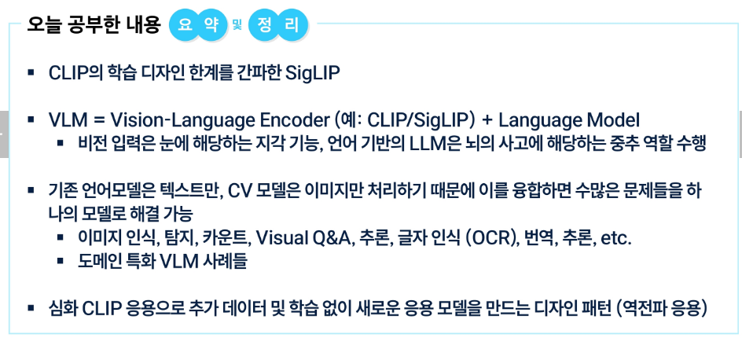

-------
# 📌 small VLM과 파운데이션 모델들 소개
> **학습 목표**
> - 경량화 VLM모델들이 어떤 것들이 있는지 살펴보고, 디자인 패턴과 특징 이해
> - 한국어 VLM의 별도 개발 필요성 이해
> - Segment Anything, Grounding DINO를 비롯한 이미지/비디오 생성 모델, 3D 복원 모델들의 기능과 이불력, 활용 설명
> - 이미지/ 영상 파운데이션 모델들의 산업에 미치는 영향력 알기

## 🔻 Small Vision-Language Models(sVLM)
### 1-1.OpenVLM
- **VLM 성능 리더보드: 너무 무겁다** -> 경량화 모델 필요성 높아짐

### 1-2.sVLM


### 1-3. SmolVLM


### 1-4. Moondream 0.5B


### 1-5. Gemini Nono
#### 온 디바이스용 경량 Gemini 
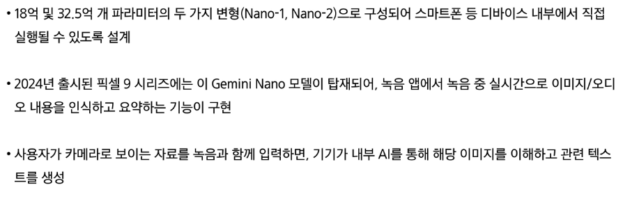

### 1-6. 갤럭시 온디바이스 AI
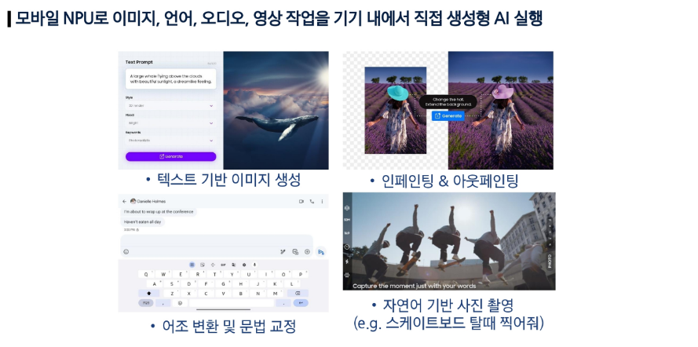

### 1-7. 기타 sVLM
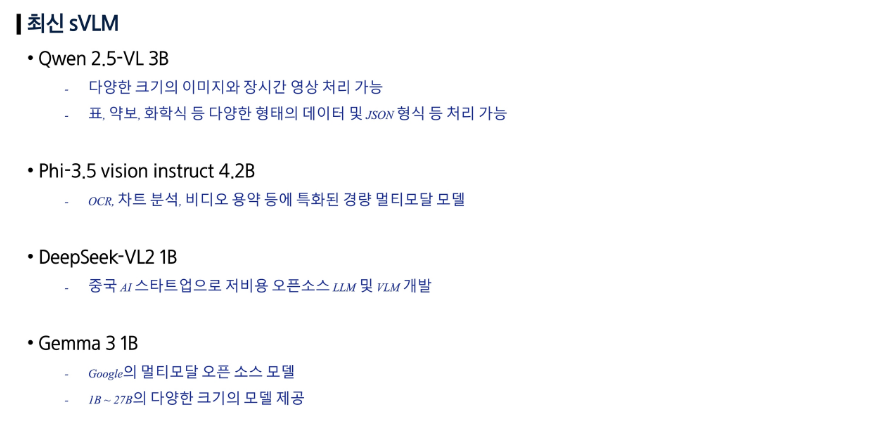

## 🔻 한국어 sVLM
### 2-1. 언어별 구조적, 형태적 차이에 따른 토큰화 복잡성
#### 언어별 토근 길이 격차 (토큰 정보밀도 차이)

- 컨텍스트: AI 모델이 대답을 생성할 때 참고하는 주변 정보, 문맥, 대화의 흐름(이력)

#### 토큰나이저의 언어 편중 이슈


#### 토큰을 줄이려는 시도 - 한국어

- 한국어가 영어 중심으로 사전 학습된 인공지능 토크나이저에서 얼마나 비효율적으로 쪼개지는지, 그리고 단어장을 확장했을 때 토큰화 효율이 어떻게 개선되는지를 보여주는 예시

### 2-2. 한국어 sVLM 모델
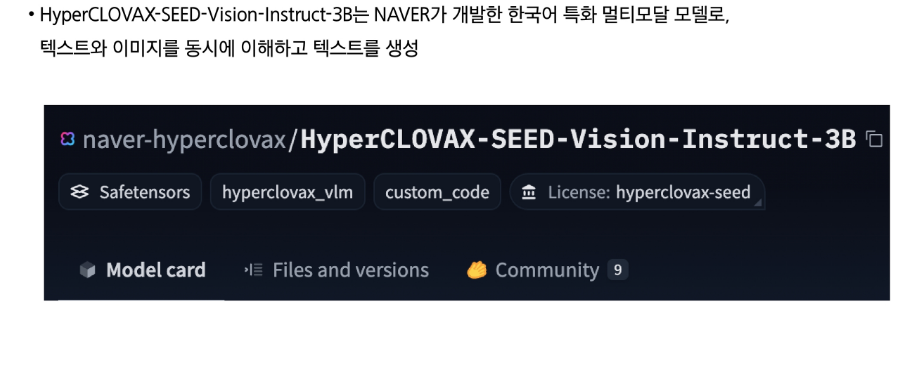
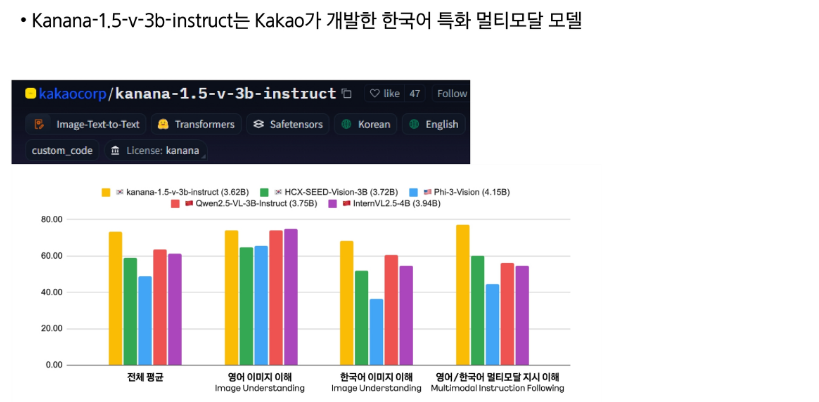
- LMDeploy는 LLM의 효율적 압축, 배포, 서빙을 지원하는 오픈소스 툴킷
  - internvl, qwen, deepseek, phi 등 다양한  vlm 제공

## 🔻 다른 이미지 파운데이션 모델들 소개
### 2-1. 이미지 파운데이션 모델
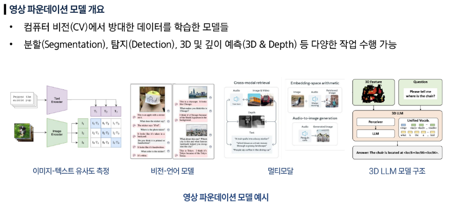

#### 2-2. 이미지 세그멘테이션 모델: SAM, 원하는 영역 마스크
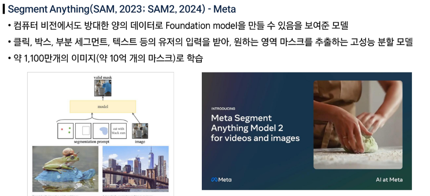
- 이미지 세그멘테이션(Image Segmentation): 인공지능이 이미지를 볼 때 "픽셀 단위로 선을 깔끔하게 따서 배경과 각 물체를 오려내는 기술"
<details>

1. 어디를, 어떻게, 뭘 분할한다는 건가요?
   1) 무엇을 (What): **원하는 영역의 '마스크(Mask)'**
   여기서 '마스크'란 이미지에서 내가 관심 있는 특정 물체나 영역만 색칠해서 구분해 둔 경계 지도를 의미합니다.

   예를 들어 사람 사진이 있다면, 사람 모양 그대로 픽셀 하나하나를 검은색 배경과 분리하여 오려낸 영역이 바로 마스크입니다.

   2) 어디를 (Where): 이미지 속의 모든 사물과 배경
   물체: 사람, 자동차, 강아지, 의자, 컵 등

   배경: 하늘, 도로, 건물, 인도 등

   이미지 전체에서 "어디부터 어디까지가 사람이고, 어디부터 어디까지가 배경인가?"를 영역별로 나누게 됩니다.

   3) 어떻게 (How): **픽셀(Pixel) 단위**로 촘촘하게
   일반적인 사물 인식(Object Detection)은 물체 주변에 네모 상자(Bounding Box)만 쳐줍니다.
    - 하지만 세그멘테이션(Segmentation)은 네모 상자가 아니라, 물체의 실제 곡선과 테두리를 따라 정확하게 픽셀 단위로 분할해 냅니다.
</details>

#### 2-2. 이미지 내 물체 탐지 모델: DINO, 높은 일반화 성능
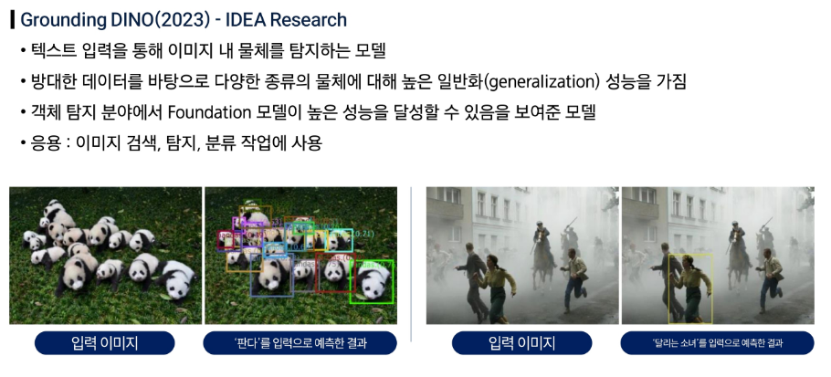

#### 2-2. 이미지 내 인스턴스 탐지 및 세그멘테이션 모델: SAM + DINO
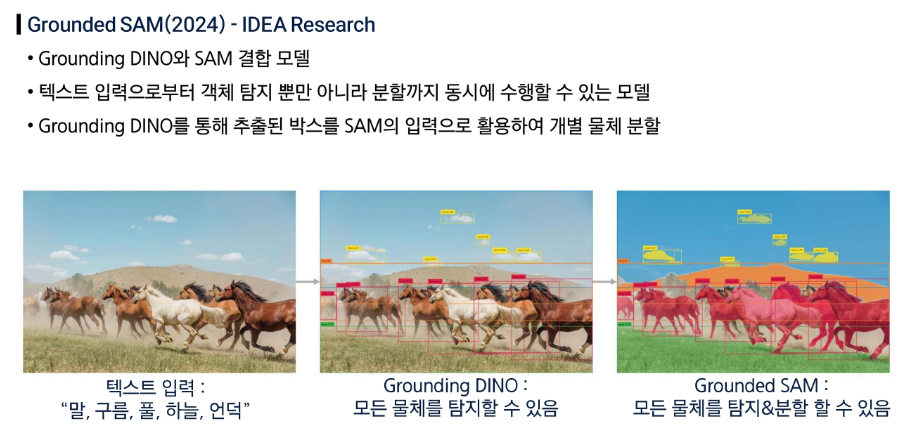

#### 2-2. 비디오 내 인스턴스 탐지 및 세그멘테이션 모델: SAMURAI, 물체 트랙킹
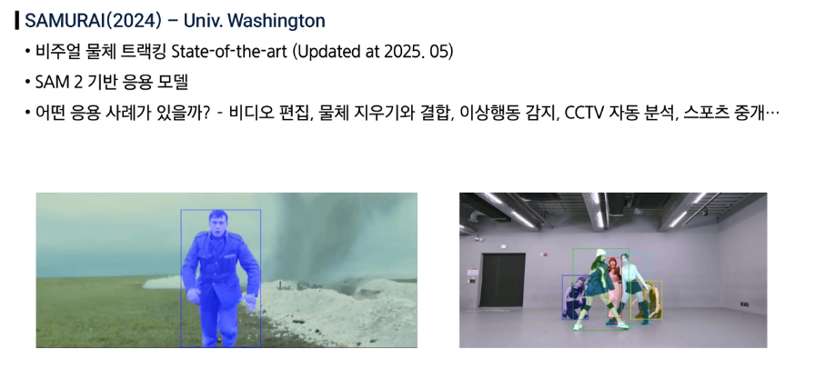

### 2-3. 영상 생성 파운데이션 모델들
#### 이미지 생성 모델
- 대규모 이미지로 학습되어 텍스트 설명을 토대로 새로운 이미지를 생성
  - 응용 사례1: 텍스트 외에 다양한 조건을 입력받아 이미지 생성
  - 응용 사례2: 텍스트 기반 3D 객체 생성

#### 생성 모델 기초
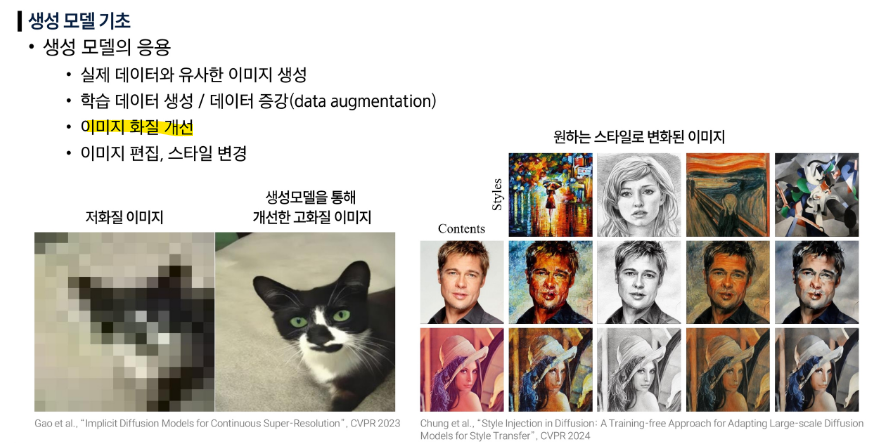

- 데이터 분포 Pdata(x) 는 알 수 없음. 우리가 태어날 때 어떤  x, y 가 만나서 생성될 지 알 수 없는 것처럼
  - 분포는 생성되는 과정


- 모델의 데이터 분포 $\mathbb{P}_{\text{model}}(x)$ (또는 $p_\theta(x)$): 우리가 설계한 신경망(Neural Network)에 파라미터 $\theta$(가중치, 편향)를 부여하여 진짜 분포 $\mathbb{P}_{\text{data}}(x)$를 흉내 내도록 만든 가상의 확률 분포 함수
  

- 가우시안: 정규분포 -> 쓰기 쉬워서
- 디퓨전모델: 랜덤 샘플링 -> 가우시안 정규 분포 생성 -> 조금씩 디노이즈 -> 이미지 생성


- 디퓨전 모델이 최선이야? -> LDM
- 저해상도 -> 노이즈 더함 -> 노이즈 없애면서 생성

#### LDM(Latent Diffusion Model) 구조
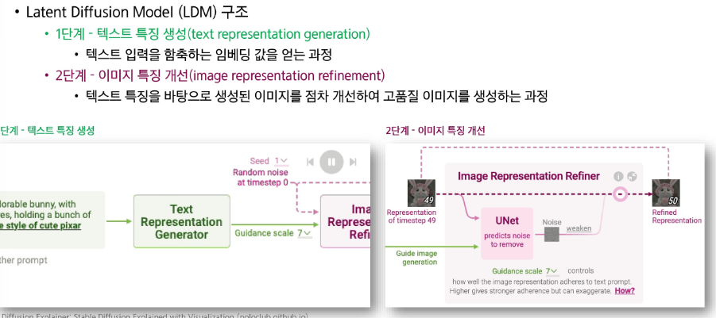

### 2-3.이미지 생성 모델
#### Closed 이미지 생성 모델
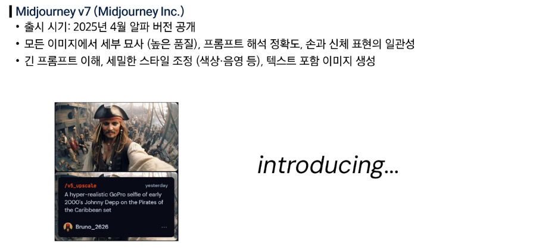

#### Open Source 이미지 생성 모델
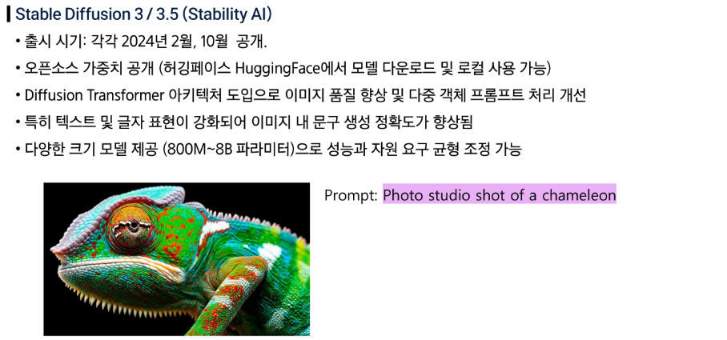
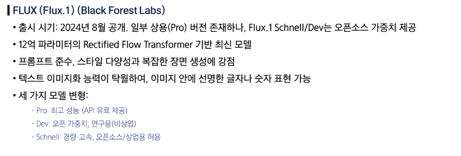

#### 파인튜닝으로 용도 변경
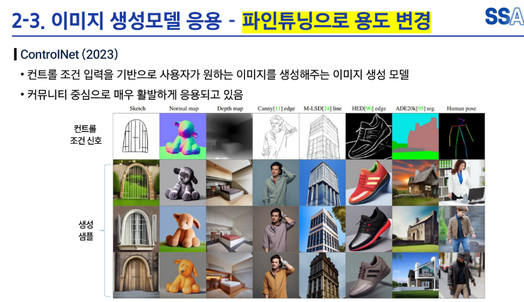
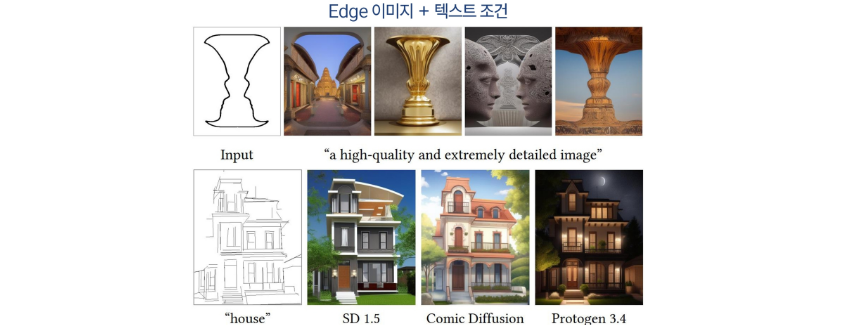
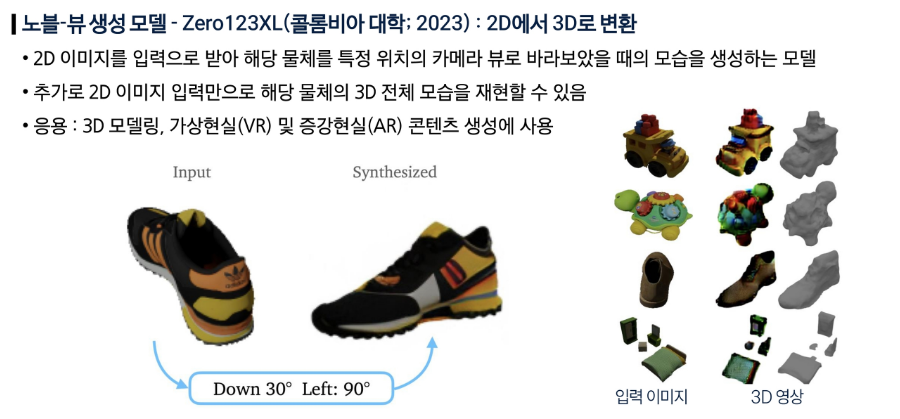
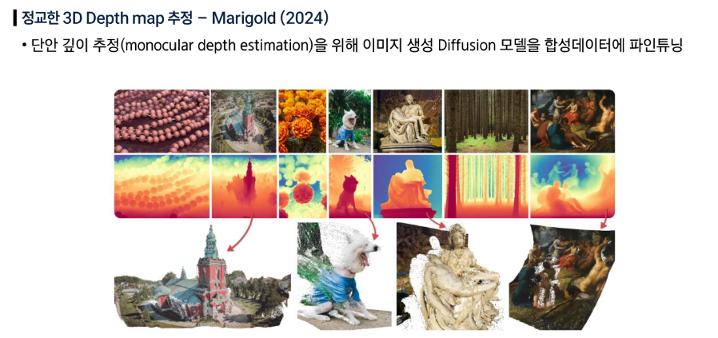
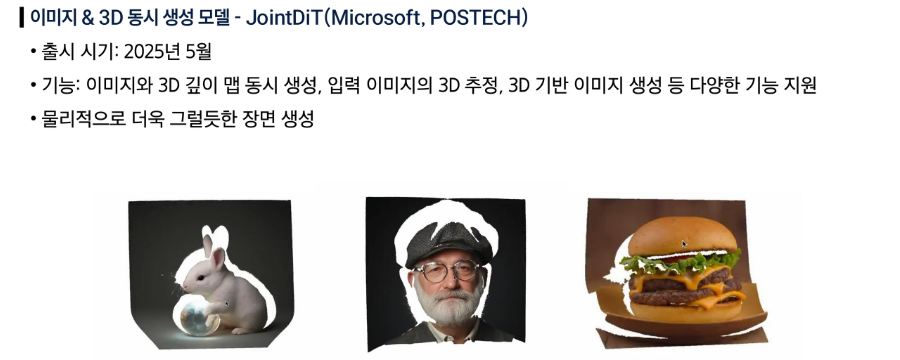

### 2-4. 3D 파운데이션 모델
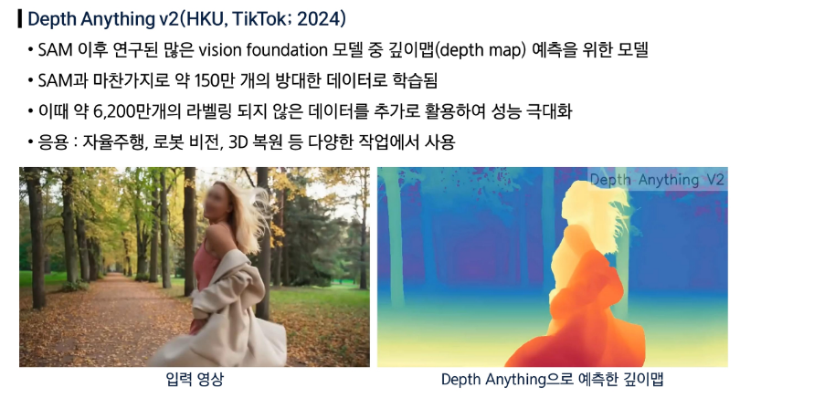
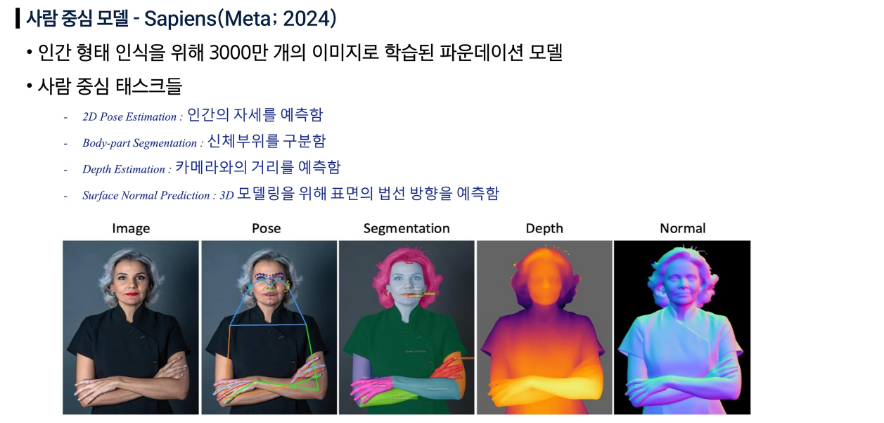

### 2-5.Closed  비디오 생성 모델
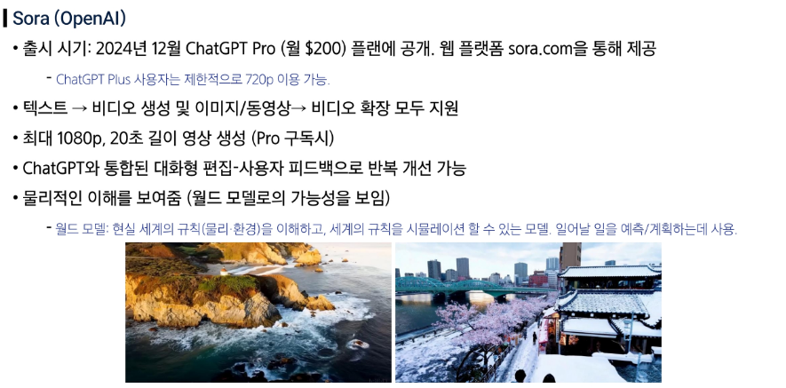
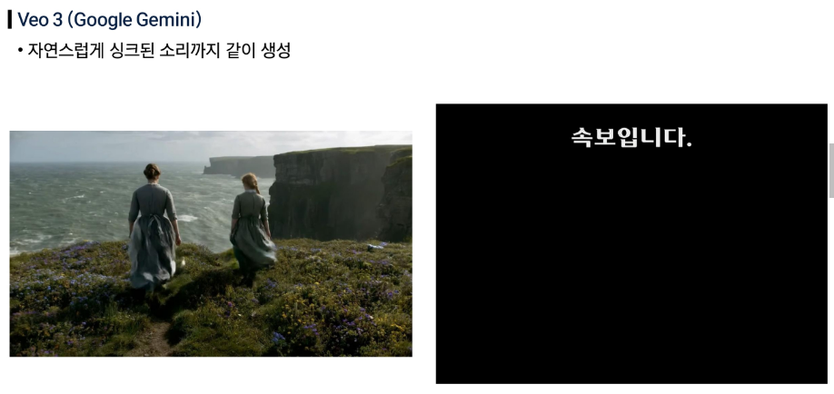
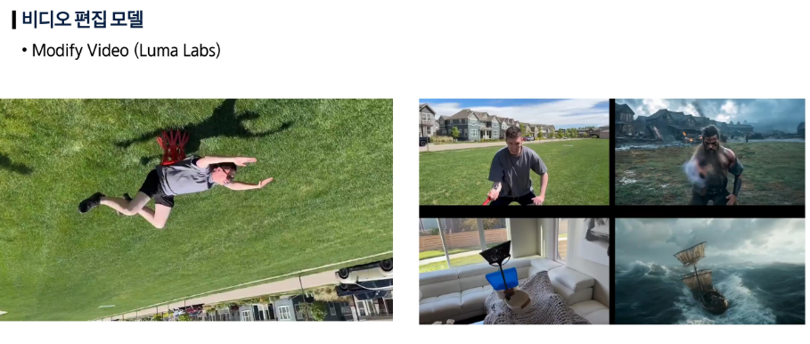
- AI가 만든 광고/영화 - 코카콜라


#### 응용사례
- 비디오 생성 모델 기술 스택 사례
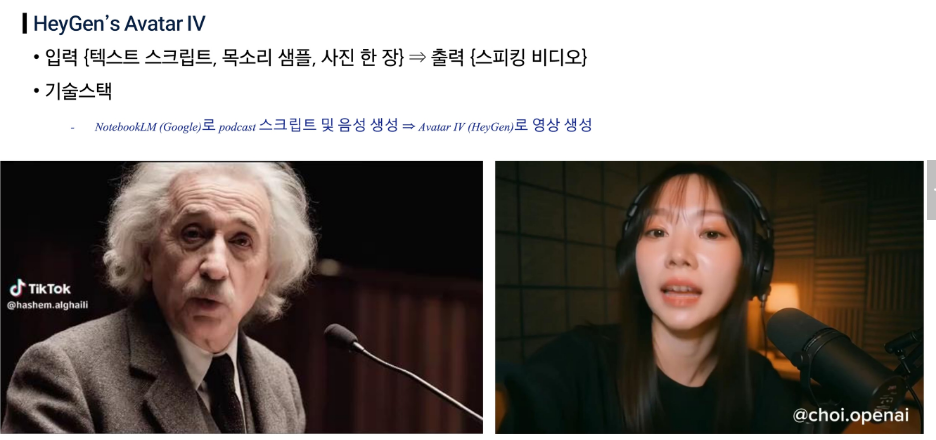

- Open Source 비디오 생성 모델
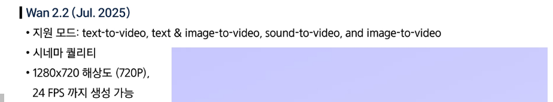

### 2-6. Dynamic 3D 파운데이션 모델
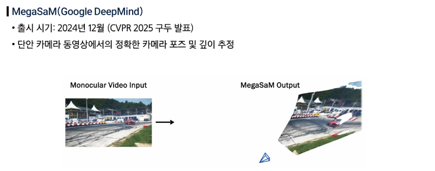
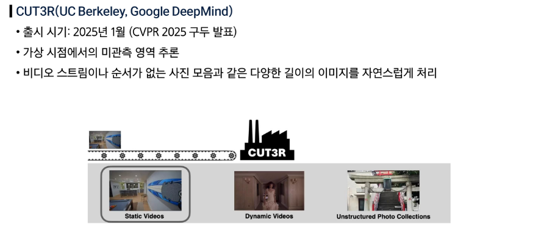

### 2-7.Audio-Vision Language Models
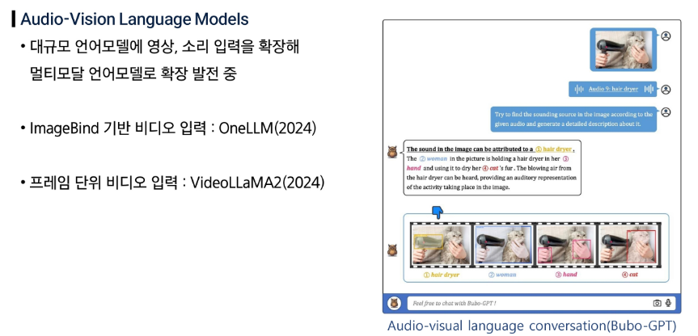

### Toward Unified Foundation Models
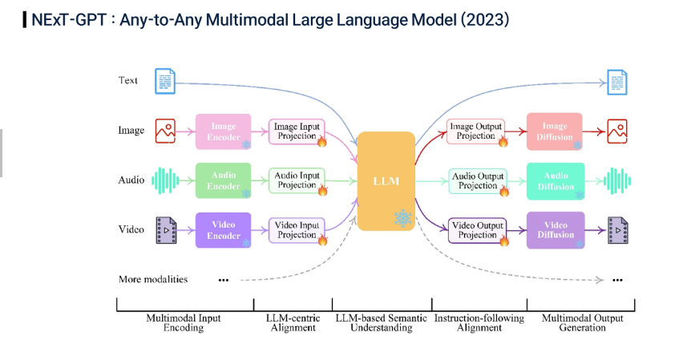

### 유용한 파운데이션 모델들 정리
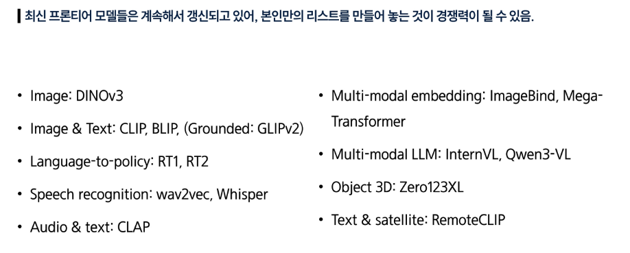

### 요약 정리
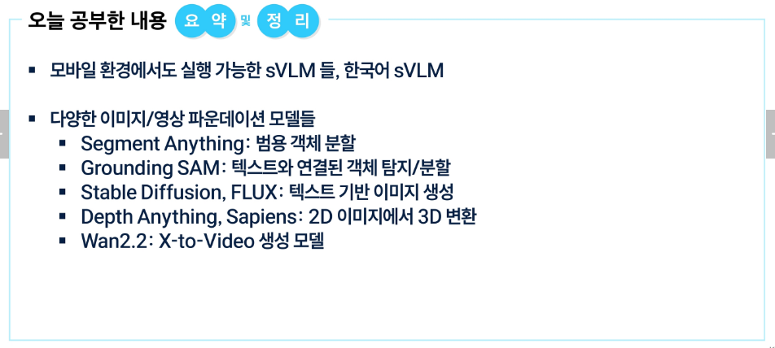

# 📌 개인화, 합성 데이터 활용 사례
> **학습 목표**
> - 도메인 특화, 개인화 모델 확보를 위한 적응 학습법들이 어떤 것들이 있는지 설명할 수 있다.
> - 적응 학습법들의 개념을 구분하여 설명할 수 있다.
> - 합성데이터의 사례를 파악하고, 역할과 응용법을 고찰한다.
> - (실습) HuggingFace와 Gradio를 활용해 간단한 모델 서빙과 배포를 할 수 있다.

## 🔻 파운데이션 모델의 주 응용 방법: 적응 학습
### 1-1. 파운데이션 모델 + Fine-tuning

#### 파운데이션 모델 (Foundation model)과 미세조정(Fine-tuning)이 필요한 이유

• 방대한 데이터로 학습된 초대형 딥러닝 모델. 다양한 작업이나 범용적인 문제에 바로 적용 가능
• 최근에는 텍스트 뿐만 아니라 이미지, 오디오, 비디오 등의 다양한 입력 데이터를 처리할 수 있는 멀티모달로 확장
• 하지만 최신 정보나 특정한 작업/도메인에 최적화 되어 있지 않아, 즉시 활용이 어려운 경우가 반드시 있음

#### 미세조정 (Fine-tuning): 추가 학습을 통해 이미 학습된 모델을 조금만 튜닝하는 것

• 미세 조정(fine-tuning)을 통해 특정 작업에 특화된 모델을 개발할 수 있다

• 파운데이션 모델 + Fine-tuning = 실용적인 개인화 파운데이션 모델
  - 적은 데이터로 학습 가능
  - 학습 리소스 절약 가능
  - 특정 작업에 대한 우수한 성능


### 1-3. 하이퍼파라미터 - Learning Rate(반영 비율)
- gradient(경사): 미분을 통해 구한 기울기
- 뉴럴넷 모델(인공신경망): [입력층 Input Layer] ──> [은닉층 Hidden Layer(s)] ──> [출력층 Output Layer] 

<details><summary>대표적인 뉴럴넷 모델 종류</summary>


| 모델 종류 | 핵심 특징 | 주요 활용 분야 |
| --- | --- | --- |
| **ANN / MLP** (다층 퍼셉트론) | 가장 기본이 되는 일자형(Dense) 신경망 | 기본적인 회귀 예측, 단순 데이터 분류 |
| **CNN** (합성곱 신경망) | 공간적/시각적 특징(격자 구조)을 잘 추출 | 이미지 분류, 누끼 따기, 사물 인식 |
| **RNN / LSTM** | 순차적 데이터(시계열/텍스트)의 맥락을 기억 | 주가 예측, 초기 음성 인식 |
| **Transformer** | Self-Attention 메커니즘으로 긴 맥락을 병렬 처리 | GPT, Llama, BERT, Translation |
| **ViT** (Vision Transformer) | 이미지를 패치 단위로 나누어 트랜스포머에 적용 | 이미지 분류, 멀티모달(LLaVA, CLIP) |
| **GAN / Diffusion** | 노이즈나 가상 데이터로부터 새로운 샘플 생성 | Midjourney, DALL-E, 이미지/음성 생성 |


###### 한 줄 요약

> **뉴럴넷 모델**은 **"입력 데이터 $\rightarrow$ 가중치 연산 $\rightarrow$ 오차 확인 $\rightarrow$ 역전파로 가중치 수정"** 과정을 수없이 반복하며, 데이터 속 패턴을 스스로 학습해 나가는 인공지능의 핵심 뼈대입니다.

</details>

<br>


#### 너무 낮은 learning rate 값
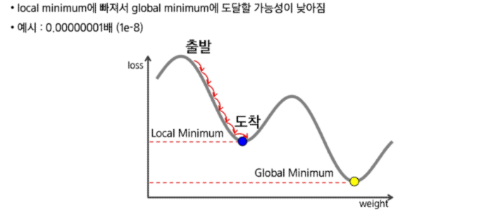

#### 너무 높은 learning rate 값
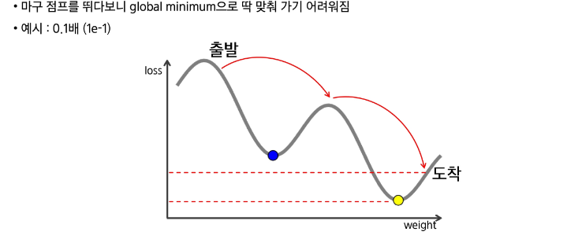
- 마구 점프를 뛰다보니 global minimum으로 딱 맞춰 가기 어려워짐
- 미세조정에서는 좋은 시작점에서부터 시작하기 때문에 작은 learning rate부터 보수적으로 시작해야 함

<details><summary>경사하강법 손실 함수 최저점(global, local)</summary>

머신러닝과 딥러닝의 최적화(Optimization) 과정에서 만나는 Local Minimum(최적의 지역적 최소점)과 **Global Minimum(전역 최저점)** 개념입니다.

##### 개념 및 차이점

모델이 경사하강법(Gradient Descent)으로 손실(Loss)을 줄여나갈 때, 손실 함수의 그래프 모양을 언덕과 골짜기 지형에 비유할 수 있습니다.

```text
Loss
 ^
 │       /\
 │      /  \       Local Minimum
 │  ___/    \_______  (지역 최저점: 주변보다 낮음, 하지만 더 낮은 곳이 있음)
 │ /                \
 │/                  \          Global Minimum
 │                    \________  (전역 최저점: 전체 그래프에서 가장 낮은 최적의 지점)
 └───────────────────────────────────────> Weights (파라미터)

```

* **Global Minimum (전역 최저점)**
  * 손실 함수 전체 공간에서 **가장 낮은 오차(Loss) 값을 가지는 단 하나의 최고 지점**입니다.
  * 모델이 이 점에 도달했을 때 가장 이상적이고 정밀한 예측 능력을 갖추게 됩니다.


* **Local Minimum (지역 최저점)**
  * 주변 공간들에 비해서는 찌그러진 골짜기처럼 낮아서 기울기(Gradient)가 $0$이 되는 지점이지만, **전체 그래프를 봤을 때는 더 낮은 지점(Global Minimum)이 따로 존재하는 상태**입니다.
  * 경사하강법은 기울기만 보고 밑으로 내려가기 때문에, 한번 Local Minimum에 빠지면 기울기가 $0$이 되어 더 이상 움직이지 못하고 "함정"에 갇히게 됩니다.


> **Global Minimum**은 전체에서 **가장 오차가 적은 '진짜 정답 골짜기'** 이고, **Local Minimum** 은 진짜인 줄 알고 **잘못 갇히기 쉬운 '가짜 웅덩이'** 입니다.
</details>
<br>

### 1-4. Parameter-Efficient Fine-Tuning(PEFT)
#### AI 모델의 크기
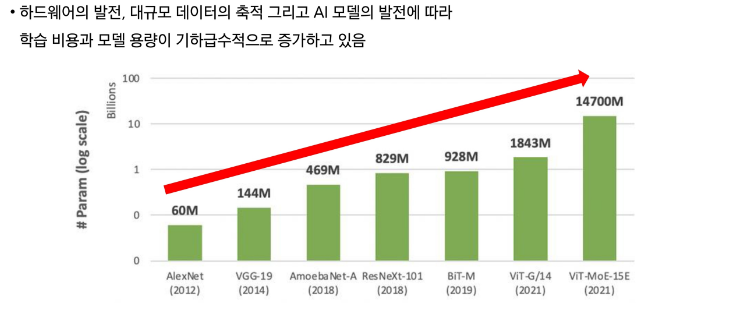
#### 효율적인 모델 학습: LoRA(추가 파라미터 학습)
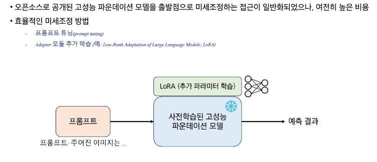
#### 프롬프트 디자인
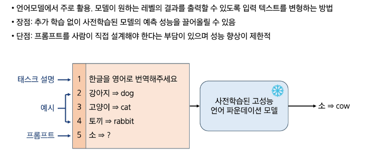
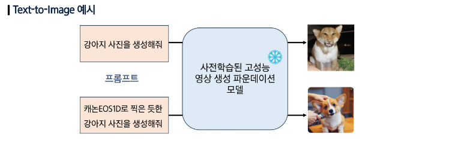

#### 프롬프트 튜닝(2021): 학습 가능 프롬프트
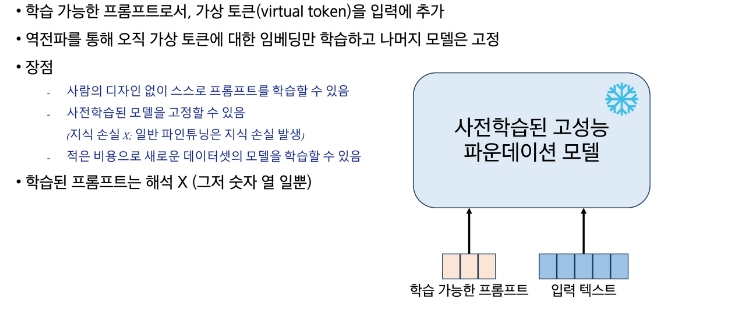


#### Adaptor 모듈 추가 학습
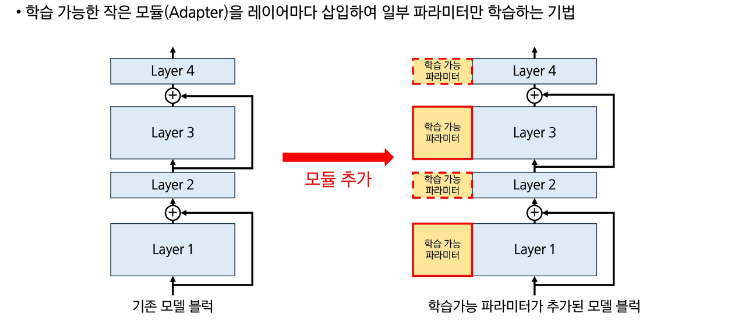

### 1-5. 개인화 모델 예시
#### 프롬프트 튜닝 응용 사례 - DreamBooth
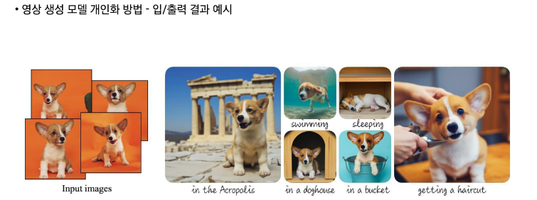
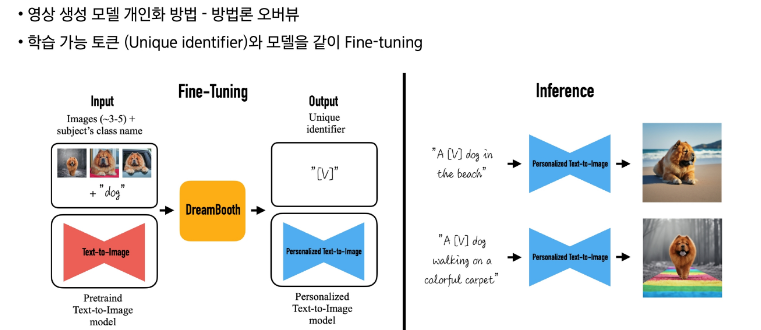

## 🔻 데이터 효율화를 위한 합성 데이터 사용
### 2-1. 합성데이터 활용법 1
#### Knowledge Distillation (Teacher-Student 학습)
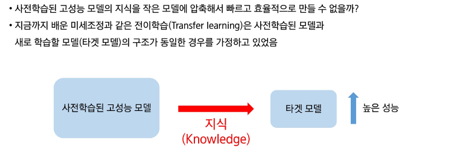

#### 지식증류: 높은 성능의 무거운 모델(선생님)을 모방하도록 가벼운 모델(학생)을 학습하는 방법
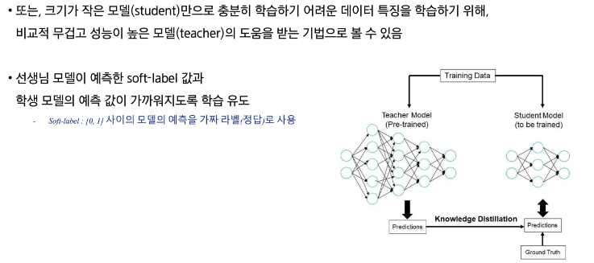
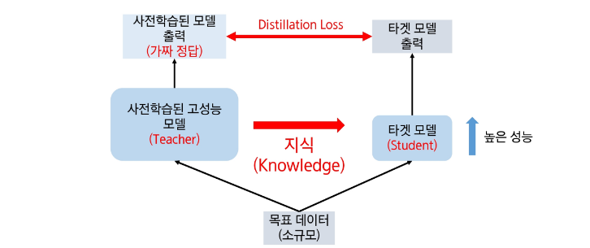
<details>

지식 증류(Knowledge Distillation)는 **크고 무거운 모델(Teacher)이 가진 지식을 작고 가벼운 모델(Student)에게 전수**하여, 작은 모델의 성능을 크기가 커서 똑똑했던 원래 모델 수준에 가깝게 올려놓는 딥러닝 경량화 기술입니다.


##### 1. 왜 필요한가요?

  * **문제점**: GPT나 ViT 같은 거대한 대형 모델들은 성능이 매우 뛰어나지만, 연산량이 너무 많고 메모리를 많이 차지해서 **스마트폰, 자율주행 차, IoT 기기 등 온디바이스(On-device) 환경에서 실시간으로 돌리기 어렵습니다.**
  * **해결책**: 무거운 대형 모델을 그대로 쓰기보다, 핵심 지식만 압축시켜서 전달받은 가벼운 소형 모델을 만들어 **배포 속도를 획기적으로 늘리고 메모리 사용량을 줄입니다.**

##### 2. 어떻게 학습하나요? (핵심 원리)

**학생 모델은 단순히 정답(Hard Label, 예: "이 사진은 고양이다 = 1")만 보고 학습하는 것이 아니라, 스승 모델이 내놓은 확률 값(Soft Label/Target)을 학습합니다.**

```text
[입력: 고양이 사진] 
       │
       ├─► [Teacher (대형 모델)] ──► 고양이: 85%, 강아지: 12%, 호랑이: 3%  ──┐
       │                                                                  ├──> [지식 증류 Loss]
       └─► [Student (소형 모델)] ──► 고양이: 60%, 강아지: 30%, 호랑이: 10% ──┘

```

* **Soft Label이 주는 풍부한 지식**:
  * 단순 정답인 `[고양이: 1, 강아지: 0, 호랑이: 0]`만 보면 "이게 강아지랑 비슷한지, 호랑이랑 비슷한지" 알 수 없습니다.
  * 하지만 스승 모델의 출력값 `[고양이: 85%, 강아지: 12%, 호랑이: 3%]`을 같이 학습하면, 제자 모델은 "고양이인데 호랑이보다는 강아지와 생김새 특징이 조금 더 유사하구나!"라는 정교한 오답 간의 상관관계(Dark Knowledge)까지 배우게 됩니다.

  > **지식 증류**는 **크고 똑똑한 스승 모델의 '부드러운 확률 출력값(Soft Label)'을 작은 제자 모델이 추종하게 하여, 가벼우면서도 성능이 우수한 경량화 모델을 만드는 기술**입니다.
</details>
<br>

### 2-2.합성데이터 활용법2
#### 파운데이션 모델들을 툴로 활용하는 방법 - InstructPix2Pix (2023)
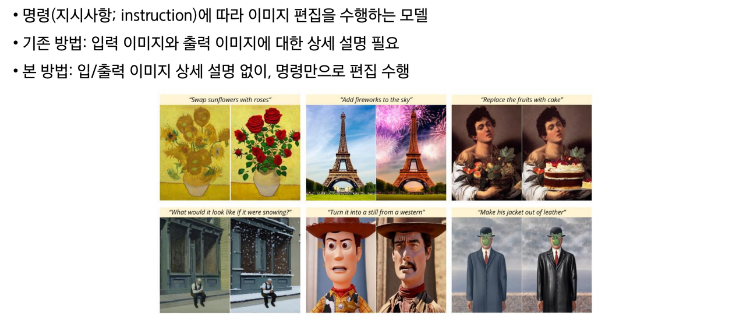

#### InstructPix2Pix 방법
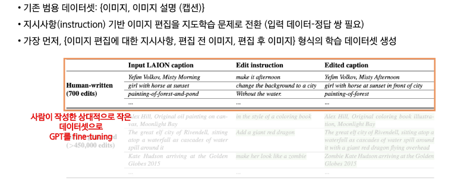
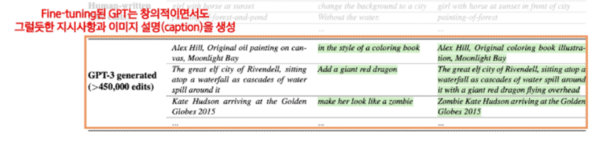
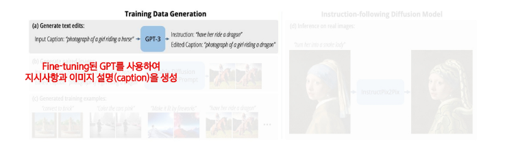
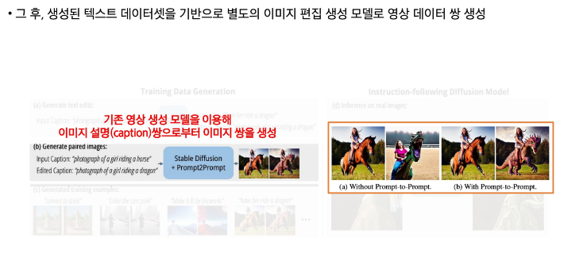
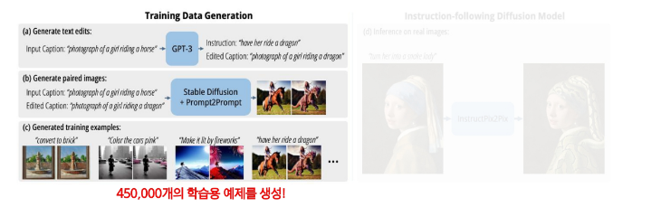
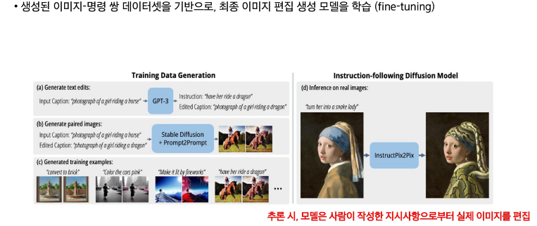

#### InstructPix2Pix 결과
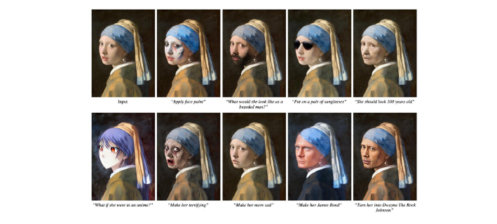

#### InstructPix2Pix 종합
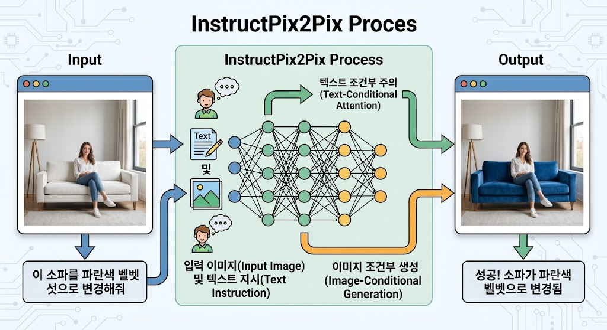
- 텍스트 조건부: "어떤 내용을 새로 그릴 것인가(What)?"
  - "사용자의 텍스트 지시사항"에 전적으로 의존하여 이미지의 특정 픽셀들을 새로 생성하거나 수정할 때 텍스트 속 키워드에 집중하는 것
- 이미지 조건부: "어디에, 어떻게 원래 구조를 유지할 것인가(Where & How)?"
  - "원본 입력 이미지"에 포함된 구조, 객체의 위치, 배경 등의 정보를 기준으로 원본의 핵심 요소들에 집중하는 것

### 2-2.합성데이터 활용법2'
#### LLaVA 학습 데이터
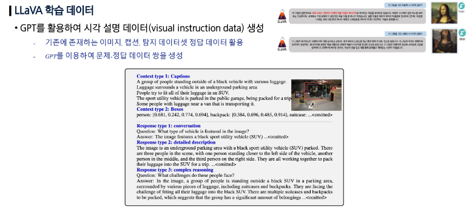

### 2-3. 합성데이터 활용법 3
#### 간단한 시뮬레이션 기반 합성 데이터: 실제 데이터를 모방하거나 새로 생성한 인공 데이터
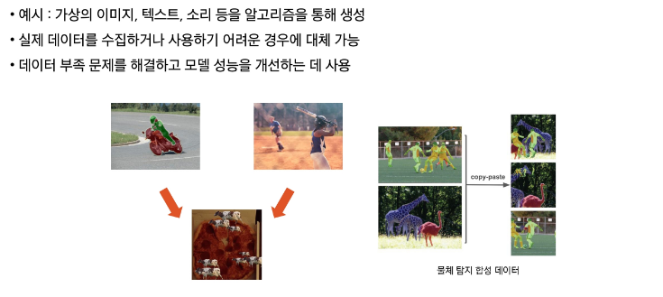

#### 합성 데이터는 데이터 취득이 어려운 문제에서 특히 더 유용

• 실제 촬영하기 어려운 움직임이나 환경을 시뮬레이션하여 다양성 높은 데이터를 생성 가능
• 예시) 모션 증폭 : 심박수 변화, 건물 진동 등의 미세한 움직임을 합성 데이터를 통해 학습 가능

#### 유의사항
• **라벨 품질의 불일치 (Label Inconsistency)**
  - 합성 데이터를 만들 때 사용하는 VLM 또는 LLM 기반 라벨러가 항상 일관적인 기준으로 라벨을 생성하지 않음.
  - 같은 객체라도 프롬프트 방식·모델 버전·컨텍스트에 따라 라벨 표현이 달라질 수 있음
    *ex) "기타(guitar)" → "electric guitar", "guitar player", "acoustic instrument" 등 서로 다른 라벨*
  - **개선 방안**: 라벨 정규화, 클래스 사전, 교차 모델 검증, 휴먼 검수

• **할루시네이션(Hallucination)**
  - 합성 데이터 생성 모델이 실제 존재하지 않는 객체, 특징, 관계를 마음대로 만들어내는 현상.
  - 실제 세계와 다른 패턴을 학습해 오류와 편향을 강화함.
    *ex) 손가락 6개 이미지, 물리적으로 불가능한 그림자가 지속적으로 합성됨*
  - **개선 방안**: 정교한 프롬프트, 후처리 Refiner, 사실성 검증 모델, 실데이터 혼합


## 🔻 NEXT
### 3-1. AGI를 향해서
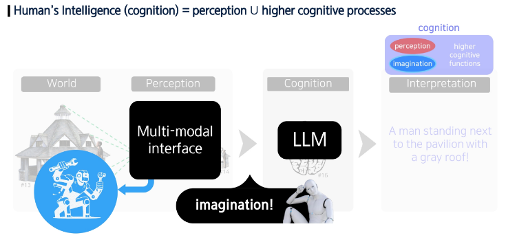

#### Sora by OpenAI: 텍스트 - 비디오 생성 모델
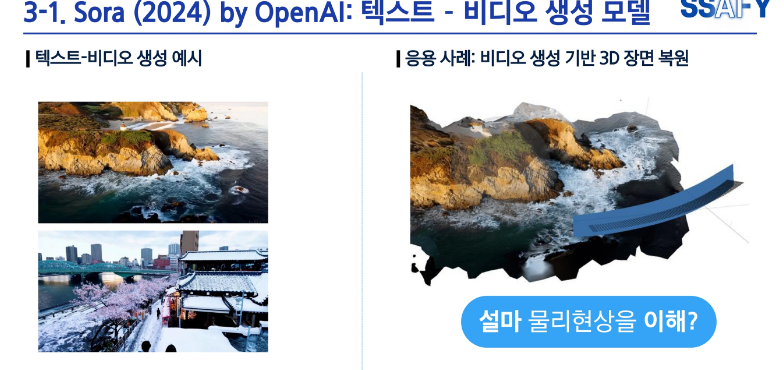
- **월드 모델로의 잠재성**
  - 로봇 제어와 같은 Embodied AI의 핵심 컴포넌트로 주목 받고 있음

### 3-2. 언어모델 + 검색증강생성
#### 언어모델(LLM) + 검색증강생성(Retrieval Augmented Generation; RAG)
• 유연성 : 추가 학습 없이 최신 정보 제공
• 개인화 : 검색과 언어모델의 합성으로 개인 맞춤형 답변 가능
• 정확성 : Verification을 통한 환각(Hallucination) 현상 감소

- RAC: Retrieval-Augmented Classifier (검색 증강 분류기)
  - 입력된 데이터에 대해 분류(Classification) 예측을 수행할 때, 내부 분류기(Neural Network)의 정보만 사용하는 것이 아니라 외부 데이터베이스/메모리에서 관련 유사 사례(예시, 패치, 임베딩)를 검색(Retrieval)하여 결합해 판단하는 모델 구조입니다.

### 3-3. AGI를 향해서 - 툴 증강 언어모델
#### Tool augmented LLM (Agent)
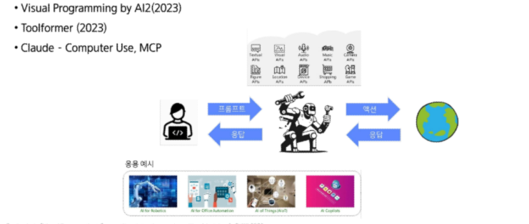

#### Visual Programming (2023)
• 언어 모델의 추가 학습 없이 주어진 툴을 사용하여, 사용자가 텍스트로 요청한 영상 처리를 수행
- 사전 정의된 툴들 존재 (Python APls)
- 응용 사례: 영상 질의응답, 영상 편집, 영상 기반 추론

#### Claude Computer Use: 텍스트를 기반으로 컴퓨터를 사람처럼 사용할 수 있는 서비스
• 컴퓨터가 수행하길 바라는 지시사항을 텍스트로 입력하면 자동으로 명령 수행
• 각 명령어를 실행하는 agentic tool로 구성되어 있는 서비스
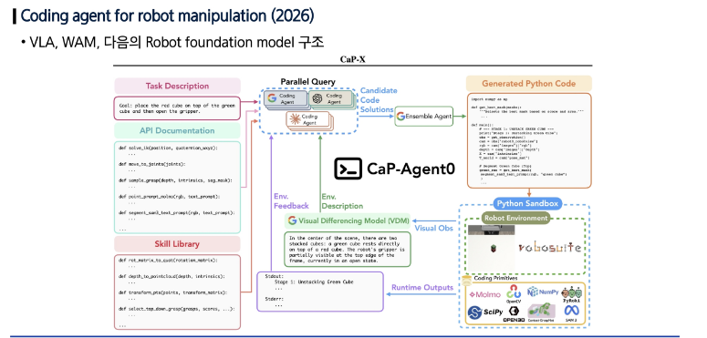

### 3-4. Multi-Agent 시스템으로의 확장
#### Agent Laboratory
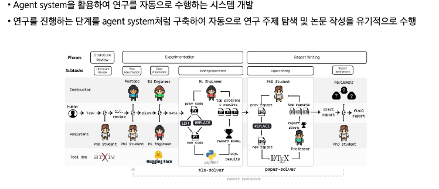

## 🔻 강의 정리
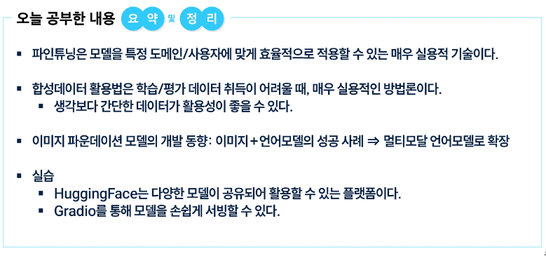