- **www**: 인터넷으로 연결된 컴퓨터들이 정보를 공유한은 거대한 정보 공간, world wide web
- **web**: web site, web application 등을 통해 사용자들이 정보를 검색하고 상호 작용하는 기술
- **web site**: 인터넷에서 여러 개의 **web page**가 모인 것으로, 사용자들에게 정보나 서비스를 제공하는 공간
- **web page**: html, css 등의 웹 기술을 이용하여 만들어진, web site를 구성하는 하나의 요소  
   > web page는 html(구조), css(스타일), javascript(행동)으로 구성됨

<br>


[toc] 


# HTML
:웹 페이지의 의미와 구조를 정의하는 언어

- **hypertext**: 웹 페이지를 다른 페이지로 연결하는 링크
    - 참조를 통해 사용자가 한 문서에서 다른 문서로 즉시 접근할 수 있는 텍스트
    - 비선형성 / 상호연결성 / 사용자 주도적 탐색
    ** 비선형: y = x가 일정하지 않음.  
<br>
- **markup language**: 태그 등을 이용하여 문서나 *데이터의 구조*를 명시하는 언어
    - 인간이 읽고 쓰기 쉬운 형태이며, 데이터의 구조와 의미를 정의하는데 집중
    - ex) html, markdown
    - 변환 과정
        1. 구조 형식 없는 원본 데이터
        2. 사람이 이해하도록 구조 부여
        3. html 구조 완성
        4. 웹 브라우저가 html 코드 해석한 실제 웹 페이지 화면

<br>

## 웹 구조화

### HTML 구조

`<!DOCTYPE html>`: 해당 문서가 html 문서라는 것을 나타냄
`<html></html>`: 전체 페이지의 콘텐츠를 포함
`<head></head>`: html 문서에 관련된 설명, 설정 등 컴퓨터가 식별하는 메타데이터를 작성
- 사용자에게 보이진 않음
** 메타데이터: 데이터를 설명하는 데이터

`<title></title>`: 브라우저 탭 및 즐겨찾기 시 표시되는 제목으로 사용

`<body></body>`: html 문서의 내용을 나타냄
- 페이지에 표시되는 모슨 콘텐츠를 작성
- 한 문서에 하나의 body 요소만 존재
<br>

#### HTML Elements(요소)
- 하나의 요소는 **여는 태그**와 **닫는 태그** 그리고 그 안의 내용으로 구성
- 닫는 태그는 태그 이름 앞에 슬래시가 포함됨
    - 닫는 태그가 없는 태그도 존재

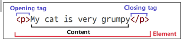

<br>

#### HTML Attributes(속성)
- **사용자가 원하는 기준에 맞도록 요소를 설정하거나 다양한 방식으로 요소의 동작을 조절하기 위한 값**
<br>
- 목적

    - 나타내고 싶지 않지만 추가적인 기능, 내용을 담고 싶을 때 사용
    - *CSS*에서 스타일 적용을 위해 해당 요소를 선택하기 위한 값으로 활용됨
<br>

-  작성 규칙

    1. 속성은 요소 이름과 속성 사이에 공백이 있어야 함
    2. 하나 이상의 속성들이 있는 경우 속성 사이에 공백으로 구분함
    3. 속성 값은 앞뒤에 따옴표로 감싸야 함

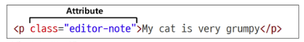

<br>

`<p>`: Paragraph(문단)의 약자로, 텍스트를 작성하는 태그

`<a>`: Anchor(닻)의 약자로, 다른 페이지로 이동시키는 하이퍼링크 태그

``: Image(이미지)의 약자로, src에 지정된 그림을 보여주는 태그

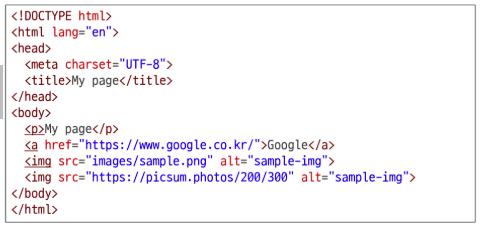
<br>

#### HTML Text Structure

- HTML의 주요 목적 중 하나는 **텍스트 구조와 의미**를 제공하는 것

- 예를 들어 `h1` 요소는 단순히 텍스트를 크게만 만드는 것이 아닌  
  현재 문서의 **최상위 제목**이라는 의미를 부여하는 것

    -  ```<h1>Heading</h1>```

<br>
<h10>TIP 

의미에 맞는 태그 사용은 스크린 리더, 검색 엔진 최적화(SEO)의 기본이 됩니다.

스크린 리더: 화면 내용을 소리로 읽어주는 프로그램
검색 엔진 최적화(SEO): 검색 결과 상단에 내 사이트를 노출시켜 방문자를 늘리는 작업
        

<br>

#### 대표적인 HTML Text structure
- heading & paragraphs
    - h1~6, p
<br>
- lists
    - ol, ul, li
<br>
- emphasis & importance
    - em, strong

<br>

```
참조) web > 01_fundamentals_of_html_css
    - 01_html_basic.html
    - 02_html_text_structure.html
```

<br>

--------
# CSS 
## 웹 스타일링
: 웹 페이지의 디지인과 레이아웃을 구성하는 언어
<br>

### CSS 적용 방법

1. **인라인(inline) 스타일**
- html 요소 안에 style 속성 값으로 잓어
** style 속성 값: 특정 요소 하나에만 css 스타일을 직접 적용하는 방식
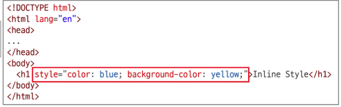


2. **내부(internal) 스타일 시트**
- <u>head 태그</u> 안에 <u>style 태그</u>에 작성
** `<style>` 태그: css 코드를 작성하여 페이지 전체에 적용하는 태그
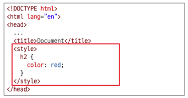


3. **외부(External) 스타일 시트**
- 별도 CSS 파일 생성 후 HTML <u>link 태그</u>를 사용해 불러오기
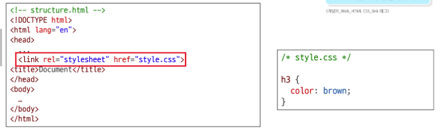


```
스타일 적용 우선순위는 인라인 > 내부 > 외부 순
인라인 스타일은 재사용이 어렵고 유지보수를 방해하니, 테스트나 특수한 경우에만 사용하는 것을 추천합니다.
- 주로 2, 3번 사용
```
<br>

### CSS 구문

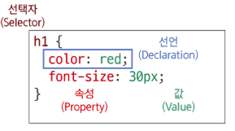

* **선택자(Selector)**
  * '누구를' 꾸밀지 지정하는 부분
  - <u>html 요소를 선택하여 스타일을 적용할 수 있도록 하는 선택자</u>

* **선언(Declaration)**
  * '어떻게' 꾸밀지에 대한 구체적인 한 줄의 명령
  * 속성과 값이 한 쌍으로 이루어지며, 세미콜론(`;`)으로 끝남    

* **속성(Property)**
  * 바꾸고 싶은 스타일의 종류를 나타냄

* **값(Value)**
  * 속성에 적용할 구체적인 설정을 나타냄

<br>

### CSS 선택자 종류
**기본 선택자**
* **전체(`*`) 선택자**
  * HTML 모든 요소를 선택
* **요소(tag) 선택자**
  * 지정한 모든 태그를 선택
* **클래스(`.` (dot)) 선택자**
  * 주어진 클래스 속성을 가진 모든 요소를 선택
* **아이디(`#`) 선택자**
  * 주어진 아이디 속성을 가진 요소 선택
  * 문서에는 주어진 아이디를 가진 요소가 하나만 있어야 함
* **속성(`[]` (대괄호)) 선택자**
  * 주어진 속성이나 속성값을 가진 모든 요소 선택
  * 속성의 존재 여부, 값의 일치/포함 등 다양한 조건으로 요소를 정교하게 선택 가능

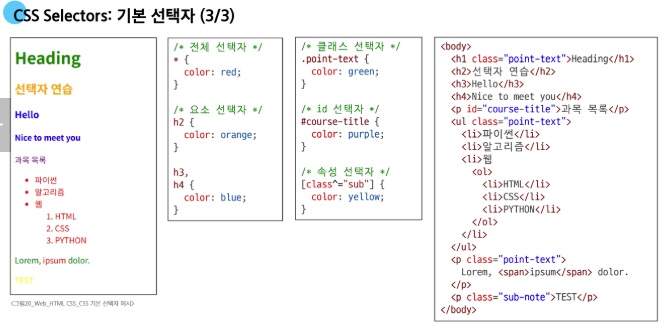
<br>

**결합자 (Combinators)**

* **자식 결합자 (`>`)**
    * 첫 번째 요소의 직계 자식만 선택
    * 예) `ul > li`은 `<ul>` 안에 있는 모든 `<li>`를 선택 
     (한단계 아래 자식들만)
* **자손 결합자 (` ` (space))**
    * 첫 번째 요소의 자손 요소들 선택
    * 예) `p span`은 `<p>` 안에 있는 모든 `<span>`를 선택
     (하위 레벨 상관 없이)

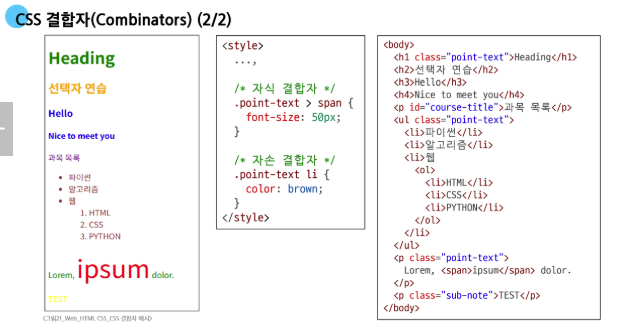
<br>


```
참조) web > 01_fundamentals_of_html_css
    - 04_css_selectors.html
```
<br>
<br>

-----
### 명시도
> **결과적으로 요소에 적용할 CSS 선언을 결정하기 위한 알고리즘**

* 명시도는 '선택자'들의 점수 싸움
* 선택자에 가중치를 계산하여 어떤 스타일을 적용할지 결정
* 동일한 요소를 가리키는 2개 이상의 CSS 규칙이 있는 경우, **가장 높은 명시도를 가진 선택자가 승리**하여 스타일이 적용됨

<br>

#### CSS와 Cascade (캐스케이드)

**CSS** 
* **Cascading** Style Sheet
* 웹 페이지의 디자인과 레이아웃을 구성하는 언어

**Cascade**
* 계단식
* 한 요소에 동일한 가중치를 가진 선택자가 적용될 때 
* CSS에서 마지막에 나오는 선언이 사용됨

<br>

#### 명시도가 높은 순

1. **Importance**
   * `!important`
2. **Inline 스타일**
3. **선택자**
   * `id 선택자` > `class 선택자` > `요소 선택자`
4. **소스 코드 선언 순서**

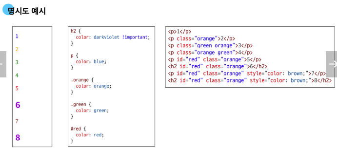
<h13> 3번을 보면 green orange 순인데 class에 적혀있는 순서는 중요하지 않고, 선언 순서가 중요함 => orange보다 green이 나중에 선언되어 green으로 출력됨


<br>

##### 명시도 퀴즈
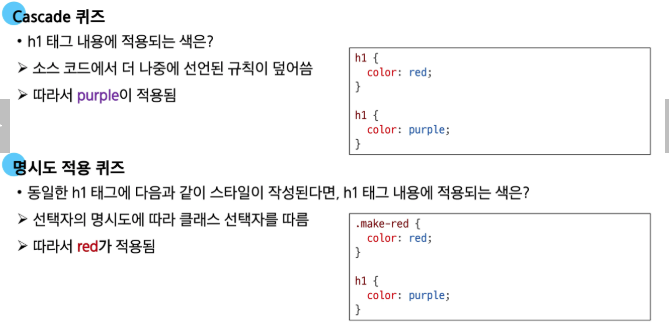

<br>

#### !important
다른 우선순위 규칙보다 우선하여 적용하는 키워드

- Cascade의 구조를 무시하고 강제로 스타일을 적용하는 방식이므로 사용을 권장하지 않음

<br>
<br>
<br>

-----
### 선언: 값과 단위
<br>

#### CSS Declaration (선언)

* **선택된 요소에 적용할 스타일을 구체적으로 명시하는 부분**
```css
h1 {
  color: red; # 선언
  font-size: 30px;
  # 속성       # 값
}
```
<br>

**CSS 선언의 목적**
* 선택자는 '어떤 요소에' 스타일을 적용할지 결정하는 규칙이었고,
* 선택자로 요소를 선택했으니, 이제 중괄호 `{}` 안에 '무엇을' 할지 정의
* 이 '무엇을'에 해당하는 부분이 바로 **선언(Declaration)**

<br>

#### 속성(Property) vs 값(Value)

**속성(Property)**

- 스타일링하고 싶은 기능이나 특성을 의미

- CSS가 미리 정의해 둔 키워드를 사용해야 함

- 예: font-size, background-color, width, margin, padding 등

<br>


**값(Value)**

- 속성에 적용될 구체적인 설정

- 속성이 받을 수 있는 값의 종류는 정해져 있음

- 예: 16px, lightgray, 100%, 10rem 등

<br>

---
#### 값의 단위 (Units)

* color: red; 처럼 키워드로 끝나는 값도 있지만, 크기나 간격을 나타낼 때는 단위가 필수적
* 단위는 크게 **절대 단위**와 **상대 단위**로 나뉨

| 구분 | 단위 종류 | 특징 |
| :--- | :--- | :--- |
| **절대 단위** | `px`, `pt`, `cm` 등 | 다른 요소의 영향을 받지 않는 **고정된** 크기 |
| **상대 단위** | `%`, `em`, `rem`, `vw`, `vh` 등 | **다른 요소**(부모, 화면 표시 영역 등)의 크기에 따라 **상대적**으로 결정 |

<br>

##### 1. 절대 단위의 대표: `px`

* 화면을 구성하는 가장 작은 단위인 **'픽셀'을 기준**으로 하는 절대 단위
* 모니터 해상도에 따라 크기가 결정되며, 직관적이고 예측이 쉬움
<br>

* **장점**
  * 디자인 시안과 거의 동일한 결과물을 만들 수 있음
  * 요소의 크기를 명확하게 고정하고 싶을 때 유용

* **단점**
  * 사용자가 브라우저의 기본 폰트 크기를 변경해도 요소의 크기가 함께 조절되지 않아 접근성에 불리
  * 다양한 디바이스 크기에 유연하게 대응하는 반응형 디자인에 한계가 있음

<br>

##### 2. 상대 단위: `em`

* **부모(parent) 요소의 `font-size`를 기준**으로 크기가 결정되는 상대 단위
* 만약 부모 요소에 `font-size`가 없다면, 그 상위 부모의 `font-size`를 상속받음
<br>

* **장점**
  * 부모 요소의 크기에 따라 자식 요소의 크기를 유연하게 조절할 수 있음

* **단점**
  * **중첩 문제**: `em` 단위를 사용하는 요소가 중첩되면 기준 크기가 계속 변경되어 계산이 복잡해지고 예측이 어려워짐
  * ➔ `rem`으로 해결

<br>

##### 3. 상대 단위의 해결사: `rem`

* "Root em"
* `em`의 단점을 극복하기 위해 등장
* 부모 요소가 아닌, **최상위 요소(root element)인 `<html>`의 `font-size`를 기준으로 크기가 결정**
* `html`의 기본 `font-size`는 대부분의 브라우저에서 **`16px`**


```css
.title {
  font-size: 2rem; /* 16px * 2 = 32px */
}

.content {
  font-size: 1rem;   /* 16px * 1 = 16px */
  padding: 1.5rem;  /* 16px * 1.5 = 24px */
}
```
<br>

##### "부모를 따를 것인가(em), 뿌리를 지킬 것인가(rem)?"

* 같은 1.5배, 다른 결과
<br>
* **em (부모 기준): 20px (부모) × 1.5 = 30px**
  * "부모가 커지면 나도 커진다" ➔ **가변적, 예측 어렵음**

* **rem (HTML 기준): 16px (최상위) × 1.5 = 24px**
  * "부모가 누구든 나는 내 길을 간다" ➔ **고정적, 예측 가능**

```
참조) web > 01_fundamentals_of_html_css
    - 06_em_rem.html
```
<br>

##### 왜 rem이 필요한가?

* **상속의 복잡성 해결**
  * em은 요소가 중첩될수록(부모의 부모...) 최종 크기 계산이 기하급수적으로 복잡해짐

* **유지보수 용이성**
  * rem은 오직 html 태그 하나만 바라보므로, 전체적인 비율 수정이 쉽고 레이아웃이 깨질 위험이 적음

* **접근성 향상**
  * 사용자가 브라우저에서 설정한 기본 폰트 크기를 html이 상속받으므로, 사용자의 설정에 맞춰 사이트 전체가 유연하게 확대/축소 됨

<br>

##### 상대 단위: "%"

* **%의 기준은 부모 요소**
* em, rem이 '글자 크기'를 기준 삼는다면, %는 '**부모의 크기**'를 기준으로 삼음

- em, rem이 "글씨를 몇 배로 키울까" 였다면, %는 "부모가 가진 공간(영역)을 몇 퍼센트 차지할까"
- 방 하나를 두 사람이 반씩 나눠 쓰는 것과 같아서, 방이 커지면 각자의 몫도 함께  커집니다.

```
참조) web > 01_fundamentals_of_html_css
    - 07_percent.html
```

## 참고
<br>

### 상속

#### CSS 상속

* 기본적으로 CSS는 상속을 통해 부모 요소의 속성을 자식에게 상속해 재사용성을 높임
<br>
* **상속 되는 속성**
  * **Text** 관련 요소(`font`, `color`, `text-align`), `opacity`, `visibility` 등

* **상속 되지 않는 속성**
  * **Box model** 관련 요소(`width`, `height`, `border`, `box-sizing` ...)
  * position 관련 요소(`position`, `top`/`right`/`bottom`/`left`, `z-index`) 등

```
참조) web > 01_fundamentals_of_html_css
    - 99_css_inheritance.html
```
<br>

#### HTML 스타일 가이드 

* **대소문자 구분**
  * HTML은 대소문자를 구분하지 않지만, 소문자 사용을 강력히 권장
  * 태그명과 속성명 모두 소문자로 작성

* **속성 따옴표**
  * 속성 값에는 큰 따옴표(`""`)를 사용하는 것이 일반적

* **코드 구조와 포맷팅**
  * 일관된 들여쓰기를 사용 (보통 2칸 공백)
  * 각 요소는 한 줄에 하나씩 작성
  * 중첩된 요소는 한 단계 더 들여쓰기

* **공백 처리**
  * HTML은 연속된 공백을 하나로 처리
  * Enter키로 줄 바꿈을 해도 브라우저에서 인식하지 않음 (줄 바꿈 태그를 사용해야 함)

* **에러 출력 없음**
  * HTML은 문법 오류가 있어도 별도의 에러 메시지를 출력하지 않음

> **💡 TIP**  
> 속성 값에 띄어쓰기가 포함된다면, 따옴표는 선택이 아닌 필수이므로 꼭 사용해야 합니다.
> * `<p class=text-style red-color></p>` 경우에는 `red-color`가 적용되지 않습니다.
> * `<p class="text-style red-color"></p>` 와 같이 꼭 따옴표를 작성해주세요.

<br>
<br>

#### CSS 스타일 가이드

* **코드 구조와 포맷팅**
  * 일관된 들여쓰기를 사용 (보통 2칸 공백)
  * 선택자와 속성은 각각 새 줄에 작성
  * 중괄호 앞에 공백 넣기
  * 속성 뒤에는 콜론(`:`)과 공백 넣기
  * 마지막 속성 뒤에는 세미콜론(`;`) 넣기

* **선택자 사용**
  * `class 선택자`를 우선적으로 사용
  * `id`, `요소 선택자` 등은 가능한 피할 것
  * ➔ 여러 선택자들과 함께 사용할 경우 우선순위 규칙에 따라 예기치 못한 스타일 규칙이 적용되어 전반적인 유지보수가 어려워지기 때문

> **💡 class 선택자 (`.class`)**  
> 여러 요소에 동일한 스타일을 적용할 때 사용

<br>

* **속성과 값**
  * 속성과 값은 소문자로 작성
  * `0` 값에는 단위를 붙이지 않음

* **명명 규칙**
  * 클래스 이름은 의미 있고 목적을 나타내는 이름을 사용
  * 케밥 케이스(`kebab-case`)를 사용
  * 약어보다는 전체 단어를 사용

* **CSS 적용 스타일**
  * 인라인(`inline`) 스타일은 되도록 사용하지 말 것
  * CSS와 HTML 구조 정보가 혼합되어 작성되기 때문에 코드를 이해하기 어렵게 만들음

> **💡 인라인 스타일**  
> HTML 요소 안에 `style` 속성 값으로 작성

<br>
<br>

#### CSS의 모든 속성은 외우는 것이 아님

* 자주 사용되는 속성은 그리 많지 않으며 주로 활용 하는 속성 위주로 사용하다 보면 자연스럽게 익히게 됨
* 그 외 속성들은 개발하며 필요할 때마다 검색해서 학습 후 사용할 것

<br>
<br>

#### MDN Web Docs

* **Mozilla Developer Network**에서 제공하는 온라인 문서로, 웹 개발자와 디자이너를 위한 종합적인 참고 자료
* **HTML, CSS, JavaScript, 웹 API, 개발 도구 등 웹 기술에 대한 정보를 제공**
<br>

##### MDN 문서의 중요성

* MDN 문서는 웹 개발 학습의 모든 단계에서 중요한 참고 자료
* 개발 과정에서 발생하는 다양한 문제에 대한 솔루션을 찾는 데 유용
* 이 문서를 활용함으로써, 웹 기술에 대한 깊은 이해를 얻고, 실무에 필요한 능력을 갖출 수 있음

> **💡 TIP**  
> * 페이지 하단의 '브라우저 호환성' 표를 꼭 확인해서, 내가 쓸 기술의 지원 범위를 파악하세요.
> * 기술명 옆 'Deprecated(폐기 예정)' 같은 표시를 꼭 확인하는 습관을 들이세요.
> * OpenAI가 최신 버전을 반드시 반영하는 게 아니기 때문에 직접 실습하며 공부해 보세요.

<br>
------
##### 실습

**태그별 핵심 개념**

1.  `<form>`

* **역할:** 사용자로부터 받은 입력값을 서버로 전송하기 위해 모든 입력 양식을 감싸는 **최상위 컨테이너 태그**입니다.
* **주요 속성:**
* `action`: 입력 데이터를 전송할 서버의 URL 경로 지정
* `method`: 데이터 전송 방식 지정 (`GET` 또는 `POST`)


2.  `<label>`

* **역할:** 입력 양식(`<input>`)에 이름을 붙여주는 **라벨(제목) 태그**입니다.
* **특징:** 라벨 텍스트를 클릭해도 연결된 `<input>`에 자동으로 포커싱(선택)되어 사용성(웹 접근성)을 높여줍니다.
* **연결 방법:** `<label>`의 `for` 속성값과 `<input>`의 `id` 속성값을 **동일하게 일치**시켜 연결합니다.

3.  `<input>`

* **역할:** 실제 사용자가 데이터를 입력할 수 있는 **입력 창 태그**입니다. (닫는 태그가 없는 빈 태그입니다.)
* **주요 속성:**
* `type`: 입력 양식의 형태 결정 (`text`, `password`, `email`, `checkbox`, `radio`, `submit` 등)
* `name`: 서버로 데이터를 보낼 때 구분하기 위한 **변수명**
* `id`: `<label>`과 연결하기 위한 고유 식별자


---

**HTML 종합 예시 코드**

```html
<!DOCTYPE html>
<html lang="ko">
<head>
    <meta charset="UTF-8">
    <title>Form 기본 예시</title>
</head>
<body>

    <h2>회원가입 폼</h2>

    <!-- form: 서버 전송 목적지(action)와 전송 방식(method) 지정 -->
    <form action="/submit-handler" method="POST">
        
        <!-- 1. 텍스트 입력 (Label - Input 연결 예시) -->
        <div>
            <!-- for 속성값과 input의 id 속성값을 통일 -->
            <label for="username">아이디:</label>
            <input type="text" id="username" name="username" placeholder="아이디를 입력하세요" required>
        </div>

        <br>

        <!-- 2. 비밀번호 입력 -->
        <div>
            <label for="userpw">비밀번호:</label>
            <input type="password" id="userpw" name="userpw" required>
        </div>

        <br>

        <!-- 3. 라디오 버튼 (하나만 선택) -->
        <div>
            <span>성별:</span>
            <!-- name 속성값을 동일하게 맞춰야 하나의 그룹으로 묶임 -->
            <input type="radio" id="male" name="gender" value="male">
            <label for="male">남성</label>

            <input type="radio" id="female" name="gender" value="female">
            <label for="female">여성</label>
        </div>

        <br>

        <!-- 4. 체크박스 (중복 선택 가능) -->
        <div>
            <label for="agree">약관에 동의합니다.</label>
            <input type="checkbox" id="agree" name="agree" value="yes">
        </div>

        <br>

        <!-- 5. 제출 버튼 -->
        <div>
            <input type="submit" value="가입하기">
        </div>

    </form>

</body>
</html>

```

---

**핵심 요약**

1. **`<form>`** 안에 입력 양식을 넣는다.
2. `<label for="A">`와 `<input id="A">`의 값을 똑같이 맞춰 연결한다.
3. 서버로 데이터를 전송할 때 데이터의 이름표 역할을 하는 **`name` 속성**을 `<input>`에 꼭 적어준다.
