[TOC]

# CSS layout

## CSS Box Model
> 웹 페이지의 모든 HTML 요소를 감싸는 사각형 상자 모델
- 요소의 크기, 배치, 간격을 결정하는 규칙
- 원은 네모 박스를 깎은 것

<br>

### 박스 구성 요소
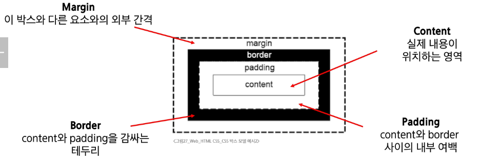


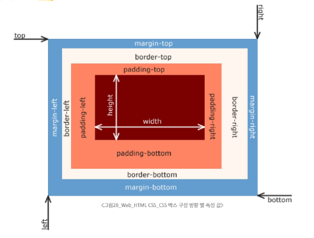

- width 조정은 박스의 전체 크기가 아니라 박스 안의 content 조정이다.
  - 예시, padding-left: 25는 오른쪽으로 25 이동
- 박스 구성 요소는 F12 -> computed로 확인 가능

```
참고) web > 02_box_model
        - 01_part_of_box.html
```
<br>

### shorthand 속성 (단축 속성)

1. **border**
    - border-width, border-stlye, border-color를 한번에 설정하기 위한 속성
    - 작성 순서는 영향을 주지 않음
    - border: 2px solid black;
<br>

2.  **'margin' &  'padding'**

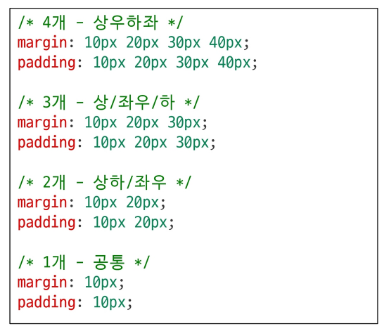

<br>

### box-sizing 속성 (박스의 크기 계산법)

#### 표준 상자 모델, The standard CSS box model (기본값: `content-box`) 

* `width`와 `height`는 <span style="color:red">`content` 영역만의 크기</span>

  ① 표준 상자 모델에서 `width`와 `height` 속성 값을 설정하면, 이 값은 content box의 크기를 조정하게 됨
  
  요소가 실제로 차지하는 가로 크기 = `width` + `padding(좌 + 우)` + `border(좌 + 우)`
  
  ② CSS는 border box가 아닌 content box의 크기를 `width` 값으로 지정
    
    ** 컨텐츠 기준으로 설정된 값이라서 사람이 생각하는 크기가 아님

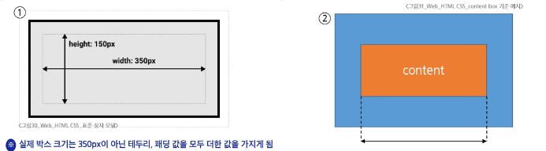

<br>

#### 대체 상자 모델, The alternative CSS box model (`border-box`)

* `width`와 `height`가 <span style="color:red">`border`까지 포함한 크기</span>, `padding`과 `border`는 그 안쪽에서 자리를 차지

* 대체 상자 모델에서 모든 `width`와 `height`는 실제 상자의 너비

* 실제 박스 크기를 정하기 위해 테두리와 패딩을 조정할 필요 없음
  
  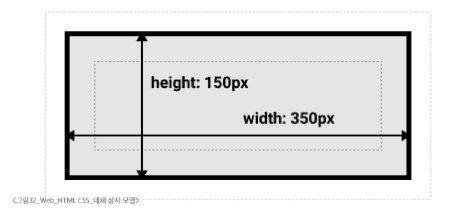
<br>

#### 대체 상자 모델 변경

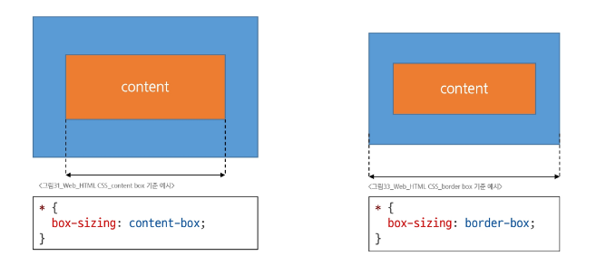

- `<div class="box content-box">` 
  - class box로 규격 설정
  - content-box로 모델 설정

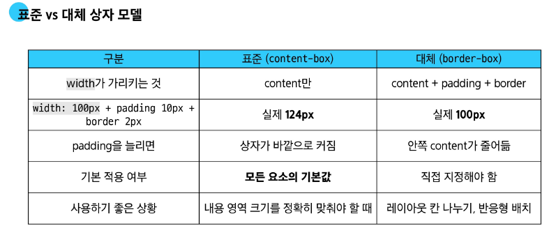


```
참고) web > 02_box_model
        - 02_botx_sizing.html
```
<br>

-------
### display 속성 (박스의 화면 배치 방식)

- 박스타입
  - 박스 타입에 따라 페이지에서의 배치 흐름 및 다른 박스와 관련하여 박스가 동작하는 방식이 달라짐

- 박스 타입 종류: Block 타입, Inline 타입
  
<br>

### block 타입

>  하나의 독립된 덩어리처럼 동작하는 요소

* block 타입은 책의 각 문단과 같습니다.
* 모든 문단은 항상 새로운 줄에서 시작하며, 그 자체로 하나의 독립된 덩어리를 이룹니다. 다른 문단이 옆에 끼어들 수 없죠.
* 이처럼 block 타입은 웹 페이지의 큰 구조와 단락을 만듭니다.

```css
.index {
  display: block;
}
```
<br>

#### block 특징

* **항상 새로운 행으로 나눔** (한 줄 전체를 차지, 너비 100%)
* `width`, `height`, `margin`, `padding` 속성을 모두 사용할 수 있음
* `padding`, `margin`, `border`로 인해 다른 요소를 상자로부터 밀어냄
* `width` 속성을 지정하지 않으면 박스는 inline 방향으로 사용 가능한 공간을 모두 차지함
  * 상위 컨테이너 너비 100%로 채우는 것


* **대표적인 block 타입 태그**
  * `h1`~`h6`, `p`, `div`, `ul`, `li`

<br>

##### 대표적인 태그: `<div>`

* 다른 HTML 요소들을 그룹화하여 레이아웃을 구성하거나 스타일링을 적용할 수 있음
* 헤더, 푸터, 사이드바 등 웹 페이지의 다양한 섹션을 구조화 하는 데 가장 많이 쓰이는 요소

<br>

```html
<div class="container">
  <h1>제목</h1>
  <p>단락 내용입니다.</p>
</div>
<div>
  <p>콘텐츠</p>
</div>

```

> # 제목
> 
> 
> 단락 내용입니다.

> 콘텐츠

<br>
<br>

### Inline 타입


> 문장 안의 단어처럼 흐름에 따라 자연스럽게 배치되는 요소

<br>

* inline 타입은 문장 속 단어를 형광펜으로 칠하는 것과 같습니다.
* inline 타입은 줄을 바꾸지 않고, 텍스트의 **일부에만** 다른 스타일을 적용할 때 사용됩니다.
  
<br>

```css
.index {
  display: inline;
}
```
<br>

#### inline 특징

* **줄 바꿈이 일어나지 않음** (콘텐츠의 크기만큼만 영역을 차지)
* `width`와 `height` 속성을 사용할 수 없음
* **수직 방향 (상하)**
  * `padding`, `margin`, `border`가 적용되지만, 다른 요소를 밀어낼 수는 없음


* **수평 방향 (좌우)**
  * `padding`, `margin`, `border`가 적용되어 다른 요소를 밀어낼 수 있음


* **대표적인 inline 타입 태그**
  * `a`, `img`, `span`, `strong`

<br>

##### 2.3 대표적인 태그: `<span>`

* **자체적으로 시각적 변화 없음**
  * 스타일을 적용하기 전까지는 특별한 변화 없음


* **텍스트 일부 조작**
  * 문장 내 특정 단어나 구문에만 스타일을 적용할 때 유용


* **블록 요소처럼 줄 바꿈을 일으키지 않으므로, 문서의 구조에 큰 변화를 주지 않음**

<br>

```html
<p>이 문장에서 <span style="color: blue;">파란색</span> 단어만 색상이 다릅니다.</p>
<p>이 단어는 <span class="highlight-text">강조</span>되었습니다.</p>
<p>이것은 <span id="changeText">클릭</span>하면 변경됩니다.</p>

```

> 이 문장에서 파란색(파랑색임) 단어만 색상이 다릅니다.
> 
> 이 단어는 강조되었습니다.
> 
> 이것은 클릭하면 변경됩니다.

<br>
<br>

----
### Normal flow
> 일반적인 흐름 또는 레이아웃을 변경하지 않은 경우 웹 페이지 요소가 배치되는 방식
> 
> 위에서 아래로 왼쪽에서 오른쪽으로

- 워드의 경우 문단을 나누면 block 엔터 안누르고 타이핑하면 inline
    - block(구조조정) : 한 줄 전체
    - inline(세부조정) : 콘텐츠만큼의 공간만 차지 줄바꿈x

<br>

### 기타 display 속성
<br>

#### 1. inline-block 타입

> inline 과 block 특징을 모두 가진 특별한 display 속성 값

```html
.index {
    display: inline-block;
}
```
<br>

**특징**
- block과 inline의 특징을 합친 것 (줄바꿈X, 크기 지정 가능)
- width 및 height 속성 사용 가능
- padding, margin 및 border로 인해 다른 요소가 상자에서 밀려남
  
  - 주로 가로로 정렬된 내비 메뉴나 여러 개의 버튼, 이미지 갤러리처럼 수평으로 나열하면서, 각 항목의 크기를 직접 제어하고 싶을 때 매우 용하게 사용합니다.

<br>

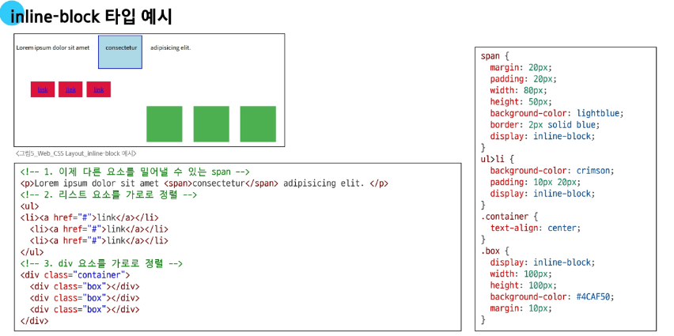

<br>

#### 2. none 타입
> 요소를 화면에 표시하지 않고, 공간조차 부여되지 않음

```
.index {
    display: none;
}
```

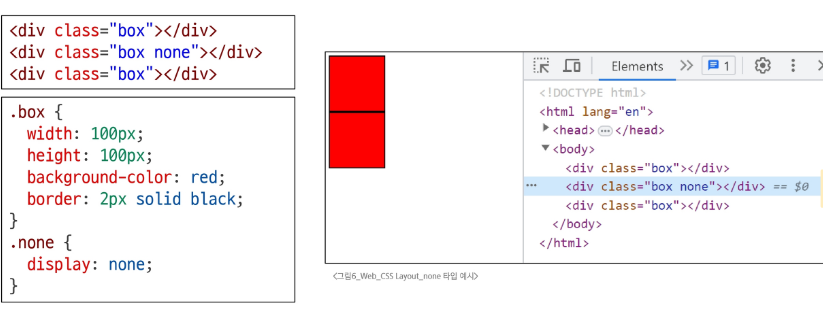

<br>
<br>

----
## CSS Position

CSS Layout

* 각 요소의 **위치**와 **크기를 조정**하여 웹 페이지의 디자인을 결정하는 것
* 요소들을 상하좌우로 정렬하고, 간격을 맞추고, 전체적인 페이지의 뼈대를 구성
* **핵심 속성**: `display(block, inline, flex, grid, ... )`

<br>

**CSS Position**

* 요소를 Normal Flow에서 제거하여 **다른 위치로 배치**하는 것
* 다른 요소 위에 올리기, 화면의 특정 위치에 고정시키기 등
* **핵심 속성**: `position(static, relative, absolute, fixed, sticky, ...)`
  
<br>

**position 이동 방향**
- 네 가지 방향 속성(상, 하, 좌, 우)을 이용해 요소의 위치 조절 가능
- 겹치는 요소의 쌓이는 순서를 조절할 수 있음
  
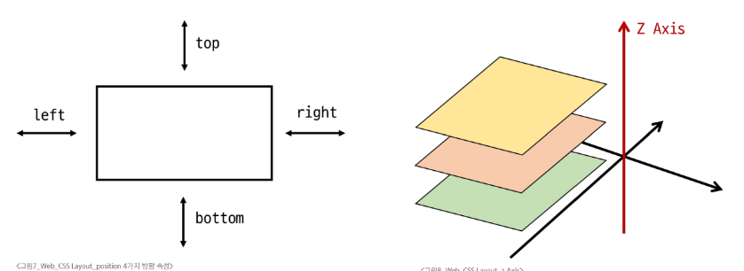

<br>

### 포지션 유형
> **static, relative, absolute, fixed, sticky**

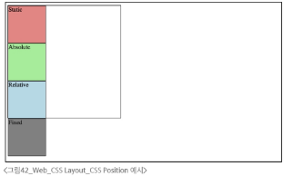
<br>

```
참고) web > 03_css_layout_position
        - 01_posion.html
            - 각 position 주석 풀면 박스 생김
```
<br>

#### 1. static

- 요소를 normal flow에 따라 배치
- top, right, bottom, left 속성이 적용되지 않음
- 기본 값

```
.statitc {
    position: static;
    background-color: lightcoral;
}
```
<br>

#### 2. relative
- 요소를 normal flow에 따라 배치
- 자신의 원래 위치(static)을 기준으로 이동
- top, right, bottom, left 속성으로 위치 조정
- 다른 요소의 레이아웃에 영향을 주지 않음
  - (요소가 차지하는 공간은 static일 때와 같음)
  
```
.relative {
    position: relative;
    background-color: lightblue;
    top: 100px;
    left: 100px;
    # 아래로 100, 오른쪽으로 100 이동
}
```
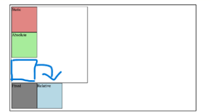

```
relative 박스가 이동해도 원래 본인의 과거 위치는 그대로 유지
 = 빈 공간이 아니다. 
 = 이미지 메모 위치가 채워져 있음
```

<br>

#### 3. absolute
- 요소를 normal flow에 따라 제거
- 가장 가까운 relative 부모 요소를 기준으로 이동
  - 만족하는 부모 요소가 없다면 body 태그를 기준으로 함
- top, right, bottom, left 속성으로 위치 조정
- 문서에서 요소가 차지하는 공간이 없어짐
  
```
.absolute {
    position: absolute;
    background-color: lightgreen;
    top: 100px;
    left: 100px;
} 
```
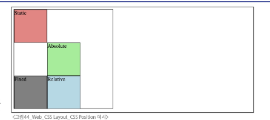

```
예: 네이버 홈에서 중간 추천 탭의 재생 버튼이나 
기사 이미지 내 카테고리 문구
```
```
참고) web > 03_css_layout_position
        - 03.absolute.html
            - absolute 활용
```

<br>

#### 4.fixed
 - 요소를 normal flow에 따라 제거
 - 현재 화면영역(viewport)을 기준으로 함
 - 스크롤해도 항상 같은 위치에 유지됨
- top, right, bottom, left 속성으로 위치 조정
- 문서에서 요소가 차지하는 공간이 없어짐
  
```
.fixed {
    position: fixed;
    background-color: gray;
    top: 0;
    left: 0;
} 
```

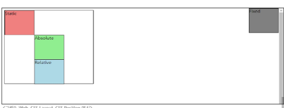

```
viewport 내가 보는 화면 
-> 뷰포트 기준으로 고정을 시켜서 화면이 이동해도 고정된 위치에 계속 존재
예: 웹툰의 이동 화살표
```
<br>

#### 5. sitcky
- relative와 fixed의 특성을 결합한 속성
- 스크롤 위치가 임계점에 도달하기 전에는 relative처럼 동작
- 스크롤 위치가 임계점에 도달하면 fixed처럼 화면에 고정
- 다음 stiky 요소가 나오면 이전 stiky 요소의 자리를 대체
  - 이전 stiky 요소와 다음 stiky 요소의 위치가 겹치게 되기 때문

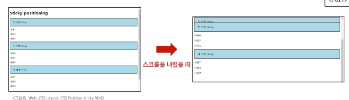

```
참고) web > 03_css_layout_position
        - 02.stiky.html
```
<br>
<br>

### z-index 
> 요소의 쌓임 순서를 정의하는 속성

- layer = z-index -> 시트가 많다

```
.index {
    z-index: 1;
}
```
<br>

#### z-index 특징

* **정수 값**을 사용해 Z축 순서를 지정
* 값이 클수록 요소가 위에 쌓이게 됨
* `static`이 아닌 요소에만 적용됨
* 기본값은 `auto`로 부모 요소의 `z-index` 값에 영향을 받음
* 같은 부모 내에서만 `z-index` 값을 비교하고, 값이 같으면 HTML 문서 순서대로 쌓임
* 부모의 `z-index`가 낮으면 자식의 `z-index`가 아무리 높아도 부모보다 위로 올라갈 수 없음

<br>

> **TIP**
> * `position` 속성이 `static`(기본값)이 아닌 요소에만 `z-index`가 적용됩니다.
> * 음수 `z-index` 값은 요소를 부모 요소의 뒤(배경)로 보낼 때 사용할 수 있습니다.
> 

<br>

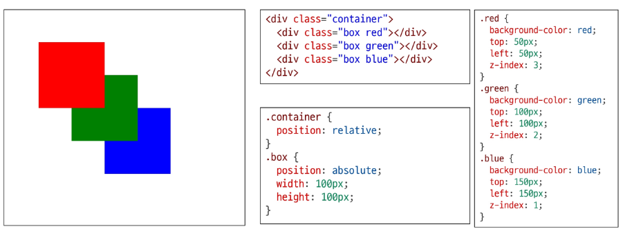
  -  원래는 파랑이초록위, 초록이 빨강 위에 있어야 함
이건 반대
```
참고) web > 03_css_layout_position
        - 04.z_index.html
```

<br>
<br>


----
## CSS Flexbox
제공해주신 이미지들의 내용을 정리한 마크다운 문서입니다.


#### 박스 표시(Display) 타입

1. **Outer display 타입**
* block 타입
* inline 타입


2. **Inner display 타입**
* 박스 내부의 요소들이 어떻게 배치될지를 결정
* CSS Flexbox (속성: `flex`)

<br>

#### CSS Flexbox

> 요소를 행과 열 형태로 배치하는 1차원 레이아웃 방식

<br>

**특징 및 개념**
* 부모 컨테이너 필요, 그 안에 움직이는 아이템 존재 (아이템을 컨테이너가 조정)
* Flexbox(flex) 타입은 책장의 책들을 정리하는 것과 같습니다.
* 책장(Flex 컨테이너) 안에 책들(Flex 아이템)을 넣고, `"책들을 왼쪽에 붙여줘"`, `"서로 같은 간격으로 띄워줘"`와 같은 명령을 통해 손쉽게 배치할 수 있습니다.
* 큰 영역의 레이아웃과 배치 및 정렬만 가능 (세부 조정은 못 함)
<br>

```css
.container {
  display: flex;
}
```
<br>

**'공간 배열' & '정렬'**
* 요소를 행(Row) 또는 열(Column) 방향으로 화살표 축 기준에 맞춰 배치하는 구조를 가집니다.

<br>
<br>

### Flexbox 구성요소
> **main axis, cross axis, flex container, flex item**
<br>

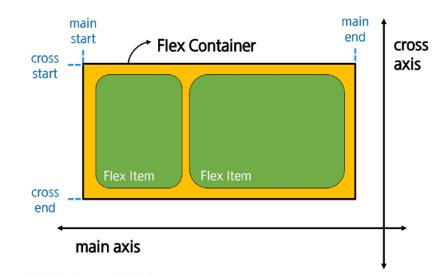
<br>

#### 1. main axis (주 축) 
- flex item들이 배치되는 기본 축
- main start에서 시작하여 main end 방향으로 배치 (기본 값)
  - 메인 축을 세우면 교차축이 가로가 됨 = 변경 가능
  
<br>

#### 2. cross axis (교차 축)
- main axis에 수직인 축
- cross start에서 시작하여 cross end 방향으로 배치 (기본 값)

<br>

#### 3. Flex Container

* `display: flex;` 혹은 `display: inline-flex;` 가 설정된 부모 요소
* 이 컨테이너의 1차 자식 요소들이 Flex Item이 됨
* flexbox 속성 값들을 사용하여 자식 요소 Flex Item들을 배치하는 주체
- 기준 위치에 따라 내가 컨테이너 혹은 아이템이 될 수 있기 때문에
1차 자식 요소들이 아이템이 된다
그 1차 아이템 속에는 물론 또 다양한 아이템 존재 가능함

<br>

#### 4. Flex Item

* Flex Container 내부에 레이아웃 되는 항목
* 이후 배우는 내용을 이용해 자유로운 순서 변경 및 정렬 가능
  
<br>
<br>

### Flexbox 속성
<br>

 **Flex Container 관련 속성**
* `display`
* `flex-direction`
* `flex-wrap`
* `justify-content`
* `align-items`
* `align-content`


**Flex Item 관련 속성**
* `align-self`
* `flex-grow`
* `flex-basis`
* `order`
  
<br>

```
참고) web > 04_css_layout_flexible_box
        - 01_flexbox.html
```

<br>

#### 1. Flex Container 지정
<br>

> **메모**
> 교차 축의 크기를 채우며, 행을 기준으로 하기 때문에 전에서 후로 변함
<br>

* `display` 속성을 `flex` 로 설정하면, Flex Container로 지정됨
* flex item은 기본적으로 행(주 축의 기본값인 가로 방향)으로 나열
* flex item은 주 축의 시작 선에서 시작
* flex item은 교차 축의 크기를 채우기 위해 늘어남
<br>

```css
.container {
  height: 500px;
  border: 1px solid black;
  display: flex;
}
```
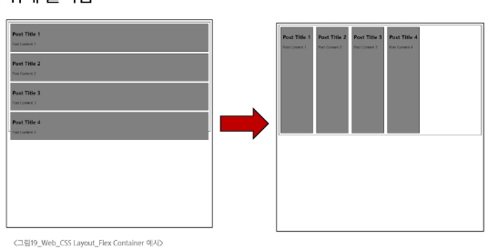
<br>


#### 2. flex-direction

* flex item이 **나열되는 방향을 지정**
* **속성**
* `row` (기본값): 아이템을 가로 방향으로, 왼쪽에서 오른쪽으로 배치
* `column`: 아이템을 세로 방향으로, 위에서 아래로 배치
* `"-reverse"`로 지정하면 flex item 배치의 시작 선과 끝 선이 서로 바뀜


```css
.container {
  /* flex-direction: row; */
  flex-direction: column;
  /* flex-direction: row-reverse; */
  /* flex-direction: column-reverse; */
}
```
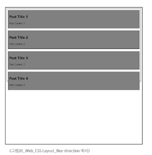

<br>

#### 3. flex-wrap

>**내용**
> Wrap의 경우 이미지와 같음
>  
> wrap-reverse인 경우 4가 위로 올라가고 123이 아래로 내려감
<br>

* flex item 목록이 flex container의 한 행에 들어가지 않을 경우, **다른 행에 배치할지 여부 설정**
<br>

**속성**
* `nowrap` (기본 값): 줄 바꿈을 하지 않음
* `wrap`: 여러 줄에 걸쳐 배치될 수 있게 설정 (위에서 아래로 쌓임)
* `wrap-reverse`: 여러 줄에 걸쳐 배치되나, 줄이 쌓이는 방향이 반대(역순)로 설정

```css
.container {
  /* flex-wrap: nowrap; */
  flex-wrap: wrap;
  /* flex-wrap: wrap-reverse; */
} # 화면 너비를 줄여서 확인하기
```
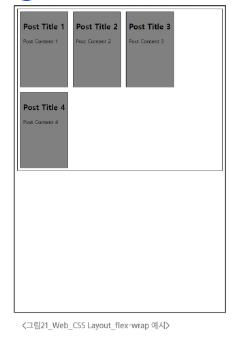

<br>

#### 4. justify-content

* **주 축을 따라 flex item 들을 정렬**하고 간격을 조정
  
**속성**
* `flex-start` (기본값): 주 축의 시작점으로 정렬
* `center`: 주 축의 중앙으로 정렬
* `flex-end`: 주 축의 끝점으로 정렬


```css
.container {
  /* justify-content: flex-start; */
  justify-content: center;
  /* justify-content: flex-end; */
}
```
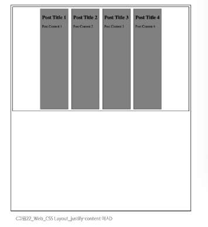

<br>

#### 5. align-content

> **메모**
> 
> flex wrap이 있을 때 여러 줄을 기준으로 ! 교차 축 기준
> 한 줄일 때도 되긴 함

* 컨테이너에 여러 줄의 flex item이 있을 때, 그 **줄들 사이의 공간을 어떻게 분배할지 지정**
* `flex-wrap`이 `wrap` 또는 `wrap-reverse`로 설정된 여러 행에만 적용됨
  * **Flex 아이템이 두 줄 이상일 때만 의미가 있음** (`flex-wrap`이 `nowrap`으로 설정된 경우 의미 없음)


 **속성**
* `stretch` (기본값): 여러 줄을 교차 축에 맞게 늘려 빈 공간을 채움
* `center`: 여러 줄을 교차 축의 중앙에 맞춰 정렬
* `flex-start`: 여러 줄을 교차 축의 시작점(보통 위쪽)에 맞춰 정렬
* `flex-end`: 여러 줄을 교차 축의 끝점(보통 아래쪽)에 맞춰 정렬


```css
.container {
  flex-wrap: wrap;

  /* align-content: flex-start; */
  align-content: center;
  /* align-content: flex-end; */
}
```
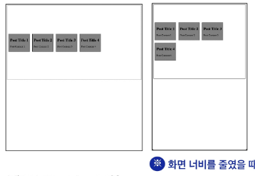


<br>

#### 6. align-items

* 컨테이너 안에 있는 flex item 들의 **교차 축 정렬** 방법을 지정
  
**속성**
* `stretch` (기본값): 아이템을 교차 축 높이를 꽉 채우도록 늘어남
* `center`: 아이템을 교차 축의 중앙에 맞춰 정렬
* `flex-start`: 아이템을 교차 축의 시작점(가로 방향일 경우 위쪽)에 맞춰 정렬
* `flex-end`: 아이템을 교차 축의 끝점(가로 방향일 경우 아래쪽)에 맞춰 정렬


```css
.container {
  align-items: center;
  /* align-items: stretch; */
  /* align-items: flex-start; */
  /* align-items: flex-end; */
}
```
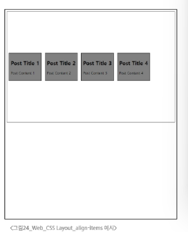

<br>

#### 7. align-self

> **메모**
> 
> 지금까지는 부모한테 속성을 줬는데 이것은 자식한테 줘야 함

* 컨테이너 안에 있는 **flex item 들을 교차 축을 따라 개별적으로 정렬**

**속성**
* `auto` (기본값): 부모 컨테이너의 `align-items` 속성 값을 상속
* `stretch`: 해당 아이템만 교차 축 방향으로 늘어나 컨테이너를 꽉 채우도록 정렬
* `center`: 해당 아이템만 교차 축의 중앙에 정렬
* `flex-start`: 해당 아이템만 교차 축의 시작점(가로 방향일 경우 위쪽)에 정렬
* `flex-end`: 해당 아이템만 교차 축의 끝점(가로 방향일 경우 아래쪽)에 정렬


```css
.item1 {
  align-self: center;
}

.item2 {
  align-self: flex-end;
}
```
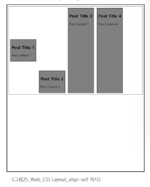
---

### Flexbox 정리 & 요약

#### 목적에 따른 속성 분류

* **배치**: `flex-direction`, `flex-wrap`
* **공간 분배**: `justify-content`, `align-content`
* **정렬**: `align-items`, `align-self`

#### 속성 쉽게 이해하는 방법

* `justify` - 주 축
* `align` - 교차 축

> **TIP**
> 
> **`justify-items` 및 `justify-self` 속성이 없는 이유는 뭘까요?**
> * 필요가 없기 때문입니다.
> * 기존에 가지고 있는 기술인 `margin: auto`를 통해 정렬 및 배치가 가능합니다.
> 
> 

<br>

#### 8. flex-grow

> **메모**
> 
> 언제나 꽉 찬 화면을 보여줄 수 있게 하는 것
> 비율 X -> grow가 몇개냐에 따라 등분이 몇개냐로 나뉜다

* **남는 행 여백을 비율에 따라 각 flex item에 분배**
* flex item이 컨테이너 내에서 확장하는 비율을 지정

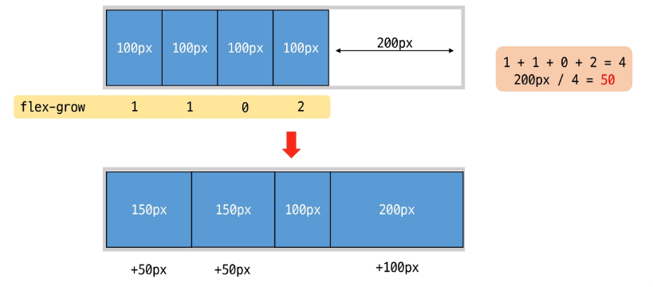

<br>


> **TIP: flex-shrink**
> * `flex-grow`의 반대되는 개념이에요.
> * 컨테이너의 공간이 부족할 때, flex item이 줄어드는 비율을 지정하는 속성입니다.
> 

```
참고) web > 04_css_layout_flexible_box
        - 02_flexbox_grow.html
```

<br>

#### 9. flex-basis
- flex item의 초기 크기 값을 지정
- flex-basis와 width 값을 동시에 적용한 경우 flex-basis가 우선
  
```
참고) web > 04_css_layout_flexible_box
        - 02_flexbox_basis.html
```

<br>
<br>

### flex-wrap 응용

#### 반응형 레이아웃 작성

* 다양한 디바이스와 화면 크기에 자동으로 적응하여 콘텐츠를 최적으로 표시하는 웹 레이아웃 방식
* `flex-wrap`을 사용해 반응형 레이아웃 작성 (`flex-grow` & `flex-basis` 활용)

  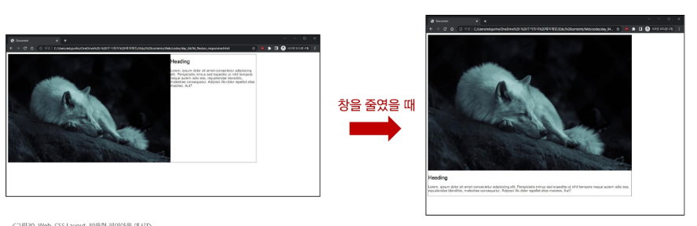

<br>

1. `.card` 요소를 flex 컨테이너로 설정
2. 컨테이너의 공간이 부족할 경우, 여러 줄로 나누어 배치되도록 허용
3. 각 flex item의 기본 너비를 설정
4. 컨테이너에 여유 공간이 있을 때 공간을 차지하며 늘어날 수 있도록 함
*(두 flex item 모두 값이 1 이므로 절반씩 나누어 가짐)*

<br>

```
참고) web > 04_css_layout_flexible_box
        - 04_flexbox_responsive_layout.html
```

<br>
<br>

## 참고
